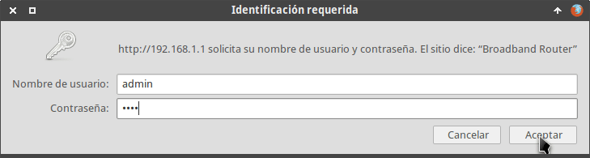
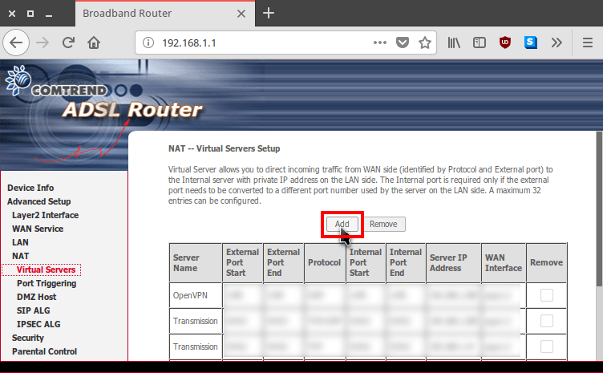
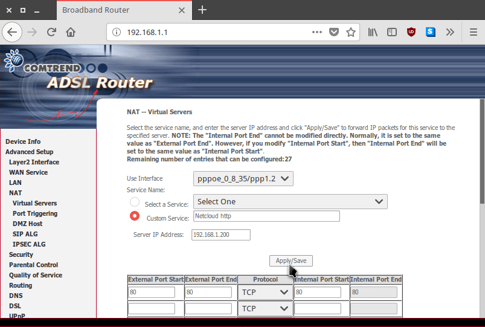
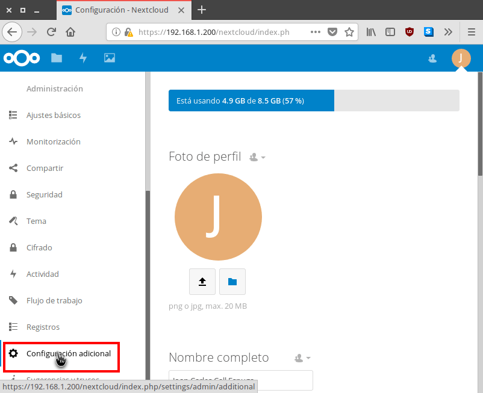
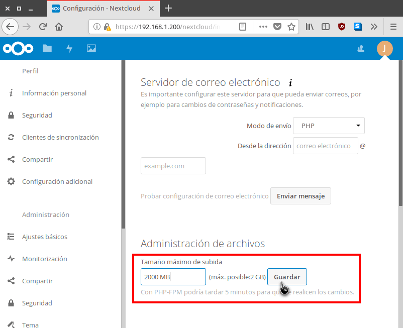

En el pasado reciente vimos como [instalar]() Nextcloud en una Raspberry Pi con Lighttpd y MariaDB. Una vez finalizada la instalación aún nos queda pendiente la configuración y optimización del rendimiento de Nextcloud. Para ello podemos seguir las siguientes instrucciones.<!--more-->

###### Nota: Cuantos más usuarios accedan dentro de nuestra nube más importante será el trabajo de optimización.

## HACER QUE NUESTRO SERVIDOR NEXTCLOUD ESTÉ ACCESIBLE DESDE EL EXTERIOR

Si queremos que nuestra nube Nextcloud esté accesible desde cualquier sitio necesitamos lo siguiente:

1. Disponer de una IP externa fija o un servicio de direccionamiento DNS.
2. Abrir los puertos correspondientes a nuestro router.

### Disponer de una IP Externa Fija o un servicio de Direccionamiento DNS

Para disponer de un servicio de IP externa fija deben ponerse en contacto con su proveedor de internet. Desafortunadamente, en la mayoría de países los proveedores de internet no ofrecen el servicio de IP externa fija, o en caso de ofrecerlo tiene un coste que no es bajo.

En el caso que no sea posible disponer de IP Fija podemos usar un servicio de direccionamiento DNS. En mi caso uso el servicio de NO-IP. Para poder usar y configurar el servicio de NO-IP deben seguir las siguientes instrucciones:

https://geekland.eu/encontrar-servidor-con-dns-dinamico/

Siguiendo las instrucciones del link que acabo de dejar asociaremos nuestra IP pública a un dominio de forma permanentemente. De esta forma Nextcloud siempre estará accesible desde el exterior de nuestra red local mediante un dominio del servicio NO-IP.

En mi caso mi IP Pública está asociada al dominio geekland.sytes.net.

### Abrir los puertos 80 y 443 en nuestro router

Para podernos conectar a nuestra nube cuando estemos fuera de nuestra red local tenemos que abrir los puertos 80 y 443 en nuestro router.

Para ello abrimos nuestro navegador, tecleamos la puerta de entrada de nuestro router y presionaremos la tecla Enter. Una vez realizado esto, tal y como se puede ver en la captura de pantalla, se abrirá una ventana que nos pedirá el usuario y contraseña de nuestro router:

[](images/acceder-configuracion-router.png)

Una vez introducida la información accederemos a la configuración del router. Seguidamente, tal y como se puede ver en la captura de pantalla, tenemos que acceder a los menús Advanced Setup / NAT / Virtual Servers y presionar el botón Add.

[](images/anadir-puerto.png)

En en el campo **custom server** hay que escribir un nombre cualquiera. En mi caso, como estoy abriendo el puerto 80 escribiré Nextcloud http.

Seguidamente en el campo **Server IP Address** tenemos que escribir la IP interna en que está instalado Nextcloud. En mi caso he configurado que nuestro Nextcloud tenga la IP estática 192.168.1.200. Por lo tanto en este campo debo escribir la IP 192.168.200.

El puerto que queremos abrir es el 80. Por lo tanto, tal y como se puede ver en la captura de pantalla, seleccionamos el protocolo TCP y escribimos el puerto 80 en los puertos internos y externos.

Finalmente presionamos el botón Apply/Save.

[](images/puerto-80-abierto-router.png)

Una vez finalizado el proceso lo volveremos a repetir, pero ahora en vez de abrir el puerto 80 se abrirá el puerto 443.

De esta forma podremos acceder a nuestro Nextcloud desde fuera de nuestra red local.

## INCREMENTAR TAMAÑO MÁXIMO DE SUBIDA EN NEXTCLOUD

La configuración estándar de Nextcloud permite subir archivos con un tamaño de hasta 511 MB. En nuestro caso incrementaremos el tamaño a 2GB del siguiente modo:

Inicialmente accedemos al apartado de Configuración de Nextcloud.

[](images/acceder-configuracion-nextcloud.png)

A continuación en el menú de la izquierda clicamos en Configuración adicional.

[](images/configuracion-adicional-nextcloud.png)

Finalmente en el apartado Tamaño máximo de subida sustituimos 511 MB por 2000 MB y presionamos en el botón Guardar.

[](images/incrementar-tamaño-subida-2gb.png)

De esta forma tan sencilla podremos subir archivos de hasta 2GB a nuestra nube personal. Si lo precisan también se puede limitar el tamaño de subida a tamaños mucho más pequeños.

## AJUSTAR LA MEMORIA SWAP DE NUESTRO SERVIDOR

De forma estándar nuestra Raspberry Pi únicamente dispone de 100 MB de memoria Swap. Para evitar problemas de rendimiento cuando el servidor está sobrecargado es recomendable incrementar la memoria swap hasta 512MB. Para ello en la terminal de nuestra Raspberry Pi ejecutamos le siguiente comando:

> ```
> sudo nano /etc/dphys-swapfile
> ```

Cuando se abra el editor de textos nano reemplazamos la siguiente línea:

> ```
> CONF_SWAPSIZE=100
> ```

por la siguiente:

> ```
> CONF_SWAPSIZE=512
> ```

De este modo la siguiente vez que arranquemos nuestra Raspberry Pi dispondremos de más memoria de intercambio.

## MEJORAR EL RENDIMIENTO DE PHP CON OPCACHE

Para mejorar el rendimiento de PHP es recomendable usar OPCache. De este modo los scripts de PHP se ejecutarán de forma mucho más rápida y eficiente porque después de la primera ejecución se almacenarán en una memoria cache.

**Para activar OPCache en PHP5** tenemos que ejecutar el siguiente comando en la terminal:

> ```
> sudo nano /etc/php5/mods-available/opcache.ini
> ```

**Para activar OPCache en PHP7** tenemos que ejecutar el siguiente comando en la terminal:

> ```
> sudo nano /etc/php/7.0/fpm/conf.d/10-opcache.ini
> ```

Cuando se abra el editor de texto nano pegaremos le siguiente código:

> ```
> opcache.enable=1
> opcache.enable_cli=1
> opcache.interned_strings_buffer=8
> opcache.max_accelerated_files=10000
> opcache.memory_consumption=128
> opcache.save_comments=1
> opcache.revalidate_freq=1
> ```

Una vez pegado el código guardamos los cambios y cerramos el fichero.

## MEJORAR EL RENDIMIENTO DE LA BASE DE DATOS Y PHP CON REDIS Y APCU

También podemos optimizar el rendimiento de la base de datos y PHP con Redis y APCu. Para instalar Redis y APCu procedemos del siguiente modo:

**Si disponemos de PHP5** ejecutamos el siguiente comando en la terminal:

> ```
> sudo apt-get install redis-server php5-redis php5-apcu
> ```

**En cambio si usamos PHP7** debemos ejecutar el siguiente comando en la terminal:

> ```
> sudo apt-get install redis-server php-redis php-apcu
> ```

Una vez instalados los paquetes pertinentes accedemos al fichero config.php de Nextcloud ejecutando el siguiente comando en la terminal:

> ```
> sudo nano /var/www/html/nextcloud/config/config.php
> ```

Acto seguido, cuando se abra el editor de textos nano pegamos las siguientes lineas en el fichero:

> ```
> 'filelocking.enabled' => true,
> 'memcache.local' => '\\OC\\Memcache\\APCu',
> 'memcache.locking' => '\\OC\\Memcache\\Redis',
> 'redis' => array (
>   'host' => 'localhost',
>   'port' => 6379,
>   'timeout' => 0.0,
> ),
> ```

Una vez introducido el código guardamos los cambios y cerramos el fichero.

###### Nota: La configuración de este apartado es la óptima para un servidor pequeño al que acceden varios usuarios. Pueden consultar configuraciones adicionales en el siguiente [enlace](https://help.nextcloud.com/t/memcache-how-to-enable/2651).

## CONFIGURAR HTTPS EN UN NEXTCLOUD CON LIHGTTPD DE FORMA ADECUADA

En este apartado hay varias opciones disponibles. Dos de ellas son las siguientes:

1. La primera y más recomendable es la de instalar un certificado SSL de Let’s Encrypt. Es más recomendable porque si usamos un certificado de Let’s Encrypt los navegadores no mostrarán ningún tipo de advertencia cuando accedamos a nuestra nube.
2. La segunda opción es generar nuestro propio certificado SSL.

Las instrucciones a seguir para cada una de las 2 opciones se muestran a continuación.

### Instalar y configurar un certificado SSL de Let’s Encrypt en Lighttpd

Para instalar, configurar y renovar un certificado SSL de Let’s Encrypt a nuestro servidor web tan solo tenemos que seguir las instrucciones que se muestran en el siguiente enlace:

https://geekland.eu/instalar-certificado-ssl-gratis-lets-encrypt-lighttpd/

### Instalar y configurar un certificado SSL generado por nosotros mismos

Si la opción que finalmente elegimos es la de emitir nuestro propio certificado actuaremos de la siguiente forma:

Inicialmente accedemos a la ruta /etc/lighttpd ejecutando el siguiente comando en la terminal:

> ```
> cd /etc/lighttpd
> ```

Seguidamente creamos la carpeta que almacenará los certificados ejecutando el siguiente comando en la terminal:

> ```
> sudo mkdir -p certs
> ```

A continuación accederemos dentro de la carpeta que acabamos de crear ejecutando el siguiente comando en la terminal:

> ```
> cd certs
> ```

El siguiente paso consistirá en crear el certificado SSL lighttpd.pem que será válido durante 730 días. Para ello ejecutaremos el siguiente comando en la terminal:

> ```
> sudo openssl req -new -x509 -keyout lighttpd.pem -out lighttpd.pem -days 730 -nodes
> ```

Una vez creado el certificado modificaremos sus permisos para que únicamente el propietario tenga acceso de lectura.

> ```
> sudo chmod 400 lighttpd.pem
> ```

A continuación accedemos dentro de la configuración del servidor web lighttpd ejecutando el siguiente comando en la terminal:

> ```
> sudo nano /etc/lighttpd/lighttpd.conf
> ```

Al final del archivo pegaremos el siguiente código:

> ```
> # Activar y configurar https en el servidor
> $SERVER["socket"] == ":443" {
>  ssl.engine = "enable"
>  ssl.pemfile = "/etc/lighttpd/certs/lighttpd.pem"
> }
> 
> # Forzar https
> $HTTP["scheme"] == "http" {
>   # capture vhost name with regex conditiona -> %0 in redirect pattern
>   # must be the most inner block to the redirect rule
>   $HTTP["host"] =~ ".*" {
>     url.redirect = (".*" => "https://%0$0")
>   }
> }
> 
> # Forzar HTTP Strict Transport Security
> setenv.add-response-header = ( "Strict-Transport-Security" => "max-age=15768000; includeSubdomains" )
> ```

Acto seguido comprueben que el modulo setenv esté activado. Para ello deberán comprobar que el fichero que estamos editando contenga el siguiente código:

> ```
> server.modules = (
> “mod_expire”,
> “mod_access”,
> “mod_accesslog”,
> “mod_auth”,
> “mod_compress”,
> “mod_redirect”,
> “mod_setenv”,
> “mod_rewrite”
> )
> ```

Una vez modificado el fichero guardaremos los cambios y cerraremos el fichero. Con este código conseguiremos lo siguiente:

1. Activar https en el servidor web lighttpd.
2. Forzar que la totalidad de peticiones en Nextcloud se hagan a través de https.
3. Activar TTP Strict Transport Security (HSTS) para asegurar que la totalidad de peticiones de los clientes se hagan mediante el protocolo https.

Finalmente tienen que reiniciar el servidor web Lighttpd para que la configuración sea efectiva. Para ello ejecuten el siguiente comando en la terminal

> ```
> sudo service lighttpd restart
> ```

## HABILITAR EL MODO DE EJECUCIÓN PHP-FPM (FastCGI Process Manager)

En el caso que nuestra nube Nextcloud tenga mucho tráfico es recomendable activar el modo de ejecución PHP-FPM.

Para activar PHP-FPM deberemos instalar los siguientes paquetes:

**Si están utilizando PHP5** deberán instalar php5-fpm ejecutando el siuguiente comando en la terminal:

> ```
> sudo apt-get install php5-fpm
> ```

**En el caso que estén usando PHP7** deberán instlaar php7.0-fpm ejecutando el siguiente comando en la terminal:

> ```
> sudo apt-get install php7.0-fpm
> ```

Acto seguido accederemos a la configuración de PHP del siguiente modo:

**En el caso que estén usando PHP5** ejecuten el siguiente comando en la terminal:

> ```
> sudo nano /etc/php5/fpm/php.ini
> ```

**Si están usando PHP7** ejecuten el siguiente comando:

> ```
> sudo nano /etc/php/7.0/fpm/php.ini
> ```

Una vez se habrá el editor de textos nano descomentan la siguiente línea:

> ```
> cgi.fix_pathinfo=1
> ```

Una vez realizadas las modificaciones guardan los cambios y cierran el fichero.

Acto seguir reiniciamos el servicio php-fpm ejecutando el siguiente comando en la terminal:

**Si usamos PHP5** ejecutamos el siguiente comando:

> ```
> sudo service php5-fpm restart
> ```

**Si usamos PHP7** ejecutamos el siguiente comando:

> ```
> sudo service php7.0-fpm restart
> ```

Acto seguido accedemos al directorio /etc/lighttpd/conf-available/ ejecutando el siguiente comando en la terminal:

> ```
> cd /etc/lighttpd/conf-available/
> ```

Realizamos una copia de seguridad del archivo 15-fastcgi-php.conf ejecutando el siguiente comando en la terminal:

> ```
> sudo cp 15-fastcgi-php.conf 15-fastcgi-php.bak
> ```

Seguidamente editamos el archivo 15-fastcgi-php.conf ejecutando el siguiente comando en la terminal:

> ```
> sudo nano 15-fastcgi-php.conf
> ```

**Si usamos PHP5** cuando se abra el editor de textos borramos todo el contenido del archivo y pegamos el siguiente código:

> ```
> # -*- depends: fastcgi -*-
> # /usr/share/doc/lighttpd/fastcgi.txt.gz
> # http://redmine.lighttpd.net/projects/lighttpd/wiki/Docs:ConfigurationOptions#mo$
> 
> ## Start an FastCGI server for php (needs the php5-cgi package)
> fastcgi.server += ( ".php" =>
>     ((
>       "socket" => "/var/run/php5-fpm.sock",
>       "broken-scriptfilename" => "enable"
>     ))
> )
> ```

**En caso de usar PHP7** el código a pegar una vez borrado el contenido del archivo será el siguiente:

> ```
> # /usr/share/doc/lighttpd-doc/fastcgi.txt.gz
> # http://redmine.lighttpd.net/projects/lighttpd/wiki/Docs:ConfigurationOptions#mod_fastcgi-fastcgi
> 
> ## Start an FastCGI server for php (needs the php7.0-cgi package)
> fastcgi.server += ( ".php" =>
>    ((
>       "socket" => "/var/run/php/php7.0-fpm.sock",
>       "broken-scriptfilename" => "enable"
>    ))
> )
> ```

Una vez realizados los cambios guardan el contenido del archivo.

**En el caso que usen PHP5** acceden a la ubicación /etc/php5/fpm/pool.d ejecutando el siguiente comando en la terminal:

> ```
> cd /etc/php5/fpm/pool.d
> ```

**Si usan PHP7** acceden al directorio /etc/php/7.0/fpm/pool.d ejecutando el siguiente comando en la terminal:

> ```
> cd etc/php/7.0/fpm/pool.d
> ```

Finalmente editamos el contenido del fichero www.conf ejecutando el siguiente comando en la terminal:

> ```
> sudo nano www.conf
> ```

Cuando se abra el editor de textos nano descomentamos las siguientes lineas:

> ```
> env[HOSTNAME] = $HOSTNAME
> env[PATH] = /usr/local/bin:/usr/bin:/bin
> env[TMP] = /tmp
> env[TMPDIR] = /tmp
> env[TEMP] = /tmp
> ```

Finalmente guardamos loca cambios y cerramos fichero. De este modo después de reiniciar PHP dispondremos del modo de ejecución php-fpm activado.

## EVITAR ERROR ALWAYS POPULATE

Si usan PHP5 es posible que les aparezca la siguiente advertencia:

> ```
> Error PHP Automatically populating $HTTP_RAW_POST_DATA is deprecated and will be removed in a future version. To avoid this warning set 'always_populate_raw_post_data' to '-1' in php.ini and use the php://input stream instead. at Unknown#0
> ```

En el caso que les aparezca tienen que entrar en el fichero de configuración de PHP5 ejecutando el siguiente comando:

> ```
> sudo nano /etc/php5/cgi/php.ini
> ```

Acto seguido tienen que localizar la siguiente línea:

> ```
> ;always_populate_raw_post_data = -1
> ```

Una vez localizada la descomentan borrando el ;

> ```
> always_populate_raw_post_data = -1
> ```

Finalmente guardamos los cambios y cerramos el fichero. La próxima vez que reiniciemos el servidor o PHP dejaremos de obtener el error.

## ESTABLECER LOS DOMINIOS DE CONFIANZA PARA ACCEDER A NEXTCLOUD

Por cuestiones de seguridad es necesario establecer las IP y los dominios de confianza que podrán acceder a nuestra nube. Para ello tenemos que acceder a la configuración de Nextcloud ejecutando el siguiente comando en la terminal:

> ```
> sudo nano /var/www/html/nextcloud/config/config.php
> ```

Una vez abierto el editor de textos nano localizan la siguiente línea:

> ```
> 'trusted_domains' =>
> ```

Una vez localizada introducen las IP y dominios de confianza del siguiente modo:

> ```
> array (
>     0 => '192.168.1.200',
>     1 => 'geekland.sytes.net',
>   ),
> ```

###### Nota: 192.168.1.200 es la IP que voy a usar para acceder a Nextcloud desde mi red local.

###### Nota: geekland.sytes.net es el dominio que usaré para acceder a Nextcloud desde fuera de mi red local.

Una vez introducidos los dominio e IP guardamos los cambios y cerramos el fichero.

## HABILITAR HTTP/2

En mi caso estoy usando el servidor web Lighttpd. Lighttpd no es compatible con http/2, por lo tanto en este apartado no puedo realizar nada.

En el caso que utilicen Nginx o Apache pueden habilitar http/2. De este modo obtendrán una mejora de rendimiento en la navegación.

## OPTIMIZAR LA CONFIGURACIÓN DE LA BASE DE DATOS MARIADB

Para optimizar la configuración de la base de datos de MariaDB podemos usar el script mysqltuner. Para descargar el script tan solo tienen que ejecutar el siguiente comando en la terminal:

> ```
> wget http://mysqltuner.com/mysqltuner.pl
> ```

Acto seguido damos permisos de ejecución al script que acabamos de descargar ejecutando el siguiente comando:

> ```
> chmod +x mysqltuner.pl
> ```

Seguidamente ya podemos ejecutar el script para evaluar el rendimiento ejecutando el siguiente comando:

> ```
> ./mysqltuner.pl
> ```

Justo después de iniciar la ejecución tendremos que introducir el usuario administrativo de nuestra base de datos y su contraseña. Finalmente se ejecutará el script y nos propondrá una serie de recomendaciones para nuestra base de datos. En mi caso las recomendaciones propuestas han sido las siguientes:

|   \-------- Recommendations --------------------------------------------------------------------------- **General recommendations:** Restrict Host for user@% to user@SpecificDNSorIp MySQL was started within the last 24 hours - recommendations may be inaccurate Dedicate this server to your database for highest performance. Configure your accounts with ip or subnets only, then update your configuration with skip-name-resolve=1 Performance schema should be activated for better diagnostics Consider installing Sys schema from https://github.com/mysql/mysql-sys Before changing innodb\_log\_file\_size and/or innodb\_log\_files\_in\_group read this: http://bit.ly/2wgkDvS **Variables to adjust:** query\_cache\_size (=0) query\_cache\_type (=0) performance\_schema = ON enable PFS innodb\_log\_file\_size should be (=16M) if possible, so InnoDB total log files size equals to 25% of buffer pool size. innodb\_buffer\_pool\_instances (=1)   |
| --- |

Para aplicar la configuración propuesta tan solo tengo que acceder a la ubicación /etc/mysql ejecutando el siguiente comando:

> ```
> cd /etc/mysql/
> ```

A continuación realizo una copia de seguridad del fichero de configuración de la base de datos ejecutando el siguiente comando en la terminal:

> ```
> sudo cp my.cnf my.cnf.bak
> ```

Para modificar la configuración de la base de datos pararemos MariaDB ejecutando el siguiente comando:

> ```
> sudo systemctl stop mysql
> ```

Finalmente editaremos el fichero de configuración ejecutando el siguiente comando en la terminal:

> ```
> sudo nano /etc/mysql/my.cnf
> ```

Una vez se abra el editor de textos nano tendré que añadir/modificar los siguientes parámetros:

 
|   **Recomendaciones Mysqltuner**   |   **Parámetros que deben figurar en mi fichero de configuración**   |
| --- | --- |
|   query\_cache\_size (=0)   |   query\_cache\_size = 0   |
|   query\_cache\_type (=0)   |   query\_cache\_type = 0   |
|   performance\_schema = ON enable PFS   |   performance\_schema=ON   |
|   innodb\_log\_file\_size should be (=16M) if possible, so InnoDB total log files size equals to 25% of buffer pool size.   |   innodb\_log\_file\_size = 16M   |
|   innodb\_buffer\_pool\_instances (=1)   |   innodb\_buffer\_pool\_instances = 1   |

Una vez realizadas las modificaciones guardan los cambios y cierran el fichero. Acto seguido tan solo tendremos que iniciar MariaDB ejecutando el siguiente comando en la terminal:

> ```
> sudo systemctl start mysql
> ```

## SECURIZAR NUESTRA NUBE NEXTCLOUD

En estos momentos deberían disponer de una nube Nextcloud correctamente configurada y con un rendimiento aceptable. En futuros post veremos como podemos incrementar la seguridad de la nube que tenemos instalada.
