Recientemente escribí un artículo en el que comentaba una serie de [motivos éticos y técnicos para no usar Facebook](). No obstante habrá gente que por necesidad usará Facebook para chatear con sus amigos. Si quieren chatear en Facebook con sus contactos sin necesidad de entrar en la horrorosa página web de Facebook pueden seguir los siguientes pasos que veremos a continuación.<!--more-->

## INSTALAR PIDGIN PARA CHATEAR EN FACEBOOK

El primer paso consiste en instalar pidgin en nuestra distribución Linux. En función de la distribución que tengamos deberemos usar los siguientes comandos de instalación:

 
|   **Distribución**   |   **Comando**   |
| --- | --- |
|   Debian y derivadas   |   sudo apt-get install pidgin aspell-es   |
|   Archlinux y derivadas   |   sudo pacman -S pidgin aspell-es   |
|   Fedora y derivadas   |   sudo yum -y install pidgin aspell-es   |
|   Opensuse   |   sudo zypper install pidgin aspell-es   |

## INSTALAR EL PLUGIN PURPLE-FACEBOOK

Una vez finalizada la instalación de pidgin tenemos que instalar el plugin purple-facebook. Este plugin es el que nos permitirá chatear en Facebook con nuestros contactos.

Para la instalación de purple-facebook existe la cómoda posibilidad de añadir un repositorio en vuestra distro y realizar la instalación de forma cómoda y práctica. No obstante en mi caso prefiero no “contaminar” los repositorios de mi distro y por lo tanto utilizaré el siguiente método:

Accedemos dentro de la siguiente página web.

[https://download.opensuse.org/repositories/home:/jgeboski/](https://download.opensuse.org/repositories/home:/jgeboski/)

Una vez dentro de la página web clicamos encima de la carpeta de nuestra distro. En mi caso clico encima de Debian\_8.0/

[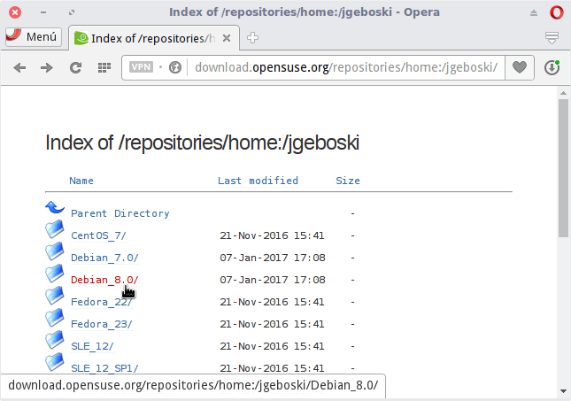](images/seleccionar-nuestra-distribucion.png)

A continuación clicamos encima de la carpeta correspondiente a nuestra arquitectura. En el caso que no sepan la arquitectura de su procesador ejecuten el comando uname -m en la terminal. En función del resultado obtenido realizarán lo siguiente:

1. Si el resultado obtenido es x86\_64 deberán clicar encima de la carpeta amd64.
2. Si el resultado obtenido es i686 cliquen sobre la carpeta i386 o en su defecto sobre la i586 o i686.

[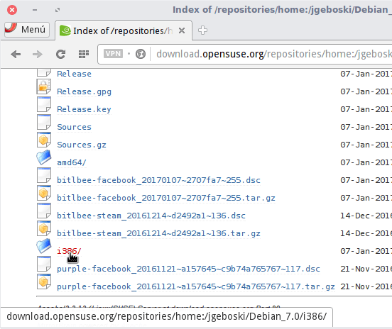](images/clicar-sobre-nuestra-arquitectura.png)

Seguidamente descargamos el paquete binario purple-facebook a nuestro disco duro:

[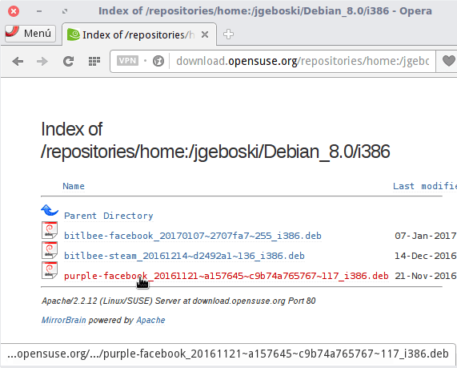](images/descargar-purple-facebook.png)

Finalmente instalamos el paquete purple-facebook que acabamos de descargar. En mi caso lo instalo fácilmente mediante gdebi.

[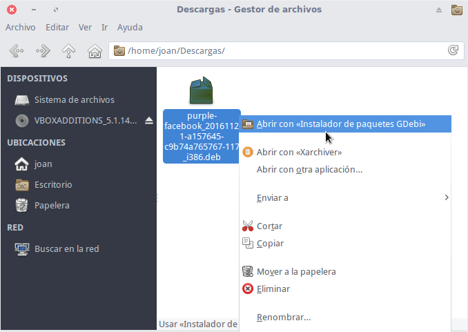](images/instalar-el-paquete-purple-facebook.png)

Una vez instalado purple-facebook ya podemos pasar al siguientes paso.

Los usuarios de Archlinux pueden instalar purple-facebook a través de AUR ejecutando el siguiente comando en la terminal:

> ```
> yaourt -S purple-facebook
> ```

## AVERIGUAR NUESTRO USUARIO DE FACEBOOK

Un paso importante es conocer nuestro usuario de Facebook. Para ello accedemos a la configuración de nuestra cuenta clicando encima de la flechita del menú de Facebook. Una vez se abra el menú clicamos encima de la opción Configuración.

[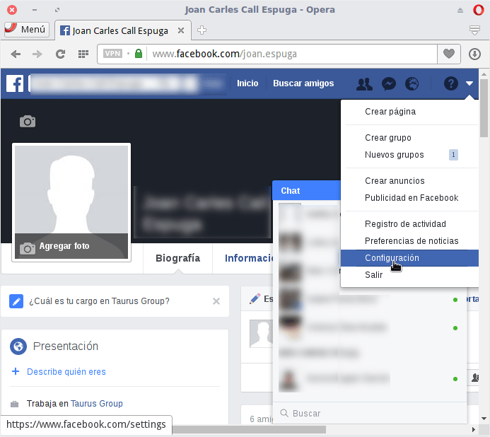](images/acceder-configuracion-facebook.png)

Finalmente en el apartado Nombre de usuario averiguaremos nuestro nombre de usuario. Como pueden ver en la captura de pantalla, en mi caso el nombre de usuario es geekland.

[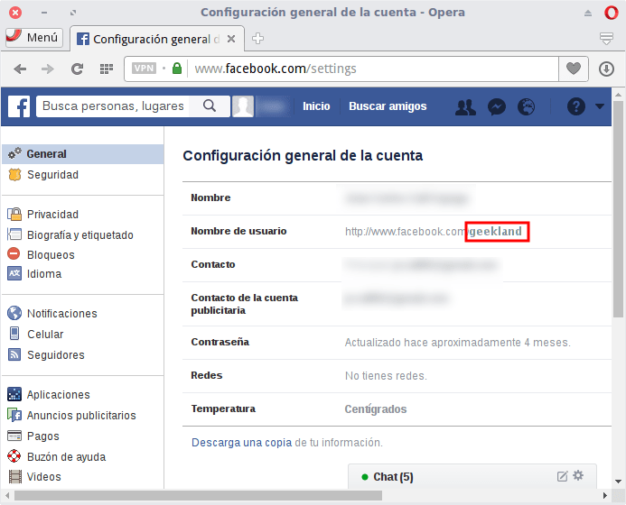](images/averiguar-nombre-usuarios-facebook.png)

## CONFIGURAR PIDGIN PARA PODER CHATEAR EN FACEBOOK CON NUESTROS CONTACTOS

Abrimos el programa Pidgin. Accedemos al menú Cuentas y a continuación clicamos en la opción Gestionar cuentas.

[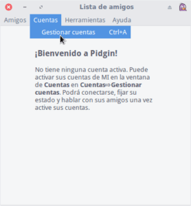](images/gestionar-cuentas-pidgin.png)

Cuando aparezca la ventana de las cuentas que tenemos configuradas presionamos encima del botón Añadir.

[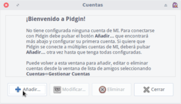](images/añadir-cuenta-a-pidgin.png)

En la ventana de Añadir cuenta ingresamos la siguiente información:

[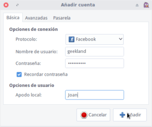](images/configurar-cuenta-facebook-pidgin.png)

En Protocolo tenemos que elegir la opción Facebook. No seleccionéis la opción Facebook XMPP. Repito que la opción a seleccionar es Facebook.

En el campo Nombre de usuario escribimos el nombre de usuario de nuestra cuenta de Facebook. Si tienen algún tipo de duda pueden consultar el apartado anterior de este post.

En Contraseña introducimos la contraseña de nuestra cuenta de Facebook.

Tildamos la casilla Recordar Contraseña. De esta forma cada vez que abramos Pidgin nos conectaremos al chat de nuestra cuenta de Facebook.

En Apodo local escribimos el nombre que queremos que se muestre cuando estemos chateando en Pidgin.

Una vez rellenados todos los campos tan solo tenemos que presionar el botón Añadir.

A continuación lo más probable es que obtengan el siguiente mensaje de error;

> ```
> User must verify their account on www.facebook.com (405)
> ```

[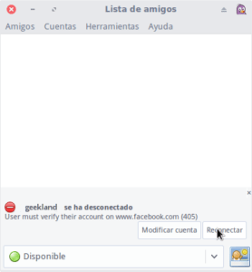](images/error-de-conexion-405.png)

Este error es debido a que Facebook bloquea la conexión de Pidgin porque detecta que una aplicación desconocida quiere acceder a nuestra cuenta de Facebook.

Para solucionar este tema accedemos a nuestra cuenta de Facebook. Justo en el momento de acceder Facebook nos preguntará que confirmemos nuestra identidad. Para ello clicamos en el botón Continuar.

[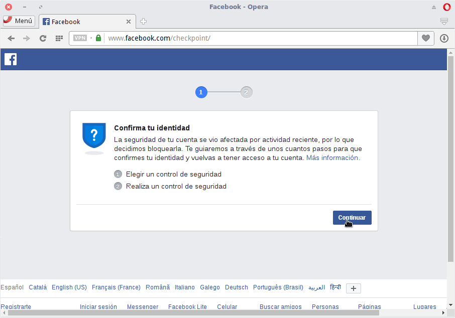](images/confirmar-nuestra-identidad-en-facebook.png)

A continuación se nos preguntará el método que queremos usar para confirmar nuestra identidad. En mi caso selecciono la opción Identifica fotos de amigos y presiono el botón Continuar.

[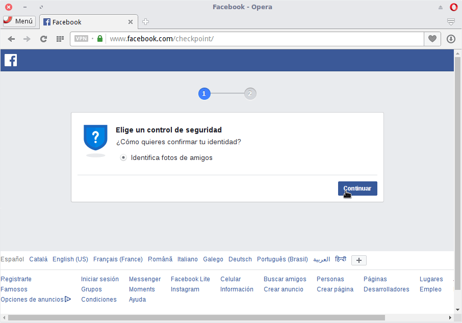](images/metodo-de-verificacion.png)

Seguidamente identificamos a nuestros amigos hasta finalizar el proceso.

[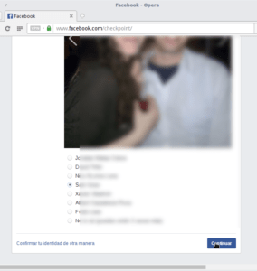](images/identificar-fotos.png)

Una vez finalizado el proceso nos vamos a pidgin y presionamos encima del botón Reconectar.

[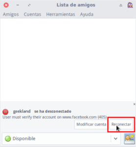](images/conectarse-de-nuevo-a-facebook.png)

Justo después de presionar el botón podremos empezar a chatear en Facebook a través de Pidgin sin tener que sufrir la horrible web de Facebook

[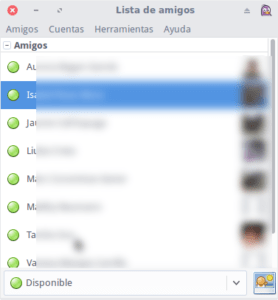](images/chatear-en-pidgin-contactos-facebook.png)

## BENEFICIOS OBTENIDOS DE CHATEAR EN FACEBOOK CON PIDGIN

El beneficio más significativo es poder chatear con nuestros contactos de Facebook sin tener que sufrir la horrible interfaz y anuncios de Facebook.

El hecho de seguir este método no evitará que el contenido de nuestras conversaciones sean almacenadas por Facebook.
