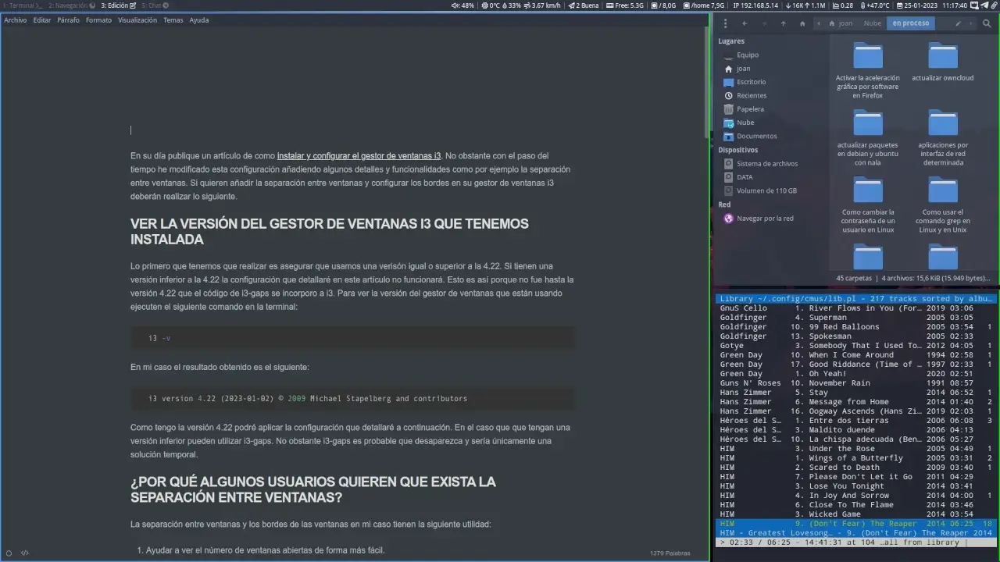

En su día publique un artículo de como [instalar y configurar el gestor de ventanas i3](). No obstante con el paso del tiempo he modificado esta configuración añadiendo algunos detalles y funcionalidades como por ejemplo la separación entre ventanas. Si quieren añadir la separación entre ventanas y configurar los bordes en su gestor de ventanas i3 deberán realizar lo siguiente.<!--more-->

## VER LA VERSIÓN DEL GESTOR DE VENTANAS I3 QUE TENEMOS INSTALADA

Lo primero que tenemos que realizar es asegurar que usamos una versión igual o superior a la 4.22. Si tienen una versión inferior a la 4.22 la configuración que detallaré en este artículo no funcionará. Esto es así porque no fue hasta la versión 4.22 que el código de i3-gaps se incorporo a i3. Para ver la versión del gestor de ventanas que están usando ejecuten el siguiente comando en la terminal:

**`i3 -v`**

En mi caso el resultado obtenido es el siguiente:

```shell
i3 version 4.22 (2023-01-02) © 2009 Michael Stapelberg and contributors
```

Como tengo la versión 4.22 podré aplicar la configuración que detallaré a continuación. En el caso que que tengan una versión inferior pueden utilizar i3-gaps. No obstante i3-gaps es un proyecto que quedará archivado en github y no recibirá más actualizaciones. Por lo tanto lo usuarios de i3-gaps se deberían pasar a i3.

## ¿POR QUÉ ALGUNOS USUARIOS QUIEREN QUE EXISTA LA SEPARACIÓN ENTRE VENTANAS?

La separación entre ventanas y los bordes de las ventanas en mi caso tienen la siguiente utilidad:

1. Ayudar a ver el número de ventanas abiertas de forma más fácil.
2. Estéticamente el entorno de escritorio queda más bonito.

Si vosotros pensáis que existen otras razones las podéis detallar en los comentarios del artículo.

**Nota:** En mi caso configuro una separación entre ventanas muy pequeña y unos bordes muy delgados. Si la separación entre ventanas es demasiado grande no se aprovechará la pantalla de forma adecuada.

## CONFIGURAR LA SEPARACIÓN ENTRE VENTANAS Y LOS BORDES DE LAS VENTANAS

Antes de mostrar mi configuración creo que es interesante explicar los parámetros de configuración existentes.

### Parámetros disponibles para configurar la separación entre ventanas

Las opciones de configuración disponibles para definir el espacio o separación entre ventanas son las que detallo a continuación:

| Ejemplo de un parámetro de configuración | Funcionalidad |
| --- | --- |
| `gaps inner 6` | La separación entre las distintas ventanas que tengamos abiertas es de 6. Este parámetro puede tomar valores numéricos como por ejemplo 3, 5, 9, etc. |
| `workspace 3 gaps inner 6` | Se aplica la separación de 6 entre ventanas únicamente en el escritorio 3. |
| `gaps outer -3` | La separación entre la ventana y el borde del monitor es -3. Este parámetro puede tomar valores numéricos como por ejemplo 3, 5, 9, etc. Este parámetro incluye el valor de `gaps inner`. Por lo tanto si hemos definido `gaps inner 6` y ahora configuramos `gaps outer -3` el resultado final será que la separación entre las ventanas y el borde del monitor será d |
| `workspace 3 gaps outer 2` | Se aplica la separación de 2 entre la ventana y el borde del monitor únicamente en el escritorio 3. |
| `gaps top 1` | Opción para definir que la separación entre la ventana y el borde superior del monitor sea 1. Este parámetro puede aceptar un entero positivo o negativo y sobrescribirá el margen que hayamos definir con la opción `gaps outer`. |
| `gaps bottom -6` | Para definir que separación entre la ventana y el borde inferior del monitor sea -6. Este parámetro puede aceptar un entero positivo o negativo. Este parámetro puede aceptar un entero positivo o negativo y sobrescribirá el margen que hayamos definir con la opción `gaps outer`. |
| `gaps left -6` | Definimos que la separación entre la ventana y el borde izquierdo del monitor sea -6. Este parámetro puede aceptar un entero positivo o negativo. Este parámetro puede aceptar un entero positivo o negativo y sobrescribirá el margen que hayamos definir con la opción `gaps outer`. |
| `gaps right -6` | Configuramos que la separación entre la ventana y el borde derecho del monitor sea de -6. Este parámetro puede aceptar un entero positivo o negativo y sobrescribirá el margen que hayamos definir con la opción `gaps outer`. |
| `smart_gaps on` | Si el valor de `smart_gaps` es `on` solo existirá separación entre ventanas cuando abramos más de una ventana en el escritorio. Los posibles valores de este parámetro son `on`, `off` y `inverse_outer`. La opción `inverse_outer` solo aplicará separación entre ventanas o gaps cuando exista una sola ventana en nuestro escritorio. |

### Explicación de los parámetros disponibles para configurar los bordes de las ventanas

Las opciones disponibles para configurar los bordes de las ventanas son las siguientes:

| Parámetro de configuración | Funcionalidad |
| --- | --- |
| `for_window [class="^.*"] border pixel 2` | El grosor del borde será de 2 pixeles. Si lo quieren más grueso pueden elegir valores como por ejemplo 3, 4, etc. |
| `set $border-focus #5294e2` | El borde de la ventana activa tendrá el color #5294e2. Pueden elegir otros colores en formato HEX. |
| `smart_borders on` | Si activamos los `smart_borders` con la opción `on` solo se mostrarán los bordes de la ventana cuando abramos más de una ventana en la pantalla. El parámetro smart\_borders puede tener los valores `on`, `off` y `no_gaps`. La opción `no_gaps` hara que solo se muestren los bodes cuando no existe un espacio de separación entre ventanas. |

### Ejemplos de los parámetros de configuración que podemos aplicar

En mi caso me gusta aprovechar el máximo el tamaño de la pantalla. Pero al mismo tiempo también me gusta que al abrir más de una ventana pueda ver de forma sencilla el número de ventanas abierta. Partiendo de estas premisas en mi caso la configuración es la siguiente.

Para la separación entre ventanas tengo el siguiente código en mi fichero de configuración:

```shell
## Configurar la seperación entre ventanas
# Separación entre ventanas adyacentes
gaps inner 6
# Separación entre las ventanas y el borde de la pantalla
gaps outer -3
# Para hacer que no haya separación entre la ventana y el borde izquierdo del monitor
gaps left -6
# Para hacer que no haya separación entre la ventana y el borde derecho del monitor
gaps right -6
# Para hacer que no haya separación entre la ventana y el borde inferior del monitor
gaps bottom -6
# Para que solo exista separación en el caos que haya más de una ventana abierta
smart_gaps on
```

Para la configuración de los bordes:

```shell
## Configuración de los bordes de las ventanas
# Para definir el grosor del borde de las ventanas
for_window [class="^.*"] border pixel 2
# Definir el color del borde cuando la ventana está activa
set $border-focus        #5294e2
# Solo se dibujarán bordes en el caso que haya más de una ventana abierta
smart_borders on
```

Con la configuración aplicada pasaremos de tener este entorno de escritorio:


A tener este entorno de escritorio:



**Nota:** La diferencia es sutil ya que la separación entre ventanas es mínima, pero para mi es la configuración ideal. Vosotros podéis añadir más separación en el caso que lo crean conveniente.

Con la nueva configuración del entorno de escritorio:

1. Cuando tenga una sola ventana no existirá ningún tipo de separación y no se dibujarán los bordes de la ventanas.
2. En el momento que haya más de una ventana existirá una separación entre ventanas y se dibujarán los bordes para poder distinguir fácilmente la ventana que está activa.
3. Si hablamos de separación entre las ventanas y los bordes del monitor únicamente tendremos una pequeña separación entre el borde superior de la pantalla y el monitor.

**Nota:** Para ayudarnos a ver la ventana que está activa también podemos usar las transparencias, pero para ello deberemos instalar un compositor de ventanas como por ejemplo compton o picom.

Si quieren definir atajos de teclado para modificar la separación entre ventanas definida pueden seguir la configuración que encontrarán en el siguiente enlace:

[https://github.com/Airblader/i3/wiki/Example-Configuration](https://github.com/Airblader/i3/wiki/Example-Configuration)

#### Fuentes

[https://i3wm.org/docs/userguide.html](https://i3wm.org/docs/userguide.html)
