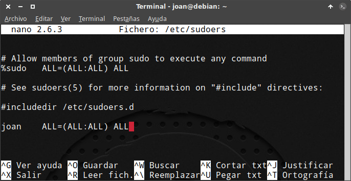
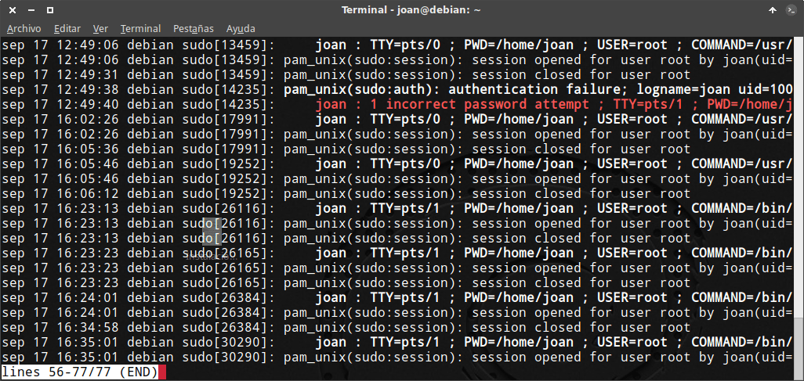

Hay varias distribuciones, como por ejemplo Debian or Arch Linux, que no traen sudo configurado de serie. Por este motivo en el siguiente artículo detallaré de forma clara y concisa como configurar sudo y las ventajas que nos proporcionará.<!--more-->

## VENTAJAS Y UTILIDADES QUE PROPORCIONA EL USO DE SUDO

Bajo mi punto de vista son 3 las ventajas que proporciona el comando sudo. Estas ventajas son las siguientes:

### Dar permisos de administrador a un usuario normal

Mediante sudo, durante un período limitado de tiempo, podemos dar permiso a un usuario común para que pueda ejecutar tareas de administración del sistema con su propia contraseña.

Por lo tanto un usuario normal podrá ejecutar cualquier tipo de tarea en el sistema sin necesidad de loguearse como usuario root y sin tan siquiera saber la contraseña del usuario root.

### Mayor seguridad

Sudo proporciona mayor seguridad en el aspecto que nos permite administrar un sistema operativo sin la necesidad de iniciar una sesión de usuario root.

Además el comando sudo registrará la totalidad de usos realizados en el siguiente log:

En Debian y distros derivadas: **/var/log/auth.log** En Fedora y distros derivadas: **/var/log/secure** Si usamos Arch y distros derivadas: **/var/log/sudo-io** En CentOS: **/var/log/secure**

###### Nota: Las ubicaciones son las predeterminadas por cada distro. Si lo creemos necesario podemos modificar la ruta en que se guardan los logs.

Finalmente sudo nos permitirá restringir los comandos que puede ejecutar cada uno de los usuarios al que le permitiremos usar el comando sudo.

### Comodidad a la hora de administrar un sistema

En el trabajo diario es mucho más cómodo utilizar sudo que no loguearte a la cuenta de root.

Como ejemplo si queremos actualizar nuestro sistema operativo es mucho más práctico ejecutar el comando **sudo apt-get upgrade** que no los comandos **su** y **apt-get upgrade**.

## INSTALAR EL PAQUETE SUDO

El primer paso para poder utilizar sudo es comprobar que tenemos instalado el paquete sudo.

Para ello nos logueamos como usuario root ejecutando el siguiente comando en la terminal:

> ```
> su
> ```

A continuación ejecutamos el siguiente comando para asegurar que el paquete sudo está instalado:

> ```
> apt-get install sudo
> ```

Una vez instalado el paquete sudo podemos pasar a configurar sudo según nuestras necesidades.

## CONFIGURAR SUDO EN LINUX

Existen varios parámetros que nos permiten configurar sudo. Algunos de ellos los podemos ver a continuación:

### Configurar sudo para restringir su uso

Para restringir el uso del comando sudo abrimos una terminal y ejecutamos el siguiente comando:

> ```
> su
> ```

A continuación escribimos la contraseña del usuario root y presionamos enter.

Una vez logueados como usuario root ejecutamos el siguiente comando en la terminal:

> ```
> visudo
> ```

###### Nota: Para editar el fichero /etc/sudoers se recomienda usar visudo. Visudo previene que 2 usuarios puedan editar el fichero de forma simultánea y comprueba que la sintaxis que escribimos sea correcta.

Después de ejecutar el comando se abrirá el editor de textos en el que podremos configurar sudo según nuestras necesidades.

Para restringir el uso del comando sudo deberemos usar un comando del siguiente tipo:

> ```
> nombre_usuario nombre_equipo = (usuario:grupo) comando_restringir
> ```

El significado de cada uno de los términos de este comando es el siguiente:

**nombre\_usuario**: Es el nombre de usuario que puede usar el comando sudo. El nombre de usuario puede ser un usuario, un alias de usuario o un grupo.

**nombre\_equipo**: Es el nombre del equipo o hostname en el que podemos aplicar el comando sudo. Sus valores pueden ser todos los equipos (ALL), un solo equipo, un alias de equipos, una dirección IP, etc.

**(usuario:grupo)**: Especificamos los usuarios y los gruposs que podrá usar el usuario de sudo cuando ejecuta los comandos. Para poder ejecutar comandos con un usuario y grupo específico tendremos que usar los comandos **sudo -u** y **sudo -g**. Si no indicamos ningún usuario ni ningún grupo se usará el usuario root y el grupo root.

**comando\_restringir**: Especificación/restricción de los comandos que pueden ejecutar los usuarios que pueden ejecutar el comando sudo.

Una vez vista la explicación teórica pasaremos a ver ejemplos prácticos para restringir el uso del comando sudo.

#### 1- Dar permisos de usuario root a un usuario normal para ejecutar cualquier comando en nombre de cualquier usuario

La configuración que veremos en este apartado es la que usan el 99% de usuarios domésticos en sus equipos

Para conseguir este propósito tan solo tenemos que añadir la siguiente línea dentro del fichero **/etc/sudoers**.

> ```
> joan ALL=(ALL:ALL) ALL
> ```

\[caption id="attachment\_7457" align="alignnone" width="484"\][](images/Configuración-básica-del-comando-sudo.png) Muestra de mi fichero /etc/sudoers\[/caption\]

Introduciendo esta línea damos permiso al usuario **joan** para que en cualquier equipo pueda ejecutar cualquier comando en nombre de cualquier usuario y grupo existente.

Una vez introducida la línea guardamos los cambios y cerramos el fichero.

#### 2- Dar permisos de usuario root a un usuario normal mediante sudo

Para cumplir con nuestro propósito tenemos que introducir la siguiente línea en el fichero **/etc/sudoers**:

> ```
> joan debian=(root:root) ALL
> ```

Introduciendo esta línea damos permiso al usuario **joan** para que en el equipo **debian** pueda ejecutar cualquier comando en nombre del usuario **root**.

A diferencia del caso anterior en este caso el usuario joan únicamente podrá usar comando sudo en el equipo debian y únicamente lo podrá hacer en nombre del usuario root.

Una vez introducida la línea guardamos los cambios y cerramos el fichero.

#### 3- Dar permisos para que todos los usuarios de un grupo tengan permisos de administrador

Para dar permisos de administración a todos los usuarios de un grupo tendríamos que introducir la siguiente línea en el fichero **/etc/sudoers**:

> ```
> %joan ALL=(root:root) ALL
> ```

Introduciendo esta línea damos permisos a todos los usuarios del grupo **joan** para que en cualquier equipo puedan ejecutar cualquier comando en nombre del usuario root.

Una vez introducida la línea guardamos los cambios y el proceso ha finalizado.

#### 4- Dar permisos a un usuario para ejecutar comandos en nombre de varios usuarios

Para que un usuario pueda ejecutar comandos como si fuera otro usuario podemos añadir un comando similar al siguiente en el fichero **/etc/sudoers**:

> ```
> joan debian=(martin,root:martin,root) ALL
> ```

Introduciendo esta línea damos permiso al usuario **joan** para que en el equipo **debian** pueda ejecutar cualquier comando en nombre del usuario **martin** y en nombre del usuario **root**.

Una vez guardados los cambios en el fichero **/etc/sudoers**, el usuario **joan** podrá por ejemplo crear un fichero en nombre del usuario **martin** ejecutando el siguiente comando en la terminal:

> ```
> sudo -u martin -g martin touch prueba.txt
> ```

#### 5- Dar permisos a un usuario para que únicamente pueda usar los comandos que nosotros queramos

De forma fácil podemos limitar los permisos que damos a un usuario.

A modo de ejemplo podemos introducir el siguiente comando en el fichero **/etc/sudoers**:

> ```
> joan ALL=(root:root) /usr/bin/passwd *, !/usr/bin/passwd root
> ```

Con este comando damos permiso al usuario **joan** para que en el cualquier equipo pueda cambiar la contraseña de cualquier usuario exceptuando la contraseña del usuario **root**.

###### Nota: Mediante el operador \* indicamos que el usuario joan podrá cambiar la contraseña de todos los usuarios. Con el operador ! Forzamos que el usuario joan no pueda cambiar la contraseña del usuario root.

#### 6- Dar permisos para que únicamente los usuarios de un grupo puedan utilizar iptables

Si únicamente quiero que los usuarios del grupo **joan** puedan utilizar iptables introduciré la siguiente línea dentro del fichero **/etc/sudoers**:

> ```
> %joan ALL=(root:root) /sbin/iptables
> ```

Una vez introducidos los cambios tan solo tenemos que guardarlos y cerrar el editor de textos.

###### Nota: Para facilitar el proceso de restricción y configuración de podemos usar alias.

### Configurar sudo para deshabilitar o limitar el período de gracia de sudo

En el momento de ejecutar un comando con sudo tenemos que introducir la contraseña de nuestro usuario.

Una vez introducida la contraseña nuestro sistema operativo la recordará durante un período de 5 minutos.

De este modo si a los 3 minutos de aplicar un comando con sudo aplicamos otro comando con sudo no tendremos que introducir la contraseña de nuevo.

Muchos usuarios consideran que este período de gracia es una brecha de seguridad.

Por lo tanto si queremos limitar o eliminar el tiempo que nuestro sistema almacena nuestra contraseña abrimos una terminal y ejecutamos el siguiente comando:

> ```
> sudo visudo
> ```

Una vez se abra el editor de textos introduciremos la siguiente línea al final del archivo:

> ```
> Defaults:ALL timestamp_timeout=0
> ```

Una vez introducida guardamos los cambios y cerramos el editor de textos.

En estos momentos cada vez que usemos sudo tendremos que introducir nuestra contraseña de usuario. Por lo tanto hemos eliminado el período de gracia para la totalidad de usuarios de nuestro equipo.

Si nuestro objetivo fuese simplemente reducir el período de gracia a 2 minutos, al final del archivo **/etc/sudoers** deberíamos introducir el siguiente comando:

> ```
> Defaults:ALL timestamp_timeout=2
> ```

Después de introducir el comando guardamos los cambios y cerramos el editor de textos.

En estos momentos nuestro sistema operativo únicamente recordará nuestra contraseña de usuario durante 2 minutos. Si en vez de 2 minutos queremos que sea 1 minuto tendremos que reemplazar el 2 por el 1.

### Usar el comando sudo sin necesidad de usar contraseña

En contraposición al apartado anterior pueden existir usuarios a los que no les preocupe la seguridad y les molesta tener que introducir su contraseña.

Si este es vuestro caso tenéis que abrir una terminal y ejecutar el siguiente comando:

> ```
> sudo visudo
> ```

Se abrirá el editor de textos con el contenido del archivo **/etc/sudoers**.

En el apartado donde restringimos el uso del comando sudo deberemos introducir la palabra **NOPASSWD:** justo antes de la parte del comando en que que indicamos los comandos que se pueden ejecutar con sudo.

Por lo tanto en mi caso escribiría el siguiente comando:

> ```
> joan ALL=(ALL:ALL) NOPASSWD: ALL
> ```

Finalmente guardaría los cambios y cerraría el fichero.

En estos momentos el usuario joan podrá ejecutar cualquier comando con sudo sin necesidad de introducir ninguna contraseña.

En el caso que quisiéramos que un usuario solo pudiera usar determinados comandos sin tener que utilizar contraseña podríamos reemplazar el comando anterior por el siguiente:

> ```
> joan ALL=(ALL:ALL) NOPASSWD: /usr/bin/apt-get,/sbin/shutdown
> ```

De este modo el usuario joan podría gestionar los paquetes del equipo y cerrar el ordenador sin necesidad de introducir ninguna contraseña. Para el resto de tareas de administrador tendría que introducir la contraseña.

### Configurar sudo para limitar los intentos que un usuario tiene para adivinar la contraseña

De forma estándar disponemos de 3 intentos para adivinar la contraseña de nuestro usuario.

En el caso que fallemos 3 veces deberemos volver a introducir de nuevo el comando que queremos ejecutar.

Si queréis reducir el número de intentos a 2 tenemos que abrir una terminal y ejecutar el comando:

> ```
> sudo visudo
> ```

A continuación se abrirá el editor de textos y al final del contenido del archivo **/etc/sudoers** introduciremos el siguiente comando:

> ```
> Defaults:ALL passwd_tries=2
> ```

Una vez introducido el comando guardamos los cambios y cerramos el editor de texto.

En estos momentos únicamente tendremos 2 oportunidades para poner nuestra contraseña de usuario de forma correcta.

### Configurar sudo para definir el archivo y ubicación en que se guardarán los logs

En el inicio del artículo hemos visto la ubicación de logs de sudo para varias distribuciones.

Si queremos modificar esta ubicación lo podemos realizar fácilmente editando el archivo **/etc/sudoers**. Para ello abrimos una terminal y ejecutamos el siguiente comando:

> ```
> sudo visudo
> ```

Seguidamente en la parte final del archivo añadimos la siguiente línea:

> ```
> Defaults logfile=/var/log/sudo
> ```

###### Nota: La parte de color rojo del comando indica la ruta y el archivo en el que se guardaran los logs. En vuestro caso podéis colocar la ruta que queráis.

Una vez introducida la línea guardamos los cambios.

A partir de estos momentos la totalidad de logs referentes a sudo se guardaran en **/var/log/sudo**.

Si queremos consultar el log podemos ejecutar el siguiente comando en la terminal:

> ```
> sudo less /var/log/sudo
> ```

## CONSULTAR LOS REGISTROS DE SUDO

Si queremos ver la totalidad de acciones realizadas con el comando sudo podemos abrir una terminal y ejecutar el siguiente comando:

> ```
> sudo journalctl _COMM=sudo
> ```

###### Nota: Este comando funcionará para las distros que usen systemd. En la actualidad prácticamente la totalidad de distros usa Systemd.

Después de ejecutar el comando obtendremos el siguiente resultado:

\[caption id="attachment\_7458" align="alignnone" width="590"\][](images/logs-sudo-journalctl.png) Muestra de los logs de sudo\[/caption\]

Si observamos los resultados de la captura de pantalla podemos observar los siguientes registros:

1. La hora en que hemos ejecutado el comando sudo.
2. La ubicación desde donde hemos ejecutado el comando sudo.
3. El usuario que ha usado sudo.
4. Los comandos que hemos ejecutado con sudo.
5. Los intentos fallidos a la hora de escribir la contraseña de usuario.
6. Etc.

Por lo tanto podemos ver que sudo registra la totalidad de acciones que realizan los distintos usuarios del sistema.

## DESACTIVAR O DESHABILITAR EL USUARIO ROOT

Una vez tenemos configurado sudo a nuestro gusto es posible que alguien se pueda plantear deshabilitar el usuario root.

De este modo en caso de un ataque, el atacante tendrá una tarea adicional que será la de averiguar el nombre de usuario que puede utilizar sudo.

###### Nota: Antes de seguir adelante aseguraos que sudo lo tenéis configurado correctamente. Si sudo está mal configurado y deshabilitamos el usuario root podemos tener graves problemas.

Para bloquear al usuario root ejecutamos el siguiente comando en la terminal:

> ```
> sudo usermod --lock --expiredate 1970-01-01 root
> ```

Después de ejecutar este comando únicamente podremos realizar tareas de administración del sistema con sudo.

Si un día quisiéramos reactivar el usuario root tan solo tendríamos que ejecutar el siguiente comando en la terminal:

> ```
> sudo usermod --unlock --expiredate 99999 root
> ```

## CONSIDERACIONES DEL COMANDO SUDO

En este artículo hemos visto varias opciones para configurar sudo según nuestras necesidades. No obstante solo se recomienda usar sudo para ejecutar comandos en la terminal.

En el momento que tengamos que ejecutar aplicaciones gráficas con permisos de administrador es recomendable hacerlo con los comandos gksu, kdesu y beesu.

En función del entorno de escritorio que usemos deberemos usar un comando u otro. De este modo:

**gksu:** Será usado en entornos de escritorio Gnome y Xfce **kdesu:** Lo usaremos en entornos de escritorio kde. **beesu:** Es el comando que usaremos en Fedora.

A modo de ejemplo si en xfce quiero ejecutar thunar con permisos de administrador ejecutaré el siguiente comando en la terminal:

> ```
> gksu thunar
> ```

En el caso que pretendan obtener información adicional sobro como abrir aplicaciones con entorno gráfico como usuario root pueden consultar el siguiente enlace:

[https://geekland.eu/abrir-aplicaciones-graficas-como-root/]()

Si queréis aportar alguna idea adicional para poder configurar  sudo la podéis dejar en los comentarios del blog.
