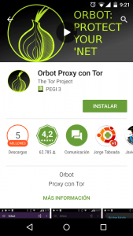
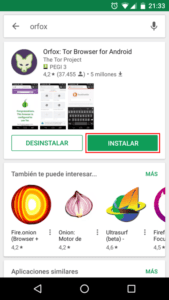
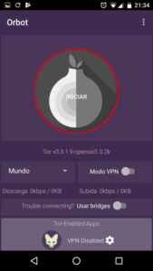
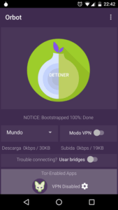
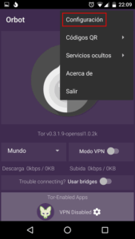
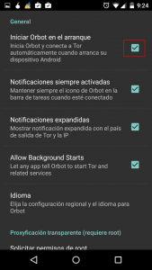
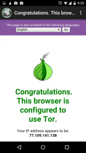
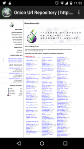

Hace tiempo escribí un [post]() en el que detallaba varios aspectos de la Deep web. A raíz de este post mucha gente ha estado pidiendo como poder acceder a la Deep web a partir de su teléfono Android. A raíz de las numerosas peticiones en el siguiente post detallaremos como acceder a la Deep Web a través de nuestro teléfono Android.<!--more-->

## REQUISITOS PARA NAVEGAR EN LA DEEP WEB EN ANDROID

Para conectarnos a la red Tor y poder acceder y navegar de forma anónima en la deep web con nuestro dispositivo Android necesitamos cumplir 3 requisitos:

1. **Disponer de un teléfono o tablet** con con el sistema operativo Android.
2. **Disponer de la App [Orbot](https://guardianproject.info/apps/orbot/ "Información sobre la App Orbot")**. La aplicación Orbot es un [servidor proxy]() local que funciona por el puerto 8118. Este servidor proxy será el encargado de resolver las peticiones de nuestro navegador web a través de la red Tor. En futuros post hablaremos más de Orbot, porque esta app tiene varias utilidades, como por ejemplo trabajar como un proxy transparente.
3. **Disponer del navegador web [Orfox](https://guardianproject.info/apps/orfox/ "Información sobre la App Orfox")**. Podemos usar cualquier otro navegador que permita hacer las peticiones a través del servidor proxy Orbot, pero en mi caso prefiero redactar el post usando Orfox porque este navegador viene preparado de serie para usar la red Tor, no guarda historiales de búsqueda, gestiona las cookies de forma que no podamos ser rastreados, permite deshabilitar el javascript, etc. Si usamos otros navegadores, como por ejemplo Firefox, tendremos que instalar extensiones extra y configurar el navegador. Como alternativa real a Orfox tenemos la opción de usar Orweb, pero Orweb ha quedado obsoleto.

Estos son los 3 únicos requisitos. No es necesario ser usuario root para conseguir navegar por la deep web.

## BENEFICIOS DE USAR LA RED TOR EN ANDROID

La lista de beneficios de usar la red Tor para navegar en internet no es que sea muy larga, pero las ventajas que obtenemos son importantes. Algunas de las ventajas obtenidas son las siguientes:

1. Poder **navegar anónimamente en la red**. Nuestra identidad estará completamente oculta. Ni nuestro proveedor de internet podrá saber las páginas web que hemos visitado.
2. El tráfico que generamos viajará de forma cifrada. Por lo tanto la **navegación es más segura**.
3. **Acceder a la** totalidad de contenido ubicado en la llamada **deep web**.
4. **Acceder a contenidos web que están bloqueados geográficamente**.

## INSTALAR ORBOT Y ORFOX

Seguidamente se detalla de forma breve como pueden instalar las aplicaciones Orbot y Orfox.

### Instalar Orbot en nuestro dispositivo Android

Para instalar Orbot, tan solo tenemos que **acceder a la tienda de Google Play Store e instalar la aplicación**. Si clican en el siguiente [enlace](https://play.google.com/store/apps/details?id=org.torproject.android&hl=es "Link para descargar Orbot del Google play") accederán directamente a la página de descarga de aplicación Orbot.

Para que no tengan ningún tipo de duda del programa que se trata, les dejo esta captura de pantalla en la que pueden ver información relativa al programa.

Fuentes alternativas para la descarga e instalación de Orbot son las siguientes:

1- [Instalación de Orbot a través de la tienda F-Droid](https://guardianproject.info/fdroid/ "Link para descargar Orbot de la tienda F-droid") 2- [Instalación de Orbot descargando el apk de la web de los desarrolladores](https://guardianproject.info/apps/orbot/ "Link para descargar Orbot de la web de los desarrolladores")

### Instalar Orfox en nuestro dispositivo Android

Para instalar Orfox, tan solo tenemos que **acceder a la tienda de Google Play Store e instalar la aplicación**. Si clican en el siguiente [enlace](https://play.google.com/store/apps/details?id=info.guardianproject.orfox&hl=es "Link para descargar Orweb de la tienda Google Play") accederán directamente a la página de descarga de aplicación Orfox.

Para que no tengan ningún tipo de duda del programa que se trata, les dejo esta captura de pantalla en la que pueden ver información relativa al programa.

Fuentes alternativas para la descarga e instalación de Orfox:

1- [Instalación de Orfox a través de la tienda F-Droid](https://guardianproject.info/fdroid/ "Link para descargar Orfox de la tienda F-droid") 2- [Instalación de Orfox descargando el apk de la web de los desarrolladores](https://guardianproject.info/apps/orfox/ "Link para descargar Orweb de la web los desarrolladores")

## EMPEZAR A NAVEGAR POR LA DEEP WEB

Una vez instaladas las aplicaciones Orbot y Orfox ya podemos empezar a configurarlas y a usarlas. Para configurar y usar las 2 aplicaciones que acabamos de instalar, tenemos que seguir las siguientes instrucciones.

**Paso 1: Iniciar Orbot** Justo en el momento de **iniciar Orbot** tendremos saltar la introducción y seguidamente veremos la siguiente pantalla:

Para que Orbot empiece a funcionar, tan solo tenemos que **pulsar el botón iniciar**. En el momento que se inicie Orbot veremos la siguiente pantalla:

En estos momentos ya estamos listos para empezar a navegar a través de la red Tor.

**Paso 2: Configurar Orbot (Opcional)** **La configuración estándar de Orbot es perfectamente válida** para el uso que nosotros le queremos dar. Por lo tanto si queréis no es necesario seguir las indicaciones de este apartado.

En mi caso hay un punto de la configuración estándar de Orbot que me molesta. Lo que me molesta es que viene configurado para que Orbot se ejecute automáticamente cada vez que encendemos nuestro teléfono. Si queremos evitar esto, tal y como se indica en la captura de pantalla, _presionamos encima del icono de configuración_:

Después de presionar sobre el icono de configuración aparecerá la siguiente pantalla:

En la pantalla de configuración tan solo tenemos que **destildar la opción Iniciar Orbot en el arranque**. A partir de estos momentos Orbot no se iniciará automáticamente cada vez que encendamos el teléfono.

**Paso 3: Iniciar y usar Orfox para navegar en la deep web** Una vez iniciado Orbot ya podemos usar Orfox para navegar de forma anónima en la web tradicional, o para navegar en la deep web. Por lo tanto abrimos Orfox.

Para tener la certeza absoluta que estamos conectados a la red Tor ingresamos la siguiente URL en Orfox:

[https://check.torproject.org](https://check.torproject.org)

Si la configuración es correcta y todo está en orden para navegar, aparecerá la siguiente pantalla confirmando que estamos conectados a la red Tor:

A partir de estos momentos ya podemos navegar de forma normal y corriente con nuestro navegador. En la siguiente captura de pantalla podrán observar que estoy observando el contenido de la Hidden Wiki.

Nos nos tenemos que preocupar por la configuración de Orfox ya que la configuración estándar es correcta para poder navegar de forma anónima. No obstante quien sea curioso y perfeccionista puede entrar en la configuración para definir el idioma, configurar el comportamiento de las cookies, configurar el borrado automático del historial de navegación, limpiar la cache del navegador, definir un user agent falso, habilitar/deshabilitar el contenido javascript, etc.

## ADVERTENCIAS

A pesar de que Orbot y Orfox nos ofrecerán una navegación anónima y segura, hay que ser cauteloso y evitar ser nosotros mismos quien revele nuestra identidad. Por lo tanto hay que ser cauteloso con los siguientes aspectos:

1. Con el método descrito en el post **nuestra navegación solo será anónima cuando usemos el navegador Orfox**. Si usamos un navegador convencional, o alguna otra App como por ejemplo Twitter, no seremos anónimos ni estaremos usando al red Tor.
2. **No uséis vuestras cuentas de hotmail, gmail, etc**. En el momento de usar estás cuentas estáis dando pistas claras de vuestra identidad.
3. En el momento de navegar por la deep web tenemos que **ser cautelosos con lo que nos descargamos y con lo que hacemos**. Descarga y ejecutar archivos en nuestro teléfono puede llegar a ser peligroso y puede revelar nuestra identidad.

Si quieren información adicional sobre este aspecto y otros les recomiendo visitar en siguiente [enlace]().

## FUENTES

Las fuentes usadas para la redacción de este post han sido las siguientes:

[https://www.torproject.org/docs/android.html.en](https://www.torproject.org/docs/android.html.en) [https://guardianproject.info/apps/orbot/](https://guardianproject.info/apps/orbot/)
