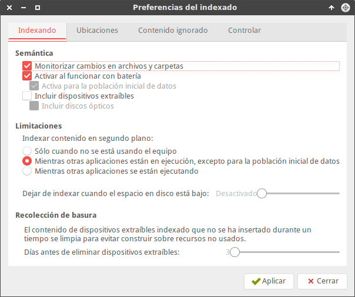
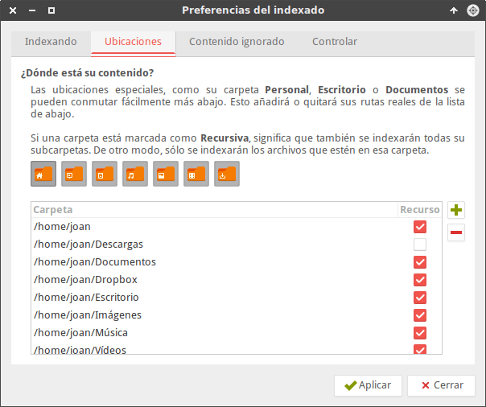
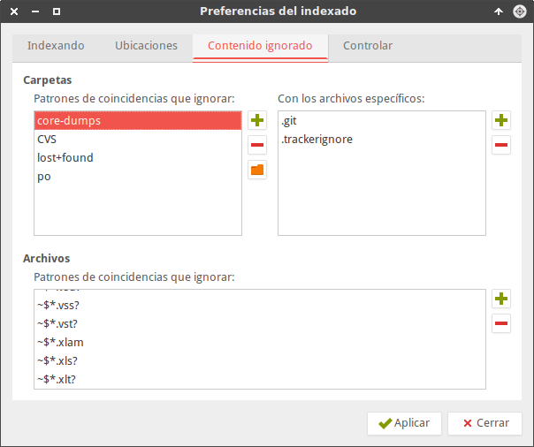
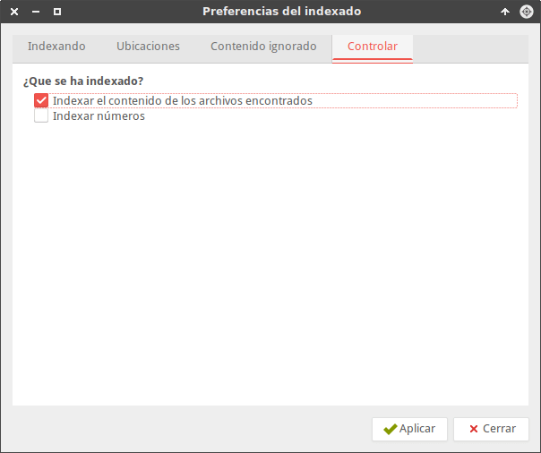
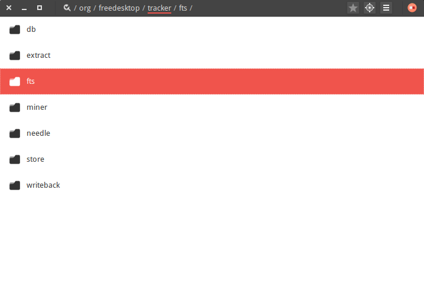
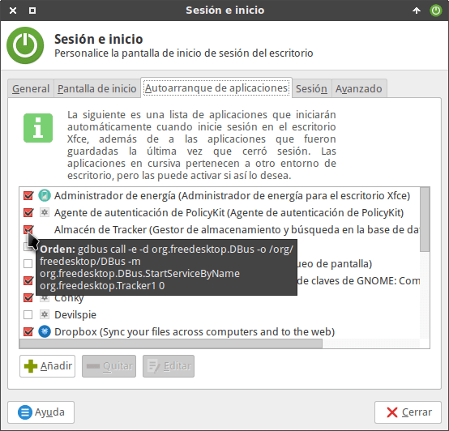

Hace semanas tuve una conversación con un lector que daba por sentado que en XFCE no se pueden realizar búsquedas a partir del contenido que tiene un archivo. A raíz de esta experiencia en este artículo explicaré como buscar archivos por su contenido en cualquier entorno de escritorio mediante el programa de Gnome Tracker.<!--more-->

###### Nota: En Xfce y en otros escritorios ligeros, casi siempre hay opciones para realizar todo lo que tenemos en mente. Cabe recordar que muchos escritorios gtk, como por ejemplo Xfce y Lxde, permiten instalar y usar componentes y aplicaciones de Gnome o Kde.

## ÁMBITO DE APLICACIÓN DE ESTE TUTORIAL

Este tutorial lo podéis aplicar en cualquier entorno de escritorio a excepción de Plasma. Los motivos son los siguientes:

1. Plasma ya dispone de esta funcionalidad de serie mediante Strigi, Akonadi y nepomuk.

## COMO INSTALAR TRACKER

Para instalar tracker tienen que ejecutar el siguiente comando en la terminal:

> ```
> sudo apt-get install tracker
> ```

###### Nota: Los usuarios de Gnome Shell, y otros entornos de escritorio, es posible que ya tengan instalado el paquete.

Una vez instalado el programa y podemos iniciar el proceso de configuración.

## CONFIGURAR TRACKER PARA BUSCAR ARCHIVOS POR SU CONTENIDO

Uno de los pasos más importantes es definir el contenido que queremos que indexar. Para ello en la terminal ejecutamos el siguiente comando:

> ```
> tracker-preferences
> ```

Después de ejecutar el comando aparecerá la siguiente ventana en la que realizaremos todo el proceso de configuración.

### Opciones de la pestaña indexando

En la primera pestaña vemos las siguientes opciones:

[](images/opciones-de-indexado.png)

Por lo tanto en la pestaña Indexando tenemos la oportunidad de configurar los siguientes aspectos:

1. Activar y desactivar la monitorización de los cambios en los archivos y carpetas.
2. Activar o desactivar la monitorización de archivos y carpetas cuando nuestro equipo trabaja con batería.
3. Definir si queremos que se indexe y monitorice el contenido de dispositivos extraíbles como por ejemplo un USB.
4. Indicar el momento en que tracker puede indexar el contenido de nuestras carpetas y archivos.
5. Que se pare la indexación cuando nos estemos quedando sin espacio en el disco duro.
6. Eliminar contenido indexado de dispositivos extraíbles que hace días que no conectamos a nuestro equipo.

### Opciones de la pestaña Ubicaciones

La pestaña Ubicaciones contiene las siguientes opciones:

[](images/ubicaciones-que-queremos-indexar.png)

En esta pestaña de forma muy fácil e intuitiva debemos añadir las ubicaciones que queremos indexar. En mi caso únicamente añado la ubicación /home/joan/Dropbox y tildo la su casilla Recurso para que se indexe de forma recursiva todo el contenido ubicado en mi carpeta de Dropbox.

Únicamente tenemos que indexar las ubicaciones que necesitemos por los siguientes motivos:

1. Cuanto más contenido indexemos, más recursos consumiremos de nuestro ordenador.
2. Cuando menos contenido tengamos indexado, más fácil será encontrar lo que buscamos. Indexar información no útil dificultará nuestras búsquedas.

### Opciones de las pestaña Contenido ignorado

Si examinamos el contenido de la pestaña Contenido ignorado veremos lo siguiente:

[](images/contenido-ignorado.png)

Por lo tanto en esta pestaña podemos configurar los siguientes aspectos:

1. Definir que las carpetas con un determinado nombre o que contengan determinadas extensiones de archivos no se indexen.
2. Indicar las extensiones y/o nombres de los archivos que no queremos que se indexen.

###### Nota: En patrones recomiendo borrar ~$.xls? y ~$.ppt?. De este modo se indexarán los documentos de Microsoft Office que podamos tener en nuestro ordenador.

### Opciones de las pestaña Controlar

Finalmente en la pestaña Controlar podemos ver las siguientes opciones:

[](images/contenido-que-se-indexa.png)

Tildando la primera de las casillas hacemos que se indexe el contenido de nuestros archivos. Si nuestro fin es buscar archivos por la información que contienen tenemos que activar esta opción. Si no activamos esta opción simplemente se indexarán los archivos por su nombre.

En la segunda de las opciones podemos seleccionar si queremos que tracker indexe los números del contenido y el nombre de nuestros ficheros. En mi caso no selecciono esta opción.

Una vez realizada toda la configuración presionan el botón Aplicar y reinician el ordenador. Al reiniciar el ordenador empezará la indexación del contenido de nuestros archivos.

## CONFIGURACIÓN AVANZADA DE TRACKER

Mediante dconf-editor podemos configurar otros aspectos más avanzados de la aplicación de búsqueda de Gnome.

Para ello lo primero que tenemos que hacer es instalar dconf-editor ejecutando el siguiente comando en la terminal:

> ```
> sudo apt-get install dconf-editor
> ```

Una vez instalado abrimos una terminal y ejecutamos el comando:

> ```
> dconf-editor
> ```

A continuación se abrirá dconf-editor y deberemos navegar hacia la ubicación /org/feedesktop/tracker.

[](images/configuración-avanzada-tracker.png)

Dentro de las carpetas de la ubicación mencionada encontrarán los archivos para configurar los siguientes aspectos:

1. Indicar si queremos que el indexado y las búsquedas tengan en cuenta los acentos de las palabras. (/org/feedesktop/tracker/fts/enable-unaccent)
2. Fijar un número limite de palabras a indexar por documento. De forma predeterminada el límite de palabras por documento que se indexarán son 10.000. (/org/feedesktop/tracker/fts/max-words-to-index)
3. Definir la longitud máxima de las palabras que se indexarán. Por defecto únicamente se indexarán las palabrás más pequeñas de 30 caracteres. (/org/feedesktop/tracker/fts/max-word-lenght)
4. Regular la velocidad de indexado mediante la propiedad Throttle. Por defecto tracker trabaja a la máxima velocidad. Si notamos lentitud en nuestro ordenador podemos ralentizar la velocidad de indexado. (/org/feedesktop/tracker/miner/files/throttle)
5. El tamaño máximo de datos que se indexarán de cada uno de los archivos que queremos indexar. Por defecto los metadatos extraidos de una uno de los archivos no puede superar los 1.048.576 bytes. (/org/feedesktop/tracker/extract/max-bytes)
6. Tamaño del diario en que se iniciará la rotación. Por defecto cuando el tamaño del diario supera los 50 MB se comprime el diario actual y se crea un diario nuevo. (/org/feedesktop/tracker/db/journal-chunk-size)
7. Etc.

Para comprobar la totalidad de parámetros de configuración que estamos usando podemos abrir una terminal y ejecutar el siguiente comando:

> ```
> gsettings list-recursively | grep -i org.freedesktop.Tracker | sort | uniq
> ```

Una vez finalizado el proceso de configuración tan solo tienen que reiniciar el ordenador. Después de reiniciar el ordenador se iniciará el proceso de indexación de contenido.

## UBICACIONES QUE ALMACENAN INFORMACIÓN IMPORTANTE

Hay una serie de ubicaciones tenemos que conocer. Estas ubicaciones contienen información importante sobre tracker.

### Ubicación de la base de datos

La ubicación de la base de datos es la siguiente:

> ```
> ~/.cache/tracker/meta.db
> ```

Obviamente nunca tenemos que borrar la base de datos porque es la que contiene la totalidad de metadatos extraídos para realizar nuestras búsquedas.

### Ubicación de los diarios

Los diarios de tracker se almacenan en la siguiente ubicación:

> ```
> ~/.local/share/tracker/data/
> ```

Los diarios servirán para restablecer la base de datos en el caso que presente problemas.

## ARCHIVOS Y CONTENIDO QUE SE PUEDE INDEXAR

Tracker permite indexar contenido de un gran número de formatos de archivos. Algunos de los más destacados son:

1. Archivos de Microsoft Office como por ejemplo .doc, .xls, .ppt, .docx, .xlsx, .pptx.
2. El contenido de todos los tipos de documento de Libreoffice.
3. Metadatos de los archivos de Microsoft Office o Libreoffice.
4. Archivos html.
5. Archivo de Texto plano.
6. PDF.
7. EPUB.
8. Etc.

Si quieren ver la totalidad de archivos que se pueden indexar pueden visitar la siguiente URL:

[Extensiones que soporta el programa](https://wiki.gnome.org/Projects/Tracker/SupportedFormats "Totalidad de extensiones soportadas por el programa")

## DESINSTALAR O DESHABILITAR TRACKER

Por diversos motivos es posible que haya personas que quieran desactivar o desinstalar el buscador de gnome.

### Desinstalar Tracker

Para su desinstalación tienen abrir una terminal y ejecutar el siguiente comando:

> ```
> tracker reset --hard
> ```

Después de ejecutar el comando les aparecerá la siguiente advertencia:

> ```
> ADVERTENCIA: este proceso puede eliminar datos definitivamente.
> Aunque Tracker puede reindexar la mayor parte del contenido de manera segura, no se puede asegurar esto para todos los datos. Tenga en cuenta que puede perder datos, proceda bajo su responsabilidad.
> 
> ¿Esta seguro de que quiere continuar? [s|N]:
> ```

Como queremos borrar todo el índice teclearemos la tecla s y presionaremos Enter.

Justo después de borrar los datos que tracker tenia indexados, desinstalaremos el programa ejecutando el siguiente comando en la terminal:

> ```
> sudo apt-get remove --purge tracker
> ```

### Deshabilitar Tracker

Si lo único que pretendemos es deshabilitarlo, el procedimiento a seguir para el entorno de escritorio XFCE es el siguiente:

Abrimos una terminal y tecleamos el siguiente comando:

> ```
> xfce4-session-settings
> ```

Una vez ejecutado el comando se abrirá la ventana de sesión e inicio. A continuación clicamos sobre la pestaña Autoarranque de aplicaciones.

[](images/deshabilitar-tracker.png)

Dentro de la pestaña destildamos la totalidad de entradas que hacen referencia a Tracker. En mi caso las entradas son:

1. Almacén de Tracker
2. Extractor de metadatos de Tracker
3. Minero de aplicaciones de Tracker
4. Minero de guías de usuario de Tracker

Una vez destildadas estas opciones, la próxima vez que arranquemos el ordenador, el buscador de archivos de Gnome ya no se cargará en memoria.

## ALTERNATIVAS PARA BUSCAR ARCHIVOS POR SU CONTENIDO

Tracker no es el único software que nos permite buscar ficheros por su contenido. Por lo tanto en el caso que no les convenza pueden probar otras opciones como por ejemplo las siguientes:

1. Recoll
2. Beagle

## EMPEZAR A BUSCAR ARCHIVOS POR SU CONTENIDO

En las próximas semanas escribiré una serie de artículos para que todo el mundo sea capaz de buscar archivos y carpetas por su contenido.

Los artículos que escribiré serán los siguientes:

1. Como buscar archivos por su contenido con Tracker.
2. Etiquetar archivos mediante la terminal.
3. Etiquetar archivos mediante el gestor de archivos Nautilus.
4. Buscar archivos y carpetas mediante etiquetas.
