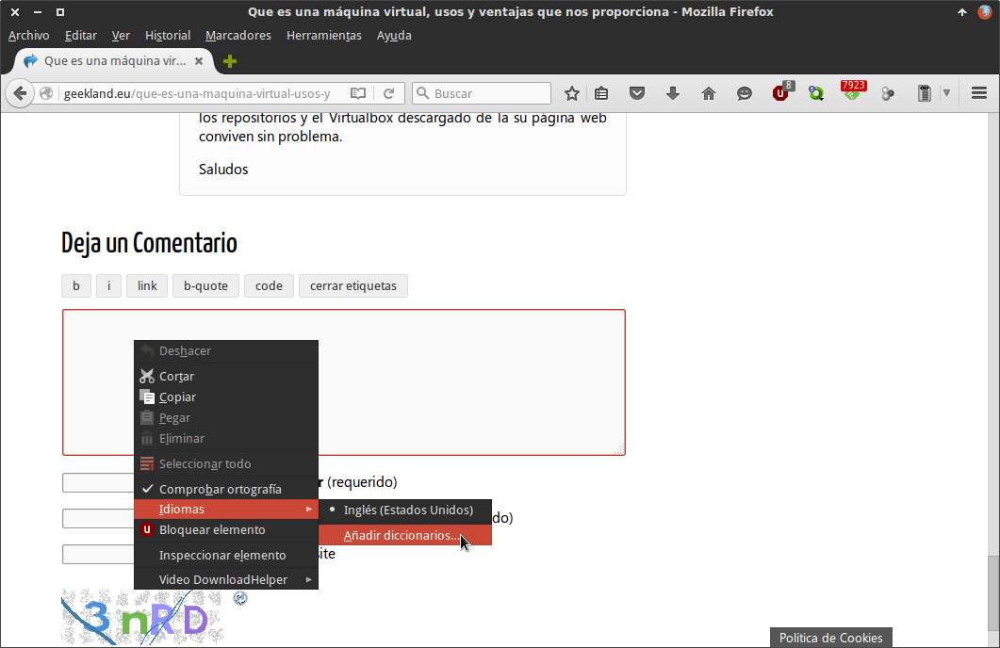
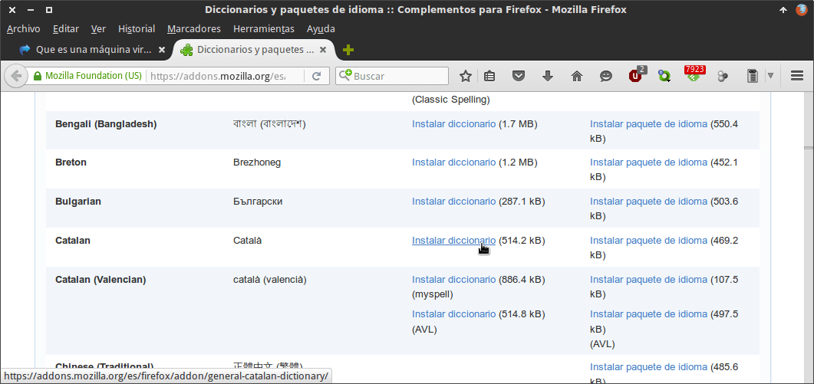
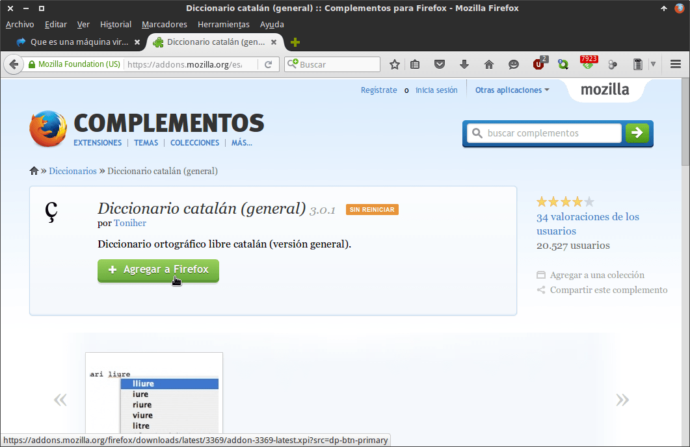
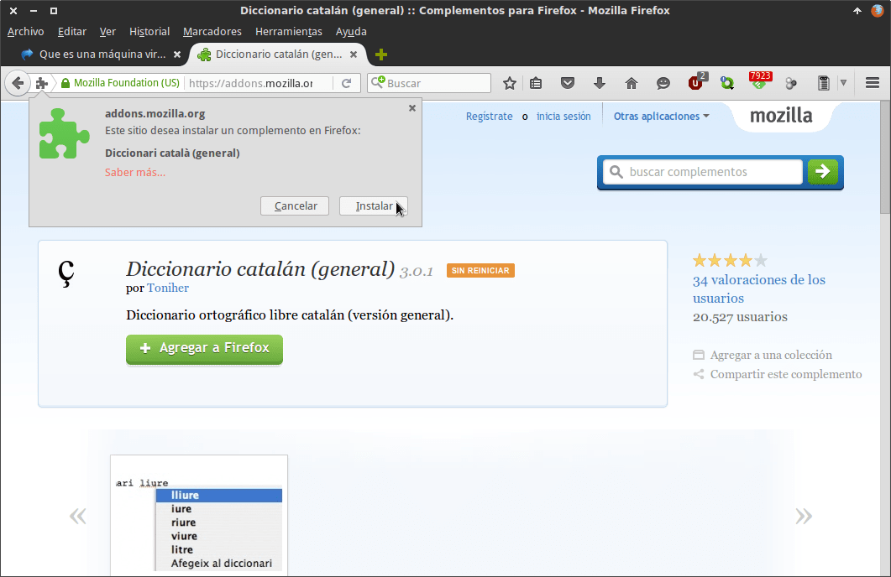
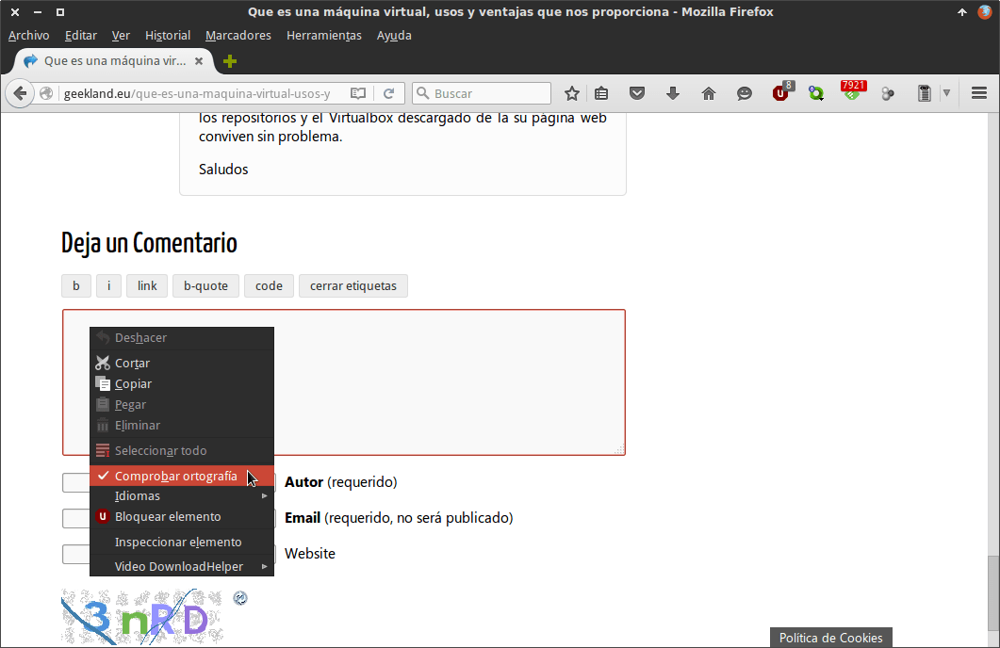
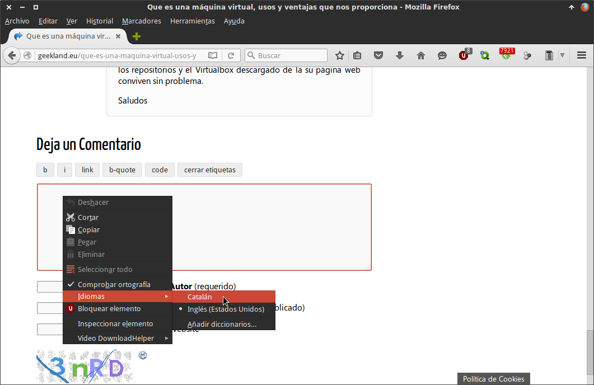
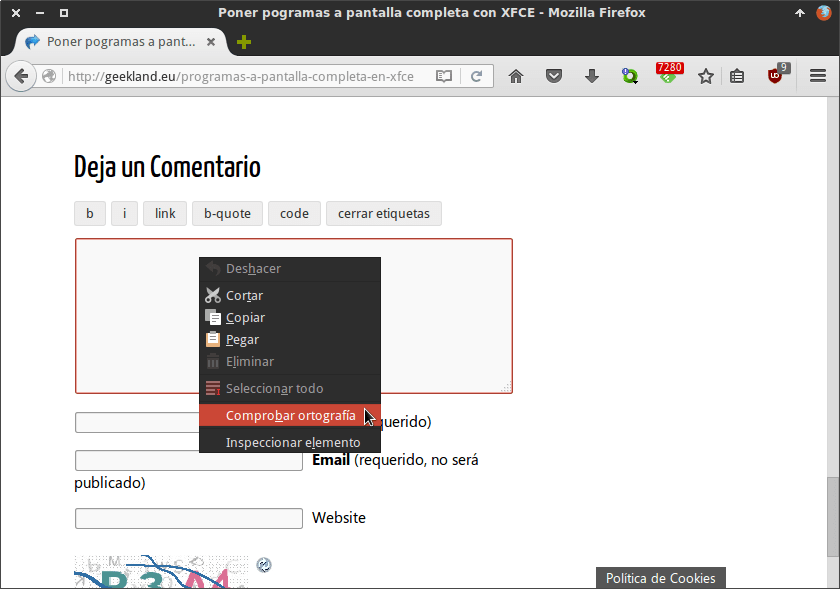
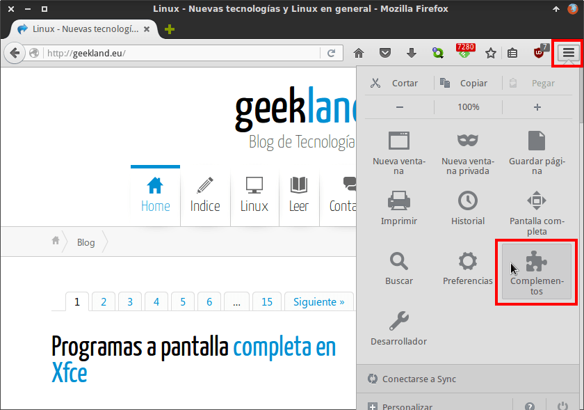
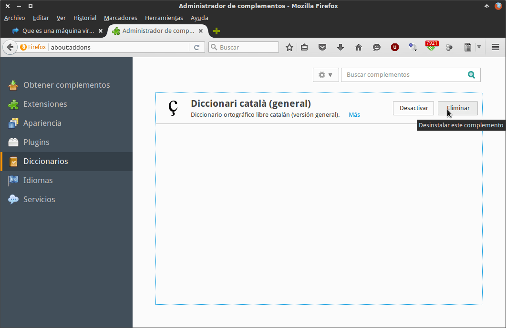

 

En su día escribí un post detallando como [configurar y usar el corrector ortográfico en Chrome](). Como existen muchos usuarios que prefieren usar Firefox, en el siguiente artículo veremos como podemos configurar y usar el corrector ortográfico en Firefox.<!--more-->

## CONFIGURAR EL CORRECTOR ORTOGRÁFICO EN FIREFOX

Los pasos a seguir para poder configurar y usar el corrector ortográfico en Firefox son los siguientes.

### Instalar los diccionarios que usaremos en Firefox

Inicialmente tenemos que instalar los diccionarios de los distintos idiomas en los que acostumbramos a escribir.

Para ello ubicamos el puntero del mouse encima del cuadro de texto en el que queremos escribir y presionamos el botón derecho del ratón.

Seguidamente seleccionamos la opción **Idiomas** y a continuación clicamos en la opción **Añadir diccionarios**.

Después de clicar encima de Añadir diccionarios se abrirá una pestaña en el navegador para poder instalar los diccionarios. Seleccionamos el diccionario que queramos, que en mi caso es el Catalán, y pulsamos en la opción **Instalar diccionario**.

Seguidamente aparecerá la siguiente ventana en que tenemos que presionar sobre el botón **\+ Agregar a Firefox** para que se puede instalar el diccionario.

Finalmente damos permiso para instalar el diccionario presionando sobre el botón **Instalar**.

Una vez añadido el diccionario en Catalán podemos añadir otros idiomas. Para añadirlos tan solo tenemos que repetir el proceso que acabamos de ver seleccionando el diccionario que nos interese instalar.

### Usar el corrector ortográfico en Firefox

Una vez instalados los diccionarios, Firefox será capaz de realizar la corrección ortográfica.

Para comprobarlo nos ponemos encima del cuadro de texto en que queremos escribir y presionamos el botón derecho del ratón. Cuando aparezca el menú contextual deberemos asegurar que la opción **Comprobar ortografía** esta tildada.

Al contrario que Google Chrome, Firefox no detecta de forma automática el idioma en que estamos escribiendo. Por lo tanto, tal y como se puede ver en la captura de pantalla, en el menú **Idiomas** deberemos seleccionar el Idioma en el que queremos escribir que en mi caso es el Catalán.

Una vez seleccionado el idioma ya podemos empezar a escribir sin ningún tipo de problema. Cuando cometamos una falta de ortografía Firefox la subrayará en color rojo.

### Deshabilitar el corrector Ortográfico en Firefox

Si queremos deshabilitar el corrector ortográfico tan solo tenemos que ubicarnos encima de un cuadro de texto y presionar el botón derecho del ratón.

Cuando aparezca el menú contextual tenemos que destildar la opción **Comprobar ortografía**. Con esta simple acción el corrector ortográfico estará desactivado.

### Desinstalar los diccionarios del corrector ortográfico en Firefox

Si además quieren desinstalar algunos de los diccionarios que tienen instalados deberán acceder al apartado de Complementos de Firefox.

Para ello tienen que clicar encima del icono de **Abrir menú** y seguidamente clicar encima de la opción **Complementos**.

Finalmente clicamos en el apartado **Diccionarios** y seguidamente podremos **Desactivar** o **Eliminar** por completo los diccionarios disponibles.

De esta forma tan simple y tan sencilla podemos configurar y usar el corrector ortográfico de Firefox.
