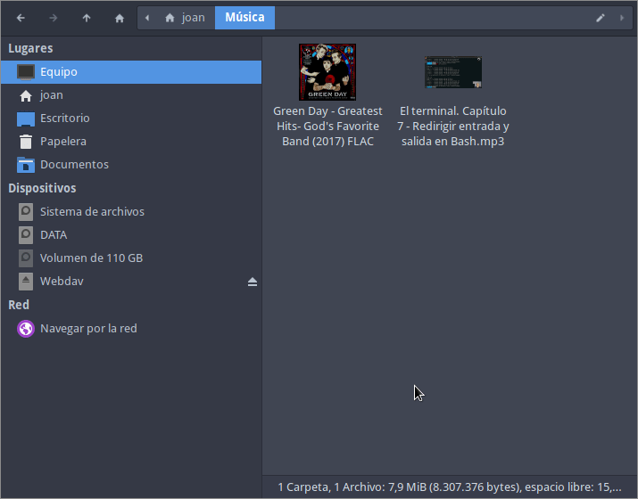

Es más que posible que al usar [youtube-dl]() tengáis que usar una gran cantidad de parámetros para adaptar la descarga a vuestras necesidades. Por ejemplo, para definir un patrón para el nombre de los archivos descargados, obtener un fichero que contenga los metadatos del vídeo, descargar solamente el audio de un vídeo, etc. Para solucionar este pequeño inconveniente lo único que tenéis que realizar es configurar youtube-dl mediante su archivo de configuración.<!--more-->

## ¿DÓNDE PODEMOS ENCONTRAR EL FICHERO PARA CONFIGURAR YOUTUBE-DL?

En ninguno de mis equipos he podido encontrar un archivo de configuración para configurar Youtube-dl. Por lo tanto en mi caso lo he creado manualmente. Si quieren crear un archivo de configuración que sea usado para la totalidad de usuarios de un equipo deberán crear el fichero youtube-dl.conf ejecutando el siguiente comando en la terminal:

> ```shell
> sudo touch /etc/youtube-dl.conf
> ```

Si quieren que únicamente sea útil para su usuario deberán ejecutar el siguiente comando:

> ```shell
> touch ~/.config/youtube-dl/config
> ```

Una vez ejecutado uno de los 2 comandos ya tendrán un archivo de configuración, pero estará vacío. Para realizar la configuración deberán proceder del siguiente modo.

## COMO CONFIGURAR YOUTUBE-DL MEDIANTE SU ARCHIVO DE CONFIGURACIÓN

Generar el archivo de configuración es sencillo. Lo único que tenemos que realizar es introducir las opciones que introduciríamos en el comando de youtube-dl dentro del fichero de configuración. Una vez introducidas las opciones, cuando ejecutemos youtube-dl sin ningún parámetro se aplicarán los que hayamos definido en el archivo de configuración.

A modo de ejemplo crearemos un fichero de configuración. Como quiero que la configuración solo se aplique a mi usuario ejecutaré el siguiente comando en la terminal:

> ```shell
> sudo nano ~/.config/youtube-dl/config
> ```

Una vez se abra el editor de textos nano pegaré el siguiente código que corresponderá a la configuración:

> ```shell
> # Para definir el nombre de los ficheros descargados
> -o '%(title)s.%(ext)s'
> 
> # Elimina/Sustituye espacios y otros caracteres del nombre de los ficheros descargados que pueden generar problemas
> --restrict-filenames
> 
> # Ante un error no se interrumpe el script. Por ejemplo si falla la descarga de un vídeo se pasa al siguiente
> --ignore-errors
> 
> # Descarga la descripción del vídeo de youtube en un fichero con extensión .description
> --write-description
> 
> # Descarga los metadatos del vídeo en un fichero con terminación info.json
> --write-info-json
> 
> # Descarga la imagen destacada del vídeo
> --write-thumbnail
> ```

**Nota**: Como hemos dicho anteriormente, el texto del archivo de configuración contiene los parámetros que usamos habitualmente para realizar descargas con youtube-dl.

**Nota**: Consulten el siguiente enlace para ver una lista completa de los [parámetros que se pueden introducir en el fichero de configuración](https://github.com/ytdl-org/youtube-dl/blob/master/README.md).

Una vez pegados los parámetros guardan el fichero y buscan la URL de un vídeo que quieran descargar. Para descargarlo tan solo tienen que usar el comando youtube-dl seguido de la URL que contiene el vídeo a descargar.

> ```shell
> joan@gk55:~$ youtube -dl https://www.youtube.com/watch?v=iJTmFahX_AI
> ```

Y como pueden ver el contenido descargado se corresponde con los parámetros que hemos definido en el fichero de configuración.

> ```shell
> joan@gk55:/media/DATOS$ ls
> El_terminal._Capitulo_7_-_Redirigir_entrada_y_salida_en_Bash.webp
> El_terminal._Capitulo_7_-_Redirigir_entrada_y_salida_en_Bash.description
> El_terminal._Capitulo_7_-_Redirigir_entrada_y_salida_en_Bash.info.json
> El_terminal._Capitulo_7_-_Redirigir_entrada_y_salida_en_Bash.mkv
> ```

## GENERAR VARIOS FICHEROS DE CONFIGURACIÓN PARA YOUTUBE-DL Y USAR EL QUE MÁS NOS CONVENGA

Podemos generar tantos archivos de configuración como sean necesarios. En el apartado anterior creamos un perfil para descargar vídeo y ahora generaremos otro con el nombre audio.txt para descargar audio. Para ello ejecutaremos el siguiente comando para crear el fichero de configuración.

> ```shell
> sudo nano ~/.config/youtube-dl/audio.txt
> ```

Cuando se abra el editor de textos nano pegaremos la siguiente configuración. Con esta configuración descargaremos la mejor calidad de audio disponible sin realizar ninguna tarea de transcodificación:

> ```shell
> # Para definir el nombre de los ficheros descargados
> -o '%(title)s.%(ext)s'
> 
> # Para descargar solo el audio de un video
> -x
> 
> # El formato del archivo resultante es el que youtube-dl considera mejor. Podríaamos forzar un formato de archivo reemplazando best por mp3, aac, vorbis, m4a, opus o .wav
> --audio-format best
> ```

Una vez pegado el código guardamos los cambios y el proceso ha finalizado. Si quisiéramos obtener ficheros de audio con el formato .mp3 entonces el fichero de configuración debería ser el siguiente:

> ```shell
> # Para definir el nombre de los ficheros descargados
> -o '%(title)s.%(ext)s'
> 
> # Para descargar solo el audio de un video
> -x
> 
> # El formato del archivo resultante es el que youtube-dl considera mejor. Podriamos forzar un formato de archivo reemplazando best por mp3, aac, vorbis, m4a, opus o .wav
> --audio-format mp3
> 
> #Para incrustar los metadatados y la imagen destacada en el fichero de audio
> --add-metadata
> --embed-thumbnail
> ```

**Nota**: Si el formato mp3 no está presente en la fuente de descarga se tendrá que transcodificar el audio de la fuente con la correspondiente pérdida de calidad. La calidad del archivo de audio transcodificado se puede seleccionar con el parámetro `--audio-quality`. La calidad por defecto es la 5 y la calidad más alta es la 0.

Una vez definido el nuevo archivo de configuración descargaremos un audio cualquiera con la configuración deseada mediante un comando del siguiente tipo:

> ```shell
> youtube-dl --config-location ruta_fichero_configuración URL_descarga
> ```

Por lo tanto para descargar el audio de un vídeo de Youtube tendré que ejecutar el siguiente comando:

> ```
> youtube-dl --config-location /home/joan/.config/youtube-dl/audio.txt https://www.youtube.com/watch?v=iJTmFahX_AI
> ```

y el resultado obtenido será el siguiente:

[](images/audio-extraido-con-youtube-dl.png)
