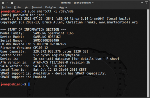
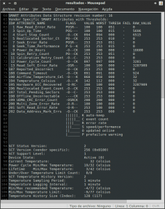

La verdad es que nunca he tenido problemas con el disco duro de mi ordenador. Pero en dos ocasiones que recuerde mi ordenador empezó a colgarse y a tener comportamientos extraños y realmente llegue a pensar que mi disco duro podía ser el responsable porqué ya tiene sus años y sus horas de vida. Al final en las dos ocasiones el problema resulto ser con la memoria RAM.<!--more-->

En otras ocasiones compañeros de trabajo y conocidos me han ofrecido comprar discos duros usados y la verdad es que la primera pregunta que me hice es saber cual es el estado de este disco duro que me ofrecen. A raíz de estas dos experiencias he decido compartir los pasos que seguiría para comprobar el estado de un disco duro y de esta forma intentar evitar la pérdida de información que supondría la rotura del disco duro.

## HERRAMIENTA PARA REALIZAR LA EVALUACIÓN DEL ESTADO DISCO DURO

Para evaluar el estado de nuestro disco duro interno, disco duro extraíble o memoria USB **necesitaremos la herramienta** **smartctl** **contenida en el paquete** [smartmontools](http://www.smartmontools.org/ "Web desarrolladores Smartmontools").

**El método** que veremos en este artículo **se puede aplicar a la totalidad de discos duros o dispositivos de almacenamiento que dispongan la tecnología** [SMART](https://es.wikipedia.org/wiki/S.M.A.R.T. "Explicación de lo que es la tecnología SMART"), que a día de hoy son prácticamente el 100%. **La tecnología SMART es una tecnología que permite detectar anticipadamente fallos y averías que se pueden ocasionar ocasionar en nuestro disco duro**. Al detectar anticipadamente una posible avería podremos prevenir la pérdida de información que supondría la rotura total de nuestro disco duro. Por lo tanto en el caso de detectar una posible falla se aconseja realizar de forma inmediata una copia de seguridad de nuestros archivos.

###### Nota: La herramienta smartmoontools no solamente sirve para comprobar el estado de discos duros internos. También sirve para por ejemplo comprobar el estado de discos duros extraíbles, discos duros sólidos, memorias USB que dispongan de la tecnología SMART, etc.

###### Nota:  La herramienta smartmoontools se puede usar tranquilamente desde un live USB . Por lo tanto podemos aplicar este método a cualquier ordenador independientemente del sistema operativo que tenga instalado. Quien precise realizar un live USB puede seguir las instrucciones que se mencionan en este [artículo]().

###### Nota: La totalidad de diagnósticos del artículo se realizan vía terminal. A quien no le guste la terminal siempre tiene la posibilidad de instalar un entorno gráfico para esta herramienta. Para instalar el entorno gráfico tan solo se tiene que instalar el paquete gsmartcontrol.

###### Nota:  La herramienta SMART no protege contra la totalidad de fallos que se pueden producir en un disco duro. Esta herramienta no nos puede proteger contra fallos impredecibles como por ejemplo las caídas de tensión o las sobretensiones. Afortunadamente los fallos impredecibles son menos frecuentes que los predecibles.

## INSTALAR LA HERRAMIENTA SMARTCTL

**Es posible que ciertas distribuciones Linux ya tengan preinstalada la herramienta smartctl.** **En el caso que** vuestra distribución **no** tenga instalada esta herramienta pueden realizar lo siguiente:

**En el caso usar Debian u otras distribuciones derivadas** de Debian como por ejemplo Linux Mint, Ubuntu, etc. Tan solo tienen que abrir una terminal y teclear el siguiente comando:

> ```
> sudo apt-get install smartmontools
> ```

**En el caso de usar distribuciones derivadas de Red Had**, como por ejemplo Fedora o CentOS, tenéis que abrir una terminal y teclear el siguiente comando:

> ```
> sudo yum install smarmontools
> ```

**En el caso de ser usuario de Archlinux, o alguna distro derivada de Archlinux** como por ejemplo Manjaro, tienen que escribir el siguiente comando en la terminal:

> ```
> sudo pacman -S smartmontools
> ```

###### Nota: En caso que no sean amigos de la terminal y quieran utilizar un front-end o entorno gráfico, tan solo tienen que instalar de forma adicional el paquete gsmartcontrol. Al instalar este paquete podrán ver un entorno gráfico similar al que se muestra en el siguiente [enlace](https://gsmartcontrol.sourceforge.io/home/index.php/Screenshots "Muestra entorno gráfico gsmartcontrol").

## REALIZAR EL ANÁLISIS DEL ESTADO DEL DISCO DURO

#### Averiguar el nombre con el que se reconoce nuestro disco duro

Lo primero que tenemos que realizar es averiguar el nombre con el que se reconoce el disco duro o dispositivo de almacenamiento que queremos analizar. Para ello **abrimos una terminal y tecleamos el siguiente comando:**

> ```
> sudo smartctl --scan
> ```

Tal y como se puede ver en la captura de pantalla **mi disco disco duro es reconocido como sda**:

[](images/1-Denominación-disco-Duro.min_.png)

###### Nota:  El comando que acabamos ver detecta la totalidad de dispositivos con tecnología SMART conectados a nuestros ordenador. En mi caso solo es uno.

###### Nota:  A partir de ahora la totalidad de comandos que mostraré harán referencia al disco duro sda. En el caso que vuestro disco duro sea reconocido con otro nombre deberéis sustituir sda por el nombre de vuestro dispositivo.

#### Detectar que el soporte SMART está activado

Lo segundo a realizar es comprobar que nuestro disco duro tiene soporte Smart y además está habilitado. Para realizar esta comprobación tienen que **ingresar el siguiente comando en la terminal:**

> ```
> sudo smartctl -i /dev/sda
> ```

Una vez ejecutado el comando veremos que en la terminal nos aparece una serie de información básica de nuestro disco duro como por ejemplo el modelo del disco duro, el número de serie del disco duro, la versión de firmware del disco duro, la capacidad del disco duro, la versión de Sata, etc. Además en la captura de pantalla podemos ver que **en las dos últimas menciona que nuestro disco duro tiene soporte para SMART y además el soporte está habilitado.**

[](images/2-Comprobacion-activación-smartools.min_.png)

**En el caso que el soporte esté deshabilitado aparecerá la frase** **SMART support is Unavailable**. **Para solucionar este problema**, y para por lo tanto activar el soporte Smart, tenemos **teclear el siguiente comando en la terminal**:

> ```
> sudo smartctl -s on /dev/sda
> ```

Una vez aplicado el comando el soporte SMART debería estar activado. Una vez realizados estos pasos ya podemos pasar a realizar un análisis de nuestro disco.

###### Nota: Aparte de introducir el comando sudo smartctl -s -on /dev/sda hay que tener en cuenta que hay BIOS que tienen una opción para activar y desactivar SMART. En el caso que vuestra BIOS tenga esta opción nos tenemos que asegurar este activada para que smartctl funcione correctamente. Si tenemos la opción de la BIOS activada, cada vez que se arranque nuestro ordenador se comprobará el estado de salud de nuestro disco duro. Si el estado es correcto nuestro ordenador arrancará normalmente pero si el resultado no es bueno no se arrancará con el fin de prevenir daños.

#### Realizar un análisis rápido

**No es el tipo de análisis más recomendado** pero hay que decir que es útil para detectar posibles problemas que pueda tener nuestro disco. **El análisis rápido básicamente consiste en 3 partes**:

1. **Test de las propiedades eléctricas:** Se realizará un test de las propiedades eléctricas de nuestro disco duro como por ejemplo si las placas electrónicas están en buen estado, si la totalidad de buffers del disco duro se encuentra en óptimas condiciones, etc. Obviamente para cada modelo de disco duro el test que se realizará será diferente ya que el comportamiento eléctrico depende del modelo y marca de disco duro que tenemos.
2. **Test de las propiedades mecánicas:** Se realizará un análisis para determinar si el posicionamiento del cabezal del disco encima del plato se realiza de forma correcta, si la velocidad de los platos del disco es correcta, etc. En definitiva se realizarán todo tipo de comprobaciones para verificar que el funcionamiento mecánico del disco es adecuado.
3. **Test de lectura del disco:** La última comprobación consiste en leer partes de la información almacenada en el disco duro y verificar que la lectura es correcta. Este proceso no abarca toda la superficie del disco. Esta prueba está limitada en tiempo y solo analiza ciertas partes de la superficie del disco. Las partes del disco duro analizadas son en función del modelo de nuestro disco duro.

**Para realizar un análisis rápido** del estado del disco duro o soporte de almacenamiento que acabamos de describir, tan solo tenemos que **teclear el siguiente comando en la terminal:**

> ```
> sudo smartctl -t short /dev/sda
> ```

**Una vez ejecutado el comando el análisis del disco se realizará en segundo plano** y por lo tanto no nos daremos cuenta que el test se está ejecutando. El hecho de hacer el análisis en segundo plano tiene la ventaja que mientras se está realizando el análisis podemos seguir utilizando tranquilamente nuestro ordenador sin notar nada. Como contrapartida el tiempo que empleado en realizar el análisis será mayor.

La duración del test será relativamente rápida. En aproximadamente 2 minutos el test debería haber finalizado. **Para comprobar que el test ha finalizado podemos teclear el siguiente comando en la terminal**:

> ```
> sudo smartctl -c /dev/sda
> ```

Al ejecutar este comando si consultamos la información del campo **Self-test execution status** nos dirá el % del test que aún está pendiente para realizar.

###### Nota: Algunos discos no soportan la totalidad de test que realiza la herramientas smartctl. Para conocer los tipos de test que soporta cada disco duro se puede teclear sudo smartctl --capabilities /dev/sda en la terminal.

#### Realizar un análisis completo

**Este tipo de análisis es el más adecuado** para garantizar que los resultados que obtenemos son plenamente fiables. **El tipo de comprobaciones que realizará el análisis completo son las mismas que el análisis rápido**. Por lo tanto se realizará un test de las propiedades eléctricas, mecánicas y finalmente se realizará un test de lectura de la totalidad de superficie del disco duro. **La diferencia entre el análisis rápido y el completo será que el completo realizará un análisis mucho más exhaustivo de cada uno de los puntos analizados**. Así por ejemplo si en el análisis rápido se hacia la comprobación de ciertas partes de la superficie del disco duro, en el análisis completo se realizará la comprobación de la totalidad de la la superficie.

**Para realizar un análisis detallado** y más preciso del estado del disco duro o soporte de almacenamiento tan solo **tenemos que teclear el siguiente comando en la terminal:**

> ```
> sudo smartctl -t long /dev/sda
> ```

Al igual que en el caso anterior, **el análisis se realizará en segundo plano** y no nos daremos cuenta. **A diferencia del caso anterior el tiempo de espera será mucho mayor** y tenemos que estar dispuestos a esperar horas para finalizar el test. **En mi caso el proceso tardo 15 o 16 horas**. Para comprobar que el test ha finalizado podemos teclear el siguiente comando en la terminal:

> ```
> sudo smartctl -c /dev/sda
> ```

Al ejecutar este comando si consultamos la información del campo **Self-test execution status** nos dirá el % del test que aún esta pendiente para realizar.

###### Nota: Algunos discos no soportan la totalidad de test que realiza la herramientas smartctl. Para conocer los tipos de test que soporta cada disco duro se puede teclear sudo smartctl --capabilities /dev/sda en la terminal..

#### Realizar un análisis de golpes que ha sufrido el disco duro

A veces es posible que durante el transporte o el uso del ordenador puedan ocurrir ciertos accidentes como por ejemplo caídas que generan aceleraciones y desaceleraciones importantes en el disco duro. **Para evaluar el número de veces que nuestro disco duro ha recibido impactos superiores al límite establecido por el fabricante podemos ejecutar el siguiente comando en la terminal**:

> ```
> sudo smartctl -t conveyance /dev/sda
> ```

El análisis se realizará en segundo plano. En aproximadamente 2 minutos el test habrá finalizado. Para comprobar que el test ha finalizado podemos teclear el siguiente comando en la terminal:

> ```
> sudo smartctl -c /dev/sda
> ```

###### Nota: En mi ordenador de sobremesa no he podido realizar el test ya que mi disco duro no es compatible con este tipo de test. En el laptop si he podido realizar el test sin problema.

## REALIZAR ANÁLISIS DE LOS RESULTADOS OBTENIDOS

Lo primero que haremos para obtener los resultados de nuestros test es volcar la totalidad de los resultados en un archivo de texto. Para realizar esto **abrimos una terminal y tecleamos el siguiente comando**:

> ```
> sudo smartctl --xall /dev/sda > resultados
> ```

**Después de teclear este comando, en nuestra home se generará un archivo de texto en el que podremos consultar multitud de datos para comprobar si el estado de nuestro disco duro es el correcto**. Si abrimos el fichero el contenido que vamos a encontrar en este fichero es el siguiente:

[](images/3-resultados-test.min_.png)

#### Conocer el estado global del disco duro

Para tener una valoración global del disco sin entrar en detalles tan solo tienen que **abrir el archivo de texto que acabamos de generar**. Una vez abierto **buscan el siguiente parámetro**:

****SMART overall-health self-assessment test****

**En mi caso como resultado me pone **PASSED****. Por lo tanto puedo estar tranquilo ya que se mi disco duro se encuentra en buenas condiciones. En el caso que el disco duro tenga algún tipo de problema aparecerá la palabra FAILED en vez de PASSED. En caso que aparezca FAILED se aconseja realizar una copia de seguridad de los datos del disco lo antes posible.

###### Nota:  El estado global del disco duro también se puede obtener tecleando el comando sudo smartctl -l selftest -H /dev/sda en la terminal.

#### Revisar el log de errores

Para revisar que durante la comprobación no se ha producido ningún error podemos **usar el siguiente comando en la terminal**:

> ```
> sudo smartctl -l error /dev/sda
> ```

#### Horas de funcionamiento del disco duro

Las horas de funcionamiento de un disco duro son limitadas. Por lo tanto si sabemos las horas que ha funcionado nuestro disco duro podemos tener una idea de las horas de trabajo que aún le quedan.

**Dentro del fichero donde tenemos los resultados tenemos que localizar la siguiente frase**:

****Power\_On\_Hours****

Tal y como se puede ver en la captura de pantalla de los resultados, e**l valor de este parámetro en mi caso es 16600 horas. Esto equivale a cerca 2 años de funcionamiento**. Para valorar si esto es mucho o poco fui a las especificaciones de mi disco duro y vi que el parámetro de tasa media entre fallos es de 600.000 horas. Sabiendo este parámetro puedo fácilmente calcular la probabilidad de fallo de nuestro disco duro aplicando la siguiente fórmula:

> ```
> Probabilidad de fallo = 1 – exp(-(horas de funcionamiento)/tasa media entre fallos)
> ```
> 
> ```
> 1- exp(-16600)/600.000) = 0,0273 x 100 = 2,73%
> ```

**Por lo tanto con las horas que ha trabajado mi disco, solo en 3 de cada 100 casos se habría roto**. Si ahora decidimos que queremos usar el disco duro hasta llegar a las 26280 horas podemos concluir que únicamente 4,29 de cada 100 discos duros tendrán problemas. Por lo tanto **en mi caso seguiré usando mi disco duro tranquilamente ya que hasta que no hayan pasado 6 o 7 años la probabilidad de fallo es aceptable en mi caso**.

###### Nota: Todos estos datos únicamente son indicativos. La vida de un disco duro depende de muchos otros factores como por ejemplo de las veces que se apaga y se enciende el disco duro, las condiciones de humedad y temperatura, la carga de trabajo que ha tenido que soportar el disco mientras ha estado conectado, etc.

###### Nota: Si queremos obtener de forma rápida las horas de funcionamiento de nuestro disco duro podemos teclear  sudo smartctl -a /dev/sda | grep Power\_On\_Hours en la terminal.

#### Número de veces que se ha encendido el disco duro

Otro factor a tener en cuenta para evaluar el estado de nuestro disco duro es el número de veces que se ha encendido y se ha apagado. Normalmente los discos duros están diseñados para aguantar un determinado número de ciclos de encendido y apagado. Para saber el número de veces que mi disco duro se ha encendido **tenemos que mirar el parámetro**:

****Power\_Cycle\_Count****

Tal y como se puede ver en la captura de pantalla, si miramos **este parámetro vemos que su ****RAW\_VALUE****  es 3281**. **Por lo tanto nuestro disco duro se ha encendido 3281 veces**. Para ver si esto es mucho o es poco nos podemos guiar por del parámetro VALUE. **El valor VALUE de este parámetro es 97**. Como el valor 97 **se puede considerar que está comprendido entre 100 y 253 podemos concluir que en principio mi disco duro no presenta problema alguno.**

###### Nota: Los valores VALUE que acabamos de citar están comprendidos entre el 1 y 253. Estos valores indican el “estado de salud” de cada uno de los parámetros que analizamos. Si el valor de VALUE del parámetro a analizar está comprendido en 100 y 253 podemos considerar que no hay problema alguno en el parámetro que estamos analizando.

###### Nota: Si vamos a dejar nuestro ordenador sin trabajar durante un periodo reducido de tiempo, por ejemplo 3 o 4 horas, es mejor no apagar el ordenador para alargar la vida de nuestro disco duro. En casos así se aconseja suspender, hibernar o simplemente apagar la pantalla.

#### Temperaturas del disco duro

Obviamente **si nuestro disco duro trabaja en valores extremos de temperatura su vida se reducirá drásticamente**. P**ara ver si los rangos de temperatura de trabajo han sido los adecuados tenemos que buscar el siguiente parámetro en el fichero que hemos volcado los resultados:**

****Lifetime Min/Max Temperature****

Tal y como se puede ver en la captura de pantalla **la temperatura mínima de trabajo ha sido 3 ºC mientras que la máxima ha sido 42ºC**. Además el parámetro ****Under/Over Temperature Limit Count**** indica que nunca se han sobrepasado los valores inferiores y superiores de temperatura recomendados. Por lo tanto no hay indicio de ningún problema.

###### Nota: Si consultáis las especificaciones de vuestro disco duro también podréis encontrar información acerca del rango de temperatura al que se aconseja que trabaje el disco duro.

#### Impactos sufridos por el disco

Cada vez que nuestro disco duro registre un impacto o aceleración/desaceleración superior a los valores que tiene preestablecidos el fabricante se generará un error. **Para ver las veces que hemos superado el valor límite establecido tenemos que consultar el parámetro**:

****G-Sense\_Error\_Rate****

Este parámetro no figura en la captura de pantalla en que muestro los resultados ya que la captura de pantalla es de mi ordenador de sobremesa. En mi laptop **he consultado el valor y veo que tiene un** ******RAW\_VALUE****** **de 332**.

Por lo tanto **mi laptop ha sufrido incrementos de aceleración/desaceleración superiores a los establecidos por el fabricante 332 veces**. En principio esto no es un problema ya que el estado del disco es correcto en todos los otros apartados, y además el parámetro **VALUE** que determina si este parámetro es correcto tiene un valor superior a 100.

#### Errores de Lectura que ha sufrido el disco

Si nuestro disco duro presenta muchos errores de lectura puede ser una señal que el disco no esté funcionando adecuadamente. **Si queremos controlar los errores de lectura que ha tenido nuestro disco tan solo tenemos que buscar el parámetro**:

****Raw\_Read\_Error\_Rate****

**En mi caso** tal y como se puede ver en la captura de pantalla **el valor es cero y el valor** **VALUE** **es igual a 100**. Por lo tanto no me tengo que preocupar en absoluto de este aspecto.

#### Sectores defectuosos en el disco duro

********Este factor es crítico para evaluar la saludo de nuestro disco duro********. **Este parámetro nos indica la cantidad de sectores del disco duro que están marcados como defectuosos**. Si tenemos un número significativo de sectores defectuosos es un indicativo que nuestro disco duro está en sus últimas horas de vida. Para ver los sectores defectuosos de nuestro disco duro tenemos que **abrir el archivo donde volcamos les resultados del test y buscar el siguiente parámetro**:

****Reallocated\_Sector\_Ct****

Una vez encontrado el parámetro **vemos que tiene un** ******RAW\_VALUE****** **de 0**. **Esto significa que en nuestro ordenador nunca se ha detectado un sector defectuoso**. Además el parámetro que indica el nivel de salud (**VALUE**) de este parámetro tiene una valor de 253. En el caso de tener sectores defectuosos en vuestro disco hay que pensar muy seriamente en reemplazarlo ya que la probabilidad de fallo es elevada.

###### Nota: Al detectarse un sector defectuoso lo que se hace es pasar la información de este sector defectuoso a un espacio reservado del disco duro para no perder la información. De esta forma, aunque un sector esté dañado, nuestro sistema operativo sigue siendo plenamente operativo ya que cuando se requiera acceder a la información del sector dañado, la petición de la información se redirigirá al espacio reservado. Todo este proceso que acabo de describir provocara un empeoramiento de la velocidad de lectura y escritura de nuestro ordenador.

#### Sectores defectuosos imposibles de corregir en el disco duro

Para saber el número de sectores defectuosos imposibles de recuperar de nuestro disco, tenemos que **buscar el siguiente parámetro en el fichero donde tenemos almacenados los resultados**:

****Offline\_Uncorrectable****

**En mi caso el** ******RAW\_VALUE****** **es de cero**. Por lo tanto en mi disco duro no existe ningún Sector que sea imposible de reparar. **En el caso de existir varios errores nos tenemos que preocupar y mucho ya que este parámetro es crítico**. En el caso que el valor no sea cero o sea elevado es probable que la superficie mecánica del disco duro o alguna parte mecánica esté dañada.

#### Velocidad de escritura del disco duro

Smartctl no proporciona datos respecto la velocidad de lectura y escritura de nuestro disco duro. Pero **por nuestra cuenta podemos ver y analizar la velocidad de lectura y escritura de nuestro disco duro. Una vez conozcamos los valores los podemos comparar con las especificaciones de nuestro disco duro o con otras mediciones realizadas en el pasado.**

Si los valores obtenidos son similares a los proporcionados en las especificaciones de nuestro disco duro o las mediciones realizadas en el pasado, será un signo inequívoco de que en principio el disco está funcionando adecuadamente.

Para quien precise analizar la velocidad de lectura y escritura de su disco duro puede seguir las instrucciones que se muestran en el siguiente [enlace]().

#### Intentos fallidos de arranque del disco duro

**Este es otro de los parámetros críticos** que tenemos que tener muy en cuenta. **Este parámetro controla los intentos fallidos de los platos del disco duro para obtener la velocidad de funcionamiento del disco duro**. En el caso de tener problemas en este parámetro es un síntoma claro que nuestro disco duro puede presentar una avería de tipo mecánico, y debemos proceder a intentar salvar los datos almacenados en nuestro disco duro inmediatamente. Para controlar este parámetro, **en nuestro archivo de resultados tenemos que encontrar la siguiente frase**:

****Spin\_Retry\_Count****

En mi caso, tal y como se puede ver en la captura de pantalla, **el** ******RAW\_VALUE****** **tiene un valor de 0**. Por lo tanto nunca se ha producido un error. **Además** el parámetro que indica el nivel de salud **VALUE** respecto a este parámetro **tiene un valor de 253**.

#### Evaluación del tiempo de respuesta

Este parámetro es otro de los parámetros críticos. **Este parámetro lo que hace es contabilizar el número de operaciones que el disco duro no ha realizado porqué se ha agotado el tiempo máximo de espera** para realizar la operación.

Para analizar este parámetro tenemos que **consultar nuestro fichero de resultados para buscar la palabra**:

****Command\_timeout****

**Una vez encontrada en mi caso veo que tengo 924 errores**. La verdad es que es un número elevado. A pesar de todo **el valor** **VALUE** **es de 91** y el disco duro nunca me ha generado problemas. Por lo tanto no es cuestión de preocuparse por este valor. El Número elevado de errores en principio podría ser ocasionado o relacionado con problemas de la fuente de alimentación o del cable de datos del disco duro.

###### Nota: Para obtener información adicional de los parámetros e información que les puede dar smartctl pueden consultar este [enlace](https://en.wikipedia.org/wiki/S.M.A.R.T. "Parámetros adicionales que puede medir smartctl") u estre otro [enlace](https://www.smartmontools.org/browser/trunk/smartmontools/smartctl.8.in "Página man del comando smartctl").

## OTRAS FUNCIONALIDADES DE SMARTMONTOOLS

Anteriormente hemos comentado que la herramienta smartctl esta contenida dentro del paquete smartmoontools. **Dentro del paquete smartmontools hay otra herramienta llamada smartd**.

**Smartd es un demonio que sirve para monitorizar continuamente el estado de nuestro disco duro**. Si activan el demonio y lo configuran adecuadamente podemos conseguir los siguientes beneficios:

1. Aviso vía email en caso de producirse un error.
2. Planificar de forma periódica y automática los test que hay que realizar a los dispositivos de almacenamiento.
3. Poner límites de temperatura. Cuando se supera el límite de temperatura establecido se enviará una advertencia vía email al administrador del sistema.

Obviamente smartd tiene funcionalidades adicionales a las descritas en este mail pero en este post no escribiremos sobre smartd. **Smartd no es una herramienta útil para usuarios domésticos. En futuros artículos es posible que escriba sobre esta herramienta**.

###### Nota: La totalidad de operaciones de este post solo sirven para diagnosticar el estado del disco duro. En ningún caso se repararán los errores detectados. Para reparar los errores detectados existen otras herramientas que se abordaran en futuros artículos.
