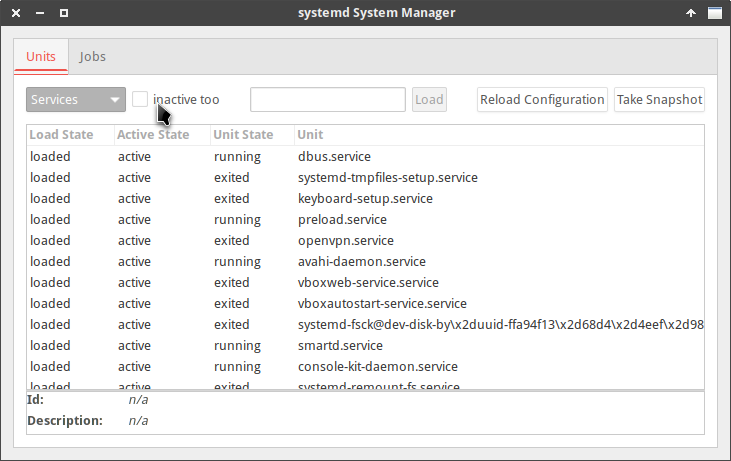

En el siguiente artículo veremos varios métodos para comprobar el estado de los servicios que estan disponibles en nuestro sistema operativo. De este forma podremos ver si un servicio está activo, inactivo, enmascarado, etc. Los pasos a seguir para conseguir nuestro objetivo seran los siguientes.<!--more-->

## VER EL ESTADO DE UN DETERMINADO SERVICIO

En ocasionamos necesitamos **conocer información sobre un determinado servicio o unidad**. Un ejemplo de la información que podemos necesitar es la siguiente:

1. Ver si el proceso o unidad está activo o inactivo.
2. Conocer la fecha y hora en que arranco un proceso.
3. Saber el identificador de proceso de un determinado servicio.
4. Ver si un servicio está configurado para que se inicie en al arranque del sistema.
5. Información relativa al control de grupos.
6. Etc.

Para conocer este tipo de información tan solo tenemos que abrir una terminal y ejecutar el comando systemctl status seguido del nombre del proceso.

Por lo tanto si queremos obtener información relativa al servicio dnscrypt-proxy tenemos que ejecutar el siguiente comando:

> ```
> systemctl status dnscrypt-proxy.service
> ```

Después de ejecutar el comando obtendremos la siguiente información:

|   ● `dnscrypt-proxy.service - DNSCrypt proxy Loaded: loaded (/lib/systemd/system/dnscrypt-proxy.service; enabled; vendor preset: enabled) Active: active (running) since dom 2016-07-24 08:50:10 CEST; 1h 12min ago Docs: man:dnscrypt-proxy(8) Main PID: 2042 (dnscrypt-proxy) CGroup: /system.slice/dnscrypt-proxy.service └─2042 /usr/sbin/dnscrypt-proxy –resolver-name=dnscrypt.org-fr`   |
| --- |

## AVERIGUAR SI UN SERVICIO ESTÁ ACTIVO

**Para saber si un proceso está activo o inactivo** tenemos ejecutar el comando systemctl is-active seguido del nombre del proceso que queremos ver si está activo.

Por lo tanto, para ver si el servicio estático initrd-cleanup está activo tenemos que ejecutar el siguiente comando en la terminal:

> ```
> systemctl is-active initrd-cleanup
> ```

En mi caso después de ejecutar el comando he podido constatar que el proceso no está activo.

> ```
> Inactive
> ```

## CONOCER EL ESTADO DE LA TOTALIDAD DE SERVICIOS

Para obtener un **listado de la totalidad de servicios y saber si están habilitados o deshabilitados** tenemos que ejecutar el siguiente comando en la terminal:

> ```
> systemctl list-unit-files --type service --all
> ```

Una vez ejecutado el comando obtenemos el siguiente resultado:

|   ``````` **UNIT FILE                   STATE** `````` accounts-daemon.service     enabled ````` acpid.service               disabled ```` alsa-restore.service        static ``` alsa-state.service          static `` alsa-utils.service          masked `…` `` ``` ```` ````` `````` ```````   |
| --- |

Si leemos los resultados aparecerán la totalidad de servicios conjuntamente con su estado. El significado de cada uno de los estados es el siguiente:

**Enabled:** El servicio está habilitado, se está usando o está disponible para su uso.

**Disabled:** El servicio está deshabilitado. Si lo necesitamos lo podemos habilitar sin mayor problema.

**Masked:** El servicio está completamente deshabilitado y no se puede iniciar de ningún modo sin previamente desenmascararlo.

**Static:** Servicios que únicamente se usarán en el caso que otro servicio o unidad lo precise. Estos servicios pueden estar activos o inactivos, pero siempre están disponibles para cuando se necesite usarlos. Estos servicios no se pueden activar ni desactivar, pero se pueden enmascarar.

**Generated:** Servicio que ha sido iniciado a través de un initscript SysV o LSB con systemd generator.

En el caso que encuentren estados no mencionados en este apartado, pueden obtener información abriendo una terminal y ejecutando el siguiente comando:

> ```
> man systemctl
> ```

Una vez ejecutado el comando podrán ver una explicación del significado de cada uno de los estados.

## OBTENER INFORMACIÓN DE LA TOTALIDAD DE SERVICIOS

Para obtener un **listado de la totalidad de servicios, independientemente de si están activos o inactivos**, tenemos que ejecutar el siguiente comando en la terminal:

> ```
> systemctl list-units --type service --all
> ```

El resultado que obtendremos será parecido al siguiente:

|   **`UNIT                     LOAD       ACTIVE    SUB      DESCRIPTION`** ``````` accounts-daemon.service  loaded     active    running  Accounts Service `````` acpid.service            loaded     active    running  ACPI event daemon ````` alsa-restore.service     loaded     active    exited   Save/Restore Sound Card State ```` alsa-state.service       loaded     inactive  dead     Manage Sound Card State (restore and store) ``` anacron.service          loaded     inactive  dead     Run anacron jobs `` ● apparmor.service       not-found  inactive  dead     apparmor.service `…` `` ``` ```` ````` `````` ```````   |
| --- |

Los datos que podemos consultar en el listado que acabamos de obtener son los siguientes:

La columna **LOAD** de este listado nos muestra información sobre si los servicios estan cargados o no. El valor loaded indica que el archivo de configuración del servicio ha sido procesado. El valor not-found indica lo contrario.

En la columna **ACTIVE** podremos ver si un servicio está activo o inactivo.

Finalmente, la columna **SUB** complementa la información de la columna ACTIVE detallando con más precisión el estado de cada servicio. En esta columna podemos encontrar los siguientes valores:

- running: El servicio se está activo y ejecutándose en estos momentos.
- exited: El servicio se ha ejecutado en algún momento, pero en estos momentos systemd no es capaz de detectar si el servicio está corriendo. Este caso se acostumbra a dar cuando por ejemplo se carga el fichero de configuración del servicio y a posteriori el servicio pasa a ser controlado por el kernel sin la necesidad que ningún demonio esté corriendo.
- dead: El servicio está completamente inactivo.

## OBTENER INFORMACIÓN DE LOS SERVICIOS ACTIVOS

Para obtener un **listado de la totalidad de servicios que actualmente están activos** tenemos que ejecutar el siguiente comando en la terminal:

> ```
> systemctl list-units --type service
> ```

El resultado que obtendremos será parecido al siguiente:

|   `**UNIT                      LOAD    ACTIVE  SUB      DESCRIPTION**` `` accounts-daemon.service   loaded  active  running  Accounts Service `acpid.service             loaded  active  running  ACPI event daemon` `alsa-restore.service      loaded  active  exited   Save/Restore Sound Card State` `atd.service               loaded  active  running  Deferred execution scheduler` `…` ``   |
| --- |

El significado de los parámetros obtenidos se interpreta del mismo modo que en el apartado anterior.

## AVERIGUAR SI UN SERVICIOS O UNIDAD FALLA DURANTE EL ARRANQUE DE NUESTRO SISTEMA OPERATIVO

Para obtener un listado de la **totalidad de servicios que fallan al iniciar** el sistema operativo hay que ejecutar el siguiente comando en la terminal:

> ```
> systemctl list-unit-files --state=failed
> ```

Una vez ejecutado el comando veremos los servicios y unidades que no se han podido iniciar durante el inicio del sistema. En el caso de encontrar errores tendremos que buscar una solución.

## CONOCER EL ESTADO DE UN SERVICIO O UNIDAD MEDIANTE UNA INTERFAZ GRÁFICA

Existen interfaces gráficas para poder ver, e incluso gestionar, los servicios y unidades de nuestro sistema operativo. Por ejemplo en Debian existe systemd-ui. Para instalarlo tanto solo tienen que ejecutar el siguiente comando en la terminal:

> ```
> sudo apt-get install systemd-ui
> ```

Una vez instalado el paquete abrimos una terminal y ejecutamos el siguiente comando:

> ```
> systemadm
> ```

Seguidamente aparecerá la siguiente interfaz gráfica en la que podremos ver el estado de todas las unidades gestionadas por systemd.

[](images/consultar-servicios-con-systemd-ui.png)

Para averiguar el significado de cada uno de los parámetros del servicio tan solo tienen que consultar el apartado [Obtener información de la totalidad de los servicios](#mi-ancla).

Para finalizar pueden visitar el siguiente enlace en el que encontrarán la información necesaria para [administrar los servicios]() de vuestra distribución Linux.
