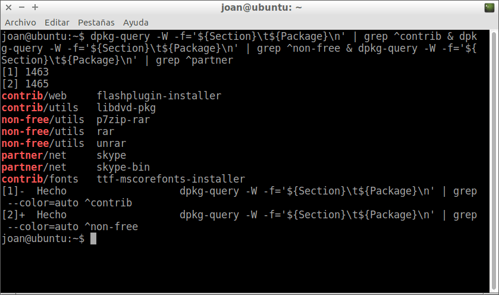
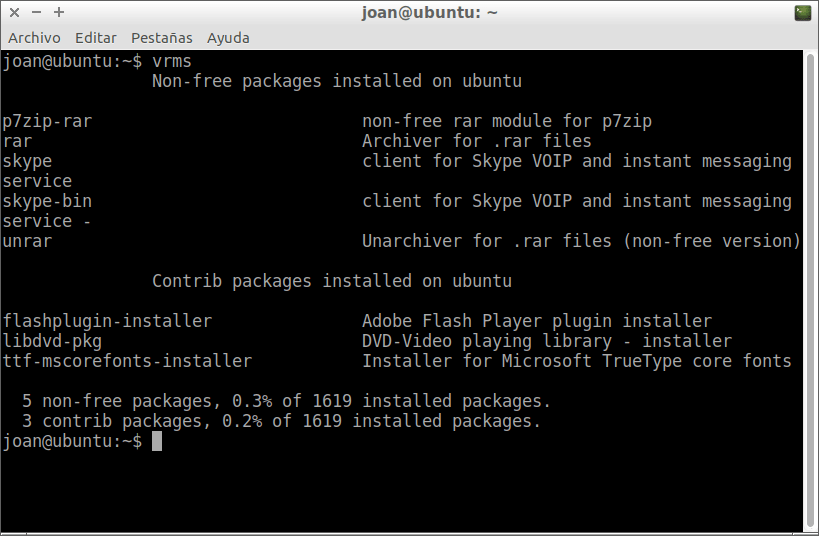
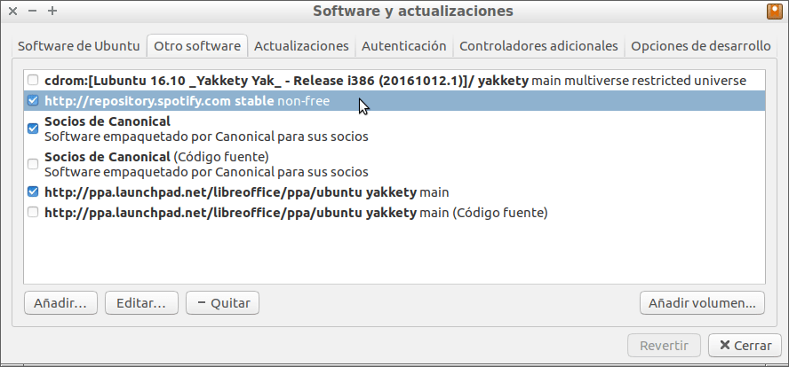
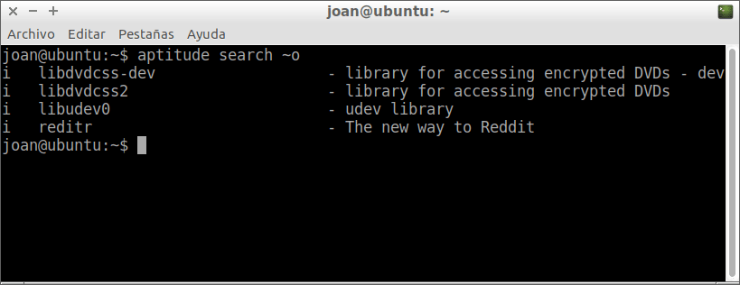

Aunque GNU/Linux es un sistema operativo libre y abierto existen muchas distribuciones que incluyen software privativo en sus repositorios.

Para los que sean contrarios al uso de software y paquetes privativos, en el siguiente artículo veremos un par de métodos para poder comprobar el software privativo que tenemos instalado en cualquier distribución Debian o Ubuntu.<!--more-->

## CONOCER EL SOFTWARE PRIVATIVO INSTALADO MEDIANTE LA TERMINAL

En Debian y en Ubuntu los paquetes privativos se acostumbran a almacenar en las secciones non-free y Contrib de los repositorios.

Por lo tanto una forma de analizar el software privativo que tenemos instalado es obtener un listado de los paquetes instalados de la sección Contrib y non-free. Para ello tan solo tenemos que ejecutar el siguiente comando en la terminal:

> ```
> dpkg-query -W -f='${Section}\t${Package}\n' | grep ^non-free && dpkg-query -W -f='${Section}\t${Package}\n' | grep ^contrib && dpkg-query -W -f='${Section}\t${Package}\n' | grep ^partner
> ```

Después de ejecutar el comando podemos ver la totalidad de paquetes y software privativo instalado en nuestro ordenador:

[](images/Software-privativo-instalado.png)

## CONOCER EL SOFTWARE PRIVATIVO INSTALADO MEDIANTE VRMS

Otra opción alternativa para comprobar el software privativo en nuestro ordenador es usar el software VRMS (Virtual Richard M. Stallman).

El software VRMS nos proporcionará un listado de los paquetes no libres instalado en nuestro equipo. En algunos casos el programa también nos dará una breve explicación de porque los paquetes no son libres.

Para instalar el software VRMS tan solo tenemos que ejecutar el siguiente comando en la terminal:

> ```
> sudo apt-get install vrms
> ```

Una vez instalado lo podemos usar abriendo una terminal y ejecutando el siguiente comando:

> ```
> vrms -e
> ```

Al ejecutar el programa en mi caso he obtenido los siguientes resultados:

[](images/paquetes-con-vrms.png)

Si comparamos los resultados obtenidos con los del apartado anterior vemos que son exactamente los mismos.

A partir de estos momentos si queremos podemos intentar buscar alternativas libres al software privativo instalado en nuestro ordenador.

## LIMITACIONES DE LOS MÉTODOS USADOS PARA BUSCAR SOFTWARE PRIVATIVO

Las 2 opciones que hemos visto funcionan de forma correcta. No obstante los 2 métodos se limitan a buscar software privativo en secciones especificas de nuestros repositorios. Esto ocasiona que no podamos detectar el 100% de software privativo instalado en nuestro ordenador.

El motivo es que los programas que instalamos de forma manual y no están presentes en los repositorios originales de nuestra distro, acostumbran a ubicarse en secciones no apropiadas de nuestros repositorios.

Así por ejemplo Google Chrome se ubica en la sección web y la sección web acostumbra a disponer Software Libre. Por lo tanto los métodos detallados en este post no detectaran que Google Chrome es software privativo.

### Solución para solventar las limitaciones de estos métodos

Conociendo esta limitación, la forma apropiada para detectar el 100% de software privativo es aplicar uno de los 2 métodos y a posteriori analizar uno por uno los programas que tenemos instalados de forma manual o a través de repositorios externos.

Por lo tanto en mi caso abro Synaptic para ver los repositorios de terceros que estoy usando y obtengo el siguiente resultado:

[](images/Repositorios-externos-de-terceros.png)

Si observamos con detalle vemos que los 2 únicos repositorios de terceros que estoy usando son el de Libreoffice y el de Spotify. Si buscamos información acerca de Libreoffice y Spotify llegaremos a las siguientes conclusiones:

1. Libreoffice es una suite ofimática de Software Libre.
2. El cliente de Spotify es Software privativo, por lo tanto los partidarios de usar únicamente Software Libre deberían desinstalarlo.

A continuación, desde Synaptic o desde la terminal, consultaremos el software instalado en nuestro ordenador que no pertenece a ningún repositorio.

Para ello en mi caso abro una terminal y ejecuto el siguiente comando:

> ```
> aptitude search ~o
> ```

Los resultados obtenidos son los siguientes:

[](images/Paquetes-instalados-de-formamanual.png)

Si buscamos información sobre los paquetes veremos que la totalidad de librerías y programas que aparecen en este listado son totalmente libres.

Por lo tanto en mi caso únicamente estoy usando 9 librerías o programas que son software privativo.
