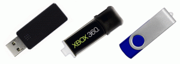
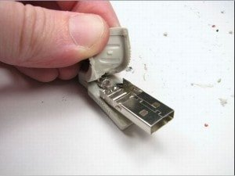

Hoy en día a la hora de comprar una memoria USB **muchísima gente se deja seducir por el precio y por las grandes capacidades de almacenamiento** que se acostumbran a ofertar en las tiendas, Internet o centros comerciales.

Obviamente estos 2 puntos son importantes **pero hay muchísimos más puntos a considerar en la compra de una memoria USB**. Si únicamente consideramos el factor capacidad de almacenamiento y precio es posible que nuestra compra no acabe siendo satisfactoria.<!--more-->

Las **cosas que según mi punto de vista tenemos que tener muy en cuenta a la hora de comprar una memoria USB** o pendrive son las siguientes:

## FACTOR 1: LA VELOCIDAD DE LECTURA Y ESCRITURA DE LA MEMORIA USB

Sin duda bajo mi criterio este es **uno de los puntos más importantes a la hora de comprar una memoria USB**.

**Si elegimos una memoria USB con una velocidad de lectura y escritura lenta** seguramente **nos encontraremos con las siguientes situaciones**:

1. Cuando vayamos a copiar una película o fotos dentro de nuestra memoria USB nos vamos a cansar de esperar ya que la velocidad de escritura será lenta. Imagino que muchos de vosotros se habrá encontrado con este problema.
2. Si usamos la memoria USB para correr distribuciones de Linux en modo LiveUSB es posible que noten lentitud excesiva a la hora de cargar el sistema operativo y realizar ciertas operaciones. Esta lentitud es debida a una velocidad de lectura y escritura baja.
3. Lentitud en el caso de usar la memoria USB para ejecutar aplicaciones portables como por ejemplo Openoffice, Firefox, etc.

**Para evitar estos y otros problemas**, cuando se compra una memoria USB hay que **intentar informarse de la velocidad de lectura y escritura de la memoria USB y leer comentarios de usuarios que han comprado previamente la memoria USB**. La velocidad de escritura y lectura se acostumbra a indicar en megabytes por segundo (MB/s). Cuando más alta sea la tasa de escritura y lectura, mayor será el rendimiento y velocidad que obtendremos.

Hay que tener en cuenta además que las memorias USB de hoy en día disponen de gran capacidad de almacenamiento y la gente las utiliza para manejar gran cantidad de información. Por lo tanto la velocidad es muy importante.

## FACTOR 2: VERSIÓN DEL ESTÁNDAR USB

El estándar USB presenta varias versiones. La 1.0, la 1.1, la 2.0 y la 3.0. **Como más actual sea la versión de estándar mayor será la velocidad de lectura y escritura que obtenemos**.

Así por lo tanto **en la versión USB 2.0** podemos encontrar velocidades de lectura y escritura que oscilan entre los siguientes rangos:

**Velocidad de escritura**: 4 – 10 MB/s **Velocidad de lectura**: 15 – 25 MB/s

###### Nota: La velocidad de lectura oscila en función del USB que compramos.

**En la versión USB 3.0** podemos encontrar los siguientes rangos de velocidades de lectura y escritura:

**Velocidad de escritura**: 10 – 20 MB/s **Velocidad de lectura**: 40 – 50 MB/s

###### Nota: La velocidad de lectura oscila en función del USB que compramos.

Por lo tanto siempre obtendremos mejor rendimiento si nuestro USB es 3.0 en vez de 2.0. **En el caso de comprar una memoria USB 3.0 tenemos que asegurarnos que los puertos USB donde conectaremos la memoria soporten 3.0**. En el caso contrario el rendimiento que obtendremos será menor al esperado si hablamos de memorias USB.

## FACTOR 3: LA MARCA DE LA MEMORIA USB

Obviamente **la marca de la memoria USB es un factor importante**. En el mercado existen multitud de marcas genéricas y desconocidas en que el rendimiento o durabilidad que ofrecen acostumbran a ser pésimos.

Si elegimos marcas reconocidas como por ejemplo [Kingston](http://www.kingston.com/es/ "Web de Kingston"), [Corsair](http://www.corsair.com/es/ "Web de Corsair"), [Trascend](http://es.transcend-info.com/ "Web de trascend"), [Verbatim](http://www.verbatim.es/ "Web de Verbatim") o [Sandisk](http://www.sandisk.es/ "Web de sandisk"), podemos estar seguros que el rendimiento y durabilidad que obtendremos como mínimo serán óptimos.

## FACTOR 4 CONSTRUCCIÓN FÍSICA DEL USB

**Hay muchos tipos de construcción de memorias USB**. Hay USB retráctiles, con tapa, con distintas calidades de plástico y materiales, con superficies de plástico engomado, memorias USB promocionales, con posibilidades de personalizar, etc.

Frente a los distintos tipos de construcción y opciones bajo mi punto de vista **tenemos que buscar lo siguiente**:

1. Asegurar que la memoria USB tenga una **construcción sólida**. Es importante que el **plástico sea duro** y si además si viene **engomado** mejor que mejor ya que nuestra memoria USB va a ser **mucho más resistente a los golpes**.
2. **Personalmente los USB con tapa no me gustan**. Es fácil de perder o romper la tapa. Prefiero un diseño que proteja el terminal USB de la memoria de polvo sin necesidad de usar una tapa.

Si termináis comprando una memoria con una construcción que sea poco sólida, podéis terminar teniendo problemas similares a los que se muestran en la siguiente fotografía:

## FACTOR 5: CAPACIDAD DE ALMACENAMIENTO

Obviamente **la capacidad de almacenamiento también es un factor a tener muy en cuent**a. Tenemos que **asegurarnos que la memoria USB que vamos a comprar cubre nuestra necesidades de almacenamiento.**

No es siempre aconsejable comprar la memoria USB que tenga mayor capacidad de almacenamiento. Si compramos la memoria usb con mayor capacidad de almacenamiento existiendo en la actualidad acabaremos pagando un extra de precio que no siempre vale la pena.

## FACTOR 6: TAMAÑO DE LA MEMORIA USB

Para determinadas personas **el tamaño puede ser importante**. Si es posible **a igualdad de especificaciones entre 2 memorias USB es siempre mejor elegir el USB que tenga dimensiones más reducidas**. Los motivos son dos:

1. Las memorias pequeñas y delgadas son más fáciles de transportar.
2. Las memorias grandes y gruesas pueden generar problemas de espacio cuando las conectamos a las entradas USB de nuestro ordenador. Alguna vez he querido enchufar 2 memorias USB en mi notebook y sencillamente no he podido por falta de espacio.

## FACTOR 7: SENSIBILIDAD DE LOS DATOS QUE ALMACENARÁ LA MEMORIA USB

En el caso que necesitemos almacenar información sensible **puede ser interesante adquirir memorias USB que dispongan de un sistema de cifrado de seguridad por Hardware**.

De este modo si perdemos nuestro USB solo nos tendremos que lamentar por la pérdida de la memoria USB ya que nadie tendrá acceso a la información que teníamos almacenada. Si alguien encuentra nuestra memorioa USB y quiere acceder a nuestra información sencillamente no podrá ya que solo enchufarlo en un ordenador le pedirá una contraseña. Como no la sabrá no podrá hacer a ninguna información.

###### Nota: En caso de comprar una memoria USB que no disponga de cifrado por hardware tenemos opciones alternativas. Existe software, como por ejemplo USB Safeguard o Bitlocker, que nos permitirán cifrar las memorias USB.

###### Nota: También existen USB que tienen utilidades de software y hardware incorporados en él. Por ejemplo existen USB con software para visualizar fotografías, memorias USB con puertos miniUSB con función OTG, etc.

## FACTOR 8: EL PRECIO

Y para finalizar también hay que considerar un factor muy importante. El precio de compra. Cada uno tiene que tener claro la cantidad que quiere invertir en la compra de su memoria USB. En función del presupuesto disponible tendremos que evaluar lo que más nos conviene en función de los 7 factores anteriores.
