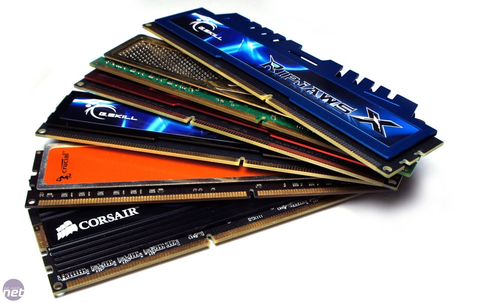
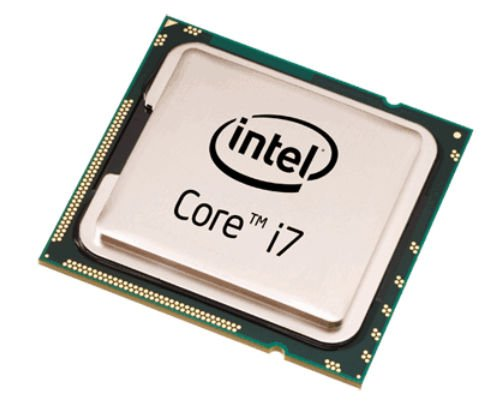
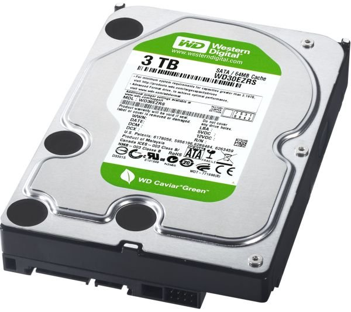
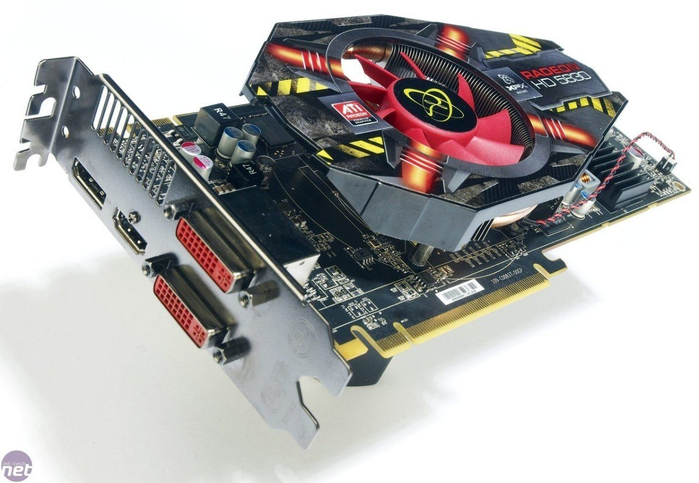
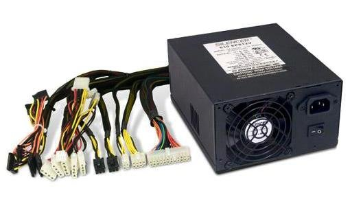
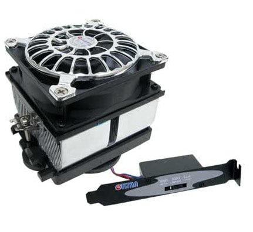
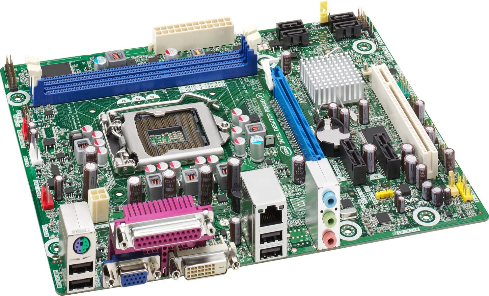
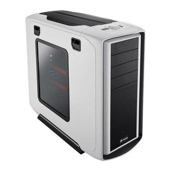

La mayoría de gente que quiere comprar un ordenador acostumbra comparar distintos tipos de parámetros entre las diferentes opciones que tiene disponible y siempre acaban eligiendo el que presenta sobre el papel unas prestaciones más elevadas. Es decir el que tiene mucha RAM, el que tiene mucha capacidad de almacenamiento, etc.<!--more-->

Bajo mi punto de vista en la informática esto es un error. No siempre tener un procesador muy rápido nos garantiza un mayor rendimiento o tener más RAM una mayor velocidad. ¿Porqué?

Aplicaremos el símil de una cadena de montaje para responder a esta pregunta. Si tenemos una cadena de montaje la productividad final es determinada por el cuello de botella de toda la cadena de montaje. En otras palabras si tenemos 10 máquinas que pueden fabricar 5000 piezas horas y la última máquina del proceso de producción solo puede fabricar 4000 piezas, la producción por hora serán 4000 piezas. Lo mismo pasa en los ordenadores. Por lo tanto de nada me servirá tener un procesador muy rápido si la placa base tiene una velocidad de bus baja.

A modo genérico y vista la problemática redactaré una serie de puntos y parámetros a tener a la hora de comprar un ordenador:

## PUNTOS A TENER EN CUENTA AL COMPRAR UN ORDENADOR

### Punto 1. Que al comprar un ordenador los componentes sean compatibles con el sistema que voy a usar

Que el fabricante o los componentes que elija sean compatibles con el sistema operativo que uso. Para los que usan Windows esto no es un problema pero en mi caso uso Linux y a veces te encuentras con el problema que cierto hardware no tiene drivers disponibles para Linux.

### Punto 2. Que al comprar un ordenador no lleve un sistema operativo instalado de serie

Muchos ordenadores ya llevan sistemas operativos instalados de serie cuando los compras. Lo que muchos usuarios no saben es que en el momento que compran el ordenador están pagando por el sistema operativo que lleva instalado. En mi caso me niego que me impongan a pagar un sistema operativo que no uso ni usaré en mi ordenador personal. Para que usar Windows existiendo Linux?

Ademas hay que tener en cuenta que en el momento en que sustituimos el sistema operativo que viene instalado de serie perdemos la garantía del ordenador.

### Punto 3. En caso de usar Linux asegurarnos que podremos instalar nuestra distro en el ordenador

Al comprar un ordenador los usuarios de Linux también tienen que tener en cuenta uefi. Actualmente uefi está dificultando mucho la instalación de otros sistemas que no sean Windows. Hay que ir con cuidado a la hora de comprar ordenadores que ya llevan preinstalado Windows 8.

### Punto 4. Tener muy en cuenta el uso que queremos darle al ordenador

Al comprar un ordenador tenemos que ajustar las prestaciones de los componentes al uso que le daremos a la máquina. La gran mayoría de personas  usan el ordenador para navegar, mirar el correos, leer feeds y usar aplicaciones ofimáticas. Para este uso no hace falta comprar lo último que acaba de salir ni hace falta disponer de una gran máquina. Comprando un equipo con prestaciones medias vas más que sobrado y tu bolsillo lo agradecerá.

En este punto también tenemos que tener en cuenta si el ordenador lo queremos tener en casa o al contrario es un equipo que llevaremos encima siempre que salimos de casa. En el caso que siempre llevemos el ordenador encima tendremos que considerar buscar un equipo ligero y compacto.

### Punto 5. Elegir componentes de marcas reconocidas

Al comprar un ordenador hay bajo mi punto de vista hay que asegurarse que la totalidad de componentes que compramos son de marcas reconocidas. Hay muchas marcas genéricas o desconocidas que a acostumbran a generar problemas como calentamientos, cuelgues, etc. Algunas de las marcas reconocidas son por ejemplo:  Seagate , Western Digital, Kingston, Nvidia, ATI, Asus Gigabyte, VIA, [Intel](http://www.intel.es/), Antec, Corsair, Seasonic, Three Hundred, Nzxt Phantom, HAF 91, etc.

### Punto 6. No por tener más RAM el ordenador nos irá más rápido

Al comprar un ordenador no por tener una cantidad desmesurada de RAM nuestro ordenador irá más rápido. Para el uso descrito en el punto número 4 tener 8 gigas de RAM es una exageración, con 4 o incluso me atrevería decir 2 Gigas vas sobrado. El usuario no notará ninguna mejora por tener 2 u 8 Gigas de RAM. Por lo tanto quedaté con 4 Gb y ahorrarás dinero.

Piensa que la RAM es un simple espacio donde están trabajando los programas en ejecución. Por lo tanto si tenemos 8Gb lo único que nos permitirá es lanzar más aplicaciones al mismo tiempo. El uso de mucha RAM solo es necesaria en el caso que nos queramos dedicar al tratamiento de vídeo o fotografía, diseño gráfico, necesidad de virtualizar sistemas operativos, etc.

Además hay que tener en cuenta que hay memorias más rápidas y más lentas. En la actualidad existen distintos tipos de memorias DDR-SDRAM, DDR2 y DDR3. Dentro de cada uno de los tipos de memoria existen memorias que ofrecen mayor o menor velocidad. Por lo tanto en este punto tenemos que asegurarnos que el tipo de memoria que usamos sea compatible con nuestra placa madre y también asegurar que la velocidad de Bus de la placa base sea igual sea igual al bus de memoria de la memoria RAM.

Así por lo tanto si tenemos una placa base que admite memorias DDR2 y tiene una velocidad máxima de bus de 800 MHz lo más eficiente es elegir una RAM de DDR2 un FSB de 800MHz. Si usamos una memoria de 667MHz nuestro ordenador funcionará pero estaremos penalizando su rendimiento. En el ejemplo puesto nuestro ordenador rendirá más si disponemos de 4 Gb de memoria DDR2 con una velocidad de 800 MHz que no con 8 Gb de memoria DDR2 con una velocidad de   667 MHz.

### Punto 7. Elección del microprocesador al comprar un ordenador

Al comprar un ordenador la gente se suele deslumbrar por las increíbles velocidades del procesador que se muestran en los folletos. Esto es un error. No es necesariamente más bueno el procesador que tiene más MHz. Los MHz que nos acostumbran a enseñar en los folletos corresponden a la velocidad interna que funciona el microprocesador o lo que es lo mismo a las operaciones que puede realizar este microprocesador por segundo y solo es una medida de fuerza bruta.

Aparte de la velocidad interna también tenemos que considerar la velocidad externa (frecuencia de reloj) de este procesador. La velocidad externa nos da la velocidad de comunicación entre el micro y la placa y por tanto nos da una idea de la velocidad de la comunicación  entre el procesador y los distintos componentes de nuestro ordenador. Por lo tanto al comprar un ordenador también es interesante analizar la velocidad externa del procesador y asegurar que coincida con la velocidad de bus de la placa base y con la velocidad de la RAM.

La conclusión es que de nada nos sirve tener un microprocesador que opere muy rápido si la información que ha procesada viaja lentamente. Por lo tanto podemos tener un procesador muy rápido pero que puede llegar a ser un cuello de botella.

Por lo tanto para haceros una idea si tenemos un procesador de 2 GHz con una velocidad externa de 800 MHz podemos decir que el rendimiento mucho mayor que otro procesador que tenga 2.6 GHz con una velocidad externa de 667 MHz.

Por último decir que existen también existen procesadores que son más ideales para la virtualización de sistemas que no otros. En el caso de tener la necesidad de virtualizar sistema tener en cuenta este punto.

### Punto 8. Elección del disco duro al comprar un ordenador

Respecto al disco duro la gente solo se acostumbra a fijarse en la la capacidad de almacenaje que tiene. Este es un parámetro importante pero también hay otros como por ejemplo la velocidad de escritura.

Los mejores discos duros existentes en la actualidad son los SSD ya que son muchos más rápidos que los convencionales, no hacen ruido, son más pequeños, no existe la [fragmentación](), consumen menos pero tienen el problema que son caros. También existen los discos duros PATA (IDE) que personalmente intentaría evitar a toda costa. ¿Por qué?

Porqué la velocidad de transmisión en estos discos es lenta y si se monta en ordenadores actuales podría llegar a representar un cuello de botella.

Para terminar actualmente los discos duros más habituales en la actualidad son los discos duros SATA (SATA 2, SATA 3). En principio para un uso habitual los discos SATA no deberían presentar ningún problema. Cuantas más revoluciones por minuto tenga el disco duro más rápida será su velocidad de escritura y prestaciones.

Otros parámetros a tener en cuenta:

\- Cache o tamaño del buffer: Cuanta más cache tenga el disco duro también podemos afirmar que mejores serán las prestaciones del disco.

\- Tiempo de acceso: A menor tiempo de acceso mayor rendimiento obtendremos

\- Velocidad de transmisión: A mayor Velocidad de transmisión mayor rendimiento. Normalmente este parámetro indicará la cantidad de datos Megas que un disco puede leer o escribir en un segundo.

### Punto 9. Elección de la tarjeta gráfica al comprar un ordenador

Elegir una tarjeta adecuada en función de las aplicaciones que tengamos que realizar. Si no eres un gamer, ni un diseñador gráfico y simplemente usas el ordenador para navegar y para realizar cuatro trabajos con suites ofimáticas la mayoría de tarjetas integradas en las placas base te será suficiente.

En el caso de ser un usuario exigente hay que ir con cuidado a la hora de elegir una tarjeta gráfica. No hay que elegir la tarjeta gráfica exclusivamente por el tamaño de memoria de que esta disponga. La memoria RAM no es más que un simple espacio de almacenamiento. Los parámetros que hay que tener en cuenta a la hora de comprar una tarjeta gráfica son:

1- De nada nos servirá tener una tarjeta de 1Gb de RAM si el chip gráfico que tiene que procesar el contenido almacenado en la memoria RAM es malo. La tarjeta gráfica hay que considerarla como un pequeño ordenador. Por lo tanto en un ordenador no nos sirve de nada tener mucha RAM si nuestro microprocesador es de bajo rendimiento.

2- Para elegir microprocesador hay que analizar la frecuencia reloj del microprocesador. Cuanto mayor mayor sea la frecuencia mayor será el rendimiento siempre y cuando los valores del procesador estén equilibrados con el resto de componentes de la tarjeta gráfica.

3- Existen distintos tipos de RAM para las tarjetas gráficas. En función de la velocidad que tienen se clasifican por tipos: GDDR2, GDDR3 o GDDR5. Por lo tanto existen memorias más rápidas y memorias más lentas.

4- Analizar el ancho de banda de la tarjeta gráfica. Cuanto mayor sea el ancho de banda de la tarjeta mayor será la velocidad de comunicación entre el procesador de la tarjeta gráfica (GPU) y la memoria (RAM). El ancho de banda depende tanto de la velocidad o frecuencia que trabaja nuestra memoria así como el ancho de bus de la tarjeta. Así por lo  tanto a mayor velocidad de la memoria o del ancho de bus mayor será el ancho de banda. Por lo tanto:

Si tenemos una memoria DDR5 de 1502 MHz con un ancho de bus de 256 bits nuestro de banda será:

(Frecuencia de la memoria) x (transferencia de datos por ciclo del tipo de memória que usamos) x (número de bits) = Ancho de banda

1502 MHz x 4 transferencias por ciclo x 256 bits = (1.538.048 Mbit/s) / 8 = 192256 Bytes/s = 192.256 MB/s

5- Hay que analizar el parámetro de la resolución máxima que  vamos a necesitar. A mayor resolución gráfica requerida más potente tendrá que ser nuestra tarjeta.

6- Ver las salidas que tiene la tarjeta gráfica. Ver y comprobar que tenga el número de salidas adecuadas para las utilidades que le queramos dar.

7- Comprobar que nuestra placa base tenga un puerto PCI para poder conectar la tarjeta. Si el ordenador es antiguo probablemente tengo solo puertos AGP.

8- Asegurar que nuestra fuente de alimentación tenga suficiente potencia para alimentar nuestra tarjeta gráfica. Si tiene potencia insuficiente nuestro ordenador tendrá un funcionamiento anormal y nuestra fuente se calentará y hará ruido.

###### Nota: El nombre usado para cada uno de los fabricantes de tarjetas gráficas os ayudará a discernir la calidad de una tarjeta gráfica.

### Punto 10. Elección de la fuente de alimentación al comprar un ordenador

Muchos usuarios acostumbran a descuidarse de la fuente de alimentación al comprar un ordenador. Es más importante de lo que parece ya que en muchas ocasiones la fuente de alimentación es la responsable de cuelgues y problemas diversos. Tenemos que asegurarnos que los Watios que proporciona la fuente sean los necesarios para alimentar los componentes de nuestro ordenador dejando siempre un margen de seguridad. Si la fuente de alimentación va muy justa de potencia el ventilador hará mucho ruido y habrá un calentamiento excesivo. El rendimiento óptimo de trabajo de una fuente de alimentación se acostumbra a obtener cuando consume un 50 % de su potencia nominal .También es aconsejable que sea de una marca reconocida como por ejemplo Antec, Corsair, Enermax, Fortron, Seasonic.

La función de una fuente de alimentación es transformar corriente de alterna a continua y alimentar los componentes del ordenador. Existen varias tecnologías para el proceso de transformación de corriente alterna a continua. Actualmente las fuentes con PFC Activo son las que realizar el proceso de transformación más eficiente. Por lo tanto PFC activo será más eficazmente que PFC Pasivo.

Las tarjetas gráficas de gama alta o algunos procesadores pueden requerir de mucha energía para alimentarlas. Por lo tanto al elegir la tarjeta gráfica es interesante analizar la fuente de alimentación que tenemos disponible y la cantidad de amperaje que nos puede ofrecer cada linea para saber si nuestra fuente es adecuada. Para ellos debemos fijarnos en las pegatina que llevan las fuentes de alimentación.

### Punto 11. Elección del disipador de calor al comprar un ordenador

Existen distintos tipos de disipadores en el mercado. Los puntos a tener en cuenta cuando queremos comprar o elegir un disipador de calor:

\- Asegurar que el disipador elegido se pueda acoplar a nuestra placa base y haya suficiente espacio para ubicarlo dentro de nuestra torre.

\- Utilidad que vamos a dar nuestro ordenador. Si exigimos un alto rendimiento a nuestro ordenador con tareas como renderización de películas, tratamiento de vídeo o si realizas overclocking entonces hay que tener especial atención y sobredimensionar nuestro disipador de calor.

\- Si nos importa o no el ruido. En función de si nos importa el ruido deberemos elegir un disipador más o menos silencioso.

En el mercado existen multitud de disipadores y por lo tanto en función de los puntos citados anteriormente tendremos que elegir el que más nos conviene. En el caso de dar un uso normal a nuestro ordenador los disipadores estandard cumplirán con su función.

### Punto 12. Elección de la placa base al comprar un ordenador

Los factores a considerar para una elección óptima de una placa base son los siguientes:

**Placa base integrada o pura**

Para empezar decir que existen placas base integradas y placas bases puras. Por lo tanto debemos elegir una de las 2 en función de nuestras necesidades.

Las placas base integradas integran normalmente la tarjeta de red y video en la misma placa base y normalmente tienes menos puertos PCI para poder incorporar hardware adicional.

Las **ventajas** de las placas integradas son la reducción del coste y el ahorro en espacio ya que tenemos todos los controladores y chips en una misma placa y un menor calentamiento principalmente debido a que los componentes que usan no son muy potentes.

Las principales **desventajas** de las placas integradas son el bajo rendimiento principalmente de la tarjeta de vídeo ya que acostumbran a ser de baja calidad, Perjudican el rendimiento de nuestro ordenador ya que los componentes integrados en la placa usan la RAM del sistema para funcionar, menores posibilidades de ampliación y en caso de que un elemento se estropee no tendremos posibilidad de reemplezar el elemento.

Referente a las placas puras tendrán la gran ventaja de poder elegir los componentes que nosotros queramos pudiendo elegir siempre componentes de mayor calidad y como contrapartida principal podemos destacar que el desembolso económico total que tendremos que efectuar será mucho mayor que no en el caso anterior.

En definitiva si usamos el ordenador simplemente para navegar, chatear, ver vídeos y escribir y por lo tanto no realizamos tareas como procesamiento de vídeo  imagen y si no acostumbramos a jugar con juegos un placa base integrada puede llegar a ser suficiente.

**Socket de la placa base**

Es importante analizar el tipo socket de la placa base y su consumo máximo admisible. De está forma podremos analizar que procesadores podemos acoplar a nuestra placa y en cierto modo será un factor que determina las futuras posibilidades de ampliación que tiene el ordenador.

**Velocidad de bus de la placa**

Cuanto más alta sea la velocidad de bus de la placa más posibilidades de ampliación tendrá nuestra placa. Según lo visto en el post la velocidad de bus de la placa tiene que ir en consonancia con la frecuencia de trabajo de la memoria RAM y del microprocesador.

**Analizar las características que ofrece la placa base y analizar los componentes que podemos instalar en ella:**

Algunos de los datos a analizar son:

El número de slots de memoria que tiene la placa (2 o 4), los tipos de memoria RAM admisible (DDR2, DDR3, etc) , cantidad máxima de RAM que admite nuestra placa base, tipo de procesador que podemos instalar (AMD, INTEL), número y tipo de ranuras PCI disponibles (PCI 1x. PCI 2.2), Tipo y número de tarjetas de red (10/100 - 100/1000 ), número y tipos de conectores disponibles para el disco duro (IDE, SATA 2, SATA 3), que la placa tenga posibilidad de arranque remoto, número y tipo de conectores USB  (1.0 - 2.0), analizar si la placa dispone de conectores SATA externos, si tiene soporte por hardware para RAID0, RAID1 y JBOD, Conectores de entrada y salida de la tarjeta (Serie, paralelo, lan, USB audio, etc), etc.

### Punto 13. Torre del ordenador y ventilación

La torre del ordenador tenemos que asegurarnos que elimine el calor que generan nuestros componentes de forma eficaz. Si los componentes que elegimos son potentes precisaremos de una caja más gran y con mayor capacidad para eliminar el calor. Como contrapartida los equipos de gama más baja la torre del ordenador no tiene tanta importancia.

Por lo tanto en función del uso que queremos dar al ordenador deberemos analizar que la torre sea suficientemente espaciosa para colocar el disipador que necesitamos, que traiga soportes para añadir ventiladores adicionales, filtros antipolvo, tipo de acabados, estética, etc.

**En resumen:** A la hora de comprar un ordenador no hay que hacer mucho caso a lo que dicen los folletos o incluso a lo que nos pueden contestar los dependientes de una tienda. Pensad que un vendedor de una tienda te intentará vender lo que a el le interese mientras que los folletos simplemente dan una información incompleta. Por lo tanto el único remedio a la hora de comprar un ordenador es investigar y pasar horas analizando sus componentes.
