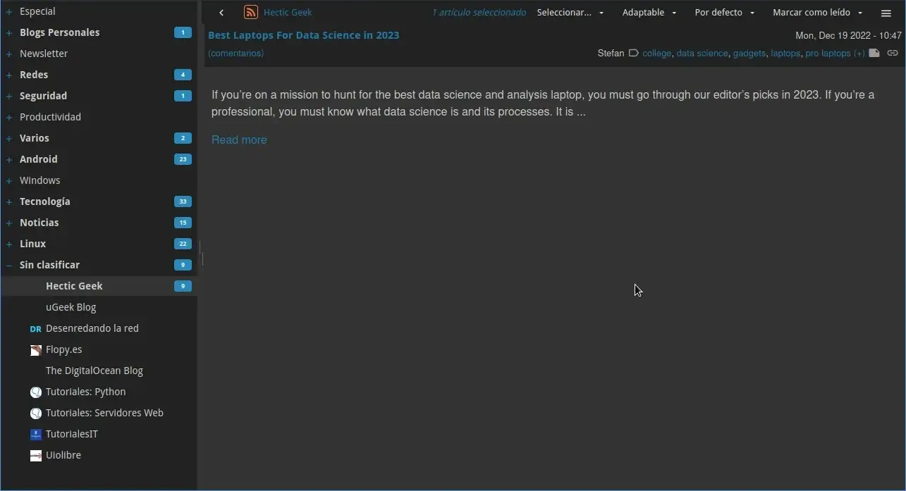
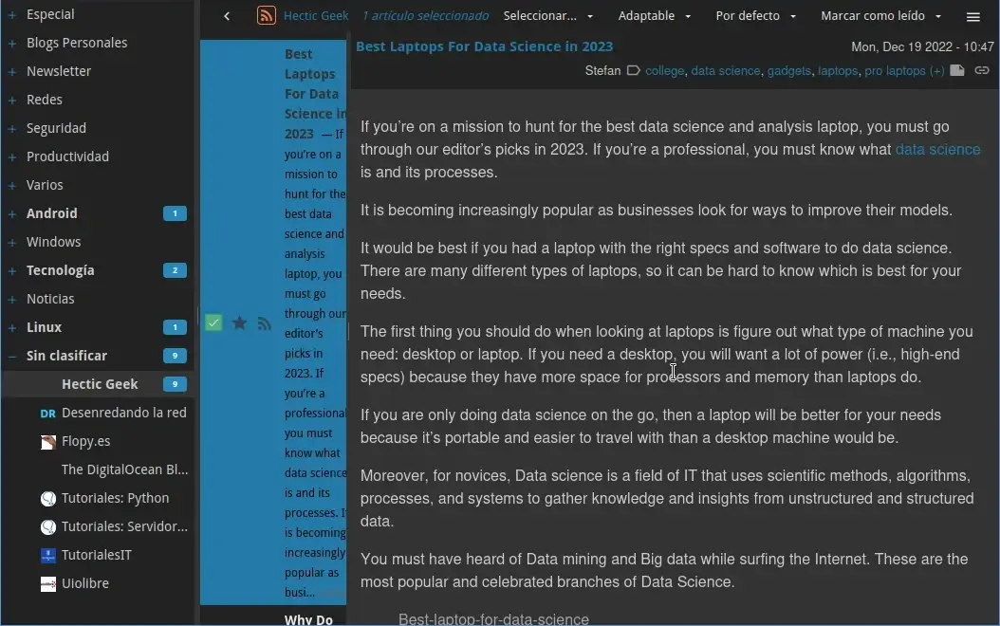
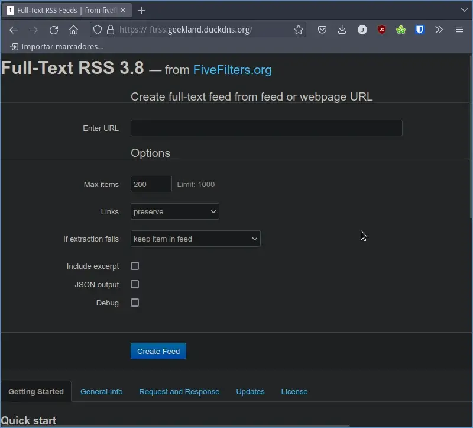
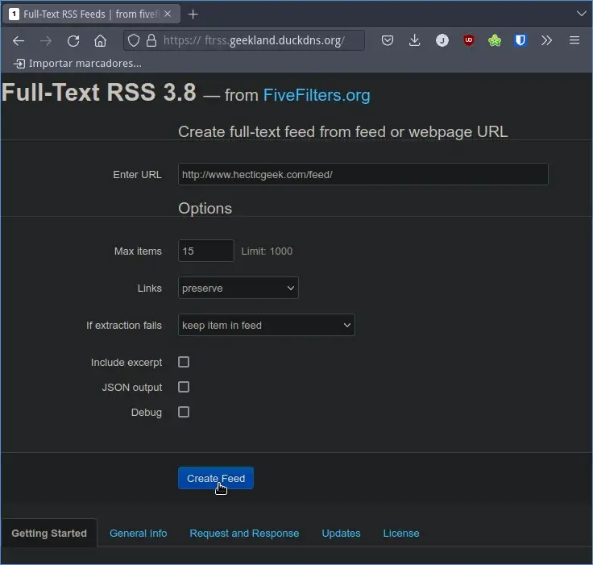
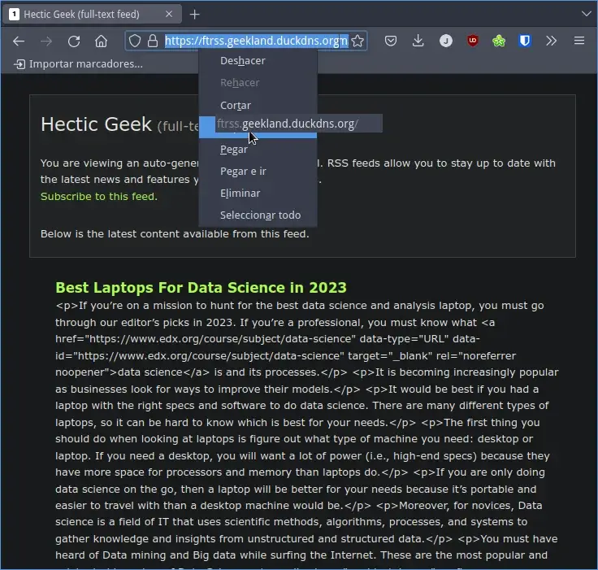

En mi caso leo la totalidad de artículos a través de mi [lector de feeds RSS]() y para ello lo mejor es usar un feed que contenga el contenido completo de los artículos. No obstante muchos de los feeds de blogs que acostumbro a leer solo tienen las 5 o 10 primeras líneas del artículo. Seguidamente dejan el link para que podamos visitar su página web y de esta forma proseguir con la lectura. Esto para mi esto es un inconveniente porqué la mayoría de webs que podemos visitar hoy en día:<!--more-->

1. Tienen una cantidad excesiva de anuncios que lo único que hacen es molestar.
2. No tienen un diseño adecuado para la lectura.
3. Generan distracciones y hacen que la lectura del contenidos sea más lenta y poco productiva.

Para solucionar este problema les mostraré el servicio autoalojado Full-Text RSS que les permitirá construir feed RSS que contengan el contenido completo de los artículos de un blog. De este modo podremos leer la totalidad del contenido en nuestro lector de feeds RSS preferido.

## ¿QUÉ CONSEGUIREMOS CON EL SERVICIO DE FULL TEXT RSS?

Como acabo de comentar en la introducción del artículo en multitud de ocasiones únicamente podemos leer el siguiente contenido en el lector de feeds:



Gracias a Full-Text RSS conseguiremos generar un feed que contenga la totalidad del contenido del artículo. Por lo tanto en vez de leer el contenido anterior podremos leer el contenido completo:



De esta forma sera posible leer la totalidad de nuestros artículos desde nuestro lector de feeds y sin tener que visitar la página web de los creadores del contenido. Además Full Text RSS también nos permitirá realizar lo siguiente:

1. Convertir a texto completo el feed de un blog y que su salida esté en un fichero con formato `.json`. El formato predeterminado es RSS pero también podemos usar el formato `.json`
2. Extraer parámetros concretos de un feed. Por ejemplo si lo precisamos podemos extraer el título que el escritor del artículo ha definido para la plataforma Twitter, etc.

## LEER ARTÍCULOS ENTEROS DESDE NUESTRO LECTOR DE FEEDS RSS

Los pasos a seguir para poder instalar Full-Text RSS y de este modo poder leer la totalidad de artículos que nos interesan sin tener que abandonar nuestro lector de feeds son los siguientes.

### Instalar Docker y Docker-compose

Full-Text RSS es un servicio que autoalojaremos en nuestro servidor VPS o en nuestra Raspberry Pi. El método de instalación que usaremos será Docker. Para instalar Docker y Docker Compose seguiremos las siguientes instrucciones:

https://geekland.eu/instalar-docker-y-docker-compose-en-linux/

### Abrir los puertos 80 y 443

Para poder acceder al servicio autoalojado tendremos que abrir los puertos 80 y 443 de nuestro servidor. Para ello procederemos del siguiente modo:

Si usamos un sistema operativo Linux podemos usar el firewall `ufw`. Para instalarlo ejecuten el siguiente comando en la terminal:

```
sudo apt install ufw
```

Una vez instalado el servicio lo habilitan mediante el siguiente comando:

```
sudo ufw enable
```

Para iniciar el firewall ejecutaremos el siguiente comando en la terminal:

```
sudo service ufw start
```

Finalmente abriremos los puertos 80 y 443 del firewall ejecutando los siguientes comandos en la terminal:

```
sudo ufw allow http

sudo ufw allow https
```

En el caso que estén detrás de un Router recuerden que también tienen que abrir los puertos 80 y 443 en el router. Además las peticiones entrantes a los puertos 80 y 443 se deberán redirigir a la IP del equipo en que instalaremos Full-Text RSS.

### Instalar el proxy inverso Traefik

En mi caso estoy usando la versión 2 del proxy inverso Traefik. Para instalar y configurar la versión 2 del proxy inverso Traefik les recomiendo que sigan las instrucciones dle siguiente enlace:

https://geekland.eu/instalar-y-configurar-traefik-v2-para-usarlo-como-proxy-inverso/

Una vez finalizada la instalación y configuración del proxy inverso tendremos un dominio de direccionamiento DNS similar al siguiente:

```shell
geekland.duckdns.org
```

### Definir la URL para acceder a Full-Text RSS

En el apartado anterior hemos definido que nuestro DNS dinámico será `geekland.duckdns.org`. Por lo tanto ahora podemos definir la dirección que usaremos para acceder al servicio Full-Text RSS. En mi caso he decidido que sea la siguiente:

> ```shell
> ftrss.geekland.duckdns.org
> ```

Una vez tomada esta decisión podemos saltar al siguiente apartado.

### Instalar Full Text RSS con Traefik y Docker para obtener un feed con el contenido completo y de esta forma poder leer los artículos en nuestro lector de feeds RSS

El primer paso para la instalación de Full-Text RSS es clonar el repositorio de Github de la persona que ha puesto el servicio de FiveFilters a disposición del público. Para ello ejecutamos el siguiente comando en la terminal:

> ```shell
> git clone https://github.com/heussd/fivefilters-full-text-rss-docker
> ```

Acto seguido accedemos dentro del directorio que acabamos de descargar ejecutando el siguiente comando:

> ```shell
> cd fivefilters-full-text-rss-docker/
> ```

A continuación accederemos dentro del fichero docker-compose.yml ejecutando el siguiente comando en la terminal:

> ```shell
> nano docker-compose.yml
> ```

Cuando se abra el fichero de texto nano modificaréis el contenido para que quede de la siguiente forma:

```shell
version: '3.7'
services:

  fullfeedrss:
    build: .
    image: "heussd/fivefilters-full-text-rss:latest"
    environment:
      # Leave empty to disable admin section
      - FTR_ADMIN_PASSWORD=
    volumes:
      - "rss-cache:/var/www/html/cache"
    ports:
      - "8086:80"

    networks:
      - web

    labels:
      - traefik.http.routers.ftrss.rule=Host(`ftrss.geekland.duckdns.org`)
      - traefik.http.routers.ftrss.tls=true
      - traefik.http.routers.ftrss.tls.certresolver=lets-encrypt
      - traefik.docker.network=web
      - traefik.port=8086
      - traefik.enable=true

volumes:
  rss-cache:

networks:
  web:
    external: true
```

**Nota:** Tengan en cuenta que tendrán que reemplazar las partes azules del código del fichero docker-compose.yml en función del dominio que hayan elegido. En el caso que ya estéis usando el puerto 8086 podéis usar otro.

**Nota:** Este es el docker-compose más sencillo que pueden generar. En el no se establece ninguna contraseña de administración ni tampoco se establece ningún método de autenticación. Por lo tanto el servicio que levantaremos estará abierto a todo el mundo. Para cerrarlo podríamos usar un middleware de autenticación de Traefik, pero esto lo haremos a posteriori y en otro artículo.

Una vez definido el contenido del fichero docker-compose.yml guardamos los cambios y cerramos el fichero. Finalmente levantaremos el servicio Full-Text RSS de fivefilters ejecutando el siguiente comando en la terminal:

> ```shell
> docker-compose up -d
> ```

## EMPEZAR A USAR FULL TEXT RSS PARA OBTENER UN FEED CON EL CONTENIDO COMPLETO

Una vez levantado el servicio ya podremos acceder a él. Para ello ingresaremos la URL del servicio en nuestro navegador y si todo funciona correctamente veremos lo siguiente:



Acto seguido en el campo `Enter URL` pondremos la URL que contiene el feed incompleto del blog que nos interesa. A continuación en el campo `Max items` definiremos el número de artículos máximo que quiero que tengo el feed. Por lo general 15 artículos debería ser más que suficiente. Una vez definidos estos 2 parámetros ya podemos presionar el botón `Create Feed` y el feed con el contenido completo se generará.



A continuación verán el contenido del nuevo feed. La URL del nuevo feed, que contendrá la totalidad del contenido de los artículos, será la que figura en la barra de direcciones del navegador. Por lo tanto tendremos que seleccionar la URL de la barra de direcciones y copiarla.



Acto seguido deberán usar esta URL para suscribirse en su lector de feeds preferido. Una vez suscritos verán que pueden leer la totalidad de los artículos sin tener que salir de su lector de feeds.


## COMO CERRAR EL SERVICIO QUE ACABAMOS DE AUTOALOJAR

El servicio que acabamos de levantar estará abierto a todo el mundo que conozca la URL. Si queremos cerrar el servicio lo podemos realizar del modo que dejo en el siguiente enlace:

https://geekland.eu/autenticacion-con-usuario-y-contrasena-mediante-traefik/

#### Fuentes

[https://github.com/heussd/fivefilters-full-text-rss-docker](https://github.com/heussd/fivefilters-full-text-rss-docker)
