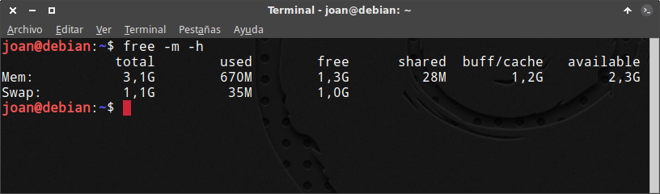

Si en algún momento quieren conocer y analizar el consumo de memoria RAM que tiene su sistema operativo Linux pueden **ejecutar el siguiente comando en la terminal**:<!--more-->

> ```
> free -m -h
> ```

En mi caso los resultados obtenidos son los siguientes:

[](images/Consumo-de-memoria-RAM.png)

Si leemos los resultados obtenidos veremos algo realmente sorprendente. De los 3.1GB de memoria RAM **únicamente tengo disponibles 1.3GB cuando apenas no tengo ningún programa abierto**. ¿Como puede ser que el consumo de memoria RAM sea tan elevado?

## ¿POR QUÉ LINUX CONSUME TANTA MEMORIA RAM?

Linux en todo momento tiende a maximizar el uso de nuestra memoria RAM para conseguir los siguientes objetivos:

1. **Acelerar las lecturas en disco:** Linux usa la memoria RAM que nos sobra para almacenar metadatos, datos e información de los archivos y programas que usamos, que hemos accedido recientemente o utilizamos de forma frecuente. De esta forma cuando necesitemos acceder a estos datos lo podremos hacer de forma mucho más rápida porque podremos acceder a la informaron directamente de la memoria RAM sin tener que acceder a la información almacenada en nuestro disco duro.
2. **Acelerar la asignación de memoria RAM a los programas:** Cuando en Linux se abre un programa, el Kernel reserva una cantidad determinada de memoria para el funcionamiento de este programa. La cantidad de memoria reservada por el kernel es más grande que la memoria usada por el programa, de este modo en el momento que el programa necesita más memoria RAM, el Kernel se la puede proporcionar de inmediato sin tener que realizar operaciones adicionales porque se dispone de memoria sobrante previamente reservada para el programa en cuestión.

**La obtención de estos 2 objetivos se traducirá en un consumo de memoria RAM mayor, pero también con una mayor velocidad en el arranque, ejecución y uso de nuestros programas**. En definitiva Linux tendrá un excelente gestión de la memoria RAM ya que siempre aprovechará la memoria RAM que no usamos para mejorar el rendimiento del sistema operativo.

## ¿QUÉ PASARÁ CUANDO ABRA 2 O 3 PROGRAMAS QUE TENGAN UN CONSUMO ELEVADO DE RAM?

En el caso que el comando Free nos dijera que únicamente tenemos 60 MB de RAM libres y abriéramos un navegador pesado como Chrome o Firefox no pasaría absolutamente nada.

En el momento de abrir el navegador **se liberaría parte de la memoria RAM que almacena datos y metadatos de nuestro disco duro y se la asignaría al navegador**. De este modo el navegador se abrirá y lo podremos usar sin ningún tipo de problema.

## ANALIZAR EL CONSUMO DE MEMORIA RAM CON FREE

Para leer y entender correctamente los resultados que nos da el comando free, primero tenemos que saber lo que significan cada uno de los parámetros que nos proporciona.

### Significado de los parámetros que nos muestra el comando free

El significado de cada uno de los parámetros que nos da el comando Free son los siguientes:

**Total:** Muestra la memoria RAM que tiene nuestro ordenador.

**Used:** Muestra el consumo de memoria RAM que están consumiendo los programas y procesos que se están ejecutando en nuestro ordenador.

**Free:** Muestra la memoria RAM que no estamos usando y por lo tanto está completamente libre sin realizar ninguna función. En otras palabras podemos decir que se trata de memoria RAM libre o “desperdiciada”.

**Shared:** Muestra la cantidad de memoria RAM que está siendo compartida y usada por más de un proceso o programa. De esta forma los procesos se pueden comunicar entre ellos y se evita copiar datos redundantes en la memoria.

**buff/cache:** Es la cantidad de memoria RAM que Linux se reserva para acelerar las lecturas en disco y para acelerar la asignación de memoria RAM a los programas.

**Available:** Es una estimación de la memoria RAM disponible para iniciar nuevos programas y procesos sin considerar la memoria Swap.

### Ejemplo de como leer los resultados del comando Free

Los resultados del comando que hemos ejecutado al inicio del post, y que podemos ver a continuación, se deben leer e interpretar de la siguiente forma:

[](images/Consumo-de-memoria-RAM.png)

###### Nota: La salida que proporciona el comando free puede variar en función de la versión del paquete procps instalado en su sistema operativo.

###### Nota: El comando free proporciona resultados estáticos. Si quieren que los resultados del comando free se vayan actualizando de forma automática y periódica deben ejecutar el comando watch free -m -h

1. Actualmente los programas y procesos que se están ejecutando en mi ordenador consumen una memoria RAM de 670 Megas. **(Campo Used)**.
2. Aproximadamente 1200 Megabytes de memoria RAM se están usando para almacenar metadatos e información con el fin de evitar el acceso al disco duro y acelerar la carga y uso de los programas. **(Campo buff/cache)**
3. Tenemos 1300 Megabytes que actualmente no estamos usando. **(Campo Free)**
4. Si sumamos la memoria detallada en los campos Used + Free + buff/cache, suman 3100 Megabytes que justo es la memoria RAM total que tiene mi ordenador. **(Campo Total)**
5. Mi ordenador actualmente dispone de aproximadamente 2300 Megabytes para podar iniciar nuevos programas. **(Campo available)**
6. Finalmente 28 Megabytes de nuestra memoria se están usando para almacenar información que puede ser consultada por varios programas y procesos. **(Campo Shared)**

## CONCLUSIONES FINALES

Una vez explicados cada uno de los parámetros del comando free ya tenemos que ser capaces conocer a grandes rasgos la gestión de la memoria RAM y poder de llegar a las siguientes conclusiones:

1. **El hecho de tener poca memoria RAM libre disponible (free) no significa que la gestión de la memoria sea deficiente o tengamos poca memoria disponible**. Simplemente significa que Linux saca el máximo partido al hardware disponible.
2. **Para tener una idea** clara **de la memoria RAM que estamos consumiendo** tenemos que **consultar el Campo Used o el campo Available** del comando free.
3. **Tener mucha memoria RAM sin usar (Free) es equivalente a desperdiciar la memoria RAM** que tenemos en nuestro ordenador ya que usando esta memoria RAM podríamos conseguir que nuestro sistema operativo se moviera con mayor rapidez y fluidez.
4. **Tener poca memoria RAM libre (free) no implica que se vaya a hacer uso de la memoria Swap**. Antes de usar la memoria Swap se liberará la memoria RAM usada como Buffer o como cache.
5. **Gran parte de la memoria usada como buffer y como cache se puede llegar a considerar como memoria no usada** ya que en el momento de ser necesitada por los programas se liberará sin mayor problema.

## OTROS COMANDOS PARA CONOCER EL CONSUMO DE MEMORIA RAM

En este artículo nos hemos limitado a comentar y analizar el consumo de memoria RAM mediante el uso del comando free. No obstante **en Linux existen multitud de comandos que incluso dan mayor información que el comando free**. Algunos de estos comandos son los siguientes:

### Comando top

Para ejecutar top tal solo tenemos que abrir una terminal y ejecutar el siguiente comando:

> ```
> top
> ```

Los resultados que nos mostrará este comando serán más completos que el comando Free. Este comando **mostrará los mismos parámetros que el comando free, pero además será capaz de mostrarnos la cantidad de memoria RAM y CPU consumida por cada uno de nuestros procesos** y programas que se ejecutan en nuestro ordenador.

### Comando /proc/meminfo

Para visualizar la información a través de meminfo tan solo tenemos que abrir una terminal y ejecutar el siguiente comando:

> ```
> cat /proc/meminfo
> ```

Después de ejecutar el comando aparecerá una larga lista que nos mostrará multitud de parámetros de nuestra memoria RAM.
