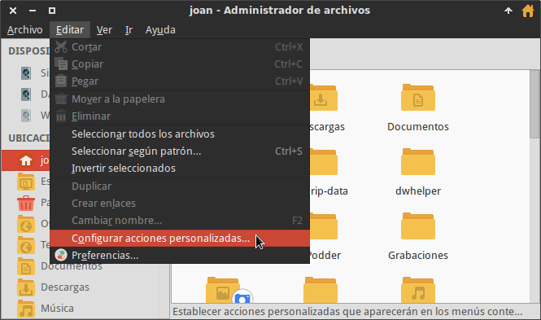
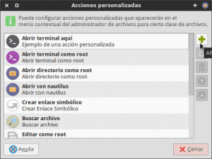
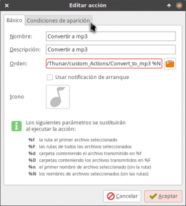
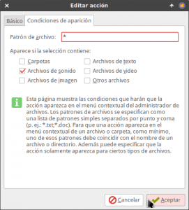

Quienes trabajan de forma habitual con audio agradecerán disponer de una herramienta rápida y ágil para convertir audio a mp3.

En mi caso la solución que encuentro más rápida y ágil para el entorno de escritorio XFCE es usar Thunar. Para convertir audio a mp3 en Thunar tienen que seguir las siguientes instrucciones.<!--more-->

## INSTALAR LOS PAQUETES NECESARIOS PARA CONVERTIR AUDIO A MP3

Tenemos que asegurar que nuestro sistema operativo tenga los paquetes necesarios para convertir los archivos de audio a mp3. Para ello ejecutamos el siguiente comando en la terminal.

> ```
> sudo apt-get install lame oggenc flac zenity mplayer id3v2
> ```

###### Nota: Si utilizan un gestor paquetes diferente a apt deberán realizar un pequeña adaptación al comando que he dejado en el post.

Una vez instalada la paqueteria necesaria ya podemos pasar a construir el script encargado de convertir audio a mp3.

## CREAR EL SCRIPT PARA CONVERTIR AUDIO A MP3

En primer lugar creamos la ubicación en que guardaremos el script. Para ello ejecutamos el siguiente comando en la terminal:

> ```
> mkdir ~/.config/Thunar/custom_Actions
> ```

A continuación creamos el archivo Convert\_to\_mp3 que contendrá el código del script. Para ello ejecutamos el siguiente comando en la terminal:

> ```
> touch ~/.config/Thunar/custom_Actions/Convert_to_mp3
> ```

Seguidamente abriremos el archivo que acabamos de crear ejecutando el siguiente comando en la terminal:

> ```
> nano ~/.config/Thunar/custom_Actions/Convert_to_mp3
> ```

El siguiente paso consistirá en pegar el siguiente el código que nos permitirá convertir cualquier archivo de audio a mp3. El código a pegar es el siguiente: `#!/bin/bash source /usr/lib/elive-tools/functions #el_make_environment . gettext.sh TEXTDOMAIN="thunar-audio-converter" export TEXTDOMAIN el_check_translations_required_notify exit_me(){ rm -rf "${tempdir}" exit 1 } trap "exit_me 0" 0 1 2 5 15 main(){ # pre {{{ local file PROCESS NUMBER_OF_FILES ARTIST TITLE ALBUM GENRE TRACKNUMBER DATEYEAR file_dest_dir GENRE_NUM GENRE_NUM2 is_delete_original PROGRESS filename guitool tempdir extension # How many files to make the progress bar PROGRESS=0 NUMBER_OF_FILES="$#" guitool=zenity # Dialog box to choose quality QUALITY="$( $guitool --list --height=340 --width=500 --title="Seleccionar el formato de Salida" --text="Selecciona la calidad de salida" --radiolist --column=$"Marcar" --column=$"Calidad" "" "Baja" "" "Media" "" "Alta" || echo cancel )" [[ "$QUALITY" = "cancel" ]] && exit if [[ "$QUALITY" = "Baja" ]] ; then bit_rate=9 varbit_rate=9 fi if [[ "$QUALITY" = "Media" ]] ; then bit_rate=5 varbit_rate=5 fi if [[ "$QUALITY" = "Alta" ]] ; then bit_rate=0 varbit_rate=0 fi if [[ "$QUALITY" = "" ]]; then $guitool --error --text="Calidad no especificada. Debe especificar una calidad. " exit 1 fi tempdir="/tmp/.${USER}-audio-converter-$$" # }}} if [[ -z "$@" ]] ; then $guitool --error --text="$( eval_gettext "No files provided to convert" )" exit 1 fi let "INCREMENT=10000000/$NUMBER_OF_FILES" mkdir -p "$tempdir" file_dest_dir="$(pwd)/Audios_Convertidos" mkdir -p "$file_dest_dir" ( for file in "$@" do echo "$(( ${PROGRESS%%.*} / 100000 ))" file="$file" filename="${file##*/}" filenameraw="${filename%.*}" echo -e "# Convirtiendo: \t ${filename}" # cache it for faster multiprocess (not i/o overload) cat "${file}" > /dev/null rm -rf "${tempdir}" mkdir -p "${tempdir}" unset ARTIST TITLE ALBUM TRACKNUMBER DATEYEAR GENRE case "$filename" in *wav|*WAV) lame --quiet -vbr-new -V $varbit_rate -q $bit_rate "${file}" -o "${tempdir}/third.mp3" ;; *flac|*FLAC) ARTIST="$(metaflac "$file" --show-tag=ARTIST | sed s/.*=//g)" TITLE="$(metaflac "$file" --show-tag=TITLE | sed s/.*=//g)" ALBUM="$(metaflac "$file" --show-tag=ALBUM | sed s/.*=//g)" GENRE="$(metaflac "$file" --show-tag=GENRE | sed s/.*=//g)" TRACKNUMBER="$(metaflac "$file" --show-tag=TRACKNUMBER | sed s/.*=//g)" DATEYEAR="$(metaflac "$file" --show-tag=DATE | sed s/.*=//g)" DATEYEAR="${DATEYEAR:0:4}" if [[ -n "${GENRE}" ]] ; then GENRE_NUM2="$( id3v2 -L | awk -v genre="$GENRE" '{if ($2 == genre) print $1}' | sed 's|:.*$||g' )" if [[ -n "${GENRE_NUM2}" ]] ; then GENRE_NUM="$GENRE_NUM2" fi fi if [[ -z "${GENRE_NUM}" ]] ; then GENRE_NUM="$( id3v2 -L | sed 's|: |\n|g' | $guitool --list --title="$( eval_gettext "Select a Genre" )"": $GENRE" --column="id" --column="$( eval_gettext "Genre" )" --height=400 )" fi flac -s -c -d "$file" | lame --quiet -vbr-new -V $varbit_rate -q $bit_rate - -o "${tempdir}/third.mp3" id3v2 -t "$TITLE" -T "${TRACKNUMBER:-0}" -a "$ARTIST" -A "$ALBUM" -y "$DATEYEAR" -g "${GENRE_NUM}" "${tempdir}/third.mp3" ;; *mp3|*MP3) extension="mp3" lame --quiet -vbr-new -V $varbit_rate -q $bit_rate "${file}" -o "${tempdir}/third.mp3" ;; *m4a|*M4A) extension="m4a" cp "$file" "${tempdir}/first.${extension}" ARTIST="$(ffprobe "$file" 2>&1 | grep -E "artist(\s)*:" | sed -e 's|^.*: ||g' )" TITLE="$(ffprobe "$file" 2>&1 | grep -E "title(\s)*:" | sed -e 's|^.*: ||g' )" ALBUM="$(ffprobe "$file" 2>&1 | grep -E "album(\s)*:" | sed -e 's|^.*: ||g' )" GENRE="$(ffprobe "$file" 2>&1 | grep -E "genre(\s)*:" | sed -e 's|^.*: ||g' )" TRACKNUMBER="$(ffprobe "$file" 2>&1 | grep -E "track(\s)*:" | sed -e 's|^.*: ||g' )" DATEYEAR="$(ffprobe "$file" 2>&1 | grep -E "date(\s)*:" | sed -e 's|^.*: ||g' )" DATEYEAR="${DATEYEAR:0:4}" if [[ -n "${GENRE}" ]] ; then GENRE_NUM2="$( id3v2 -L | awk -v genre="$GENRE" '{if ($2 == genre) print $1}' | sed 's|:.*$||g' )" if [[ -n "${GENRE_NUM2}" ]] ; then GENRE_NUM="$GENRE_NUM2" fi fi if [[ -z "${GENRE_NUM}" ]] ; then GENRE_NUM="$( id3v2 -L | sed 's|: |\n|g' | $guitool --list --title="$( eval_gettext "Select a Genre" )"": $GENRE" --column="id" --column="$( eval_gettext "Genre" )" --height=400 )" fi mplayer -really-quiet -af volnorm=0 -vo null -noconsolecontrols -af resample=44100 -ao pcm:waveheader:file="${tempdir}/second.wav" "${tempdir}/first.${extension}" 2>/dev/null lame --quiet -vbr-new -V $varbit_rate -q $bit_rate "${tempdir}/second.wav" -o "${tempdir}/third.mp3" id3v2 -t "$TITLE" -T "${TRACKNUMBER:-0}" -a "$ARTIST" -A "$ALBUM" -y "$DATEYEAR" -g "${GENRE_NUM}" "${tempdir}/third.mp3" ;; *) extension="${file##*.}" cp "$file" "${tempdir}/first.${extension}" mplayer -really-quiet -af volnorm=0 -vo null -noconsolecontrols -af resample=44100 -ao pcm:waveheader:file="${tempdir}/second.wav" "${tempdir}/first.${extension}" 2>/dev/null lame --quiet -vbr-new -V $varbit_rate -q $bit_rate "${tempdir}/second.wav" -o "${tempdir}/third.mp3" ;; esac mv "${tempdir}/third.mp3" "${file_dest_dir}/${filenameraw}.mp3" rm -rf "${tempdir}" let "PROGRESS+=$INCREMENT" done ) | $guitool --height=190 --width=500 --progress --title "$( eval_gettext "convirtiendo archivos de audio" )" --percentage=0 --auto-close --auto-kill rm -rf "${tempdir}" } # # MAIN # main "$@" # vim: set foldmethod=marker :`

###### Nota: Script prestado y modificado según mis necesidades de la siguiente [fuente](https://github.com/Elive/thunar-audio-converter/tree/master/tree/usr/libexec/thunar/audio-converter "Fuente de los scripts Thunar Audio converter").

Una vez pegado el código guardamos los cambios y cerramos el archivo.

Finalmente otorgamos permisos de ejecución al script que acabamos de crear ejecutando el siguiente comando en la terminal:

> ```
> chmod +x ~/.config/Thunar/custom_Actions/Convert_to_mp3
> ```

## CREAR LA ACCIÓN PERSONALIZADA CON THUNAR

En este apartado crearemos una acción personalizada para poder ejecutar el script que acabamos de crear cómodamente desde Thunar.

Abrimos Thunar y nos vamos al menú **Editar**. Seguidamente clicamos encima submenú **Configurar acciones personalizadas…**

[](images/Configurar-Acciones-personalizadas.png)

A continuación hay que presionar el botón **+** para poder añadir la acción personalizada.

[](images/Añadir-una-acción-personalizada.png)

Después de presionar el botón + aparecerá la ventana en la que tenemos que configurar la acción personalizada.

[](images/Orden-de-la-acción-personalizada.png)

En cada uno de los campos tenemos que introducir el siguiente contenido:

**Campo Nombre:** Introducimos el nombre que queremos que aparezca en el menú contextual de Thunar. En mi caso elijo el siguiente:

> ```
> Convertir audio a mp3
> ```

**Campo Descripción:** Simplemente tenemos que escribir una descripción de lo que hace nuestra acción personalizada. En mi caso uso la siguiente descripción:

> ```
> Convertir audio a mp3
> ```

**Campo Orden:** Tenemos que introducir el comando para que se pueda ejecutar el script seguido de %N. Por lo tanto tenemos que introducir la siguiente orden:

> ```
> bash /home/joan/.config/Thunar/custom_Actions/Convert_to_mp3 %N
> ```

###### Nota: La orden para ejecutar el script la tendréis que adaptar en función de la ruta donde tenéis guardado el script.

###### Nota: La ruta del script tiene que finalizar con %N para que podamos ejecutar el script en múltiples archivos de audio de forma simultánea.

**Campo Icono:** Si queremos podemos clicar encima del botón **Sin icono**. Si lo hacemos aparecerá una ventana en la que podremos seleccionar un icono para la acción personalizada que estamos creando.

Finalmente clicamos en la pestaña **Condiciones de aparición**, destildamos la opción Archivos de texto, tildamos la opción **Archivos de sonido** y presionamos el botón **Aceptar**.

[](images/Condiciones-de-aparación.png)

En estos momentos ya estamos listos para pasar a la acción y empezar convertir archivos de audio a mp3.

## DEMOSTRACIÓN DE COMO CONVERTIR AUDIO A MP3

En el siguiente vídeo pueden ver una demostración del funcionamiento del script que acabamos de crear para convertir archivos de audio a mp3.

https://www.youtube.com/watch?v=0NKJphueUbs

Como se puede ver en el vídeo, utilizando el script podemos transformar de forma extremadamente sencilla nuestros audios a mp3.

## COMENTARIOS SOBRE EL FUNCIONAMIENTO DEL SCRIPT

Si alguien quiere tener una idea más clara de las posibilidades que ofrece el script puede leer el siguiente apartado.

### Calidades de audio que ofrece el script

El script que hemos programado ofrece 3 calidades de audio distintas.

El comando que se usa para obtener la calidad de audio más baja es del siguiente tipo:

> ```
> lame --quiet -vbr-new -V 9 -q 9 “fichero a convertir” -o “nombre del fichero transformado”
> ```

Para obtener calidades de sonido medias usamos un comando del siguiente tipo:

> ```
> lame --quiet -vbr-new -V 4 -q 4 “fichero a convertir” -o “nombre del fichero transformado”
> ```

Finalmente para obtener la calidad de sonido más alta:

> ```
> lame --quiet -vbr-new -V 0 -q 0 “fichero a convertir” -o “nombre del fichero transformado”
> ```

Si ustedes lo creen oportuno pueden modificar el código del script para adaptarlo a sus necesidades

### Formatos de audio aceptado por el script

El script realizado está concebido para convertir los siguientes formatos de archivo de audio a mp3:

1. .wav
2. .flac
3. .mp3
4. .m4a
5. .ogg

Por lo tanto podremos transformar los formatos de archivos que acabo de mencionar a 3 calidades de mp3 preestablecidas.

Si necesitan transformar un formato de audio diferente a los mencionado es posible que el resultado no sea el esperado.

### Otros comentarios sobre el funcionamiento del script

Finalmente decirles que el script nunca sobreescribirá los archivos originales de audio. La totalidad de audios convertidos se ubicarán en una carpeta llamada Audios\_Convertidos.
