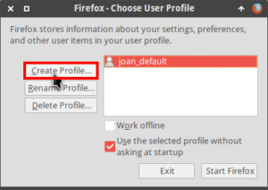
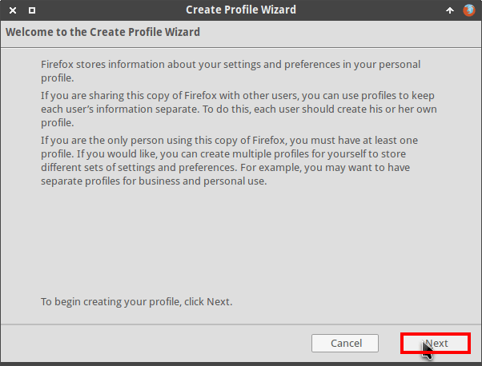
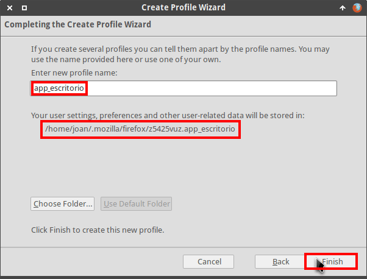
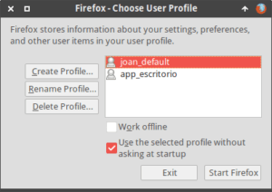
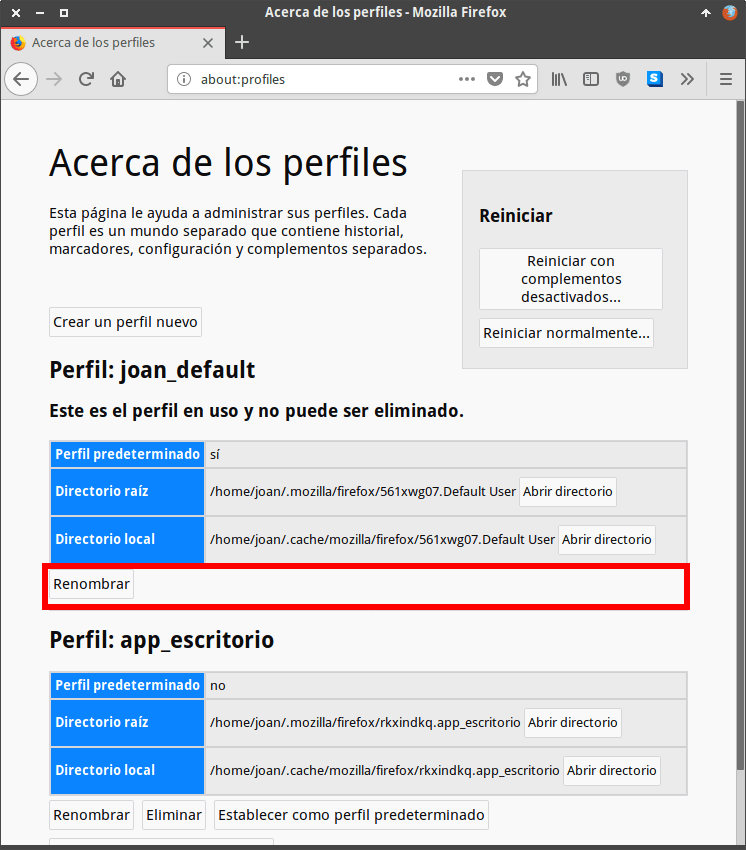
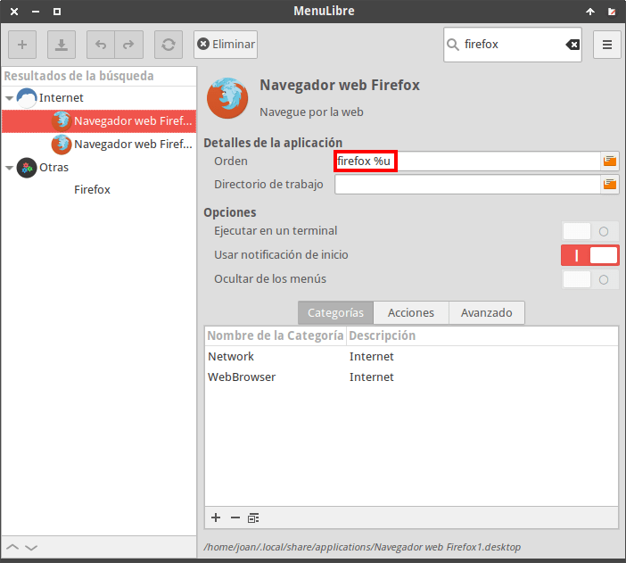
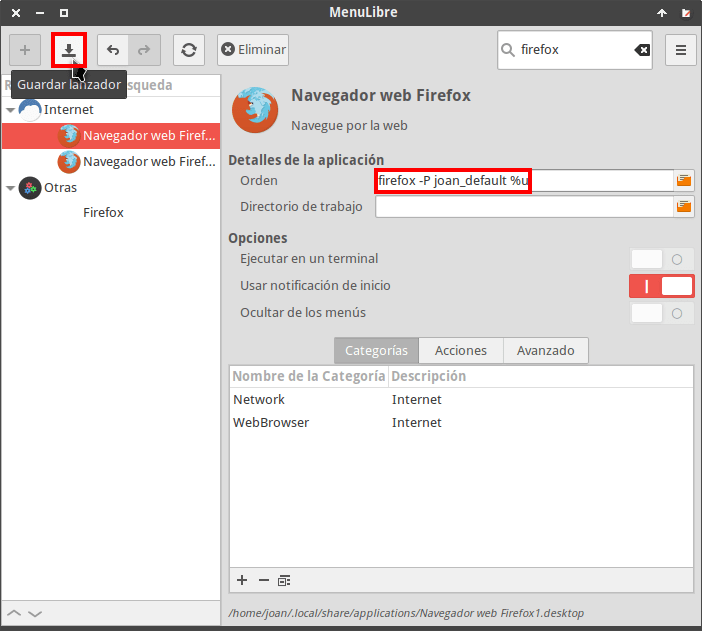
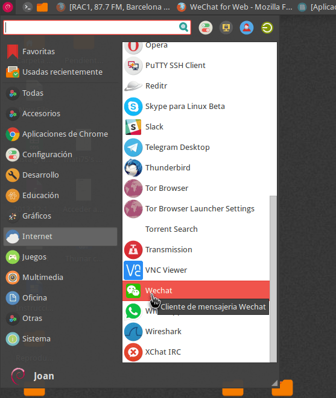
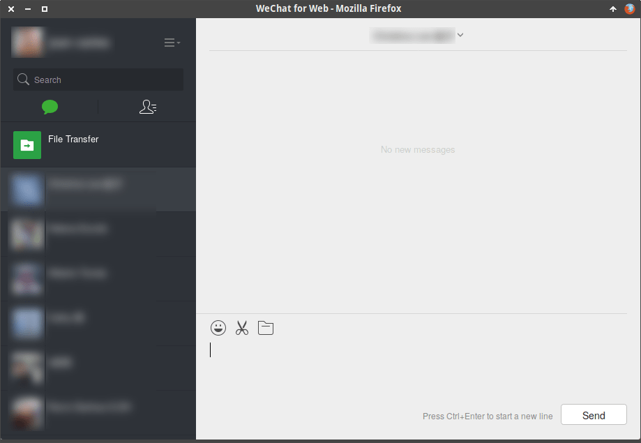

Después de la salida de Firefox 57 considero que si vale la pena usar Firefox en detrimento de Chrome. No obstante hay algunas funcionalidades de Chrome que hecho de menos en Firefox como por ejemplo crear aplicaciones de escritorio a partir de páginas web. Por lo tanto, a continuación detallaré un método para **convertir cualquier web en una aplicación de escritorio** con el navegador Firefox en Linux.<!--more-->

Cabe recordar que en el pasado Mozilla había dispuesto de proyectos interesantes como Prism que se dedicaban a crear aplicaciones de escritorio a partir de páginas web, pero desafortunadamente este proyecto y otros similares se descontinuaron.

## CONVERTIR UNA WEB EN UNA APLICACIÓN DE ESCRITORIO CON FIREFOX

Los pasos para convertir cualquier web en una aplicación de escritorio son los que verán a continuación.

### Crear un perfil adicional de Firefox

Inicialmente crearemos un perfil adicional de Firefox. El perfil que crearemos será el que usaremos para abrir las aplicaciones de escritorio que vamos a crear.

Para crear el perfil ejecutaremos el siguiente comando en la terminal:

> ```
> firefox -ProfileManager -no-remote
> ```

Seguidamente aparecerá una ventana en que se mostrará el nombre de nuestro perfil de Firefox que en mi caso es joan\_default. A continuación clicaremos encima del botón Create Profile… para crear un nuevo perfil.

[](images/crear-perfil-en-firefox.png)

El siguiente paso consistirá en presionar el botón Next.

[](images/introducción-para-crear-el-nuevo-perfil.png)

A continuación escribiremos nuestro nombre de perfil en el campo **Enter new profile name**. En mi caso uso el nombre **app\_escritorio**. Finalmente anotaremos la ubicación de nuestro perfil, que en mi caso es **/home/joan/.mozilla/firefox/z5425vuz.apps\_escritorio**, y presionamos el botón **Finish**.

[](images/iniciar-el-proceso-de-crear-el-nuevo-perfil.png)

Una vez realizados estos simples pasos ya hemos creado un perfil adicional con el nombre **app\_escritorio**.

[](images/perfil-de-firefox-creado.png)

### Configurar el perfil predeterminado de Firefox

En principio este paso no es necesario, no obstante para evitar problemas recomiendo que lo apliquen. Después de crear el nuevo perfil tenemos que asegurar que el perfil que acabamos de crear no es el predeterminado. Para ello abrimos el navegador Firefox y en su barra de direcciones escribimos el siguiente texto y presionamos Enter:

> ```
> about:profiles
> ```

A continuación aparecerá una página para administrar la totalidad de perfiles que tenemos creados. Si observan la captura de pantalla verán que dispongo de los perfiles **joan\_default** y **app\_escritorio**. También observarán claramente que el perfil predeterminado es joan\_default ya que en caso contrario me ofrecería la opción de Establecer como perfil predeterminado dentro del cuadro de color rojo de la siguiente captura de pantalla:

[](images/configurar-perfiles-firefox.png)

Por lo tanto podemos decir que todo está orden y podemos pasar al siguiente apartado. En caso que el perfil predeterminado hubiera sido **app\_escritorio** deberíamos haber clicado encima del botón Establecer como perfil predeterminado del perfil **joan\_default**.

### Instalar las extensiones oportunas y configurar nuestro nuevo perfil de usuario

Abrimos Firefox con nuestro nuevo perfil de usuario. Para ello en mi caso tengo que ejecutar el siguiente comando en la terminal:

> ```
> firefox -P app_escritorio
> ```

El significado de cada uno de los parámetros del comando es el siguiente:

- **firefox:** Comando usado para abrir Firefox.
- **\-P**: Parámetro usado para indicar que queremos abrir un perfil de Firefox determinado.
- **app\_escritorio**: Corresponde al nombre de perfil que queremos usar en Firefox. En vuestro caso deberéis reemplazar app\_escritorio por el nombre del perfil de Firefox que habréis creado en apartados anteriores.

Una vez abierto Firefox instalen las extensiones y configuren el navegador a su gusto. En mi caso las extensiones y configuraciones que acostumbro a realizar son las siguientes:

1. Instalar la extensión [uBlock origin]().
2. Instalar la extensión [HTTPS Everywhere](https://addons.mozilla.org/es/firefox/addon/https-everywhere/ "Web para instalar la extensión https everywhere").
3. [Configurar el corrector ortográfico]() del navegador.
4. Definir las preferencias de idiomas y caracteres de nuestro navegador.
5. Habilitar la reproducción de contenido DRM en el caso que lo consideremos necesario.
6. Configurar la protección contra rastreo en el caso que lo consideremos necesario.
7. Asegurar que tenemos activado el bloqueo de ventanas emergentes.
8. Etc.

Una vez finalizada la configuración del nuevo perfil del navegador podemos pasar al siguiente apartado.

### Configurar el aspecto del perfil que usuario de Firefox que acabamos de crear

Acabamos de configurar nuestro navegador, pero aun falta un paso importante para que las aplicaciones web se visualicen como aplicaciones de escritorio. Este paso consiste en modificar el aspecto de nuestro perfil de usuario mediante código css.

Para ello accedemos a la carpeta de nuestro perfil que, como hemos visto en el apartado anterior, en mi caso es:

> ```
> /home/joan/.mozilla/firefox/z5425vuz.apps_escritorio
> ```

Para acceder dentro de la carpeta desde la terminal ejecutamos el siguiente comando:

> ```
> cd /home/joan/.mozilla/firefox/z5425vuz.apps_escritorio
> ```

Dentro de la carpeta de nuestro perfil creamos una carpeta que tenga el nombre chrome ejecutando el siguiente comando en la terminal:

> ```
> mkdir chrome
> ```

Finalmente crearemos el archivo que contendrá el código css que modificará el aspecto de nuestro navegador. Para ello ejecutaremos el siguiente código en la terminal:

> ```
> nano userChrome.css
> ```

Una vez se abra el editor de textos nano pegaremos el siguiente código:

|   @namespace url(http://www.mozilla.org/keymaster/gatekeeper/there.is.only.xul);  /\* to hide the sidebar header \*/ #sidebar-header { visibility: collapse; }  /\* hide navigation bar when it is not focused; use Ctrl+L to get focus \*/ #main-window:not(\[customizing\]) #navigator-toolbox:not(:focus-within):not(:hover) { margin-top: -74px; } |
| --- |

A continuación guardaremos los cambios y cerraremos el fichero.

El código .css que acabamos de introducir en el fichero userChrome.css realizará las siguientes funciones:

1. La primera sección oculta el encabezado de la barra lateral.
2. La segunda y última de las secciones esconde la totalidad de nuestra barra de navegación.

Gracias al código .css que hemos introducido, cuando abramos una URL con nuestro nuevo perfil de usuario, las web lucirán tal y como si fueran aplicaciones de escritorio.

### Crear los lanzadores de nuestras aplicaciones de escritorio

Finalmente tan solo tenemos que crear los lanzadores .desktop para abrir nuestros servicios web como si fueran aplicaciones de escritorio. A modo de ejemplo crearemos un lanzador .desktop de Wechat del siguiente modo. Inicialmente abriremos una terminal y ejecutaremos el siguiente comando:

> ```
> nano wechat.desktop
> ```

###### Nota: En vuestro caso deberéis reemplazar la palabra wechat por el nombre de la aplicación que queráis crear.

Una vez se abra el editor de textos tenemos que escribir el código para generar el lanzador. En mi caso, el código usado para crear una aplicación de escritorio de Wechat ha sido el siguiente:

|   \[Desktop Entry\] Name=Wechat Terminal=false NoDisplay=false Exec=firefox %u -P app\_escritorio -new-window https://web.wechat.com/ Icon=/home/joan/Imágenes/Wechat.png Type=Application Categories=Network;InstantMessaging; Comment=Cliente de mensajería Wechat   |
| --- |

Para que vosotros podáis crear un lanzador cualquiera tan solo tenéis que modificar las partes de color rojo y verde. A continuación les dejo una breve explicación para que puedan realizar las modificaciones sin complicación alguna:

- **Name:** Escribimos el nombre que queremos que tenga el lanzador. En mi caso selecciono el nombre Wechat.
- **Exec:** La parte de color verde corresponde al perfil de usuario que queremos usar para abrir una URL. En mi caso quiero usar el perfil creado y configurado en apartados anteriores que se llama app\_escritorio. La parte de color rojo corresponde a la URL del servicio web que queremos convertir en una aplicación de escritorio. Como en mi caso quiero convertir el servicio Wechat web en una aplicación de escritorio pego la URL https://web.wechat.com/ que corresponde a la dirección web del servicio de Wechat.
- **Icon:** Tan solo tenemos que indicar la ruta del icono que queremos usar para nuestra aplicación de escritorio.
- **Categories:** Apartado en el que tenemos que definir la categoría de nuestro menú en que queremos introducir el lanzador. Como en mi caso quiero introducir el lanzador en el menú Internet escribo las opciones Network;InstantMessaging;.Algunas de las categorías que podemos usar son AudioVideo;Audio;AudioVideoEditing;, Game;StrategyGame;, Office;Spreadsheet;, Graphics;2DGraphics;RasterGraphics;GTK;, etc.
- **Comment=** Finalmente en el apartado Comment introduzco una descripción de lo que es o realiza la aplicación de escritorio que queremos crear.

Una vez generado el código para configurar el lanzador guardamos los cambios y cerramos le editor de textos.

### Introducir nuestro lanzador en el menú de nuestra distribución

A continuación integraremos el lanzador que acabamos de crear en el menú de nuestra distribución Linux. Para ello tan solo tenemos que copiar el lanzador que acabamos de crear en la ubicación ~/.local/share/applications/ ejecutando el siguiente comando en la terminal:

> ```
> mv wechat.desktop ~/.local/share/applications/
> ```

###### Nota: Si no les gusta la terminal pueden copiar o mover el lanzador usando el gestor de archivos.

## MODIFICAR EL LANZADOR DE FIREFOX DEL MENÚ DE NUESTRA DISTRO

Para asegurar que siempre se abra el perfil de Firefox que esperamos se recomienda editar el lanzador de Firefox del menú de nuestra distro.

Existen muchas formas de modificar los lanzadores del menú, pero en este caso lo haremos mediante [MenuLibre]().

Por lo tanto abrimos MenuLibre y buscamos el lanzador de Firefox. Una vez encontrado verán que el comando que ejecuta el lanzador es el siguiente:

> ```
> firefox %u
> ```

[](images/lanzador-estandad-de-firefox.png)

Reemplazamos el comando actual por el siguiente:

> ```
> firefox -P joan_default %u
> ```

###### Nota: En vuestro caso deberéis reemplazar joan\_default por el nombre de vuestro perfil predeterminado.

[](images/lanzador-de-firefox-modificado.png)

La parte del comando \-P joan\_default garantizará que siempre que abramos Firefox con el lanzador de nuestro menú se abra con nuestro perfil predeterminado que en mi caso es joan\_default .

## USAR LA APLICACIÓN ESCRITORIO QUE ACABAMOS DE CREAR

En estos momentos ya podemos abrir la aplicación de escritorio que hemos creado. Para ello buscamos la aplicación en el menú de nuestro escritorio y la abrimos.

[](images/abrir-la-aplicacion-de-escritorio-creada.png)

Una vez abierta pueden observar que la apariencia del servicio web de Wechat es exactamente igual a la de una aplicación de escritorio convencional. De este modo conseguimos emular la característica **Añadir al escritorio...** de que trae incorporada el navegador Google Chrome.

[](images/usando-la-aplicación-de-escritorio-de-wechat.png)

Si mientras usan la aplicación de escritorio necesitan acceder a la barra de navegación o realizar algún tipo de acción con el navegador tengan en cuenta los siguientes atajos de teclado:

- **Ctrl + L:** Para acceder a la barra de navegación, pestañas y menú de Firefox.
- **Alt:** Para acceder al menú de navegación de Firefox.
- **Ctrl + W:** Para cerrar una pestaña.
- **Alt + flecha cursor derecha:** Ir a la página siguiente.
- **Alt + flecha cursor izquierda:** Ir a la página anterior.
