En mi caso tengo que copiar 10GB de fotografías y vídeos de un ordenador a otro ordenador. Existen multitud de opciones para copiar archivos de gran tamaño de un ordenador a otro. Algunas de las opciones disponibles son:<!--more-->

1. **Usar un disco duro externo** o un dispositivo de almacenamiento externo para traspasar la información de un ordenador a otro ordenador.
2. **Conectar los equipos a una misma red local** y transferir los archivos.
3. Usar Telegram para transferir archivos de un equipo a otro.
4. **Usar un servicio en la nube** como por ejemplo Nextcloud, Dropbox, etc.

Desafortunadamente en mi caso no puedo aplicar ninguna de las opciones citadas por las siguientes circunstancias:

1. No dispongo de ningún disco duro externo.
2. Mi red local red local no dispone de ningún tipo de cableado. Por lo tanto la transferencia de archivos es extremadamente lenta y se cuelga.
3. Telegram tiene un tamaño máximo de transferencias de archivos. En otras palabras, Telegram no te permitirá pasar un vídeo de más de 1.5GB de un ordenador a otro ordenador.
4. No dispongo de ninguna nube gratuita que tenga un espacio libre de 10GB.

Vistos los inconvenientes al final he terminado copiando los archivos de un ordenador a otro ordenador mediante un cable Ethernet cruzado RJ-45. El procedimiento seguido ha sido el siguiente.

## COPIAR ARCHIVOS QUE OCUPAN UN GRAN TAMAÑO DE UN ORDENADOR A OTRO ORDENADOR

El procedimiento para copiar archivos de un ordenador a otro mediante un cable Ethernet es extremadamente sencillo.

### Averiguar el nombre de los equipos

En el primero de los equipos posicionamos el puntero del mouse encima del botón de inicio de Windows. Presionamos el botón derecho del ratón y cuando se despliegue el menú clicamos en la opción Sistema.

[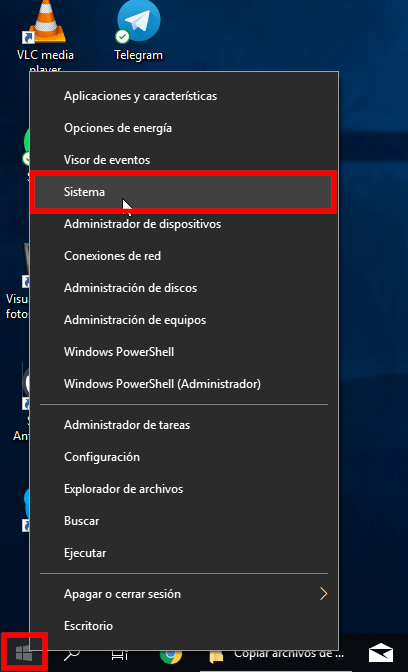](images/acceder-a-información-del-sistema.png)

Acto seguido podremos ver **el nombre del equipo es** jc-win10-desktop

[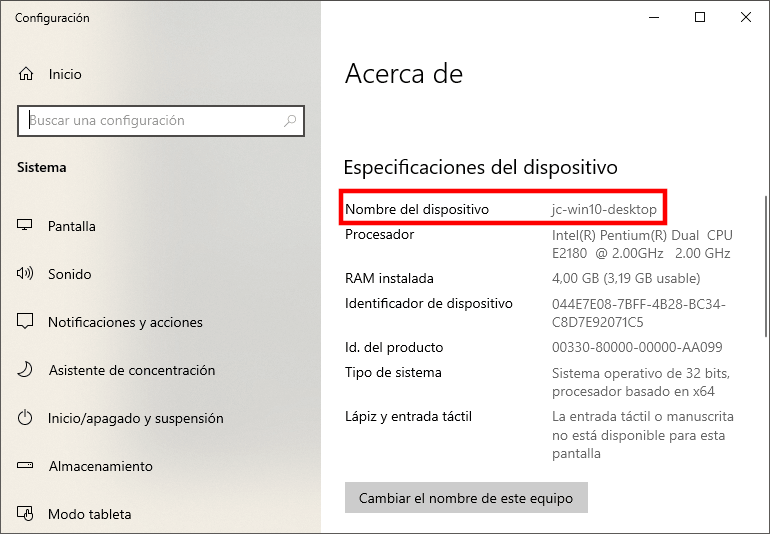](images/nombre-del-equipo-1.png)

Si repetimos el proceso en **el segundo de los ordenadores** veremos que en mi caso **tiene como nombre** jcall\_pc

[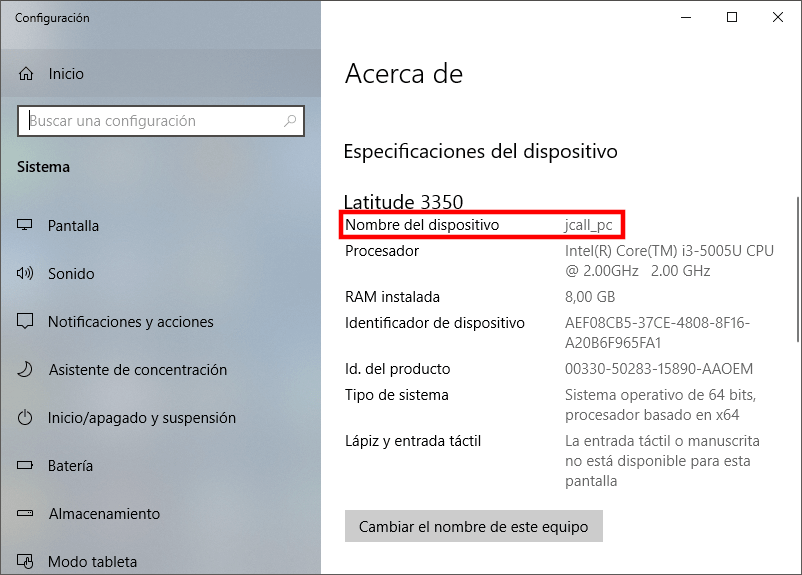](images/nombre-del-equipo-2.png)

### ¿Qué es lo que quiero realizar?

A estas alturas se que el nombre de mis ordenadores es el siguiente:

- **Ordenador 1**: jc-win10-desktop
- **Ordenador 2**: jcall\_pc

El ordenador 2 con nombre jcall\_pc contiene la carpeta fotos de 10GB que copiaré al ordenador 1.

### Conectar los 2 equipos mediante un cable Ethernet

Una vez tenemos identificados los 2 ordenadores por su nombre los conectaremos mediante un [cable Ethernet cruzado RJ-45](https://es.wikipedia.org/wiki/RJ-45 "Muestra del tipo de cable que necesitamos"). La conexión es tan simple como la que se muestra en la siguiente ilustración:

[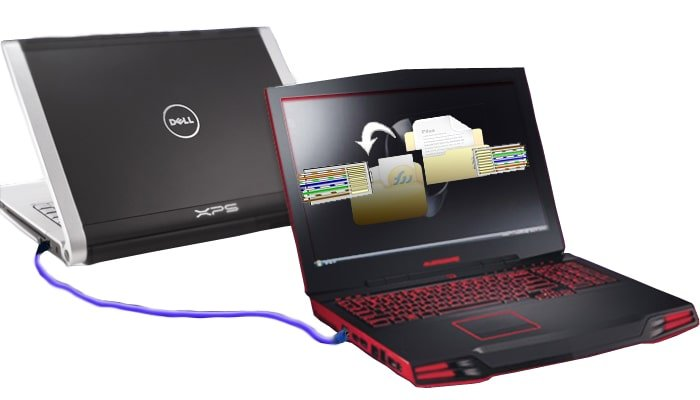](images/copiar-archivos-gran-tamaño-cable-ethernet.jpg)

Una vez conectados los equipos es recomendable comprobar que ninguno de los 2 equipos tenga conexión a internet.

### Configuración de red para que se puedan ver los equipos

Para asegurar que los 2 equipos se puedan ver y comunicar entre si haremos los siguiente.

**En el primero de los equipos** (jc-win10-desktop) presionamos la combinación de teclas Win+R. Cuando aparezca la ventana de ejecutar escribimos ncpa.cpl en el campo Abrir y presionamos el botón Aceptar.

[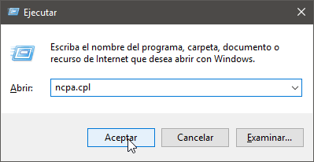](images/acceder-a-las-conexiones-de-red.png)

Cuando aparezca la ventana de **Conexiones de Red** hacemos doble click encima de nuestra tarjeta Ethernet.

[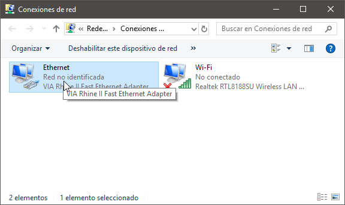](images/entrar-configuracion-tarjeta-ethernet.png)

Acto seguido clicamos en el botón Propiedades.

[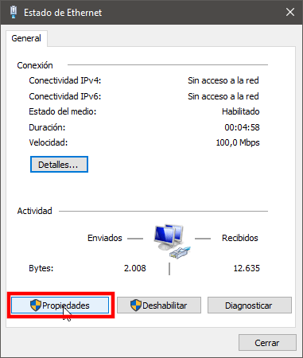](images/acceder-propiedades-tarjeta-ethernet.png)

A continuación hacemos doble click encima de la opción Protocolo de Internet versión 4 (TCO/IPv4)

[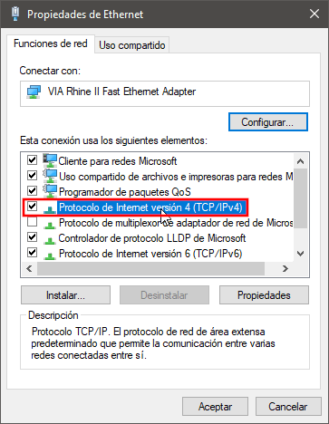](images/acceder-a-la-cofiguracion-de-red.png)

En el apartado de configuración de nuestra tarjeta Ethernet introducimos la configuración que se puede ver en la captura de pantalla:

- **Dirección IP:** Escribimos la dirección IP interna que queramos que tenga el primero de los equipos (jc-win10-desktop). En mi caso he usado la dirección 192.168.1.2
- **Mascara de subred:** Introducimos una mascara de subred que sea acorde con la dirección IP que acabamos de introducir. En mi caso introduzco 255.255.255.0
- **Puerta de enlace predeterminada:** Tenemos que escribir la IP que queramos que tenga el segundo de los equipos (jcall\_pc). La IP tiene que ser diferente a la dirección IP del primer campo y dentro de la subred definida en el segundo de los campos. Por lo tanto en mi caso elijo 192.168.1.3

Repetimos exactamente los mismos pasos en el segundo equipo (jcall\_pc), pero en el segundo equipo aplicamos la configuración que podemos ver en la siguiente captura de pantalla:

[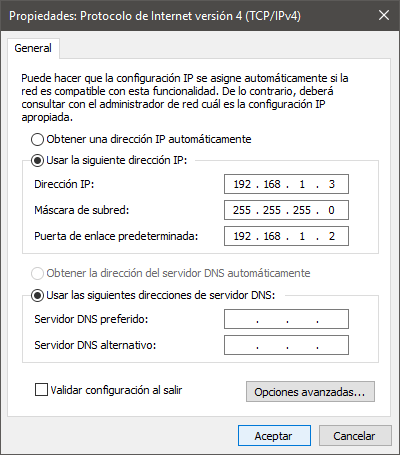](images/configuracion-de-red-del-ordenador-2.png)

- **Dirección IP:** Escribimos la dirección IP interna del segundo equipo. La dirección IP tiene que ser la misma que la puerta de entrada del primer equipo. Por lo tanto la IP que tenemos que introducir es 192.168.1.3
- **Mascara de subred:** Introducimos una mascara de subred que sea acorde con la dirección IP que acabamos de introducir. En mi caso introduzco 255.255.255.0
- **Puerta de enlace predeterminada:** Tenemos que escribir la IP que tenia el primero de los equipos (jc-win10-desktop). Por lo tanto la IP que tenemos que introducir es la 192.168.1.2

Una vez llegados hasta aquí habilitaremos la opciones de compartición de Windows.

### Configurar las opciones de uso compartido de Windows

**En el primer equipo** accedemos a las opciones de uso compartido haciendo clic con el botón izquierdo del ratón en el icono de red del panel de Windows. Cuando se despliegue el menú presionamos sobre la opción Red no identificada Sin internet.

[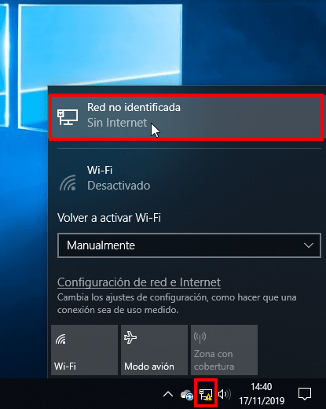](images/entrar-en-las-opciones-de-red.png)

Acto seguido clicamos en la opción Cambiar opciones de uso compartido avanzadas.

[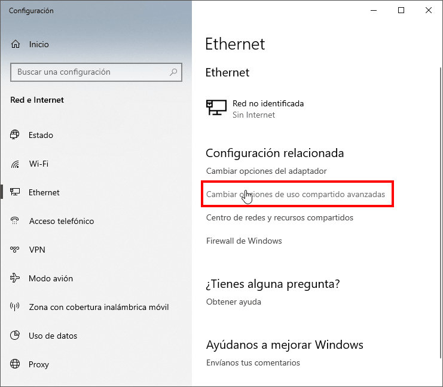](images/cambiar-las-opciones-de-uso-compartido.png)

Una vez dentro del panel de configuración de uso compartido activamos la totalidad de opciones de compartición y presionamos el botón Guardar cambios.

[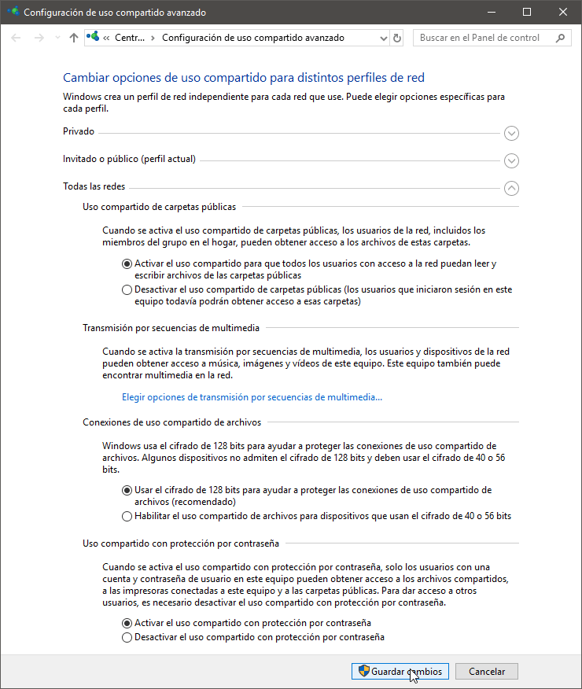](images/opciones-de-uso-compartido-seleccionadas.png)

**En el segundo de los equipos** repetimos la operación que acabamos de realizar en el primero de los equipos.

### Seleccionar la/s carpeta/s que queremos compartir entre los 2 equipos

En el ordenador con nombre (jcall\_pc) seleccionamos la carpeta de 10 GB que quiero copiar al otro ordenador. Seguidamente presionamos el botón derecho del ratón y cuando se despliegue el menú contextual clicamos en la opción Propiedades.

[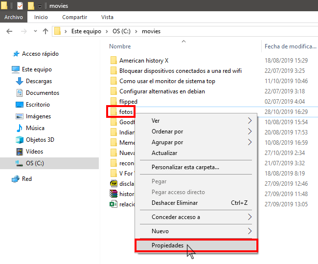](images/acceder-a-las-propiedades-carpeta-a-compartir.png)

A continuación clicamos en la pestaña **Compartir** y acto seguido en el botón Compartir...

[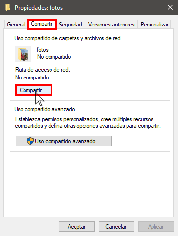](images/entrar-en-opciones-para-compartir-carpeta.png)

El siguiente paso consiste en seleccionar los usuarios con que queremos compartir la carpeta. En mi caso selecciono la opción **Todos** los usuarios y presiono el botón Agregar.

[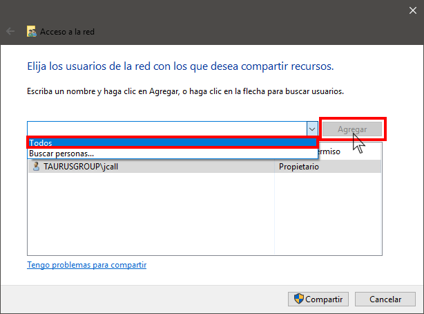](images/seleccionar-usuarios-que-pueden-ver-la-carpeta.png)

A continuación definimos los permisos que tendrán los usuarios que accedan a la carpeta compartida. En mi caso selecciono permisos de Lectura y escritura y seguidamente presiono el botón Compartir.

[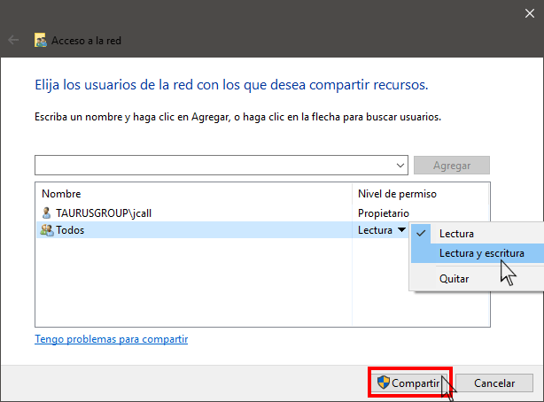](images/otorgar-permisos-a-los-usuarios.png)

Acto seguido recibiremos la confirmación que la carpeta se ha compartido de forma satisfactoria.

[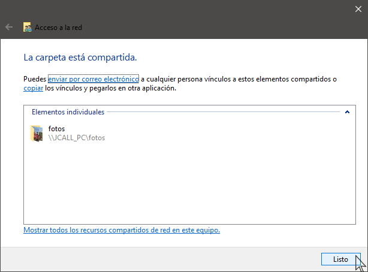](images/confirmacion-carpeta-compartida.png)

### Reiniciar los equipos

Para asegurar que los cambios se apliquen recomiendo que reiniciéis ambos ordenadores.

### Copiar los archivos de un ordenador a otro ordenador

Abrimos el gestor de archivos del ordenador en que queremos copiar todo el contenido que en mi caso es el (jc-win10-desktop). En la parte izquierda del gestor de archivos clicáis en la opción **Red** y al cabo de unos segundos os debería aparecer el nombre del otro ordenador que en mi caso es (jcall\_pc). En este momento clicáis encima del nombre del segundo ordenador.

[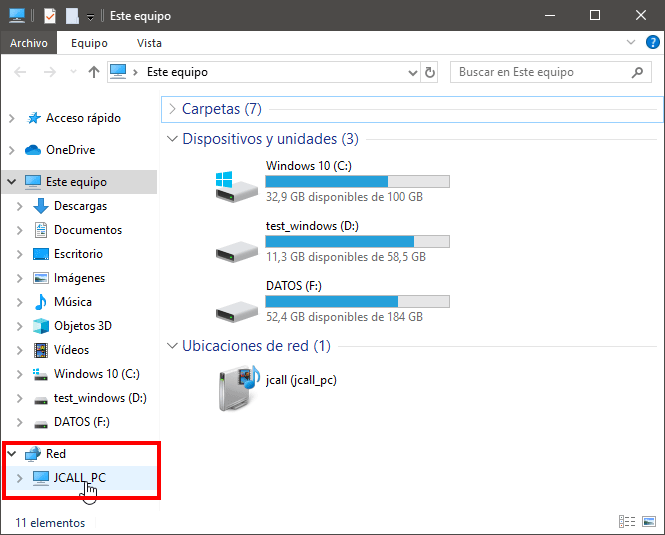](images/acceder-carpetas-compartidas-red.png)

Seguidamente deberéis introducir el usuario y la contraseña del ordenador al que nos queremos conectar y presionar el botón Aceptar.

[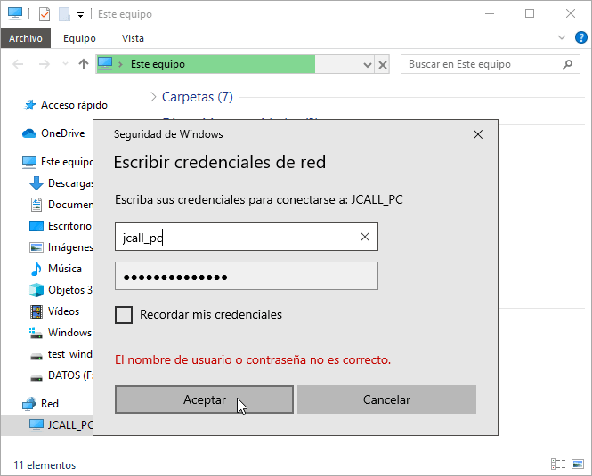](images/introducir-credenciales-acceder-carpetas-compartidas.png)

Una vez se haya producido la conexión podrán ver la totalidad de contenido que hemos Compartido anteriormente.

[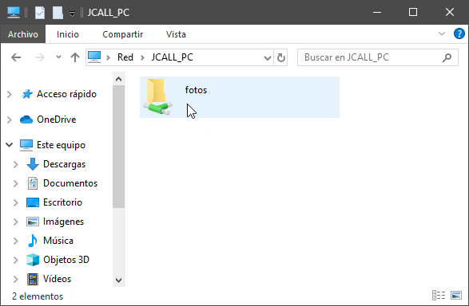](images/viendo-el-contenido-compartido.png)

En estos momentos tan solo tenemos que copiar la carpeta fotos que como hemos dicho anteriormente ocupaba 10 GB.

[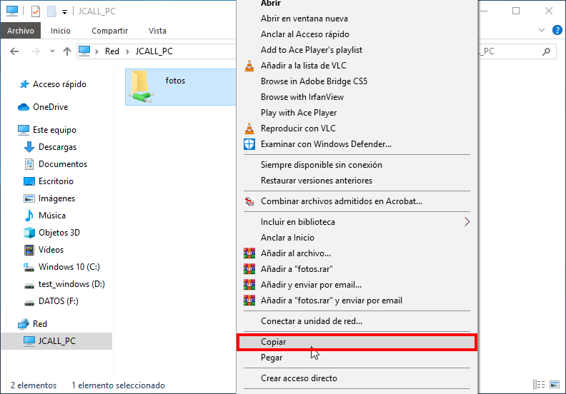](images/copiar-los-archivos-de-gran-tamaño.png)

A continuación navegamos en la ubicación donde queremos guardar las fotos y las pegamos:

[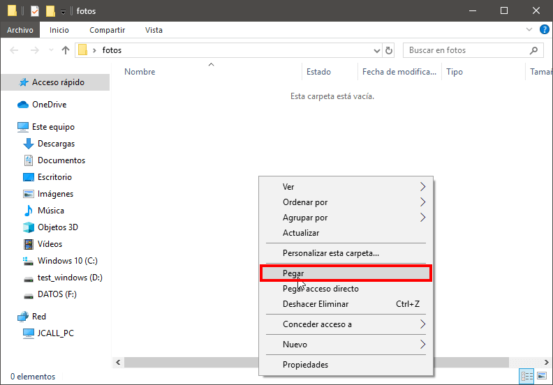](images/pegar-los-archivos-de-gran-tamaño.png)

Una vez realizados los pasos se procederá a copiar los archivos de un equipo a otro. La transmisión de datos será mucho más rápida y estable que en una conexión inalámbrica.

[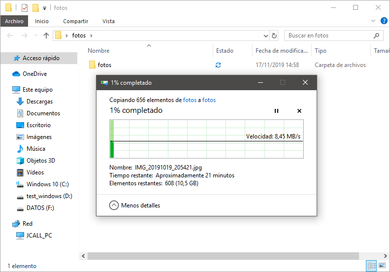](images/copiando-archivos-de-un-ordenador-a-otro.png)

## VENTAJAS DE COPIAR ARCHIVOS MEDIANTE EL CABLE ETHERNET

Las ventajas del método utilizado para copiar archivos de un ordenador a otro ordenador son las siguientes:

1. Sin duda es un proceso rápido ya que la velocidad de transmisión es de 10 MB/s. Si dispusiera una tarjeta de red de mayor calidad podría tranquilamente transferir el contenido a una velocidad de 100 MB/s.
2. Puedes realizar una transferencia sin tener que realizar ningún tipo de instalación. No es necesario que los equipos estén conectados en una red local.
3. El método de transmisión es directo. La información va directamente de un ordenador a otro ordenador sin que quede almacenada en un tercer dispositivo de almacenamiento.
4. La transferencia de información es estable y fiable. Si intentan transferir 10GB en una red inalámbrica es probable que se produzcan cortes.
5. No precisamos de conexión a Internet para realizar la transferencia.
