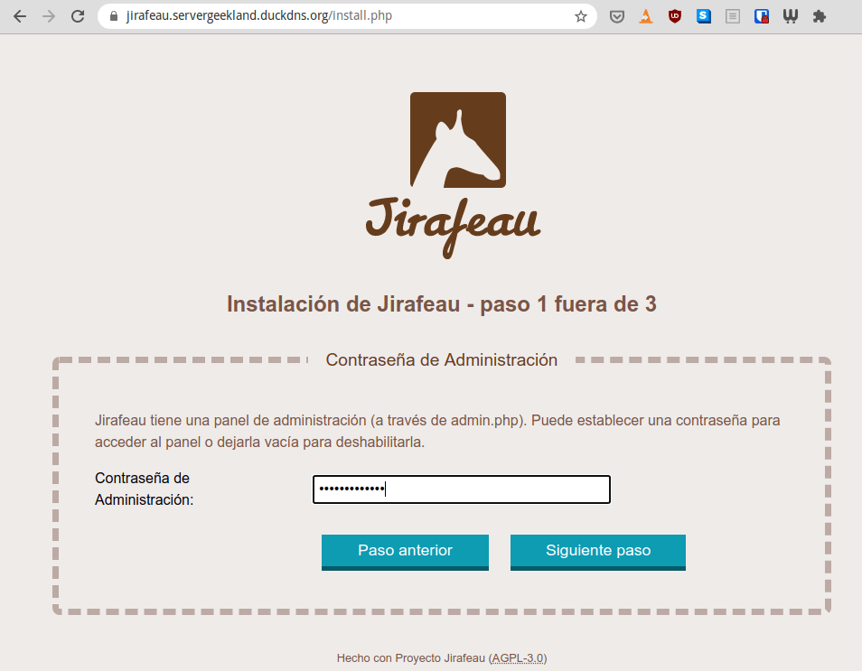
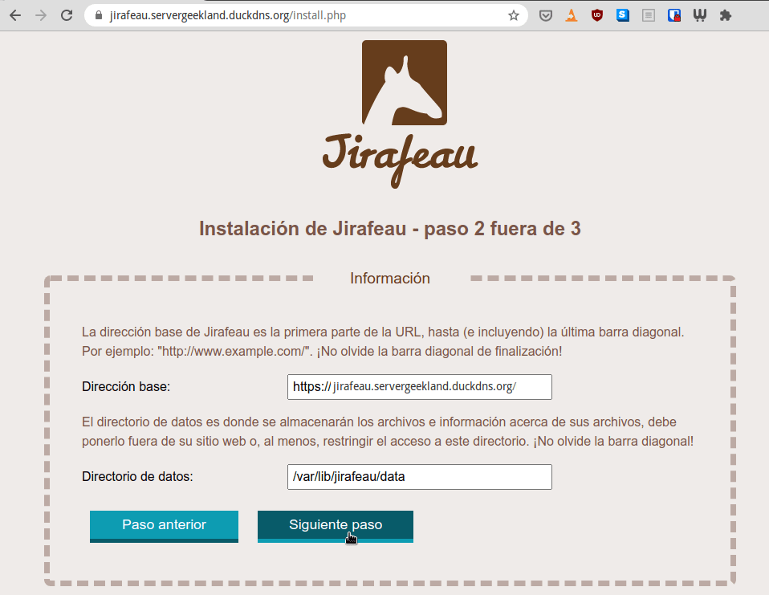
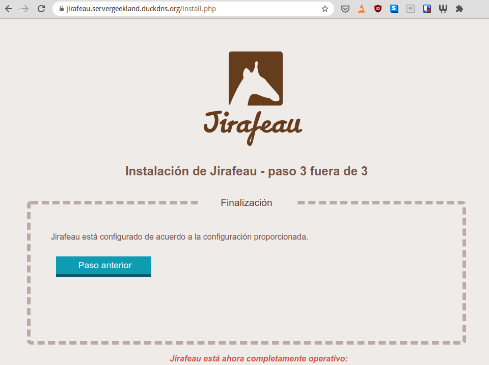
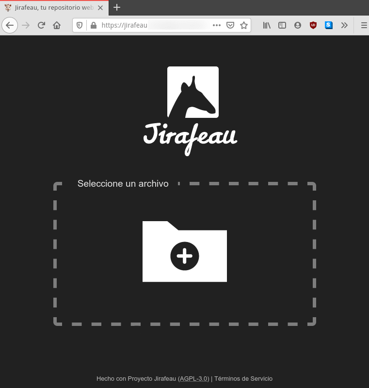
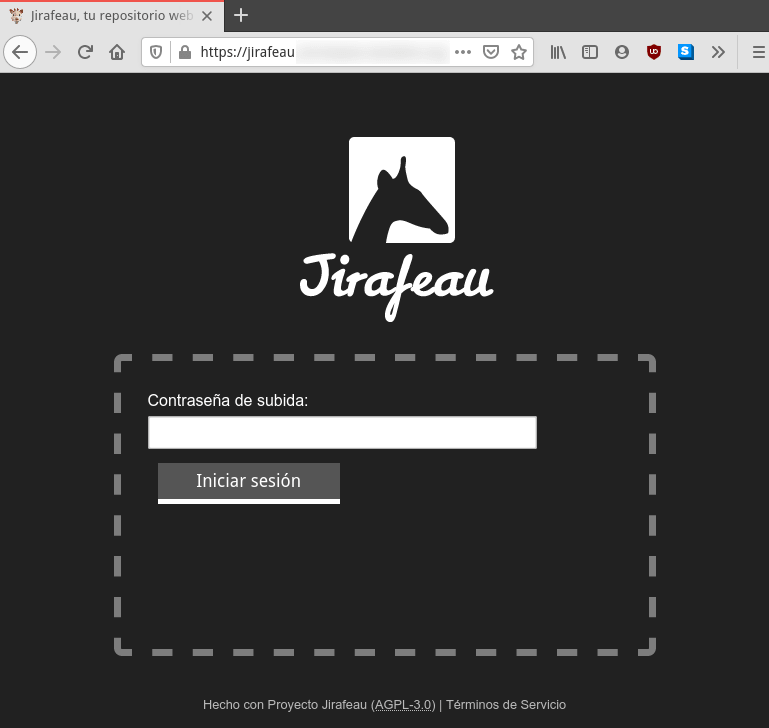
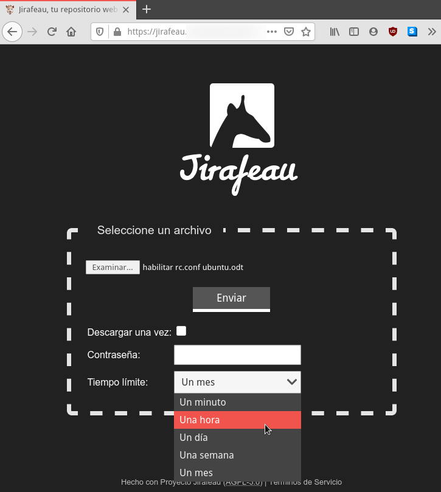
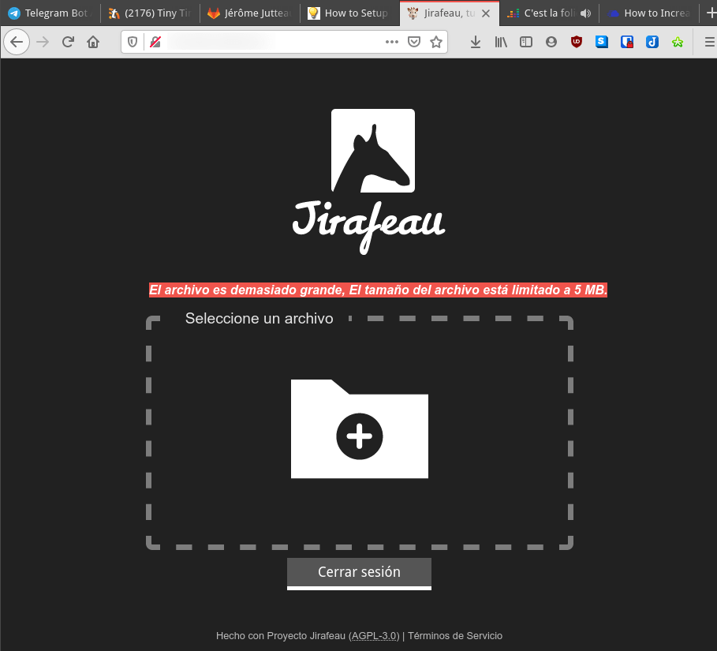
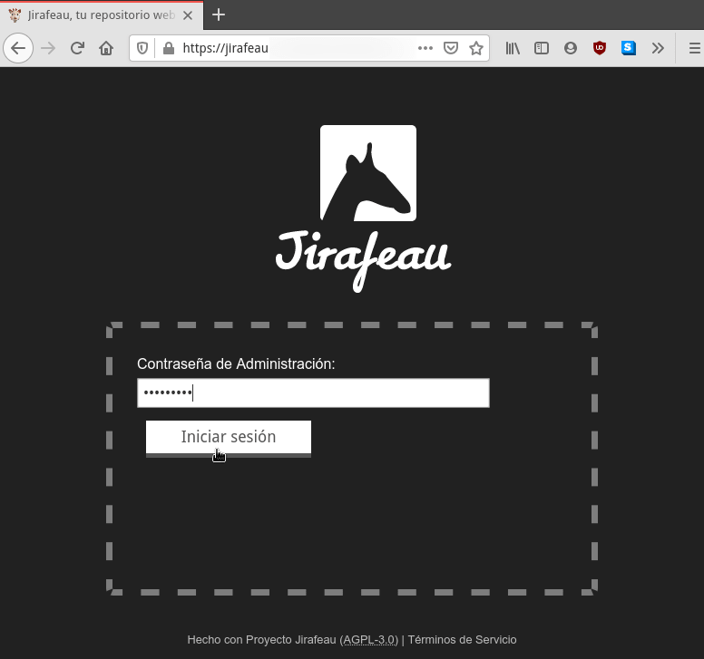

A continuación veremos como de forma sencilla podemos montar nuestro propio Wetransfer con Jirafeau y compartir archivos con nuestros contactos. Jirafeau es un software muy ligero que podremos instalar en cualquier servidor Linux y nos permitirá compartir ficheros e información con nuestros contactos. Para el funcionamiento de Jirafeau tan solo necesitaremos PHP y un servidor web ultraligero como Lighttpd. Por lo tanto será un servicio extremadamente liviano, rápido y además fácil de usar.<!--more-->

## CARACTERÍSTICAS DEL SOFTWARE PARA COMPARTIR ARCHIVOS JIRAFEAU

Con tan solo un par de clics Jirafeau nos permitirá compartir archivos con nuestros contactos de forma similar a como lo hace Wetransfer. Jirafeau nos ofrecerá las siguientes funcionalidades y nos permitirá realizar las siguientes acciones:

1. **Subir archivos de tamaño ilimitado**. Si queremos enviar un archivo de 10GB lo podremos hacer sin problema. En el caso que lo consideremos oportuno podremos limitar el tamaño de subida.
2. Configurar que la **información compartida con nuestros contactos se auto-destruya** después de la primera descarga. También podemos **definir que los links de compartición caduquen después de un determinado tiempo**.
3. Una vez subida la información Jirafeau nos proporcionará varios links. Ofrecerá un **link de descarga directa**, otro que nos llevará a la **página de descarga**, un tercer link para **previsualizar el contenido** en caso que sea posible y una **URL que nos permitirá eliminar el enlace de descarga**. Por ejemplo desde Jirafeuau podremos previsualizar archivos de imagen, de vídeo o audio.
4. **Establecer una contraseña de descarga**. De este modo solo podrá descargar la información quien tenga el link de descarga y además conozca una contraseña que definiremos en el momento de subir el contenido.
5. **Establecer una contraseña para subir contenido**. De este modo solo podrán usar el servicio las personas que sepan una contraseña que nosotros mismos podemos establecer en el fichero de configuración de Jirafeau.
6. **Detectar archivos duplicados** que se comparten con nuestros contactos. Si un día subimos un fichero y al cabo de una semana volvemos a subir el mismo fichero no se duplicará el contenido almacenado en nuestro servidor. Si se da el caso que acabo de citar tendremos un fichero almacenado en nuestro servidor y 2 links de descarga para descargar el mismo contenido.
7. Dispondremos de un **panel de administración para ver y gestionar la totalidad de contenido que estamos compartiendo**. Desde el panel de control podremos gestionar diversos aspectos del contenido compartido. Por ejemplo desactivar los enlaces de compartición, borrar el contenido que estamos compartiendo, descargar el contenido, etc.
8. Mediante Cron podemos **realizar un mantenimiento periódico y automático de Jirafeau**. Jirafeau dispone de scripts que mediante la ayuda de Cron permitirán eliminar contenidos que no tienen links de descarga activos en nuestro servidor.
9. Dispone de una **API para por ejemplo automatizar la compartición y descarga de contenido mediante scripts en bash**.
10. Permite **cifrar el contenido almacenado en la nube**.

## PREPARACIÓN PREVIA PARA LA INSTALACIÓN DE JIRAFEAU

En nuestro caso instalaremos la versión oficial de Jirafeau mediante Docker y haremos uso del proxy inverso Traefik. Para ello antes de iniciar la instalación de Jirafeau deberemos aplicar los siguientes pasos en nuestro servidor Linux.

### Instalar Docker y Docker-Compose

Para instalar Docker y Docker-Compose les recomiendo que sigan las instrucciones que les dejo en el siguiente enlace:

https://geekland.eu/instalar-docker-y-docker-compose-en-linux/

### Abrir los puertos 80 y 443 en el firewall del servidor y en el router

Tenemos que abrir los puertos 80 y 443 en nuestro router y en el servidor que contendrá los ficheros a compartir. Para abrir los puertos en nuestro servidor lo haremos usando ufw. Para ello ejecutaremos el siguiente comando para instalar ufw.

> **`sudo apt install ufw`**

Una vez instalado el servicio lo habilitaremos mediante el siguiente comando:

> ```shell
> sudo ufw enable
> ```

Para iniciar el firewall ejecutaremos el siguiente comando en la terminal:

> ```shell
> sudo service ufw start
> ```

Finalmente abriremos los puertos 80 y 443 del firewall ejecutando los siguientes comandos en la terminal:

> ```shell
> sudo ufw allow http
> sudo ufw allow https
> ```

En el caso que estén detrás de un Router recuerden que también tienen que abrir los puertos 80 y 443 en el router. Además las peticiones entrantes a los puertos 80 y 443 se deberán redirigir a la IP del equipo en que instalaremos Jirafeau y almacenará los archivos a compartir. No se detalla el procedimiento porque varia en función del modelo de Router que tengáis.

### Instalar y configurar el proxy inverso Traefik

Precisaremos disponer de un dominio y de un proxy inverso para poder instalar y usar Jirafeau de forma segura. Para conseguir lo que acabo de mencionar deben seguir las instrucciones que encontrarán en el siguiente enlace:

https://geekland.eu/instalar-y-configurar-el-proxy-inverso-traefik-en-docker/

Una vez finalizado el proceso de configuración tendremos instalado y configurado Traefik. Además dispondremos de un dominio que en mi caso es:

> ```
> servergeekland.duckdns.org
> ```

## INSTALAR Y CONFIGURAR EL SOFTWARE PARA COMPARTIR ARCHIVOS JIRAFEAU

En Docker Hub encontrarán varias imágenes de Jirafeau, pero únicamente para la arquitectura amd64. En mi caso quiero instalar Jirafeau en una Raspberry Pi, por lo tanto lo que haremos es construir nuestra propia imagen del siguiente modo.

### Definir y configurar las ubicaciones en que montaremos los volúmenes de persistencia

Inicialmente crearemos y configuraremos los directorios en que montaremos los volúmenes de persistencia. El proceso para crear volúmenes de persistencia no es fácil porque el Dockerfile no está hecho como debería y no hay ningún tipo de documentación. No obstante es importante tener los volúmenes de persistencia por los siguientes motivos:

1. Podremos realizar copias de seguridad de forma mucho más sencilla.
2. La actualización a nuevas versiones de Jirafeau será mucho más sencilla ya que podremos actualizar el programa sin perder información.

En mi caso quiero crear un volumen de persistencia para acceder a la información que estamos compartiendo. Este volumen de persistencia lo ubicaré en la siguiente ruta:

> ```shell
> /media/hd/services/jirafeau/data
> ```

El segundo volumen de persistencia corresponderá al fichero para definir la configuración de Jirafeau. Para ello en mi caso dentro de la ubicación `/media/hd/services/jirafeau/` crearé el fichero `config.local.php` ejecutando el siguiente comando a la terminal:

> ```shell
> touch /media/hd/services/jirafeau/config.local.php
> ```

Finalmente el directorio `/media/hd/services/jirafeau/data` y el fichero `/media/hd/services/jirafeau/config.local.php` tienen que pertenecer al usuario y al grupo `www-data`. Por lo tanto en mi caso ejecutaré los siguientes comandos:

> ```shell
> sudo chown 82:82 -R /media/hd/services/jirafeau/data
> ```
> 
> ```shell
> sudo chown 82:82 /media/hd/services/jirafeau/config.local.php
> ```

### Crear la imagen de Jirafeau para compartir archivos con nuestros contactos

A continuación descargaremos todo lo necesario para construir nuestra imagen ejecutando el siguiente comando en la terminal:

> ```shell
> git clone https://gitlab.com/mojo42/Jirafeau.git
> ```

Seguidamente accederemos dentro del directorio que acabamos de descargar mediante el siguiente comando:

> ```shell
> cd Jirafeau
> ```

Finalmente ejecutaremos el siguiente comando para crear la imagen:

> ```shell
> docker build -t mojo42/jirafeau:latest .
> ```

Una vez ejecutado el comando tendremos la imagen creada en nuestro equipo. La imagen se habrá realizado mediante el Dockerfile oficial del [desarrollador de Jirafeau](https://gitlab.com/mojo42/Jirafeau "Web de desarrollo de Jirafeau").

### Levantar el contenedor de Jirafeau

En estos momentos ya podemos levantar el contenedor de Jirafeau. Para levantar el contenedor procederemos del siguiente modo. Inicialmente ejecutaremos el siguiente comando:

> ```shell
> nano docker-compose.yml
> ```

Una vez se abra el editor de textos pegaremos el siguiente código:

> ```shell
> version: '3'
> 
> services:
> 
>   jirafeau:
>     image: mojo42/jirafeau
>     container_name: jirafeau
>     restart: unless-stopped
>     
>     ports:
>       - "8000:80"
>     
>     volumes:
>       - /media/hd/services/jirafeau/config.local.php:/www/lib/config.local.php
>       - /media/hd/services/jirafeau/data:/var/lib/jirafeau/data
> 
>     networks:
>       - web
> 
>     labels:
>       - traefik.backend=jirafeau
>       - traefik.frontend.rule=Host:jirafeau.servergeekland.duckdns.org
>       - traefik.docker.network=web
>       - traefik.port=80
>       - traefik.enable=true
> 
> networks:
>   web:
>     external: true
> ```

Si han seguido al pie de la letra las instrucciones de este tutorial tan solo tendrán que modificar las partes de color azul del docker-compose:

- `/media/hd/services/jirafeau/`: Sustituir esta ruta por la que vosotros hayáis definido para ubicar el archivo de configuración de Jirafeau.
- `/media/hd/services/jirafeau/data`: Reemplazar la ruta del ejemplo por la ruta en que hayáis decidido ubicar los datos que los clientes compartirán mediante el software Jirafeau.
- `jirafeau.servergeekland.duckdns.org`: Tan solo tenemos que escribir `jirafeau.` seguido del nombre de dominio que tengáis en vuestro caso.

Una vez listo el docker-compose guardamos los cambios y cerramos el fichero. Para crear y levantar el contenedor tan solo tendremos que ejecutar el siguiente comando:

```shell
docker-compose up -d
```

Una vez ejecutado el comando se creará y levantará el contenedor. Por lo tanto a partir de estos momentos ya podemos usar Jirafeau.

## INICIAR EL SOFTWARE PARA COMPARTIR ARCHIVOS JIRAFEAU Y APLICAR LA CONFIGURACIÓN INICIAL BÁSICA

Abrimos nuestro navegador e ingresamos el dominio que definimos para acceder a nuestro servicio. Una vez hayan accedido dentro de Jirafeau tendrán que definir una contraseña segura para poder acceder al panel de administración de Jirafeau. Una vez definida presionen al botón `Siguiente paso`.

[](images/definir-la-contraseña-del-administrador.png)

En el paso número 2 tienen que definir el dominio y la ubicación dentro del contenedor en que se guardarán los datos que los usuarios quieran compartir. Respecto el dominio aseguren que empieza por https. En cuanto al directorio de datos tiene que usar `/var/lib/jirafeau/data` porque así lo definimos en el momento de crear los volúmenes de persistencia. Una vez hayan cumplimentado correctamente todos los campos presionen sobre el botón `Siguiente paso`.

[](images/definir-almacenamiento-datos-y-dominio.png)

Finalmente nos saldrá la siguiente pantalla en que simplemente se nos confirmará que se ha realizado la configuración con éxito.

[](images/configuracion-inicial-jirafeau-finalizada.png)

## CONFIGURAR JIRAFEAU Y ADAPTARLO A NUESTRAS NECESIDADES

En estos momentos Jirafeau está configurado y es plenamente funcional. No obstante recomiendo acceder a su archivo de configuración para adaptarlo más a nuestras necesidades. Para ello tan solo tienen que ejecutar el siguiente comando:

> ```shell
> sudo nano /media/hd/services/jirafeau/config.local.php
> ```

Una vez se abra el editor de texto podrán realizar las siguientes acciones modificando el archivo de configuración.

### Cambiar el tema de Jirafeau

Existen varios temas para personalizar Jirafeau. Más concretamente existentes los siguientes:

> ```shell
> courgette       dark-courgette  elegantish      industrial      jyraphe         modern
> ```

Para cambiar el tema predeterminado tan solo tienen que buscar la siguiente línea en el fichero de configuración:

> ```shell
>   'style' => 'courgette',
> ```

Una vez la hayamos encontrado reemplazamos `courgette` por el nombre del tema que queramos aplicar. Por lo tanto para aplicar el tema `dark-courgette` la línea quedará del siguiente modo:

> ```shell
>   'style' => 'dark-courgette',
> ```

Si guardamos los cambios y accedemos de nuevo a Jirafeau veremos que el nuevo tema ya se ha aplicado.

[](images/tema-dark-courgette-jirafeau.png)

### Hacer que únicamente usuarios autorizados puedan compartir archivos

Por defecto todo el mundo que acceda a Jirafeau podrá subir y compartir archivos. Si queremos que tan solo los usuarios autorizados puedan compartir información tendremos que localizar lass siguientes líneas en el fichero de configuración:

>   **`'upload_password' =>   array (   ),`**

Una vez halladas, dentro de los paréntesis escribiremos la contraseña que todo usuario deberá introducir para poder usar el servicio de compartición de archivos. En mi caso he introducido la contraseña `contrasena` del siguiente modo:

> ```shell
>   'upload_password' =>
>   array (
>   'contrasena'
>   ),
> ```

Si guardamos los cambios en el archivo de configuración, la próxima vez que accedamos a Jirafeau tendremos que introducir una contraseña para poder compartir nuestros archivos.

[](images/introducir-contraseña-subir-archivos-jirafeau.png)

**Nota:** La contraseña estará definida en texto plano. Si lo precisamos podemos usar herramientas como htpasswd para ocultar la contraseña.

También podemos definir una IP o una lista de IP desde las cuales se pueda usar Jirafeau y compartir archivos sin tener que introducir ninguna contraseña. Para ello deberán localizar y modificar las siguientes líneas:

> ```shell
>  'upload_ip_nopassword' => 
>   array (
>   ),
> ```

### Configurar el tiempo de validez de los links

De forma predetermina los links generados tendrán una validez de un mes. Si queremos modificar este parámetro tendremos que localizar la siguiente línea en el fichero de configuración:

> ```shell
>   'availability_default' => 'month',
> ```

Una vez encontrada tendréis que reemplazar `month` por el período de tiempo que consideren oportuno. Los valores que podéis introducir son los siguientes:

- `minute`
- `hour`
- `day`
- `week`
- `quarter`
- `year`
- `none`

En mi caso quiero que los links solo sean válidos durante una semana. Por lo tanto tendremos que modificar el parámetro `month` por `week`:

> ```shell
>   'availability_default' => 'week',
> ```

Una vez realizadas las modificaciones guardamos los cambios y cerramos el fichero. Si en el momento de subir el archivo no modifican la opción de duración de los links entonces solo serán válidos una semana.

### Añadir más opciones de tiempo para definir la validez de los links que sirven para compartir archivos

En el momento que queramos subir un fichero podemos definir el período de validez de los links que se crearán para compartir el contenido. Las opciones por defecto son las siguientes:

[](images/seleccionar-periodo-validez-links.png)

Si quieren que aparezcan más opciones tendrán que localizar el siguiente código en el fichero de configuración.

> ```shell
>   array (
>     'minute' => true,
>     'hour' => true,
>     'day' => true,
>     'week' => true,
>     'month' => true,
>     'quarter' => false,
>     'year' => false,
>     'none' => false,
>   ),
> ```

Una vez hallado modificando los valores de `true` y `false` podrán añadir o quitar las opciones de límite de tiempo que quieren que aparezcan en el menú desplegable.

### Restringir el tamaño de subida máximo

Si habéis seguido las instrucciones del artículo no hay ningún tipo de límite de subida. Si queremos incluso podemos compartir archivos de 40GB. En el caso que queramos establecer un límite tendremos que hallar la siguiente línea en el fichero de configuración:

> ```shell
>   'maximal_upload_size' => 0,
> ```

Una vez hallada la línea reemplazan el número `0` por un número que indique el tamaño máximo de subida en megas. En mi caso a modo de ejemplo he definido `5`.

> ```shell
>   'maximal_upload_size' => 5,
> ```

Una vez guardados los cambios en el fichero de configuración no podremos compartir archivos que pesen más de 5MB.

[](images/advertencia-de-tamaño-máximo-superado.png)

### Automatizar la limpieza de contenido cuando un link ha expirado

Cuando los links caducan la información seguirá quedando almacenada en nuestro servidor. Para borrar definitivamente el contenido del servidor tienen 2 opciones:

1. Eliminar el contenido des del panel de administración.
2. Automatizar la eliminación del contenido mediante cron.

En nuestro caso automatizaremos el proceso mediante cron. Para ello ejecutaremos el siguiente comando para acceder dentro del contenedor en que se ejecuta Jirafeau:

> ```shell
> docker exec -it jirafeau sh
> ```

Una vez dentro del contenedor ejecutamos el siguiente comando:

> **`crontab -e`**

Cuando se abra el editor de textos pegaremos el siguiente código:

> ```shell
> # m h dom mon dow user  command
> 12 3    * * *   www-data  php /www/admin.php clean_expired
> 16 3    * * *   www-data  php /www/admin.php clean_async
> ```

Una vez introducidos los cambios los guardaremos y cerraremos el fichero. A partir de estos momentos todos los días a las 3:12 y 3:16 se realizarán las siguientes acciones:

1. Se borrará todo el contenido cuyos links de compartición estén caducados.
2. Si ha quedado contenido a medio subir o a medio descargar también se borrará.

### Acceder a la interfaz de administración

Si quieren acceder al panel de administración tan solo tienen que abrir un navegador y teclear la URL de acceso al servicio seguido de `/admin.php`. Por lo tanto en mi caso accederé al panel de administración usando la URL `https://jirafeau.servergeekland.duckdns.org/admin.php` en el navegador. Una vez hayan ingresado en la URL tendrán que introducir la contraseña que se definió en pasos anteriores para poder acceder al panel de administración.

[](images/acceder-a-la-interfaz-de-administracion.png)

Una vez dentro del panel de administración podrán:

1. Eliminar o dejar sin validez los enlaces de compartición.
2. Listar y descargar los ficheros que están subidos al servidor web.
3. Listar los archivos cuyo link de compartición está caducado.
4. Eliminar ficheros cuyo link de compartición ha caducado.
5. etc.

### Cifrar el contenido que se almacena en el servidor y que está a la espera de ser compartido

La versión Docker estable de Jirefeau no viene configurada para cifrar el contenido que almacenamos en el servidor. Aunque activemos el cifrado en la configuración no funcionará porque el contenedor no tiene instalado el módulo de PHP mcrypt.

**Nota**: Por lo que he visto en Gitlab, las versiones futuras de Jirafeau si traerán instalado el módulo mcrypt de serie.

Para instalar el módulo accederemos dentro del contenedor ejecutando el siguiente comando en la terminal:

> ```shell
> docker exec -it jirafeau sh
> ```

Una vez dentro del contenedor actualizaremos los repositorios de Alpine mediante el siguiente comando:

> ```shell
> apk update
> ```

A continuación instalaremos el módulo de PHP php7-mcrypt mediante el siguiente comando:

> ```shell
> apk add php7-mcrypt
> ```

Seguidamente accederemos a la ubicación `/usr/local/etc/php/conf.d/` mediante el siguiente comando:

> ```shell
> cd /usr/local/etc/php/conf.d/
> ```

Una vez dentro de la ubicación ejecutaremos el siguiente comando:

> **`vi mcrypt.ini`**

Cuando se abra el editor de textos vi pegaremos el siguiente código para activar el módulo:

> ```shell
> extension=/usr/lib/php7/modules/mcrypt.so
> ```

Una vez pegado el código guardaremos los cambios y cerraremos el fichero. Acto seguido podemos ejecutar el siguiente comando para comprobar que hemos activado el módulo mcrypt.

> ```shell
> php -m
> ```

Para borrar la cache de paquetes de apk y dejar un contenedor más ligero ejecutaremos el siguiente comando en la terminal:

> ```shell
> rm -f /var/cache/apk/*
> ```

Seguidamente saldremos del contenedor ejecutando el siguiente comando:

> **`exit`**

Finalmente accederemos al fichero de configuración que como ya sabemos en mi caso está ubicado en `/media/hd/services/jirafeau/config.local.php`. Una vez dentro localizamos la siguiente línea:

> ```shell
>   'enable_crypt' => false,
> ```

Una vez encontrada cambiamos su valor de false a true.

> ```shell
>   'enable_crypt' => true,
> ```

Guardamos los cambios y cerramos el fichero. A partir de estos momentos todo el contenido que subamos a Jirafeau para compartir con terceros estará cifrado. En el momento que un usuario se descargue el contenido que está cifrado se descifrará al vuelo mientras se descarga el fichero. Por lo tanto si usáis la función de cifrado habrá una carga extra de CPU y el funcionamiento de Jirafeau será más lento. Además al cifrar el contenido Jirafeau no será capaz de detectar los ficheros duplicado subidos al servidor.

### Modificar el texto de las condiciones de servicio

Si nuestra compañía pretende dar un servicio a un tercero puede modificar las condiciones de servicio del programa para introducir su nombre y datos de contacto. Para ello dentro del archivo de configuración deberán localizar las siguientes líneas:

> ```shell
>   'organisation' => 'ACME',
>   'contactperson' => '',
>   'title' => '',
> ```

Una vez localizadas tan solo tienen que modificarlas para introducir la información que aplique en su caso. Por ejemplo en mi caso podría usar:

> ```shell
>   'organisation' => 'GEEKLAND',
>   'contactperson' => 'Joan <mi_email>',
>   'title' => 'Terminos de servcio GEEKLAND',
> ```

Una vez introducidos los cambios los guardan. Para ver los resultados obtenidos tan solo tienen que visitar la URL `https://jirafeau.servergeekland.duckdns.org/tos.php`y acto seguido podrán ver leer los términos de servicio.

**Nota:** Si quieren modificar más aspectos de los términos de servicio pueden acceder dentro del contenedor de Docker y modificar el contenido del fichero `/www/lib/tos.original.txt`

**Nota**: El fichero de configuración contiene otras opciones simples de configurar como por ejemplo deshabilitar la vista previa del contenido, modificar la ubicación donde se almacenan los datos, etc.

## OPINIÓN Y EXPERIENCIA QUE HE TENIDO AL COMPARTIR ARCHIVOS CON JIRAFEAU

El software es realmente útil y funciona. Es muy intuitivo, fácil de usar y tiene bastantes opciones de configuración. Además mediante Docker es muy sencillo ponerlo en marcha y empezar a compartir archivos.

Se trata de un proyecto interesante que espero que siga adelante mejorando las funcionalidades existentes e implementando de nuevas como por ejemplo podría ser la subida multifichero. En mi caso he observado que al compartir ficheros de gran tamaño, como por ejemplo ficheros 2GB, le cuesta iniciar la descarga de los ficheros. Por ejemplo al clicar al link de descarga hay que esperar como unos 30 segundos antes que empiece la descarga de los archivos. Una vez iniciada la descarga la velocidad es alta y funciona perfecto, pero no debería existir un lapso de tiempo tan grande entre el momento que das click al botón de descarga y se inicia la descarga.
