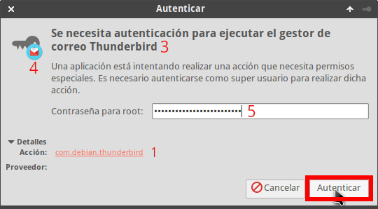

En pasados artículos comentamos que con el [comando pkexec]() podemos ejecutar cualquier comando y/o aplicación gráfica como si fuéramos otro usuario. Con el fin de controlar lo que un usuario puede realizar con el comando pkexec aprenderemos a realizar un acción de PolicyKit. No obstante, antes de iniciar la explicación es interesante que conozcan a grandes rasgos que es PolicyKit.<!--more-->

## ¿QUÉ ES POLICYKIT?

Es una herramienta para controlar los privilegios en sistemas operativos basados en Unix como por ejemplo GNU-Linux.

PolicyKit proporciona las herramientas necesarias para que procesos sin privilegios puedan comunicarse con procesos privilegiados. De este modo podemos proporcionar los permisos necesarios a un usuario determinado para por ejemplo:

1. Hibernar o cerrar un equipo.
2. Ejecutar programas con permisos de administrador.
3. Montar y desmontar dispositivos de almacenamiento como discos duros, dispositivos USB, etc.
4. Modificar y definir las configuraciones de red.
5. Limitar o permitir la instalación de programas.
6. Etc.

La forma en que PolicyKit determina los procesos que pueden comunicarse entre ellos es mediante acciones y reglas. Antes de iniciarse un programa o comando se comprobarán las acciones y reglas definidas para confirmar que tenemos los permisos necesarios.

## LISTAR LAS ACCIONES DE POLICYKIT DISPONIBLES

Al instalar nuestro sistema operativo disponemos de un conjunto de acciones de PolicyKit predefinidas. Para visualizar su nombre tan solo tienen que ejecutar el siguiente comando en la terminal:

> ```
> pkaction
> ```

###### Nota: La totalidad de acciones de PolicyKit se almacenan en la ubicación /usr/share/polkit-1/actions/.

###### Nota: La totalidad de acciones disponibles dependerá de los paquetes que tengamos instalados, del entorno de escritorio que usemos, de las acciones que hayamos creado, etc.

La totalidad de acciones que empiezan por org.freedesktop.\* se aplican en la totalidad de entornos de escritorio.

Las acciones que empiezan por org.gnome.\* , org.xfce\*, etc. hacen referencia a entornos de escritorio específicos como por ejemplo Gnome, Xfce, Plasma, etc.

Finalmente, las acciones que empiezan por com.ubuntu.\* o por com.debian.\*, org.archlinux\*, etc hacen referencia a programas específicos.

## CREAR UN ACCIÓN DE POLICYKIT PARA ABRIR UNA APLICACIÓN GRÁFICA COMO USUARIO ROOT

PolicyKit no permite que ningún usuario inicie una aplicación gráfica como si fuera otro usuario. Para modificar este comportamiento podemos crear una acción. A modo de ejemplo crearemos una acción para poder abrir el gestor de correo Thunderbird como si fuéramos el usuario root.

Inicialmente accedemos a la ruta donde se hallan todas las acciones de PolicyKit ejecutando el siguiente comando en la terminal:

> ```
> cd /usr/share/polkit-1/actions/
> ```

Al tratarse de una acción para Thunderbird creamos un archivo con el nombre org.debian.thunderbird.policy. Para ello ejecutamos el siguiente comando en la terminal:

> ```
> sudo nano com.debian.thunderbird.policy
> ```

Cuando se abra el editor de textos pegamos el siguiente código:

| <?xml version="1.0" encoding="UTF-8"?> <!DOCTYPE policyconfig PUBLIC "-//freedesktop//DTD PolicyKit Policy Configuration 1.0//EN" "http://www.freedesktop.org/standards/PolicyKit/1/policyconfig.dtd"> <policyconfig><action id="com.debian.thunderbird"> <description xml:lang="es">Ejecutar Thunderbird como root</description> <message xml:lang="es">Se necesita autenticación para ejecutar el gestor de correo Thunderbird</message> <icon\_name>evolution</icon\_name> <defaults> <allow\_any>no</allow\_any\> <allow\_inactive>auth\_admin</allow\_inactive> <allow\_active>auth\_admin</allow\_active> </defaults> <annotate key="org.freedesktop.policykit.exec.path">/usr/bin/thunderbird</annotate> <annotate key="org.freedesktop.policykit.exec.allow\_gui">true</annotate> </action></policyconfig> |
| :-- |

Una vez pegado el código guardamos los cambios y cerramos el fichero.

###### Nota: En el caso que queráis modificar el código para abrir otra aplicación como usuario root, tan solo hay que modificar el código que está en rojo.

En el siguiente apartado comentamos como se ha generado el código para crear la acción de PolicyKit.

## EXPLICACIÓN DE COMO SE HA GENERADO EL CÓDIGO DE LA ACCIÓN DE POLICYKIT

El contenido entre <action id="com.debian.thunderbird"> y </action> se usa para definir la acción. La totalidad de este código se enviará a D-Bus para comprobar si un usuario determinado tiene permisos para ejecutar Thunderbird como otro usuario.

### 1- Definir el nombre de la acción y comando enviado a D-Bus

Inicialmente tenemos que definir el nombre de la acción y del comando enviado a D-Bus. Podemos usar cualquier nombre pero en mi caso uso el mismo nombre del archivo que contiene la acción. Por lo tanto, en mi caso uso el siguiente código:

> ```
> <action id="com.debian.thunderbird">
> ```

### 2- Descripción de lo que va a realizar nuestra acción

El código contenido entre <description xml:lang="es"> y </description> tiene la utilidad de incluir la descripción del comportamiento de la acción. La descripción en mi caso quiero que sea Ejecutar Thunderbird como root, Por lo tanto el código a usar es el siguiente:

> ```
> <description xml:lang="es">Ejecutar Thunderbird como root</description>
> ```

### 3- Establecer el mensaje para que el usuario se autentique

El código entre las etiquetas <message xml:lang="es"> y </message> sirve para dar instrucciones al usuario en el momento que aparece la ventana para autenticarse. En el momento que aparece la ventana de autenticación quiero transmitir el siguiente mensaje:

> ```
> Se necesita autenticación para ejecutar el gestor de correo Thunderbird
> ```

Por lo tanto tengo que usar el siguiente código:

> ```
> <message xml:lang="es">Se necesita autenticación para ejecutar el gestor de correo Thunderbird</message>
> ```

#### 4- Definir el icono asociado con la aplicación que ejecutamos

Entre las etiquetas <icon> y </icon> tenemos que indicar el nombre del icono que queremos que aparezca en la ventana de autenticación. En mi caso quiero que se muestre el icono evolution. Por lo tanto uso el siguiente código:

> ```
> <icon_name>evolution</icon_name>
> ```

###### Nota: La gran mayoría de icono están ubicados en /usr/share/icons

### 5- Establecer el tipo autenticación que tiene que introducir el usuario

El código contenido entre <defaults> y </defaults> define la contraseña de autenticación que tienen que usar los usuarios remotos y activos.

Cada de una de las etiquetas contenidas dentro de la etiqueta defaults tiene la siguiente función:

- allow\_active: Indicar el tipo de contraseña que tienen que introducir los usuarios activos que intentan iniciar una aplicación como si fueran otro usuario.
- allow\_inactive: Establecer el tipo de contraseña que tienen que usar los usuarios remotos que inician una aplicación como si fueran otro usuario. Los usuarios remotos estarán conectados vía SSH, VNC, Telnet, etc.
- allow\_any: Hace referencia tanto a los usuarios activos como los usuarios inactivos o remotos.

A cada tipo de usuario le podemos otorgar las siguientes opciones de autenticación:

| **Valor** | **Significado** |
| :-- | :-- |
| no | No se les concede permisos a los usuarios activos y/o inactivos. |
| yes | Los usuarios activos e inactivos pueden ejecutar la acción sin necesidad de introducir ningún password. |
| auth\_self | El usuario activo y/o inactivo podrá ejecutar la acción siempre y cuando introduzca correctamente su contraseña de usuario. |
| auth\_admin | El usuario activo y/o inactivo podrá ejecutar la acción después de introducir la contraseña del usuario root. |
| auth\_self\_keep | Tiene el mismo efecto que auth\_self. La diferencia es que asignamos auth\_self\_keep, el password introducido será recordado durante varios minutos. De esto modo un usuario podrá ejecutar la misma acción varias veces sin que tenga que volver a introducir la contraseña de nuevo. |
| auth\_admin\_keep | Tiene el mismo efecto que auth\_admin. La diferencia es que asignamos auth\_admin\_keep, el password del usuario root introducido será recordado durante varios minutos. De esto modo un usuario podrá ejecutar la misma acción varias veces sin que tenga que volver a introducir la contraseña del usuario root cada vez que ejecute la acción. |

En mi caso quiero que los usuarios activos e inactivos tengan que introducir la contraseña del usuario root cada vez que inicien Thunderbird como si fueran otro usuario. Por lo tanto uso el siguiente código:

> ```
> <allow_any>no</allow_any>
> <allow_inactive>auth_admin</allow_inactive>
> <allow_active>auth_admin</allow_active>
> ```

### 6- Indicar el programa que queremos ejecutar

A continuación tenemos que indicar el archivo binario que queremos ejecutar. En mi caso quiero ejecutar Thunderbird. Como la ruta del binario de Thunberbird es /usr/bin/thunderbird utilizo el siguiente código:

> ```
> <annotate key="org.freedesktop.policykit.exec.path">/usr/bin/thunderbird</annotate>
> ```

La totalidad de archivos binarios se hallan en las siguientes ubicaciones:

1. usr/bin
2. usr/sbin

### 7- Indicar si damos permiso para que se pueda ejecutar gráficamente un programa

Para que un usuario pueda iniciar Thunderbird como otro usuario necesita usar el servidor gráfico. Con el siguiente código daremos los permisos necesarios para que se pueda iniciar el entorno gráfico:

> ```
> <annotate key="org.freedesktop.policykit.exec.allow_gui">true</annotate>
> ```

Con el valor true permitimos que un usuario debidamente autorizado pueda ejecutar aplicación gráficas como si fuera otro usuario. Si no le quisiéramos dar permisos cambiaríamos el valor true for false.

## EJECUTAR THUNDERBIRD COMO SI FUÉRAMOS OTRO USUARIO

Una vez finalizada la acción el trabajo está hecho. Para que un usuario llamado fernando arranque thunderbird como si fuera el usuario joan tan solo tenemos que ejecutar el siguiente comando:

> ```
> pkexec --user joan thunderbird
> ```

Una vez ejecutado el comando aparecerá la siguiente ventana:

[](images/autenticacion-abrir-aplicacion-como-otro-usuario.png)

Como pueden ver, en la captura de pantalla aparecen gran parte de elementos que definimos en la acción. Ahora tan solo tenemos que introducir la contraseña de administrador y presionar Enter. Acto seguida se abrirá Thunderbird como si fuéramos el usuario joan.

En el caso que quisiéramos arrancar Thunderbird como si fuéramos el usuario root, tan solo tendríamos que ejecutar el siguiente comando:

> ```
> pkexec thunderbird
> ```

###### Nota: Si no especificamos ningún usuario, pkexec abre y ejecuta las aplicaciones como si fuéramos el usuario root.
