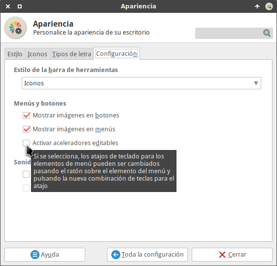
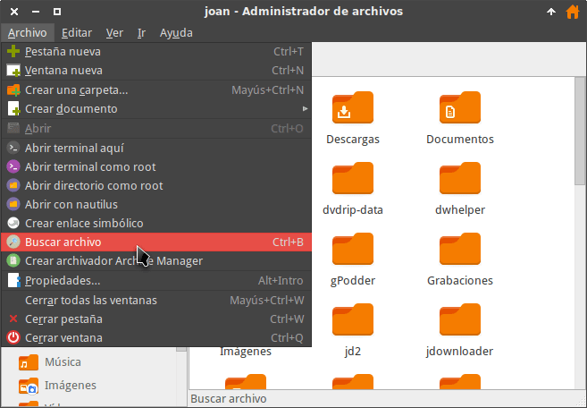
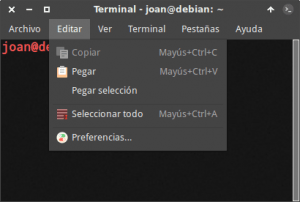
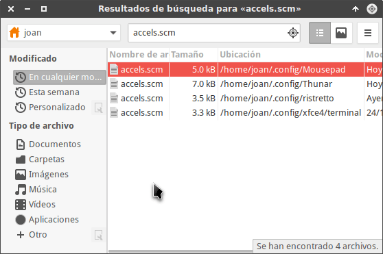
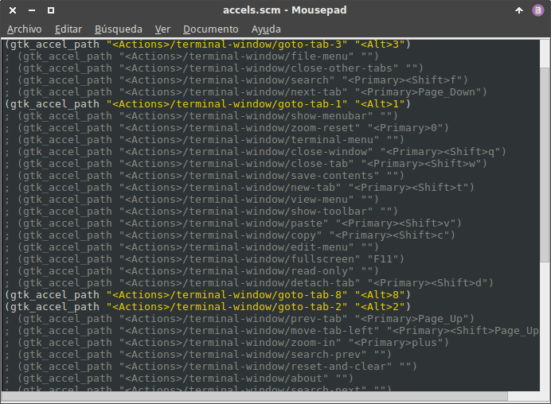
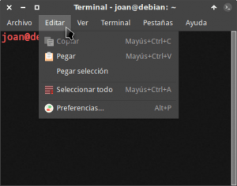
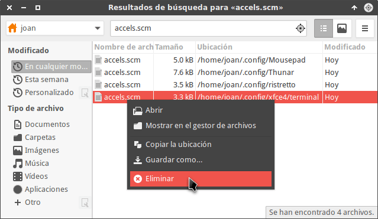

En ocasiones para realizar una tarea tenemos que acceder a un menú y clicar encima de una de sus opciones. Este proceso es lento y muchos usuarios preferirían ejecutar la tarea con un simple atajo de teclado. Si somos usuarios del entorno de escritorio XFCE estamos de suerte porque podremos modificar o crear atajos de teclado a la totalidad de los elementos de los menús que aparecen en determinados programas.<!--more-->

## ¿QUÉ PROGRAMAS NOS PERMITEN CREAR ATAJOS DE TECLADO A LOS ELEMENTOS DE SU MENÚ?

Los programas que en principio permiten crear atajos de teclado a cualquiera de los elementos que aparecen en su menú son los siguientes:

1. Thunar
2. Xfce4-terminal
3. Ristretto
4. Mousepad

Los programas que acabamos de citar deben usar librerías GTK2. En el caso que alguno de los programas citados usara librerías GTK3, deberíamos emplear un método distinto al que explicaré a continuación.

Para saber si un programa utiliza librerías GTK2 o GTK3 pueden consultar el siguiente enlace:

[https://geeklandlinux.github.io/posts/que-son-librerias-gtk-version-usamos/]()

###### Nota: Es posible que hayan otros programas que permitan crear atajos de teclado a los elementos de un menú. Todo dependerá de si los desarrolladores del programa pensaron en este aspecto cuando crearon el programa.

## CREAR UN ATAJO DE TECLADO A UN ELEMENTO DE UN MENÚ

Para crear un atajo de teclado a cualquiera de las opciones que nos ofrecen los menús de los programas citados en el apartado anterior tenemos que seguir la siguientes instrucciones.

### Activar los aceleradores editables

Existen varias formas para activar los aceleradores editables. La más fácil es abrir una terminal y ejecutar el siguiente comando:

> ```
> xfconf-query -c xsettings -p /Gtk/CanChangeAccels -T
> ```

Una vez ejecutado el comando los aceleradores editables estarán activados.

Otra forma alternativa para activar los aceleradores editables es teclear el siguiente comando en la terminal:

> ```
> xfce4-appearance-settings
> ```

Acto seguido aparecerá la ventana de **Apariencia**, seguidamente clicaremos encima de la pestaña **Configuración** y finalmente tendremos que activar la opción **Activar aceleradores editables**.

[](images/Activar-los-aceleradores-editables.png)

Una vez activados los aceleradores editables ya podemos crear los atajos de teclado que queramos.

### Crear un atajo de teclado a una entrada del menú

A modo de ejemplo asignaré un atajo de teclado a una de las entradas del menú de Thunar.

Abrimos Thunar y posicionamos el puntero del mouse sobre la entrada del menú en que queremos asignar el atajo de teclado. En mi caso la entrada del menú seleccionada es la acción personalizada **Buscar archivo** del menú **Archivo**.

[](images/Elemento-del-menu-para-crear-el-atajo.png)

Seguidamente presionamos el atajo de teclado que queremos usar para ejecutar la acción personalizada **Buscar archivo**. En mi caso presiono la combinación de teclas **Ctrl+B**.

[](images/Atajo-de-teclado-creado.png)

A partir de estos momentos, cuando Thunar esté abierto y presione la combinación de teclas Ctrl+B se ejecutará la acción personalizada Buscar Archivo.

###### Nota: En este apartado hemos visto como asignar un atajo de teclado a cualquiera de las opciones del menú de Thunar. Si queremos realizar lo mismo con Ristretto, Xfce4-terminal o Mousepad tan solo tenemos que repetir los pasos que acabamos de realizar en este apartado.

### Borrar un atajo de teclado

En caso que queramos borrar el atajo de teclado que acabamos de crear tenemos que proceder de la siguiente forma:

Posicionamos el puntero del mouse encima de la opción del menú en que hemos creado el atajo de teclado.

[](images/Atajo-de-teclado-creado.png)

A continuación presionamos la tecla **Retroceso** o la tecla **Supr**. Acto seguido se borrará el atajo de teclado.

[](images/Elemento-del-menu-para-crear-el-atajo.png)

### Desactivar los aceleradores editables

Cuando tengamos la totalidad de atajos de teclado definidos recomiendo desactivar los aceleradores editables. De este modo evitaremos cambiar o borrar nuestros atajos de teclado de forma accidental.

Para ello tan solo tenemos que abrir la terminal y ejecutar el siguiente comando:

> ```
> xfconf-query -c xsettings -p /Gtk/CanChangeAccels -T
> ```

Una vez ejecutado el comando ya no podremos asignar y/o modificar más atajos de teclado.

## CREAR ATAJOS DE TECLADO CUANDO EL PROGRAMA USA LIBRERÍAS GTK3

En el caso que alguno de los programas citados en el inicio del post esté usando librerías GTK3 deberemos aplicar un procedimiento diferente.

En mi caso xfce4-terminal está usando librerías GTK3. A modo de ejemplo veremos como crear un atajo de teclado para la opción **Preferencias** del menú **Editar** de xfce4-terminal.

[](images/Atajo-de-teclado-en-programa-GTK3.png)

Primero buscamos los archivos que contienen la configuración de los atajos de teclado. Para ello abrimos catfish y buscamos la totalidad de archivos de nuestra partición home con nombre accels.scm

[](images/Archivos-de-configuración-de-los-atajos-de-teclado.png)

Los archivos encontrados en mi caso son los siguientes:

> ```
> ~/.config/Mousepad/accels.scm
> ~/.config/Thunar/accels.scm
> ~/.config/ristretto/accels.scm
> ~/.config/xfce4/terminal/accels.scm
> ```

###### Nota: Cada una de las rutas corresponden a los archivos de configuración de los atajos de teclado de Mousepad, Thunar, Ristretto y Xfce4-terminal.

A continuación accedemos al archivo de configuración de atajos de teclado de xfce4-terminal ejecutando el siguiente comando en la terminal:

> ```
> mousepad ~/.config/xfce4/terminal/accels.scm
> ```

Seguidamente aparecerán todas las opciones de configuración de atajos disponibles para Xfce4-terminal:

[](images/Configuración-atajos-de-teclado-en-GTK3.png)

Localizamos la línea a modificar para asignar un atajo de teclado a la opción Preferencias. La línea es la siguiente:

> ```
> ; (gtk_accel_path "<Actions>/terminal-window/preferences" "")
> ```

Seguidamente descomentamos la línea y asignamos un atajo de teclado que en mi caso es Alt+P. Por lo tanto la línea que definirá el atajo de teclado de la opción Preferencias será la siguiente:

> ```
> (gtk_accel_path "<Actions>/terminal-window/preferences" "<Alt>p")
> ```

Finalmente guardamos los cambios y cerramos el fichero. La próxima vez que abramos la terminal tendremos un atajo de teclado disponible para la opción Preferencias.

[](images/Atajo-de-teclado-creado-en-programa-GTK3.png)

###### Nota: A día de hoy en Debian testing, el único de los programas que ha sido portado a GTK3 es xfce4-terminal.

## RESETEAR LA TOTALIDAD DE LOS ATAJOS DE TECLADO CREADOS

En el caso que modifiquemos o borremos muchos de los atajos de teclado estándar, es posible que nos interese restaurar los atajos de teclado predeterminados del programa.

Para ello tan solo tenemos que localizar los archivos de configuración de los atajos de teclado que en mi caso son:

> ```
> ~/.config/Mousepad/accels.scm
> ~/.config/Thunar/accels.scm
> ~/.config/ristretto/accels.scm
> ~/.config/xfce4/terminal/accels.scm
> ```

Una vez localizados los archivos borramos el archivo de configuración del programa en que queremos restaurar los atajos de teclado. Por lo tanto en mi caso borro el archivo de configuración de xfce4-terminal.

[](images/Restaurar-los-atajos-de-teclado-originales.png)

De este modo la próxima vez que arranquemos la terminal de Xfce volveremos a disponer de los atajos de teclado estándar.
