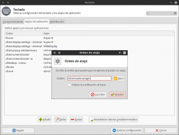
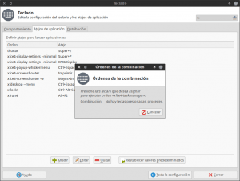

Todos los sistemas operativos que trabajan con el entorno de escritorio XFCE acostumbran a disponer de varios atajos de teclado preconfigurados para poder hacer nuestras tareas de forma más fácil y más rápida.

No obstante es posible que deseemos incluir nuevos atajos de teclado para adaptar aún más el sistema operativo a nuestras necesidades. Para conseguir nuestro propósito, tan solo tenemos que seguir los pasos que encontrarán en el siguiente apartado.<!--more-->

## CREAR ATAJOS DE TECLADO EN XFCE

En el siguiente apartado, a modo de ejemplo, crearemos un atajo de teclado para abrir el gestor de tareas de XFCE. Para ello el primero paso es **ejecutar el siguiente comando en la terminal**:

> ```
> xfce4-keyboard-settings
> ```

Una vez ejecutado el comando aparecerá la siguiente ventana:

[](images/Pestaña-de-atajos-de-teclado.png)

Tal y como se puede ver en la captura de pantalla **presionamos encima de la pestaña Atajos de Aplicación**. Seguidamente **presionamos el botón Añadir**. Después de presionar añadir aparecerá la siguiente ventana:

[](images/Escribir-comando-del-atajo-de-teclado.png)

Tal y como puede verse en la captura de pantalla, tenemos que **introducir el comando que queremos que se ejecute cuando presionaremos la combinación de teclas** que seleccionaremos posteriormente. En este caso el comando a introducir es:

> ```
> xfce4-taskmanager
> ```

**Presionamos el botón Aceptar**. Después de presionar el botón Aceptar aparecerá la siguiente pantalla:

[](images/Asignar-el-atajo-de-teclado.png)

En estos momentos lo único que tenemos que realizar es **presionar la combinación de teclas que deseamos para que se abra el gestor de tareas** de XFCE. **En mi** caso la combinación de teclas elegida es **Ctrl+Alt+T**.

Ahora tan solo tenemos que presionar la combinación de teclas Crtl+Alt+T y se abrirá el gestor de tareas de XFCE.

## EJEMPLOS DE ATAJOS DE TECLADO QUE PODEMOS CREAR EN XFCE

De la misma forma que hemos creado un atajo de teclado para abrir nuestro gestor de tareas, podemos crear otros atajos de teclado que nos pueden ser sumamente útiles. **Algunos de los atajos de teclado que podemos crear son los siguientes**:

### Bloquear el equipo (Ctrl+Alt+Supr)

Si deseamos bloquear el equipo para que nadie pueda acceder a él durante nuestra ausencia, podemos crear un atajo de teclado usando la siguiente orden y el siguiente atajo de teclado.

> ```
> Orden: xflock4
> Combinación de teclas: Ctrl+Alt+Supr
> ```

En el momento de presionar Ctrl+Alt+Supr el equipo se bloqueará. Para desbloquear el equipo tendremos que introducir nuestra contraseña de usuario y presionar Enter.

### Apagar el monitor para ahorrar energía (Ctrl+Alt+m)

Si simplemente lo que pretendemos es apagar el monitor para ahorrar energía durante un breve periodo de ausencia, podemos usar el siguiente atajo de teclado:

> ```
> Orden: xset dpms force off
> Combinación de teclas: Ctrl+Alt+m
> ```

Si usamos este método no será necesario esperar a que actúe el gestor de energía de XFCE para apagar el monitor. Para volver a encender la pantalla tan solo tenemos que presionar una tecla o mover el ratón del ordenador.

### Apagar el ordenador (Ctrl+Mayús+s)

Podemos asignar una combinación de teclas para cerrar, hibernar, suspender o cerrar la sesión de nuestro ordenador. Para conseguir este propósito podemos construir una atajo de teclado utilizando la siguiente orden y atajo de teclado:

> ```
> Orden: xfce4-session-logout
> Combinación de teclas: Ctrl+Mayús+s
> ```

Una vez configurado el atajo de teclado, cada vez presionemos la combinación de teclas Ctrl+Mayús+s, se abrirá el menú de cerrar sesión de XFCE. En este menú podremos realizar diversas acciones como por ejemplo cerrar la sesión, cerrar el ordenador, suspender el sistema, etc.

### Acceder a las opciones de configuración de la pantalla (<Super>+p)

Si lo que queremos es modificar la configuración de nuestra pantalla, lo podemos hacer fácilmente mediante la siguiente orden y combinación de teclas:

> ```
> Orden: xfce4-display-settings --minimal
> Combinación de teclas: <Super>+p
> ```

Una vez configurado el atajo de teclado, tan solo tenemos que presionar la combinación de teclas <Super>+p para acceder a la configuración de nuestro monitor.

### Activar y desactivar el compositor de ventanas xfwm (Ctrl+Mayús+C)

Si lo que pretendemos es activar y desactivar de forma rápida el compositor de ventanas xfwm, podemos crear un atajo de teclado con la siguiente orden y combinación de teclas:

> ```
> Orden: xfconf-query --channel=xfwm4 --property=/general/use_compositing --type=bool --toggle
> Combinación de teclas: Ctrl+Mayús+C
> ```

Si presionamos Ctrl+Mayús+C el compositor de ventanas xfwm4 se desactivará. Si queremos reactivarlo de nuevo tenemos que presionar otra vez la combinación de teclas Ctrl+Mayús+C.

### Realizar una captura de pantalla (Impr Pant)

Si nuestro objetivo es realizar una captura de pantalla de forma rápida, podemos construir un atajo de teclado con la siguiente orden y combinación de teclas:

> ```
> Orden: xfce4-screenshooter -u
> Combinación de teclas: Impr Pant
> ```

Una vez configurado el atajo de teclado, al presionar la tecla Impr Pant, aparecerá el menú del capturador de pantalla de XFCE para que podamos seleccionar las opciones de captura de pantalla que más nos convengan.

### Realizar la captura de pantalla de una ventana (Alt+Impr Pant)

Si lo que pretendemos es capturar una ventana de forma directa sin tener que interactuar con ningún tipo de menú ni de ventana, podemos crear el siguiente atajo de teclado usando la siguiente orden y combinación de teclas:

> ```
> Orden: xfce4-screenshooter -w -d 5 -m
> Combinación de teclas: Alt+Impr Pant
> ```

Cuando hayamos finalizado la configuración, al presionar la combinación de teclas Alt+ Impr Pant, tendremos que esperar 5 segundos. A los 5 segundos se realizará la captura de pantalla de la ventana que esté activa en este momento. Como en la orden hemos incluido el parámetro -m, la captura de pantalla incluirá el puntero del mouse.

### Realizar una captura de pantalla de la región seleccionada (Ctrl+Mayús+Impr Pant)

Si nuestro objetivo es realizar la captura de pantalla de una región cualquiera de forma directa y sin tener que interactuar con ningún menú un ventana, podemos configurar el siguiente atajo de teclado:

> ```
> Orden: xfce4-screenshooter -r
> Combinación de teclas: Ctrl+Mayús+Impr Pant
> ```

En el momento de presionar las teclas Ctrl+Mayús+Impr Pant, la pantalla se oscurecerá y tendremos que seleccionar la región de la pantalla que queremos capturar. Una vez indicada la región que queremos capturar se realizará la captura de pantalla de forma automática.

### Abrir el menú de XFCE Whiskermenu con la tecla de Windows (<Super>)

Para hacer que cada vez que presionemos la tecla de windows se active Whisker menu, tenemos que aplicar el siguiente atajo de teclado:

> ```
> Orden: xfce4-popup-whiskermenu
> Combinación de teclas: <Super>
> ```

Ahora cada vez que presionemos la tecla de Windows, se desplegará nuestro Whisker menu.

### Abrir la terminal (Ctrl+t)

Para abrir la terminal con un atajo de teclado podemos usar la siguiente orden y combinación de teclas:

> ```
> Orden: x-terminal-emulator -r "Command Line"
> Combinación de teclas: Ctrl+t
> ```

Ahora cada vez que presionemos la combinación de teclas Ctrl+t se abrirá una terminal.

### Lanzar cualquier aplicación mediante una combinación de teclas

Si nuestro objetivo es lanzar aplicaciones con atajos de teclado es muy fácil. Como orden tan solo tenemos que usar el comando que utilizaríamos para lanzar el programa desde la terminal, y como combinación de teclas podemos elegir cualquiera. Por lo tanto si lo que pretendemos es crear un atajo de teclado para arrancar el gestor de archivos Thunar podemos usar la siguiente orden y comando:

> ```
> Orden: thunar
> Combinación de teclas: <Super>+e
> ```

###### Nota: En este caso la orden thunar se puede reemplazar por cualquier otra. Por ejemplo si queremos lanzar Thunderbird, tan solo tenemos que reemplazar Thunar por Thundebird.

### Matar procesos con xkill (Ctrl+Alt+t)

A pesar de que Linux es sumamente estable, existen ocasiones en que hay alguna aplicación de terceros que se queda colgada. Para matar esta aplicación podemos usar un atajo de teclado con [xkill](http://www.tuxylinux.com/linux-colgado-i-matar-procesos-en-el-entorno-grafico/ "Ejemplo de utilización de xkill"). Para crear el atajo de teclado tenemos que usar la siguiente orden y combinación de teclas:

> ```
> Orden: xkill
> Combinación de teclas: Ctrl+Alt+t
> ```

En el momento que queramos matar un programa que se está ejecutando de forma gráfica, primero tenemos que presionar la combinación de teclas Ctrl+Alt+t. Justo después de presionar esta combinación nuestro puntero del mouse se transformará en una cruz. Para finalizar el proceso tan solo tenemos que clicar el botón izquierdo del mouse encima de la ventana que se ha quedado colgada.

### Subir y bajar el volumen (Ctrl+Super+cursor arriba) (Ctrl+Super+cursor abajo)

En mi caso no dispongo de un teclado que disponga de teclas multimedia. Este problema lo podemos solucionar fácilmente con los atajos de teclado. Para subir el volumen se puede crear un atajo de teclado con la siguiente orden y combinación de teclas:

> ```
> Orden: amixer sset Master playback 5%+
> Combinación de teclas: Ctrl+Super+cursor arriba
> ```

Para bajar el volumen podemos crear otro atajo con la siguiente orden y combinación:

> ```
> Orden: amixer sset Master playback 5%-
> Combinación de teclas: Ctrl+Super+cursor abajo
> ```

Para finalizar el post solo quiero comentar que estos solo son algunos de los atajos de teclado que podemos crear. **Si alguien desea participar y dejar algún atajo de teclado que usa y que no se menciona en el post, tan solo tiene que publicar en los comentarios del blog**.
