Normalmente no escribo sobre temas relacionados con Windows, pero aprovechando que estoy probando el nuevo Windows 10, me he animado a escribir un breve tutorial en el que detallaré, como crear atajos de teclado para abrir el programa que queramos presionando la combinación de teclas que nosotros seleccionemos.<!--more-->

En mi vida laboral uso Windows y cuando tengo que realizar una captura de pantalla acostumbro a usar el programa Recortes (herramienta también conocida como SnippingTool). Como es un programa que utilizo a menudo me interesa abrirlo lo más rápidamente posible y para ello utilizo atajos de teclado.

###### Nota: Soy consciente que para realizar capturas de pantalla en Windows hay programas muy buenos como por ejemplo Snag it, pero la verdad es que con la aplicación nativa de Windows me basta y no tengo que instalar programas piratas.

## CREAR ATAJOS DE TECLADO EN APLICACIONES DE ESCRITORIO

Los pasos para crear atajos de teclado para poder abrir un programa son los siguientes:

### Localizar el acceso directo del programa que queremos abrir

Para crear atajos de teclado lo primero que tenemos que realizar es localizar el acceso directo del programa que queremos abrir. Para localizar el acceso directo del programa recortes **clicamos en el botón de inicio de Windows**. Una vez se abra el panel de inicio, tal y como se puede ver en la captura de pantalla, **tecleamos el nombre del programa** que estamos buscando que en mi caso es recortes.

**Una vez encontrado el programa**, tal y como se puede ver en la captura de pantalla, **posicionamos el puntero del mouse sobre él**, **presionamos el botón derecho del mouse**, y seguidamente cuando aparezca el menú contextual **clicamos en la opción Abrir ubicación de archivo**.

[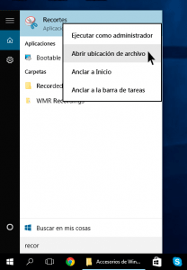](images/Bucar-el-acceso-directo-del-programa.png)

Después de clicar en abrir ubicación de archivo, se abrirá nuestro gestor de archivos y podremos ver el acceso directo del programa Recortes que necesitamos para crear el atajo de teclado.

###### Nota:  Si no hay disponible ningún acceso directo lo podemos realizar nosotros mismos a partir del archivo .exe ejecutable.

### Crear El atajo de teclado

Tal y como ya hemos dicho anteriormente, después de clicar en abrir ubicación de archivo, tal y como se puede ver en la captura de pantalla, podremos ver el acceso directo del programa Recortes.

[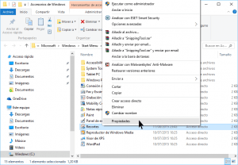](images/Acceder-a-las-propiedad-del-acceso-directo.png)

**Una vez localizado el acceso directo de recortes**, tal y como se puede ver en la captura de pantalla, **lo seleccionamos**, **presionamos el botón derecho del mouse**, y posteriormente **clicamos sobre la opción** **Propiedades** del menú contextual.

Al clicar sobre el menú propiedades se abrirá la siguiente ventana:

[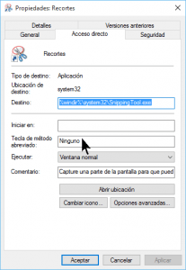](images/Campo-método-abreviado.png)

En la ventana que se ha abierto tenemos que **clicar encima del campo** **Tecla de método abreviado**, y seguidamente tenemos que **presionar la combinación de teclas que queremos usar para abrir el programa Recortes**, que en mi caso **Ctrl+0**. Una vez realizado estos pasos, tal y como se puede ver en la captura de pantalla, tenemos que **presionar encima del botón Aplicar**.

[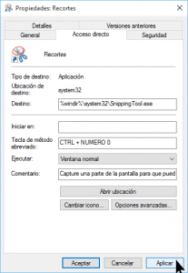](images/Seleccionar-el-atajo-de-teclado.png)

Después de presionar encima del botón aplicar, aparecerá una ventana informando que tenemos que proporcionar permisos de administración para cambiar la configuración. Tal y como se puede ver en la captura de pantalla **presionamos el botón Continuar**.

[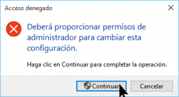](images/Permisos-para-cambiar-la-configuración.png)

Después de otorgar los permisos el proceso ha finalizado. En estos momentos cada vez que presionemos la combinación de teclas Ctrl+0, el programa recortes se abrirá y podremos realizar las capturas de pantallas que necesitemos sin ningún tipo de problema.

## CREAR ATAJOS DE TECLADO EN APLICACIONES DE LA WINDOWS STORE

En el caso que precisen abrir aplicaciones provenientes Windows Store mediante atajos de teclado el procedimiento es ligeramente diferente. Los pasos a seguir para crear atajos de teclado para abrir aplicaciones metro de la Windows Store son los siguientes:

### Crear un atajo acceso directo para una aplicación de la Windows Store

El primer paso para poder crear atajos de teclado en aplicaciones metro es crear un acceso directo. Para crear un acceso directo tenemos que seguir los siguientes pasos:

**1-** **Accedemos al panel de control** de Windows.

**2-** Una vez dentro del panel de control **clicamos la opción Programas**.

**3-** Una vez dentro de la opción programas **clicamos en la opción Programas predeterminados**.

**4-** Dentro de programas predeterminados, tal y como se puede ver en la captura de pantalla, **clicamos sobre la opción Asociar un tipo de archivo o protocolo con un programa**.

[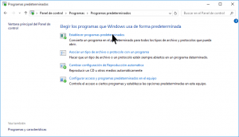](images/Asociar-un-tipo-de-archivo-o-protocolo-con-un-programa.png)

**5-** Seguidamente se abrirá la ventana establecer asociaciones. Dentro de la ventana establecer asociaciones **buscaremos la aplicación que queremos lanzar con una combinación de teclas que en mi caso es Deezer**. Una vez encontrada, tal y como se puede ver en la captura de pantalla, **apuntaremos la URL que aparece en el campo Descripción**:

[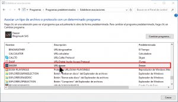](images/Averiguar-la-URL-de-la-app.png)

**6-** Una vez tenemos la URL ya podemos crear el acceso directo. Para ello, tal y como se puede ver en la captura de pantalla, nos ubicamos **en el escritorio** o en la ubicación que queramos dentro de nuestro gestor de archivos, y **presionamos el botón derecho del ratón**. Seguidamente **seleccionamos la opción Nuevo** y finalmente **clicamos en la opción Acceso Directo**.

[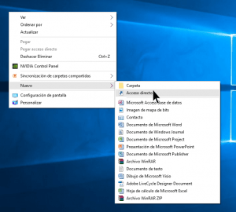](images/Crear-Acceso-Directo.png)

**7-** A continuación, **en el campo** **Escriba la ubicación del elemento**, tenemos que escribir la dirección URL de Deezer que apuntamos en el punto 5. Por lo tanto, tal y como se puede ver en la captura de pantalla, **escribimos la URL de Deezer seguido de los caracteres :///** y **presionamos el botón Siguiente**.

[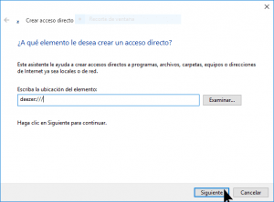](images/Indicar-URL-del-programa.png)

**8-** Finalmente, tal y como se puede ver en la captura de pantalla, tan solo tenemos que **poner el nombre que queramos a nuestro acceso directo** y **presionar** el botón **Finalizar**.

[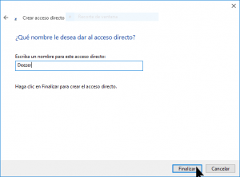](images/Nombre-del-Acceso-Directo.png)

Después de realizar estos pasos el Acceso directo se ha creado. Una vez creado el acceso directo, el procedimiento para crear un atajo de teclado es exactamente el mismo que en el caso anterior. Por lo tanto procederemos de la siguiente forma:

### Crear atajos de teclado para las aplicaciones de la Windows Store

Seguidamente, tal y como se puede ver en la captura de pantalla, **seleccionamos el Acceso directo** de Deezer, **presionamos el botón derecho del mouse**, y posteriormente **clicamos sobre la opción Propiedades** del menú contextual.

[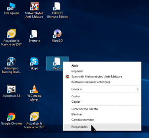](images/Propiedades-del-acceso-directo.png)

Al clicar sobre el menú propiedades se abrirá la siguiente ventana:

[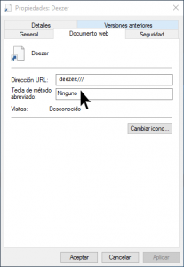](images/Seleccionar-tecla-método-abreviado.png)

En la ventana que se ha abierto tenemos que **clicar encima del campo Tecla de método abreviado**, y seguidamente tenemos que **presionar la combinación de teclas que queremos usar para abrir Deezer**, que **en mi caso Ctrl+ Alt + D**. Una vez realizado estos pasos, tal y como se puede ver en la captura de pantalla, tenemos que **presionar** encima del botón **Aplicar**.

[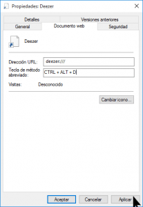](images/Seleccionar-atajo-de-teclado-para-deezer.png)

Después de presionar el botón Aplicar el proceso ha finalizado. En estos momento cada vez que presionemos la combinación de teclas Ctrl+ Alt + D, Deezer se abrirá y lo podremos usar sin ningún tipo de problema.

Espero que estos simples consejos les ayuden a ser un poco más productivos.

###### Nota: El procedimiento descrito en este post es válido para Windows 10, Windows 8 y Windows 7.
