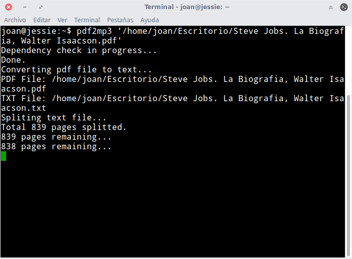
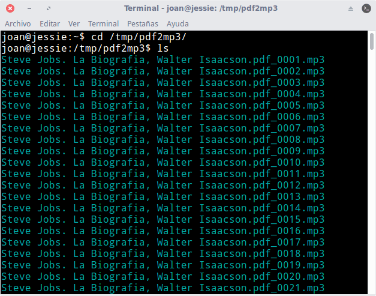
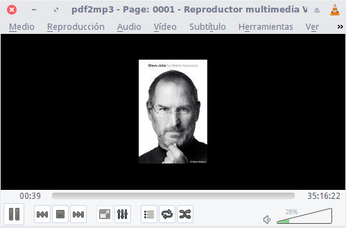

En el siguiente artículo veremos el proceso a seguir para crear nuestros propios audiolibros a partir de un archivo pdf.

El proceso que seguiremos para poder conseguir nuestro objetivo es el que describe a continuación:

1. Mediante la herramienta pdftotext convertiremos un fichero .pdf a formato .txt
2. Seguidamente dividiremos el archivo de texto .txt en varias partes. Cada parte contendrá una página del archivo pdf inicial.
3. A continuación usaremos el sintetizador de voz pico2wave para transformar cada uno de los archivos de texto a un archivo .wav.
4. Finalmente, mediante lame transformaremos cada uno de los archivos .wav a .mp3.

<!--more-->

La totalidad del proceso que acabo de mencionar lo realizaremos de forma automática mediante un script. De esta forma podremos transformar nuestros archivos pdf en audiolibros de forma sencilla y efectiva.

## INSTALACIÓN DE LOS PAQUETES NECESARIOS

El primer paso consiste consiste en instalar los paquetes necesarios para que podamos ejecutar el script sin problemas. Para ello ejecutamos el siguiente comando en la terminal:

> ```
> sudo apt-get install python poppler-utils lame libttspico-utils coreutils mawk gawk
> ```

Una vez instaladas las dependencias necesarias ya podemos descargar el script.

## DESCARGAR E INSTALAR EL SCRIPT PARA CONVERTIR ARCHIVOS PDF EN AUDIOLIBROS MP3

Abrimos una terminal y ejecutamos el siguiente comando:

> ```
> git clone https://github.com/jccall80/pdf2mp3
> ```

Una vez descargado el script le damos permisos de ejecución ejecutando el siguiente comando en la terminal:

> ```
> cd pdf2mp3 && sudo chmod +x pdf2mp3
> ```

Seguidamente copiamos el script dentro de la ubicación /usr/bin ejecutando el siguiente comando en la terminal:

> ```
> sudo cp pdf2mp3 /usr/bin/
> ```

En estos momentos el proceso de instalación del script ha finalizado. Ahora tan solo tenemos que ejecutar el script y convertir los archivos pdf que queramos en audiolibros que tendrán el formato .mp3.

## CONVERTIR UN ARCHIVO PDF A UN AUDIOLIBRO EN MP3

Tan solo tenemos que abrir una terminal y ejecutar un comando del siguiente estilo:

> ```
> pdf2mp3 ruta y nombre del archivo pdf
> ```

Por lo tanto si en mi caso que convertir el libro de la biografía de Steve Jobs en un audiolibro, tan solo tengo que ejecutar el siguiente comando:

> ```
> pdf2mp3 '/home/joan/Escritorio/Steve Jobs. La Biografia, Walter Isaacson.pdf'
> ```

###### Nota: Recuerden que con simplemente arrastrar un archivo sobre la terminal se copia la ruta y el nombre del archivo a convertir.

Justo al ejecutar el comando empezará la conversión del archivo .pdf a .mp3.

[](images/transformando-pdf-en-audiolibro.png)

Una vez finalizado el proceso encontraremos los archivos de audio en la ubicación /tmp/pdf2mp3. Para acceder a esta ubicación ejecutamos el siguiente comando en la terminal:

> ```
> cd /tmp/pdf2mp3/
> ```

A continuación, si ejecutamos el comando ls veremos que en mi dispongo de 839 archivos mp3. Cada archivo corresponde a una página del archivo pdf que he convertido en audiolibro:

[](images/archivos-pdf-transformados.png)

Para juntar estos 839 archivos en un único archivo ejecutamos el siguiente comando en la terminal:

> ```
> cat *.mp3 > final.mp3
> ```

Después de ejecutar el comando, dentro de la ubicación /tmp/mp3 encontraremos el archivo final.mp3 que contiene la totalidad de paginas de nuestro libro.

Este archivo lo podemos copiar y escuchar tranquilamente en cualquier reproductor de mp3 como por ejemplo nuestro teléfono, nuestro ordenador, el equipo de audio de nuestro coche, etc.

[](images/reproduciendo-audilibros-con-vlc.png)

De esta forma tan sencilla podemos transformar la totalidad de nuestros archivos pdf en audiolibros.

## RESULTADO OBTENIDO

A continuación les dejo una muestra del resultado que obtendremos al aplicar el procedimiento de este artículo.

<iframe src="https://w.soundcloud.com/player/?url=https%3A//api.soundcloud.com/tracks/319925962&amp;color=0090d3&amp;auto_play=false&amp;hide_related=false&amp;show_comments=true&amp;show_user=true&amp;show_reposts=false" width="100%" height="166" frameborder="no" scrolling="no"></iframe>

Como pueden observar el resultado obtenido es aceptable y superior al de la gran mayoría de herramientas online que realizan este tipo de conversión.

## AJUSTES QUE SE PUEDEN REALIZAR AL SCRIPT

El script usado para convertir archivos pdf a audiolibros en mp3 funcionará a la perfección siempre y cuando el idioma del pdf a transformar esté en Español.

Si el pdf a transformar está en otro idioma deberemos realizar pequeñas modificaciones en el script para obtener resultados aceptables.

Para realizar las modificaciones abriremos el contenido del script original y localizaremos la siguiente línea:

> ```
> pico2wave -l=es-ES -w="$WAVE" "`cat $FIRST_FILE.lock`"
> ```

Una vez encontrada la deberemos modificar en función del idioma en que esté el pdf a transformar. De este modo:

Si el pdf a transformar está en Inglés deberemos reemplazar es-ES por en-US:

> ```
> pico2wave -l=en-US -w="$WAVE" "`cat $FIRST_FILE.lock`"
> ```

En el caso que el pdf a transformar esté en Francés deberemos reemplazar es-ES por fr-FR:

> ```
> pico2wave -l=fr-FR -w="$WAVE" "`cat $FIRST_FILE.lock`"
> ```

En el hipotético caso que el pdf a transformar esté en Italiano deberemos reemplazar es-ES por it-IT:

> ```
> pico2wave -l=it-IT -w="$WAVE" "`cat $FIRST_FILE.lock`"
> ```

Finalmente, si el pdf a transformar está en Alemán deberemos reemplazar es-ES por de-DE:

> ```
> pico2wave -l=de-DE -w="$WAVE" "`cat $FIRST_FILE.lock`"
> ```

Realizando estás simples modificaciones obtendremos resultados aceptables en la totalidad de idiomas que acabo de citar.
