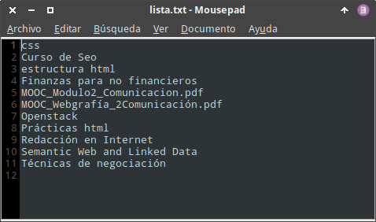
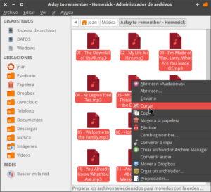
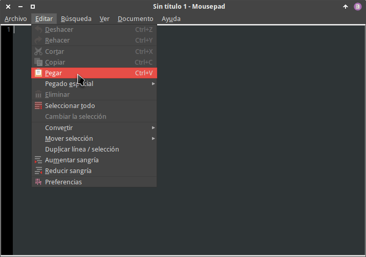
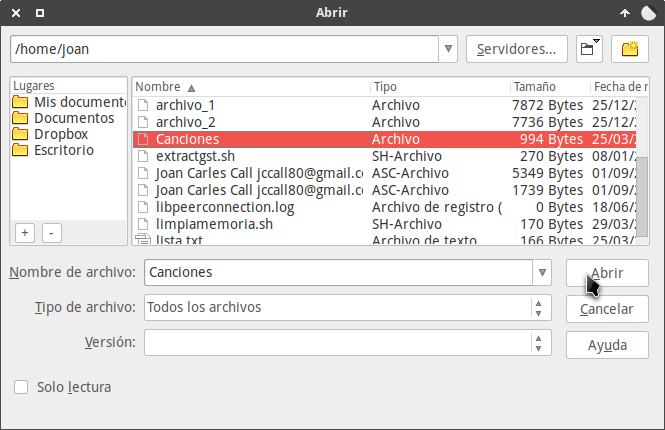
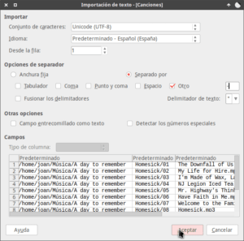
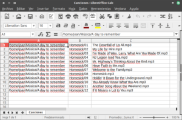

En ocasiones puede resultar interesante disponer de un listado de los archivos y carpetas que contiene un determinado directorio. Algunas de estas ocasiones pueden ser las siguientes:

1. Crear una lista de las canciones que tenemos almacenadas en un directorio.
2. Crear un listado de las películas para poderla pasar a un tercero.
3. Disponer de un catálogo de archivos relacionados con un proyecto en concreto.

<!--more-->

Para realizar esta tarea de forma sencilla, rápida y efectiva tan solo tenemos que seguir el procedimiento que indicamos a continuación.

## CREAR UN FICHERO CON LOS ARCHIVOS Y CARPETAS QUE CONTIENE UN DIRECTORIO CON LA TERMINAL

A continuación veremos una serie de variantes que nos permitirán obtener los ficheros y carpetas que contienen un directorio.

### Listar los archivos y carpetas que contiene un directorio

Si lo único que pretendemos es obtener un listado que contenga los archivos y carpetas que contiene un directorio, tan solo tenemos que abrir una terminal y ejecutar un comando del siguiente tipo:

> ```
> ls ruta_que_contiene_archivos_a_listar > nombre_archivo_contendra_lista.txt
> ```

Por lo tanto, si quiero listar el contenido de los archivos y carpetas almacenados en /home/joan/Dropbox/Cursos/ ejecutaré el siguiente comando:

> ```
> ls /home/joan/Dropbox/Cursos/ > lista.txt
> ```

El significado de cada uno de los parámetros del comando es el siguiente:

**ls :** Comando para obtener un listado de ficheros y carpetas de una ubicación. **/home/joan/Dropbox/Cursos/:** Ruta del directorio que queremos listar. **\> :** Indicamos que el resultado de salida del comando ls/home/joan/Dropbox/Cursos/ se debe volcar en un archivo. **lista.txt :** Ruta y nombre del fichero que contendrá el listado que queremos generar. Como solo especificamos el nombre, el fichero se creará en la ruta que ejecutamos el comando.

Una vez ejecutado el comando tan solo tenemos que consultar el contenido del fichero que hemos generado. Para ello hacemos doble clic sobre el archivo que hemos generado y veremos nuestro listado.

[](images/archivo-de-texto-que-lista-archivos-y-carpetas.png)

### Crear un archivo de texto que contenga los archivos y carpetas de un directorio de forma recursiva

Si nuestro objetivo es crear un archivo de texto que contenga un listado de archivos y carpetas de un directorio de forma recursiva, tan solo deberemos añadir el parámetro \-R al comando del apartado apartado anterior.

De este modo, para obtener un listado de archivos y carpetas de forma recursiva del directorio /home/joan/Dropbox/Cursos/, deberemos ejecutar el siguiente comando en la terminal:

> ```
> ls -R /home/joan/Dropbox/Cursos/ > lista.txt
> ```

Para que el listado obtenido esté clasificado alfabéticamente y por extensión, añadiremos el parámetro \-X al comando anterior:

> ```
> ls -R -X /home/joan/Dropbox/Cursos/ > lista.txt
> ```

Si además queremos obtener el nombre de los archivos y carpetas conjuntamente con su ruta podemos ejecutar el siguiente comando:

> ```
> find /home/joan/Dropbox/Cursos/ > lista.txt
> ```

### Obtener un listado de los archivos y carpetas de un directorio incluyendo información adicional

En el caso que queramos obtener un fichero de texto en que se listen los archivos y carpetas del directorio /home/joan/Dropbox/Cursos/ incluyendo sus propiedades como por ejemplo sus permisos, el tamaño, su propietario, etc. debemos ejecutar el siguiente comando:

> ```
> ls -l -h /home/joan/Dropbox/Cursos/ > lista.txt
> ```

### Crear un fichero que liste los archivos y carpetas de un directorio sin incluir las extensiones de los archivos

Para obtener un fichero de texto que incluya los nombres de los archivos y carpetas contenidas en el directorio /home/joan/Dropbox/Cursos/ sin que se incluyan las extensiones de los archivos, deberemos ejecutar el siguiente comando:

> ```
> ls -1 /home/joan/Dropbox/Cursos/ | rev | cut -f 2- -d "." | rev > lista.txt
> ```

### Elaborar un fichero de texto que contenga únicamente los archivos de un directorio

Para obtener un fichero de texto que incluya únicamente los archivos del directorio /home/joan/Dropbox/Cursos/ ejecutaremos el siguiente comando:

> ```
> ls -p /home/joan/Dropbox/Cursos/ | grep -v / > lista.txt
> ```

Si además quisiéramos que en el listado no se muestren las extensiones de los archivos, deberíamos ejecutar el siguiente comando:

> ```
> ls -p /home/joan/Dropbox/Cursos/ | grep -v / | rev | cut -f 2- -d "." | rev > lista.txt
> ```

Si ahora quisiéramos que el listado que acabamos de realizar se genere de forma recursiva deberíamos ejecutar el siguiente comando:

> ```
> ls -R -p /home/joan/Dropbox/Cursos/ | grep -v / | rev | cut -f 2- -d "." | rev > lista.txt
> ```

### Construir un listado con las carpetas de un directorio

Si nuestro objetivo es obtener un listado de las carpetas del directorio /home/joan/Dropbox/Cursos/ en un fichero de texto con nombre lista.txt, ejecutaremos el siguiente comando en la terminal:

> ```
> ls -l /home/joan/Dropbox/Cursos/ | grep "^d" | awk -F" " '{print $9}' > lista.txt
> ```

Si además quisiéramos este listado contenga las carpetas ocultas deberíamos añadir el parámetro \-A al comando anterior:

> ```
> ls -Al /home/joan/Dropbox/Cursos/ | grep "^d" | awk -F" " '{print $9}' > lista.txt
> ```

### Disponer de un fichero de texto que contenga las carpetas de uno o varios directorios incluyendo su ruta

Si en un fichero de texto, con nombre lista.txt, queremos incluir un listado de las carpetas del directorio /home/joan/Dropbox/Cursos/ incluyendo su ruta, debemos ejecutar el siguiente comando en la terminal:

> ```
> find /home/joan/Dropbox/Cursos/ -maxdepth 1 -type d > lista.txt
> ```

Si quisiéramos que el listado incluyera 2 niveles de profundidad entonces podríamos usar el siguiente comando:

> ```
> find /home/joan/Dropbox/Cursos/ -maxdepth 2 -type d > lista.txt
> ```

Si finalmente quisiéramos obtener un listado recursivo de las carpetas que contiene el directorio /home/joan/Dropbox/Cursos/ deberíamos ejecutar el siguiente comando:

> ```
> find /home/joan/Dropbox/Cursos/ -type d > lista.txt
> ```

###### Nota: Para crear más variantes de las que se muestran en este artículo, tan solo tienen que consultar las páginas man de ls y find.

## CREAR UN FICHERO CON LOS ARCHIVOS Y CARPETAS QUE CONTIENE UN DIRECTORIO USANDO EL GESTOR DE ARCHIVOS

Si lo único que pretendemos es obtener un listado de los archivos y carpetas de un directorio sin complicarnos la vida ni importarnos el formato, podemos realizar lo siguiente:

Nos dirigimos al directorio que contiene los archivos que queremos listar. Una vez dentro del directorio seleccionamos todos los archivos y/o carpetas y los copiamos.

[](images/copiar-los-archivos-y-carpetas-a-listar.png)

Seguidamente abrimos nuestro editor de textos y pegamos el contenido que acabamos de copiar.

[](images/pegar-los-resultados-en-el-editor-de-textos.png)

Una vez pegado el contenido obtendremos el listado que estamos buscando. Ahora tan solo lo tenemos que guardarlo con el formato de archivo que necesitemos.

## TRABAJAR CON LOS ARCHIVOS DE TEXTO QUE HEMOS GENERADO

Una vez generado el archivo lo podemos abrir, editar y trabajar de la forma que creamos más conveniente. En mi caso considero que la mejor forma es la siguiente:

Abrimos una hoja de cálculo como Excel o Calc de Libreoffice. Una vez abierta la hoja presionamos la combinación de teclas Ctrl+A.

A continuación aparecerá la ventana de Abrir archivos. Buscamos uno de los ficheros de texto que hemos generado y lo abrimos.

[](images/abrir-archivo-en-un-hoja-de-calculo.png)

Seguidamente configuramos los distintos apartados que conciernen a la importación de un archivo .txt a .odt o .xls. Una vez seleccionadas las opciones pertinentes presionamos el botón Aceptar.

[](images/configurar-los-parametros-de-importacion.png)

Justo después de presionar el botón aceptar dispondremos de nuestro listado de archivos en nuestra hoja de cálculo.

[](images/trabajar-los-datos-generados.png)

En estos momentos podremos trabajar el contenido de nuestro listado de forma mucho más cómoda y práctica.
