En el pasado escribí un artículo sobre los servicios de correo temporal. Estos servicios son útiles cuando necesitamos suscribirnos a un servicio y no queremos proporcionar nuestro email. No obstante tienen el problema que si necesitamos recibir información como por ejemplo una newsletter no la podremos recibir. La solución a este problema es crear un alias de nuestro email y usar este alias para suscribirnos a la newsletter. De esta forma:<!--more-->

1. Podremos suscribirnos al servicio que proporciona la Newsletter.
2. Periódicamente recibiremos la newsletter vía email y la podremos leer.
3. En el momento que decidamos que ya no queremos recibir la newsletter tan solo tenemos que cancelar o bloquear el alias del email que creamos. De esta forma quien está detrás del servicio de la newsletter no podrá freírnos a publicidad ni spamear porque no sabrá nuestro email real.

Para realizar lo que acabo de mencionar existen varios servicios, pero en este artículo detallaremos como hacerlo con SimpleLogin. [SimpleLogin](https://github.com/simple-login/app) es una solución Open Source que ofrece un servicio Freemium. Aparte de ofrecer el servicio Freemium en sus propios servidores también ofrecen la posibilidad que nosotros mismos autoalojemos SimpleLogin en nuestro propio servidor mediante un contenedor Docker.

**Nota:** Una futura nueva alternativa que garantizará mínimamente nuestra privacidad será [Firefox Private Relay](https://relay.firefox.com/). Desafortunadamente este servicio de Mozilla aun está en desarrollo y no está abierto al público para ser testeado.

**Nota:** Gmail y gestores de correo electrónico como outlook también permiten generar alias.

## ¿QUÉ ES Y COMO FUNCIONA UN ALIAS?

Un alias es una dirección de correo alternativa a nuestra dirección real. En el momento que un tercero envíe un correo a nuestra dirección de correo alternativa pasará lo siguiente:

1. Se recibirá el correo en la dirección de correo alternativa.
2. Una vez recibido el correo, la dirección de correo alternativa reenviará el email a la dirección de correo real.

Por lo tanto mediante el alias podremos recibir emails de una determinada persona sin tener que dar nuestra dirección de correo real. De esta forma podemos preservar nuestra privacidad y evitar el correo no deseado.

## VENTAJAS DE GENERAR UN ALIAS DE NUESTRO EMAIL EN VEZ DE LOS CORREOS TEMPORALES

Al crear un alias para nuestro email obtendremos los siguiente beneficios:

1. **Ningún desconocido tendrá nuestra dirección de correo electrónico**. Como mucho tendrá un alias de nuestro correo electrónico que podemos eliminar en cualquier momento.
2. **Dispondremos de la totalidad de funciones de los servicios a que nos suscribamos.** Podremos recibir las notificaciones vía email de los administradores de los servicios a que estamos suscritos. Además podremos usar las opciones de recuperación de contraseña en el caso que sea necesario.
3. **Evitar correo no deseado.** El servicio al que nos suscribimos nunca conocerá nuestro correo electrónico real. Unicamente conocerá un alias que podemos eliminar o bloquear en cualquier momento. Por lo tanto en el momento que eliminemos el alías ya nos podrán contactar para spamear.
4. **Enviar y responder emails usando nuestro propio alias.** De esta forma también podremos preservar nuestra privacidad y que nuestro correo caiga en listas de spam.
5. **Mejoramos la seguridad de nuestro correo electrónico.** En el caso que exista una brecha de seguridad al servicio al que nos suscribimos nuestra dirección de email real no estará expuesta.

## CREAR UN ALIAS PARA NUESTRO CORREO ELECTRÓNICO

Los pasos a seguir para empezar a usar el servicio de SimpleLogin son los siguientes.

### Crear una cuenta de SimpleLogin

Lo primero que tenemos que realizar es acceder a la web de SimpleLogin y hacernos una cuenta:

[https://app.simplelogin.io/auth/register](https://app.simplelogin.io/auth/register)

[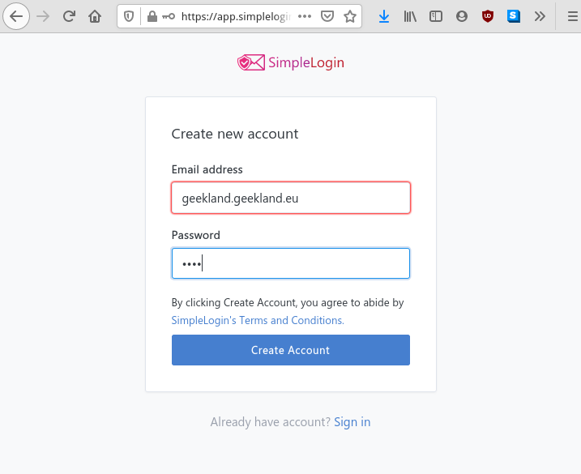](images/crear-una-cuenta-de-simplelogin.png)

### Crear un alias para nuestra cuenta de correo

Una vez creada la cuenta nos logueamos y clicamos en el botón de **New Alias**.

[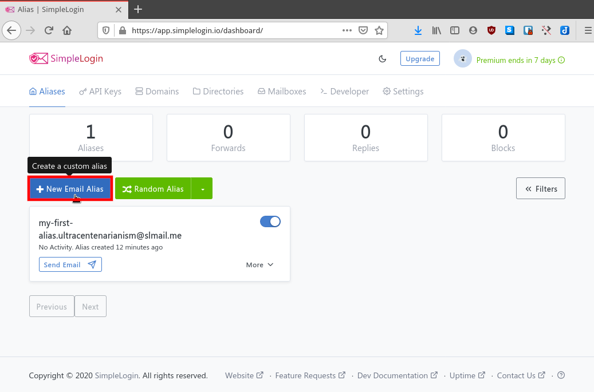](images/crear-un-alias-para-nuestro-email.png)

A continuación aparecerá una pantalla en la que que tendréis 4 campos para rellenar:

1. En el primero escribimos un nombre cualquiera que queramos que tenga nuestro alias. En mi caso escribo geekland.
2. Seguidamente seleccionamos el dominio que queramos que tenga nuestro alias. En mi caso elijo `.herslef@simplelogin.co`. Si somos usuarios de pago SimpleLogin da la posibilidad de usar nuestro propio dominio para crear un alias. Por lo tanto en mi caso podría crear un alias como por ejemplo `contacto@geekland.eu`. Para ello tan solo tendría que modificar los registros MX “Mail Exchange” de mi dominio.
3. A continuación, en el siguiente campo tan solo hay que escribir la cuenta de email para la que queremos generar el Alias. En el apartado **Mailboxes** podremos añadir nuestras cuentas de correo electrónico.
4. El último de los campos es para introducir una descripción y de este modo recordar el uso que daremos al Alias.

Una vez rellenados todos los campos presionamos en el botón **Create**.

[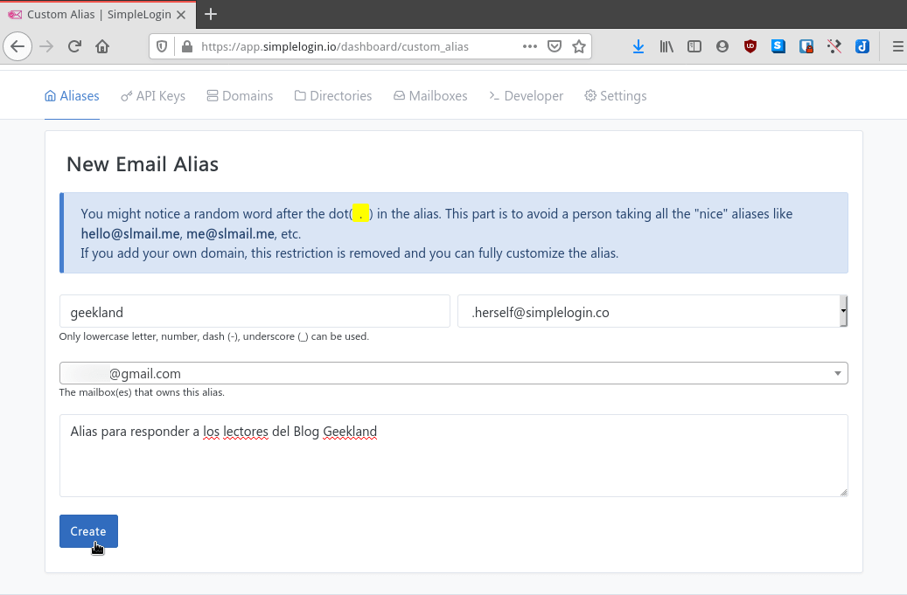](images/alias-creado.png)

El alias generado siempre estará activo hasta que nosotros mismo lo anulemos o lo bloqueemos. Cualquier persona que escriba un email al alías que acabamos de crear será recibido en nuestra cuenta de correo.

**Nota:** Una vez eliminado un alias nadie más lo podrá usar.

### Como recibir emails de un tercero mediante un alias

Una vez creado el alias lo proporcionamos a una tercera persona. Esta tercera persona abrirá su cuenta de hotmail y nos enviará un email introduciendo nuestro alias en la dirección de envío.

[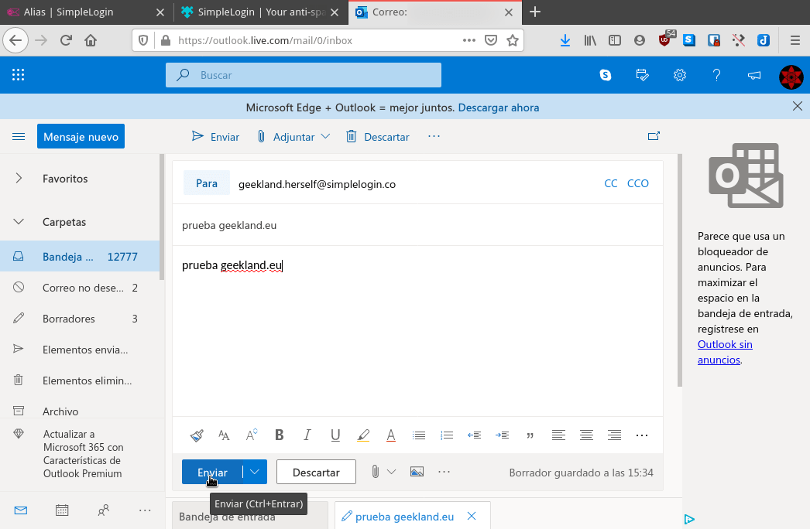](images/enviar-mail-con-un-alias.png)

Una vez enviado el correo nos dirigiremos a nuestro cuenta de correo. Después de consultarla veremos que el email nos ha llegado perfectamente. Además la dirección del receptor es la del alias y no nuestro email.

[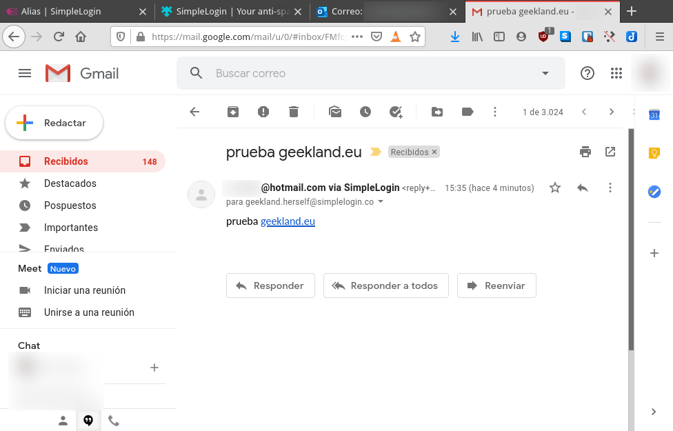](images/recepcion-email-enviado-desde-alias.png)

Si ahora pretendemos responder el correo que acabamos de recibir lo podemos hacer sin problema. Justo en el momento de responder se creará un alias reverso y de este modo el receptor nunca verá nuestra dirección de email.

[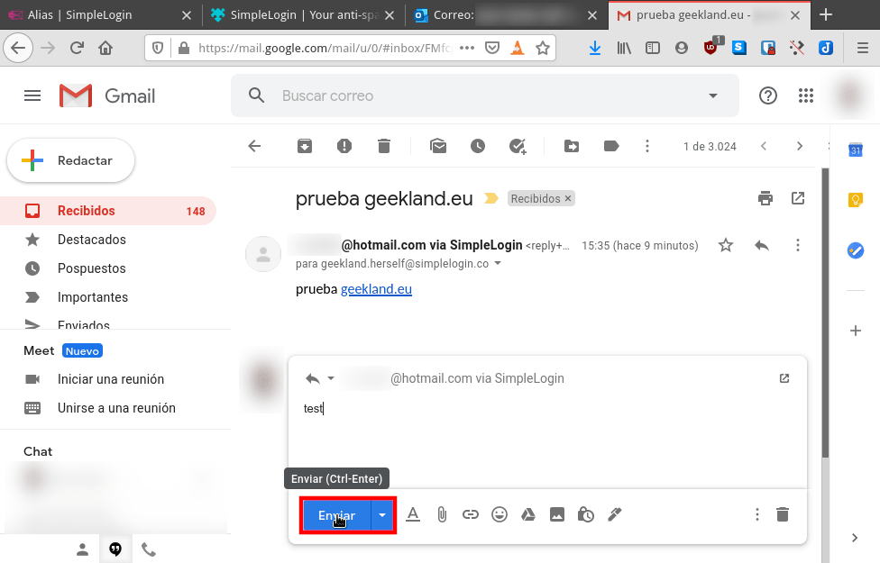](images/responder-un-email-de-un-alias.png)

### Enviar emails mediante un alias reverso

Podemos enviar emails con nuestro alias, pero antes tendremos que crear una alias reverso. Para ello accedemos en el apartado **Aliases** del panel de control de SimpleLogin. Acto seguido presionamos el botón **Send Email** del alias que creamos y que queremos usar para enviar el email.

[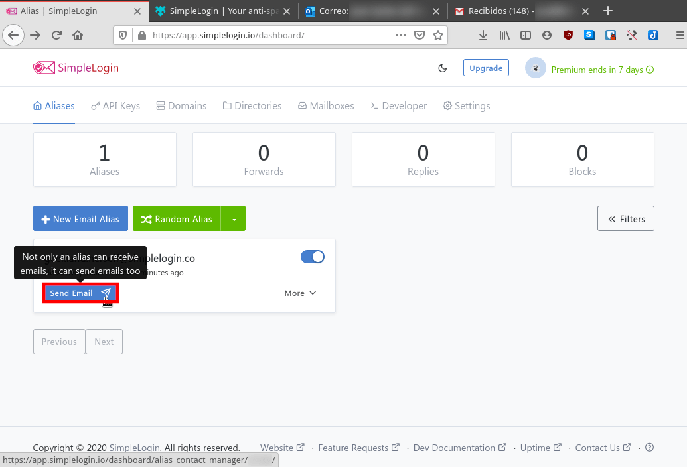](images/enviar-email-mediante-alias-reverso.png)

Acto seguido, en el único campo que aparece en pantalla escribimos la dirección de correo a la que queremos enviar el email y presionamos el botón **Create reverse-alias**.

[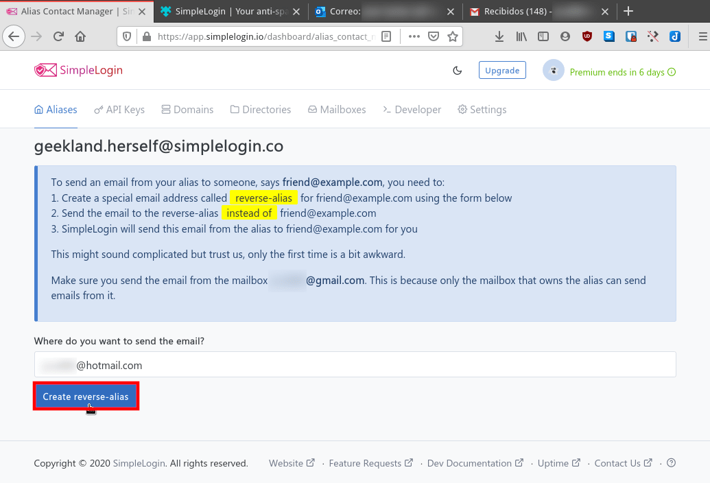](images/creacion-del-alias-reverso.png)

Justo después de presionar el botón se creará el alias reverso. Una vez creado cliquen sobre el botón **Copy reverse-alias**. De esta forma el alias reverso se copiará en el portapapeles.

[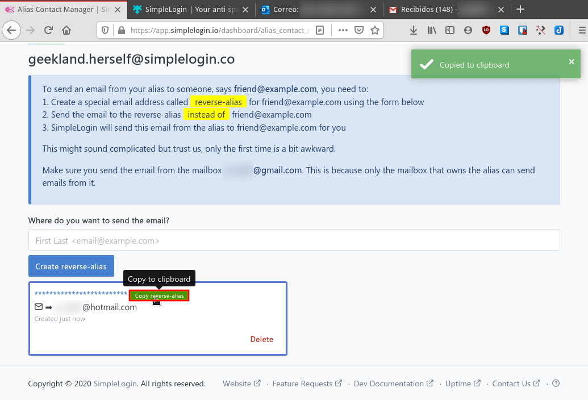](images/copiar-el-alias-reverso.png)

**Nota:** El alías reverso que acabamos de copiar servirá para enviar emails a la dirección de email que hayamos definido. Esté alias reverso es permanente a no ser que lo eliminemos.

Seguidamente se van a su cuenta de email y en el campo donde introducen la dirección de envío pegan el alías inverso que acaban de generar. A continuación escriben el email y lo envían.

[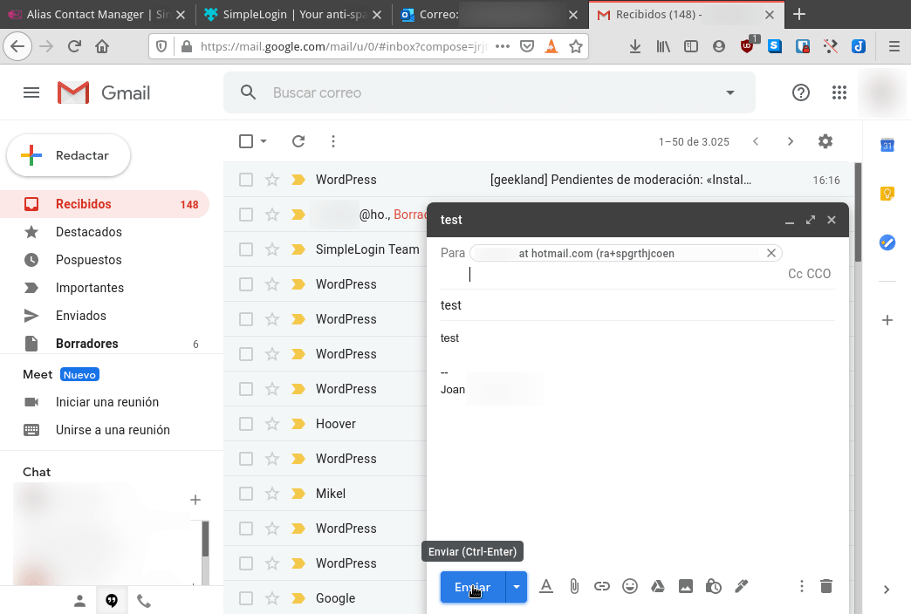](images/enviar-un-email-con-el-alias-reverso.png)

Después de enviarlo verán que el receptor recibe el email sin ningún tipo de problema.

[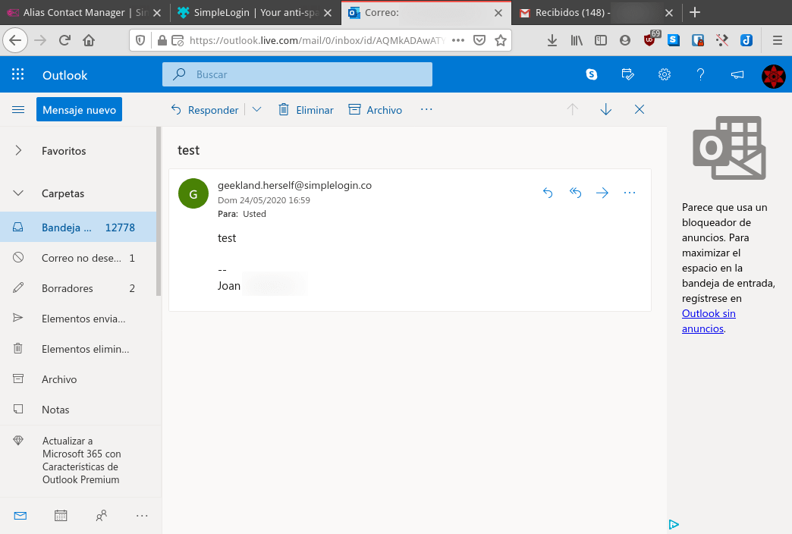](images/email-recibido-enviado-mediante-alias-inverso.png)

## CREAR UN ALIAS DE NUESTRO EMAIL SIN TENER QUE ACCEDER AL PANEL DE SIMPLELOGIN NI USAR NINGÚN PROGRAMA O EXTENSIÓN

Existe la posibilidad de crear alias de forma completamente automática y sin necesidad de entrar en el panel de administración web. Para ello podemos tendremos que acceder al panel de administración web y clicar en la pestaña **Directorios**.

[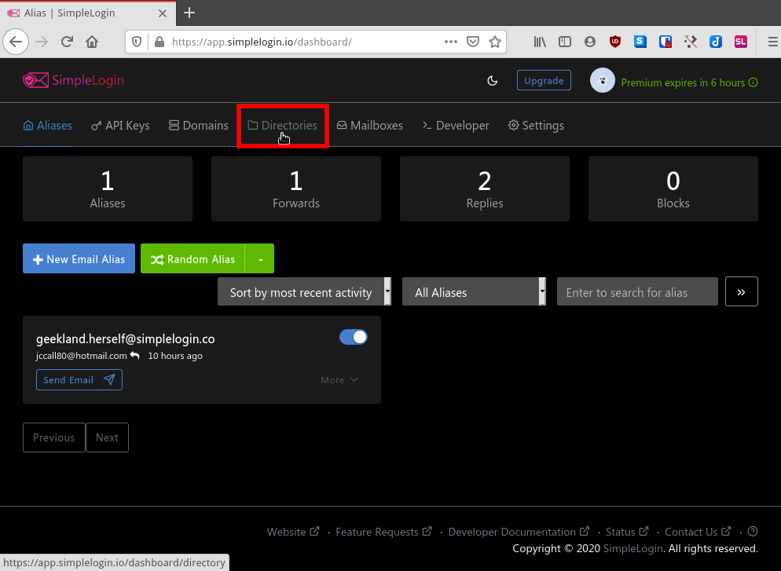](images/acceder-a-la-configuracion-de-directorio-de-alias.png)

Acto seguido en el campo **New Directory** escribiremos una palabra cualquiera que formará la parte inicial de nuestro alias y presionamos el botón **Create**. En mi caso la palabra seleccionada a sido testgeeklandeu

[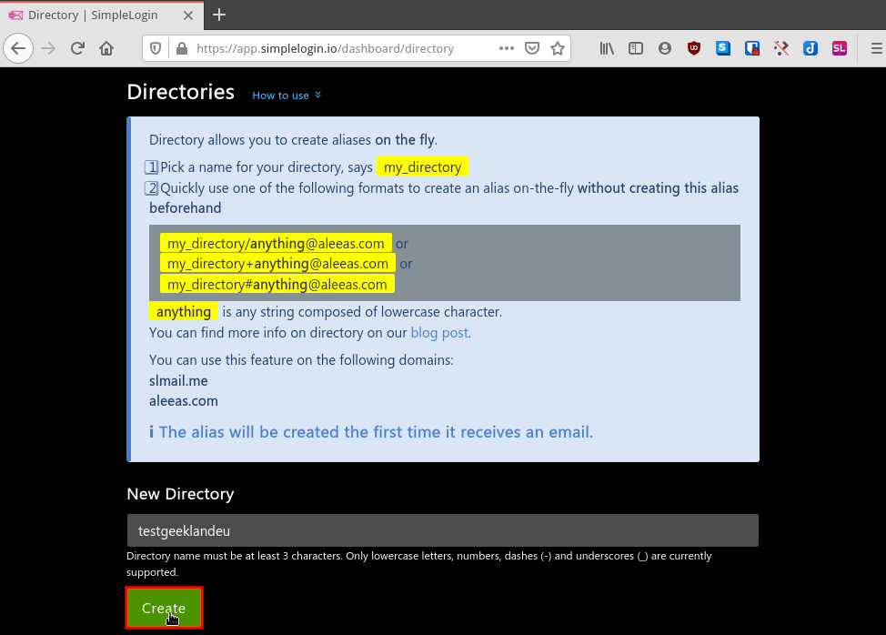](images/crear-un-directorio-de-alias.png)

Una vez creado el dominio testgeeklandeu podemos crear tantos alias como queramos de forma automática.

Imaginemos que alguien nos pide el email y no tenemos creado ningún alias. Si se lo queremos dar de forma inmediata tan solo tenemos que proporcionarle una dirección del siguiente tipo:

> ```
> directorio+cualquier_palabra@aleeas.com
> directorio+cualquier_palabra@slmail.me
> directorio/cualquier_palabra@aleeas.com
> directorio/cualquier_palabra@slmail.me
> directorio#cualquier_palabra@aleeas.com
> directorio#cualquier_palabra@slmail.me
> ```

Como el directorio que acabo de crear es testgeeklandeu daré la siguiente dirección a la persona que me ha pedido el email:

> ```
> testgeeklandeu+geekland@aleeas.com
> ```

La persona a la que le he dado la dirección me enviará un email.

[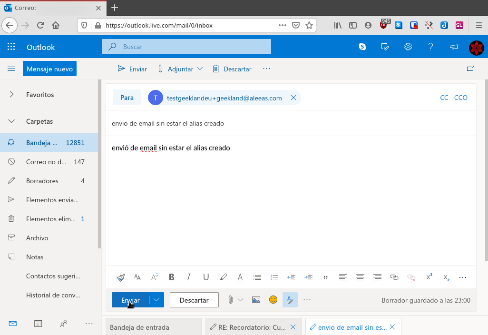](images/enviar-email-mediante-un-directorio-de-alias.png)

Una vez enviado el email lo recibiré sin problema alguno.

[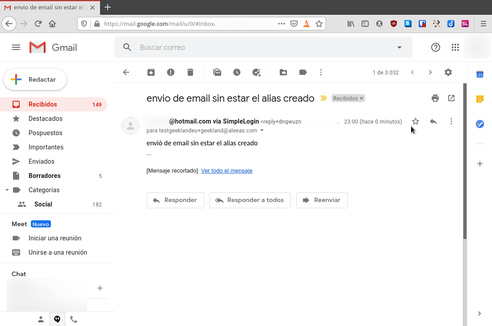](images/email-recibido-mediante-un-directorio-de-alias.png)

Si ahora accediéramos al panel de administración de SimpleLogin veríamos que el alias se ha generado de forma automática.

## QUE PUEDE HACER UN USUARIO FREE DE SIMPLELOGIN

Hemos dicho que SimpleLogin es un servicio Freemium. El servicio Freemium nos permite realizar lo siguiente:

1. Crear un máximo de 15 alías
2. Enviar, recibir y responder tantos correos como queramos.
3. Usar las extensiones de [Chrome](https://chrome.google.com/webstore/detail/simplelogin-your-anti-spa/dphilobhebphkdjbpfohgikllaljmgbn), [Firefox](https://addons.mozilla.org/es/firefox/addon/simplelogin/) o Safari para crear y gestionar nuestros alias de forma sencilla.
4. Usar la aplicación de iOS o [Android](https://play.google.com/store/apps/details?id=io.simplelogin.android).

Si pretenden crear un número ilimitado de alias, crear alias personalizados, crear directorios de alias o cifrar el envío de emails deberéis pagar una suscripción de SimpleLogin.

## CONSIDERACIONES Y REFLEXIONES SOBRE SIMPLELOGIN

Existe la posibilidad que los alias creados sean detectados como correo no deseado o no sean entregados por ser considerados Spam. Por este motivo SimpleLogin guarda una copia de los correos que se envían a nuestro alias durante 7 días. Después de 7 días el correo será completamente borrado.

Por lo tanto:

1. SimpleLogin puede tener acceso a los correos enviados a través del alias.
2. Si SimpleLogin cierra existe la remota posibilidad que podamos perder el acceso a alguno de los servicios al que nos suscribimos usando el alias.

Si os preocupan estos aspectos existen las siguientes soluciones:

1. Pagar el servicio Premium y de este modo podremos cifrar los correos electrónicos con nuestra propia clave PGP. De esta forma SimpleLogin no tendrá acceso al contenido de nuestros correos.
2. Autoalojar vosotros mismos el servicio. De este modo seréis vosotros quien tiene el control total sobre el servicio.

En mi caso estoy usando el servicio gratuito que ofrece SimpleLogin. De momento solo puedo decir que funciona perfectamente y para el uso que yo le daré la versión Free es suficiente.
