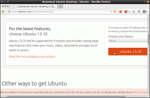
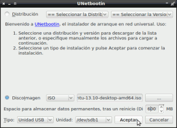
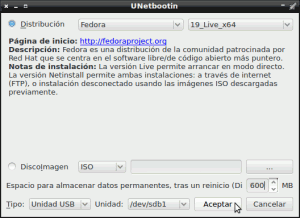
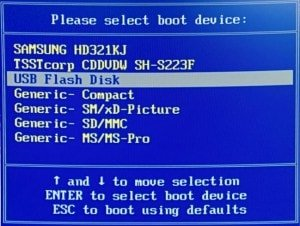
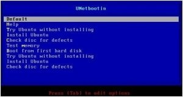

Muchas son las veces en las que hay que explicar a usuarios como realizar un LiveUSB para poder realizar las siguientes funciones:<!--more-->

1. Probar una distribución de Linux en modo LiveUSB sin tenerla que instalar en su ordenador.
2. Instalar un sistema operativo Windows en un ordenador personal que no tiene unidad de CD/DVD.
3. Instalar un sistema operativo Linux en un ordenador que no dispone de unidad de CD/DVD.
4. Intentar reparar ciertas funcionalidades de un sistema operativo dañado.
5. Recuperar información como fotos, documentos, etc de un disco duro que tiene el sistema operativo dañado y por lo tanto no arranca.
6. Instalar un sistema operativo Linux con persistencia en una memoria USB para poder tener tu propio sistema operativo y archivos disponibles en cualquier lugar y en cualquier ordenador.

###### Nota: Seguramente existen otras utilidades aparte de las que acabo de citar. No obstante las utilidades citadas pienso que son los usos más habituales que la mayoría de usuarios dan a un liveUSB.

## UTILIDADES PARA PODER CREAR UN LIVEUSB

La verdad es que existen multitud de programas para crear un LiveUSB. Seguidamente les hago una breve lista para que tengan varias opciones para elegir:

**Universal USB Installer:** Lo pueden descargar del siguiente [enlace](http://www.pendrivelinux.com/universal-usb-installer-easy-as-1-2-3/ "Web descarga Universal USB Installer"). Este programa funciona bajo windows y es útil para realizar un LiveUSB para probar multitud de distribuciones Linux. Simplemente tendrán que indicar la distribución Linux que quieren probar, indicar donde tienen guardada la ISO de la distro que quieren probar y finalmente indicar la memoria USB en la que quieren instalar el LiveUSB.

**Yumi Multiboot USB Creator:** Lo pueden descargar del siguiente [enlace](http://www.pendrivelinux.com/yumi-multiboot-usb-creator/ "Web de descarga de Yumi"). Este programa funciona bajo windows y bajo Linux. Su interfaz y uso es prácticamente idéntico a Universal USB Installer. La principal diferencia entre ellos es que Yumi permite que en una sola memoria USB se pueda alojar más de una distro en modo LiveUSB.

**Windows 7 USB/DVD Download tool:** Programa propuesto por Microsoft para poder hacer un LiveUSB para instalar Windows en tu ordenador a partir de una memoria USB. Este programa lo pueden descargar del siguiente [enlace](http://www.microsoftstore.com/store?Action=html&Locale=en_US&SiteID=msusa&pbPage=Help_Win7_usbdvd_dwnTool#installation "Web descarga para USB instalable de Windows").

**Unetbootin:** Es el programa que acostumbro a usar yo. Es multiplataforma y por lo tanto lo podrán usar tanto usuarios de windows, linux y Mac. Si quieren más información la pueden encontrar en el siguiente [enlace](http://unetbootin.net/ "Web de Unetbootin"). Más adelante en el post veremos como usar Unetbootin.

**LiveUSB Install:** Utilidad multiplataforma que se puede usar tanto en Linux como en windows. Muy similar al resto de opciones que hemos comentado. Si quieren usar les dejo el siguiente [enlace](http://live.learnfree.eu/ "Web de LiveUSB Install") en el que se indicar como instarlo y usarlo.

###### Nota: El funcionamiento de la totalidad de programas es similar. Si saben como usar uno de los programas sabrán como usar los demás. Por lo tanto en la realización de este tutorial me centraré en explicar el procedimiento con Unetbootin. Es el programa que utilizo habitualmente y tiene la ventaja que es multiplataforma y está disponible en prácticamente la totalidad de distribuciones Linux.

## REALIZAR UN LIVEUSB CON UNETBOOTIN

#### ¿Qué necesitamos para realizar un LiveUSB?

Básicamente necesitamos lo siguiente:

1. **Una memoria USB**. Para obtener un rendimiento óptimo se aconseja una memoria USB con una velocidad de lectura y escritura aceptable y más de 2GB de de capacidad. Aconsejo formatear la memoria USB en formato FAT32. Formatos como el NTFS acostumbran a generar problemas a la hora de crear el espacio de persistencia.
2. **Un ordenador** con el sistema operativo Linux , Windows o Mac que permita el arranque mediante una memoria USB.

#### Instalar Unetbootin

Para instalar Unetbootin en Linux es extremadamente fácil. Tan solo tiene que acceder a la terminal y **teclear el siguiente comando**:

> ```
> sudo apt-get install unetbootin
> ```

En el caso de querer usar unetbootin en Windows o Mac tienen que descargar el archivo ejecutable del siguiente enlace:

[http://unetbootin.sourceforge.net/](http://unetbootin.sourceforge.net/ "Web de descarga del programa Unetbootin")

Una vez descargado lo instalan en vuestros sistema operativo de forma habitual.

#### Descargar la Imagen ISO del sistema operativo que queremos usar

Tenemos que **descargarnos la imagen ISO del sistema operativo que queremos tener en nuestro LiveUSB**. Tenéis que asegurar que la ISO que descargáis tenga soporte para poder funcionar como LiveUSB.

En mi caso he seleccionado la ISO de Ubuntu. La ISO de ubuntu se puede descargar de la siguiente Ubicación.

[http://www.ubuntu.com/download/desktop](http://www.ubuntu.com/download/desktop "Web de descarga de la ISO de Ubuntu")

En la siguiente captura de pantalla pueden observar el proceso de descarga de la ISO de ubuntu:

[](images/1-Descargar-ISO-de-Ubuntu.png)

###### Nota: Al descargar la ISO tenéis que tener en cuenta una serie de aspectos. El primero es que la ISO este diseñada para funcionar en modo LiveUSB, y el segundo es elegir la arquitectura adecuada en función de vuestro ordenador. Los ordenadores que ya tienen muchos años acostumbran a trabajar con la arquitectura i386 mientras que los ordenadores actuales pueden trabajar con la arquitectura i386 y amd64.

#### Formatear nuestra memoria USB

El paso de formatear una memoria USB es simple y no requiere de muchas explicaciones. Quien no sepa como hacerlo puede consultar el siguiente [enlace]() en donde se comenta como formatear una memoria USB mediante gparted.

**Una vez se ha formateada la memoria USB hay que sacar el pendrive del ordenador.**

#### Crear un LiveUSB

**Ahora volvemos a insertar la memoria USB en nuestro ordenador**. Seguidamente iniciamos unetbootin. Para iniciar Unetbootin solo hay que **introducir el siguiente comando en la terminal**:

> ```
> sudo unetbootin
> ```

Una vez iniciado Unetbootin se encontrarán con un menú parecido al siguiente:

[](images/2-Menu-inicial-de-Unetbootin.png)

En el menú que podemos ver en la captura de pantalla los pasos a realizar son los siguientes:

1. **En** el apartado **DiscoImagen** tenemos que **seleccionar el archivo ISO** de Ubuntu que acabamos de descargar de la página de Ubuntu.
2. Seguidamente **en el menú** **Tipo** tenemos que **asegurarnos que esta seleccionada la opción** **Unidad USB**.
3. **En** el campo **Unidad** tenemos que **seleccionar el nombre con el que se reconoce nuestra memoria USB**. En mi caso es **sdb1**.
4. Finalmente solamente nos queda **indicar el espacio de persistencia que queremos dar a nuestro LiveUSB**. En mi caso como la memoria USB es de 2GB le daré **600 MB**.

Una vez realizados todos los pasos vuestro menú tendrá un aspecto similar al siguiente:

[](images/3-Parámetros-establecidos.png)

Ahora simplemente presionamos encima del botón **Aceptar** y esperamos a que termine el proceso de creación del LiveUSB.

###### Nota: Es importante dar un espacio de persistencia ya que nos permitirá que cuando se apague el sistema operativo se almacenen nuestros datos y configuraciones en la memoria USB. Por lo tanto la próxima vez que arranquemos nuestro LiveUSB todo estará exactamente igual que como lo dejamos.

## OPCIÓN ALTERNATIVA DE UNETBOOTIN PARA REALIZAR EL LIVEUSB

Unetbootin dispone de un método alternativo para facilitar aún más la realización del LiveUSB. Si queremos Unetbootin se encargará de descargar la ISO por nosotros y de esto modo no nos tendremos que preocupar de ir a la página de Ubuntu, Fedora o cualquier otra distro para descargar su imagen ISO.

[](images/4-Opción-alternativa-de-Uso-de-Unetbootin.png)

Para ello una vez arrancado Untebootin **en vez de elegir la opción DiscoImagen, seleccionamos la opción Distribución**.

Una vez seleccionada esta opción **elegimos la distro y la versión que queremos que estén presentes en nuestro LiveUSB**. Tal y como se puede ver en la captura de pantalla en mi caso he elegido la versión 64 bits de Fedora 19.

El resto de pasos son exactamente iguales que en el caso anterior, por lo tanto:

1. **En el Menú** **Tipo** tenemos que **asegurarnos que esta seleccionada la opción** **Unidad USB**.
2. **En el campo** **Unidad** tenemos que **seleccionar el nombre con el que se reconoce nuestra memoria USB**. En mi caso es **sdb1**.
3. **Indicamos el espacio de persistencia** que queremos dar a nuestro LiveUSB. En mi caso como la memoria USB es de 2GB le daré **600 MB**.
4. Finalmente **presionamos encima del botón** **Aceptar** y esperamos a que termine el proceso de creación del LiveUSB.

## ARRANCAR EL ORDENADOR CON EL LIVEUSB

Una vez realizado el LiveUSB tan solo nos falta comprobar su funcionamiento. En este apartado cada uno deberá buscarse la vida por su cuenta ya que en cada ordenador este paso es diferente.

Los pasos que tengo que seguir en mi caso son los siguientes:

1- Lo primero a realizar es **conectar el LiveUSB en el ordenador**.

2- Lo segundo es **reiniciar nuestro ordenador**.

3- Justo al arrancar el sistema operativo y **cuando se está haciendo la comprobación de la memoria RAM, se tiene que presionar la tecla** **F8**. En vuestro caso es más que probable que la tecla a presionar sea diferente a F8. Tan solo tienen que ir probando hasta encontrar la combinación correcta. Algunas de las teclas a probar pueden ser **F2, F11, F12, F1, Delete**, etc.

4- Una vez presionada la tecla F8 les aparecerá la siguiente pantalla para seleccionar la unidad de arranque de nuestro ordenador:

[](images/5-Seleccionar-la-unidad-de-arranque.jpg)

5- En la pantalla para seleccionar el orden de arranque **seleccionamos la entrada que tenga relación con nuestro memoria USB**. En mi caso **USB Flash Disk**.

6- A los pocos segundos de seleccionar la opción arranque mediante USB les tiene que aparecer la siguiente pantalla:

[](images/6-arranque-unetbootin.jpg)

7- **Seleccionan la opción** **Try Ubuntu without installing**. Una vez seleccionada esta opción empezara a arrancarse el sistema operativo. **Tan solo tienen que esperar para comprobar que efectivamente todo funciona a la perfección.**

Saludos a todos y hasta la próxima.
