En pasados post vimos como conectarnos a un servidor VPN y además también vimos las numerosas ventajas y usos que nos puede aportar un servidor VPN en determinadas circunstancias. **Para quien quiera consultar de nuevo las ventajas y virtudes de un servidor VPN puede consultar el siguiente post**:

[https://geeklandlinux.github.io/posts/conectarse-a-un-servidor-vpn-gratis/]()

**Para** quien quiera **montar un servidor VPN** mediante el protocolo [pptpd](https://es.wikipedia.org/wiki/PPTP "Explicación del protocolo pptp") tan solo tienes que **seguir leyendo este post**.<!--more-->

## ¿QUÉ NECESITAMOS PARA MONTAR NUESTRO PROPIO SERVIDOR?

**Lo único que necesitamos para montar nuestro propio servidor VPN es un viejo ordenador que no usemos**, o nuestro propio ordenador personal.

Para poder instalar el servidor VPN siguiendo las instrucciones de este tutorial tienen que tener instalado [Debian](http://www.debian.org/distrib/ "Descargar Debian") o cualquier distro que se derive de Debian como por ejemplo pueden ser, [Ubuntu](http://www.ubuntu.com/download/desktop "Descargar Ubuntu"), [Xubuntu](http://xubuntu.org/getxubuntu/ "Descargar Xubuntu"), [Crunchbang](http://crunchbang.org/download/ "Descargar Crunchbang"), [Linux Mint](http://www.linuxmint.com/download.php "Descargar Linux Mint"), etc.

###### Nota: Si queremos que nuestro servidor VPN esté disponible un requisito indispensable es tener el ordenador en que tenemos instalado el servidor encendido.

## INSTALAR EL SERVIDOR

Para instalar el servidor VPN en nuestro ordenador tan solo **tenemos que teclear el siguiente comando el terminal**:

> ```
> sudo apt-get install pptpd
> ```

[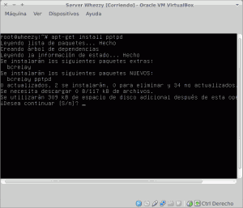](images/1-instalar-pptpd.png)

## ASEGURAR QUE NUESTRO SERVIDOR VPN TENGA IP INTERNA FIJA

**Tenemos que hacer que la IP interna de nuestro servidor VPN sea fija** ya que sino cuando recibamos una petición desde el exterior nuestro router no sabrá a que ordenador de nuestra red tiene que redireccionar nuestra petición.

**Para conseguir que nuestro servidor tenga una ip interna fija les recomiendo seguir las pasos que se describen en el siguiente post**:

[https://geeklandlinux.github.io/posts/configurar-ip-fija\_o\_estatica\_ipv4/]()

###### Nota: El método descrito en el enlace que acabo de citar es válido en el caso que estéis usando un servidor sin entorno gráfico. En el caso que estéis usando un servidor con entorno gráfico los cambios los tendréis que aplicar desde vuestro gestor de redes que seguramente serán [network manager](https://projects.gnome.org/NetworkManager/ "Web de Networkmanager") o [wicd](http://wicd.sourceforge.net/ "Web de Wicd").

Una vez terminados los pasos descritos en el link que les he dejado nuestro servidor tendrá ip fija. Con el comando **sudo ifconfig** podemos podemos ver que la IP fija de nuestro servidor VPN es la **192.168.1.188**.

[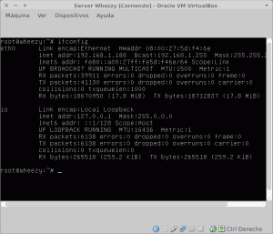](images/2-Comprobar-la-ip-del-servidor.png)

## SERVICIO DE REDIRECCIONAMIENTO DINÁMICO NO-IP

Una vez tengamos instalado y funcionando nuestro servidor VPN **lo más probable es que queramos o necesitemos acceder desde el exterior a nuestro servidor VPN, para por ejemplo establecer una conexión a internet segura en un sitio público peligroso e inseguro como puede ser un aeropuerto o cafetería.**

**Para conectarnos desde el exterior tenemos que conocer la IP Pública de nuestro servidor que en la mayoría de casos será dinámica o variable**. Esto significa que en el momento de conectarnos es posible que no sepamos la IP Pública de nuestro servidor. **Para solucionar este problema lo que vamos a realizar es asociar la IP Pública de nuestro servidor VPN con un dominio fácil de recordar que en mi caso será** **geekland.sytes.net**.

**Para asociar vuestra dirección IP Pública a un subdominio tan solo tiene que seguir los pasos que se detallan en el siguiente enlace**:

[https://geeklandlinux.github.io/posts/encontrar-servidor-con-dns-dinamico/]()

## CONFIGURAR EL SERVIDOR

Una vez realizados la totalidad de pasos que acabamos de citar ya podemos pasar a configurar el servidor VPN. **Para configurar nuestro servidor tenemos que ingresar el siguiente comando en la terminal**:

> ```
> sudo nano /etc/pptpd.conf
> ```

Como se puede ver en la imagen, una vez tecleado el comando se abrirá el editor de texto en el que podremos modificar la configuración de nuestro servidor.

[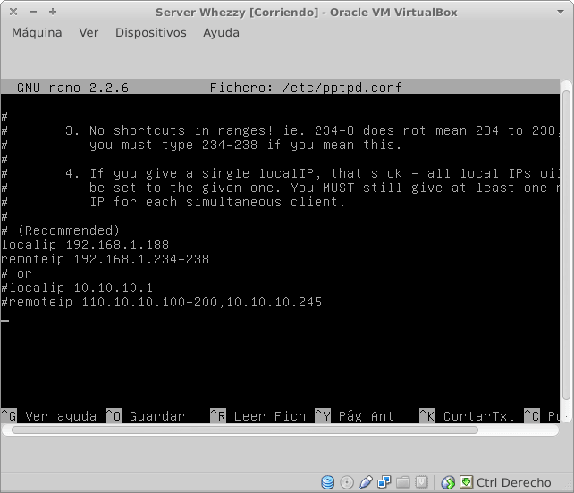](images/3-Configurar-pptpd.png)

En este fichero **únicamente vamos a modificar dos parámetros**:

**El primero de los parámetros a modificar es localip**. **En localip tenemos que poner la IP interna de nuestro servidor VPN**. Como hemos visto en apartados anteriores la ip de nuestro servidor VPN es la 192.168.1.188. Por lo tanto tenemos asegurarnos que el siguiente comando estará introducido en el navegador:

> ```
> localip 192.168.1.188
> ```

**El segundo de los parámetros a modificar es remoteip**. **En remoteip tenemos que indicar un rango de IP que serán las que nuestro servidor asignará a las máquinas clientes que se conecten a nuestro servidor VPN**. En mi caso he asignado el siguiente rango:

> ```
> remoteip 192.168.1.234-238
> ```

Por lo tanto **en el servidor VPN que acabamos de configurar como máximo se podrán conectar 4 clientes de forma simultánea que tendrán una IP comprendida entre 192.168.1.234 – 192.168.1.238**. Una vez el cliente se haya conectado pasará a formar parte de la red local en que se halla el servidor VPN.

## ELEGIR EL NOMBRE DEL SERVIDOR

**El nombre estándar de nuestro servidor VPN es pptpd**. A mi el nombre por defecto del servidor me parece correcto y por lo tanto lo voy a dejar tal cual.

En el caso que alguien precise o quiera cambiar el nombre del servidor VPN lo puede hacer de la siguiente forma. **Tan solo tiene que teclear el siguiente comando en la terminal**:

> ```
> sudo nano /etc/ppp/pptpd-options
> ```

[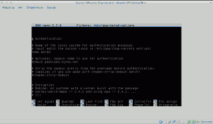](images/4-nombre-servidor.png)

Una vez abierto el editor de textos tan solo como tan solo tienen que **localizar la linea que pone**:

> ```
> name pptpd
> ```

Una vez localizada tan solo hay que **reemplazar** **pptpd** **por el nombre que quieran**.

Dentro de este fichero también es recomendable consultar que las siguientes lineas estén descomentadas:

**require­mschap­v2 :** Esta linea define que el protocolo de autenticación del cliente al servidor se realizará mediante el protocolo mschap-v2. **require­mppe­128 :** Esta linea define que el tráfico entre cliente y servidor irá cifrado con una capa de cifrado de 128 bits MPPE. **ms-dns 8.8.8.8**: Esta línea hay que introducirla para asegurar que las peticiones DNS se resuelvan adecuadamente. En vez de los DNS de google se pueden usar otros. **ms-dns 8.8.4.4:** Esta línea hay que introducirla para asegurar que las peticiones DNS se resuelvan adecuadamente. En vez de los DNS de google se pueden usar otros.

El resto de configuración dentro en principio es válido para nuestros propósitos.

## AÑADIR USUARIOS A NUESTRO SERVIDOR VPN

Ahora el siguiente paso es crear cada uno de los usuarios que se podrán conectar a nuestro servidor VPN. Para ello en la terminal tan solo tienen que **teclear el siguiente comando**:

> ```
> sudo nano /etc/ppp/chap-secrets
> ```

Una vez tecleado el comando aparecerá el editor de texto con un contenido parecido al siguiente:

[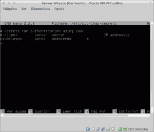](images/5-Configurar-usuarios.png)

Como se puede ver **dentro del editor de texto tenemos que introducir los datos para los siguientes parámetros:**

**Client:** **En este campo tenemos que** **asignar el nombre de usuario**. En mi caso he elegido que el nombre de usuario sea **usuariovpn**.

**Server:** **En este campo tenemos que indicar el nombre del servidor**. El nombre del servidor por defecto es **pptpd**. Si en el apartado anterior cuando hemos accedido dentro de /etc/ppp/pptpd-options hemos cambiado el nombre del servidor entonces deberemos sustituir pptpd por el nombre que elegimos.

**Secret:** **En este campo tenemos que definir la contraseña de conexión para el usuario usuariovpn**, al servidor VPN. En mi caso el password que he elegido es “**unamierda**”

**IP addresses:** En este campo pondré un **\***. De este modo al cliente que se conecta se le asignará cualquier IP comprendida entre **192.168.1.234 y 238**. En el caso que quisiéramos que el cliente usuariovpn tuviera siempre la IP **192.168.1.236** tan solo deberíamos reemplazar el \* por **192.168.1.236**.

###### Nota: Dentro de este fichero podemos introducir tantos clientes como nuestra red y rango de IP's definidos nos permitan.

## CONFIGURAR IPTABLES PARA EL ENRUTAMIENTO DE PETICIONES

El siguiente paso es configurar nuestro Firewall Netfiler para que el servidor VPN pueda enrutar adecuadamente las peticiones de los clientes que se conectarán al servidor VPN.

**Para que el enrutamiento se realizar correctamente lo primero que tenemos que hacer es habilitar el IP Forwarding. Para habilitar permanentemente el IP Forwarding tenemos que teclear el siguiente comando en la terminal:**

> ```
> sudo nano /etc/sysctl.conf
> ```

Una vez tecleado este comando nos aparecerá la siguiente pantalla:

[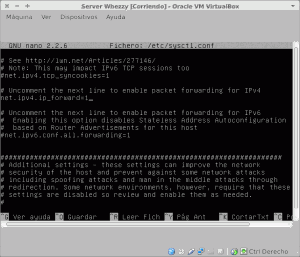](images/6-Habilitar-IP-Forwarding.png)

Una vez abierto el editor de textos tenemos que **buscar la siguiente linea:**

> ```
> #net.ipv4.ip_forward=1
> ```

**Una vez encontrada la tenemos que descomentar**. Para descomentarla quitamos el símbolo # quedando de la siguiente forma:

> ```
> net.ipv4.ip_forward=1
> ```

Guardamos los cambios y cerramos el archivo.

**En estos momentos** el IP forwarding está habilitado y **los equipos que forman parte de nuestra red privada VPN se podrán comunicar entre ellos. Pero no lo podrán hacer con redes externas públicas** como por ejemplo podría seria conectarse a la página web de facebook.

**Para solucionar este problema** **tendremos que introducir una regla en el firewall**. Para introducir la regla que soluciona este problema tenemos que introducir el siguiente comando en la terminal:

> ```
> sudo nano /etc/rc.local
> ```

Una vez se ha abierto el editor de texto tendremos que introducir la siguiente orden:

> ```
> iptables -t nat -­A POSTROUTING ­-s 192.168.1.0/24 ­-o eth0 ­-j MASQUERADE
> ```

Una vez finalizado el proceso vuestra pantalla tiene que tener un aspecto similar al siguiente:

[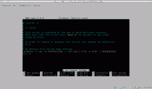](images/7-Configurar-el-Firewall.png)

El significado de la regla introducida es el siguiente:

**iptables:** Es la herramienta que utilizamos para introducir las reglas de filtrado al Firewall netfiler.

**\-t nat:** Esta parte del comando **indica que la regla que vamos a introducir afecta a la** [tabla NAT](https://es.wikipedia.org/wiki/Network_Address_Translation "Explicación de lo que es la tabla NAT"). La tabla NAT (Nertwork Address Translation) es un mecanismo de taducción de IP y puertos que utilizan los routers, o en este caso nuestro servidor proxy, para intercambiar paquetes o trasladar solicitudes entre 2 redes incomptabiles entre si como pueden ser nuestra red privada y una red pública.

###### Nota: Un ejemplo básico de lo que hace la tabla NAT es el siguiente. Cada vez que nos queremos conectar a una página web la tabla NAT traduce nuestra IP Privada del tipo 192.168.1.x a una dirección IP Pública que es la que tiene nuestro Router. Una vez se ha hecho la traducción de nuestra IP Privada a nuestra IP pública se podrá realizar la conexión entre las 2 redes y conectarnos a la página que queremos visitar.

**\-A POSTROUTING:** En este paso **lo que estamos definiendo es que la regla que vamos a añadir la vamos a introducir a una cadena llamada POSTROUTING**. De esta forma podremos organizar mejor el tráfico de nuestro firewall ya que las reglas las tendremos organizadas por cadenas.

**\-s 192.168.1.0/24:** **Especificamos el origen de los paquetes a los que se aplicará la regla**. En este caso la regla se aplicará a la totalidad de equipos de nuestra red local.

**\-o eth0:** Con este comando estamos indicando que **la totalidad de peticiones que recibamos a nuestro VPN  se tendrán que entregar a la red exterior utilizando la interfaz de salida eth0**.

**\-j MASQUERADE:** Con este comando lo que estamos haciendo es determinar la regla que se tiene que cumplir. En este caso la regla que se debe cumplir es MASQUERADE. **Lo que hace MASQUERADE es decirle al servidor VPN que cuando reciba una petición de la red local 192.168.1.0/24 para conectarse a una red pública, proceda el mismo a enviar esta petición en representación del cliente**. Una vez se haya procesado la petición y el servidor VPN haya recibido la respuesta la redirigirá a la máquina que realizo la petición.

###### Nota: Entender el comando que acabo de citar punto por puento lo considero importante para comprender el funcionamiento de un servidor VPN.

## ABRIR LOS PUERTOS DEL ROUTER

**Para poder acceder desde el exterior a nuestro servidor VPN tenemos que configurar adecuadamente nuestro router**.

El router será el encargado de redirigir la totalidad de peticiones exteriores a nuestro servidor VPN. Para que nuestro router pueda realizar esta función tenemos que **abrir nuestro navegador y teclear nuestra puerta de entrada**. Seguidamente, tal y como se puede ver en la captura de pantalla se nos pedirá nuestro nombre de usuario y contraseña:

[](images/8-Acceder-al-Router.png)

Una vez introducida la información accederemos a la configuración de nuestro router. Seguidamente, tal y como se puede ver en la captura de pantalla, **tenemos que acceder a los menús** **Advanced / NAT / Virtual Servers**:

[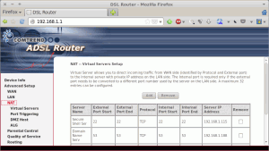](images/9-Acceder-a-Virtual-Servers.png)

Seguidamente **presionamos el botón** **Add** y nos aparecerá la siguiente pantalla:

[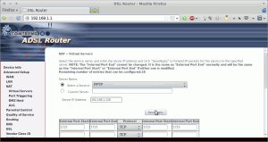](images/10-Configurar-el-Router.png)

**En** el menú desplegable **Select a service** **tienen que elegir la opción PPTP**. De este modo estaremos abriendo el puerto **1723** que es el puerto estándard de nuestro servidor VPN pptp.

**En** el campo **Server IP Address** tenemos que **seleccionar la IP de nuestro servidor** que como hemos visto anteriormente es **192.168.1.188**.

De esta forma todas las peticiones exteriores que llegen a nuestro router por el puerto 1723 serán redirigidias a nuestro servidor VPN.

## COMPROBAR QUE EL SERVIDOR FUNCIONA ADECUADAMENTE

Para comprobar si nuestro servidor VPN funciona tan solo tenemos que intentar conectarnos a él. Para ello primero lo intentaremos con un teléfono Android y seguidamente con Linux.

### Conectarse a nuestro VPN a través de Android

Para conectarnos al VPN tenemos que **ir a los ajustes** de nuestro teléfono. Una vez dentro como se puede ver en la imagen **presionamos** **Más...**

[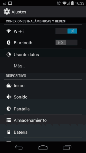](images/11-Acceso-a-Mas.png)

Seguidamente tenemos que **presionar sobre la opción** **VPN** y aparecerá la siguiente pantalla:

[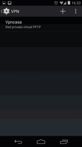](images/12-Conectarse-al-servidor.png)

**Presionamos sobre el símbolo +** **e introducimos los datos de nuestro servidor VPN** tal y como se muestra en la siguiente captura de pantalla:

[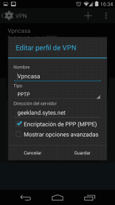](images/13-Configurar-el-cliente-VPN.png)

En **Nombre** podemos elegir el que más nos guste. En **tipo de servidor** tenemos que seleccionar la opción **PPTP** y finalmente en **dirección del servidor** lo único que **tenemos que poner es la IP pública de nuestro servidor**. En nuestro caso hemos asociado la IP pública de nuestro servidor al dominio **geekland.sytes.net**. Por lo tanto pondremos **geekland.sytes.net**.

Una vez realizados todos los pasos presionamos **guardar**. Una vez hayamos presionado guardar les quedará una pantalla parecida a la siguiente:

[](images/12-Conectarse-al-servidor.png)

**Presionamos encima del VPN** “**Vpncasa**” que acabamos de introducir y seguidamente, **y** como se puede ver en la captura de pantalla **se nos preguntará nuestro usuario y contraseña:**

[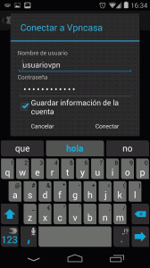](images/14-Datos-de-conexión.png)

**Una vez hemos introducido nuestro nombre de usuario y contraseña** tan solo nos falta **presionar** en **conectar**. Una vez hechos todos los pasos, como se puede en la captura de pantalla, ya estamos conectados y podemos navegar y usar el teléfono tranquilamente.

[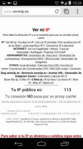](images/15-Comprobación-del-funcionamiento.png)

Como se puede ver en la captura de pantalla si comprobamos la IP con la que estamos conectados veremos que no es la IP pública del sitio donde estamos, sino que es la IP Pública de nuestro servidor VPN.

### Conectarse a nuestro VPN a través de Linux

Si necesitamos conectarnos a nuestro servidor VPN en un ordenador con GNU Linux el proceso es fácil. Tan solo tenemos **irnos a icono de nuestro gestor de redes que esta nuestro panel, y seleccionar las opciones que se pueden ver en la siguiente captura de pantalla**:

[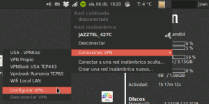](images/16-Inicio-de-la-configuración.png)

Después de **seleccionar la opción** **Configurar VPN,** aparecerá la siguiente pantalla:

[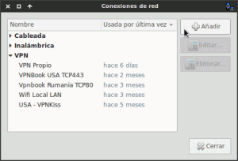](images/17-Añadir-VPN.png)

Como se puede ver en la captura de pantalla tan solo tienen que **presionar el botón Añadir**. Una vez hemos presionado Añadir aparecerá otra ventana:

[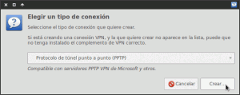](images/18-Elección-del-protocolo.png)

Tal y como puede verse en la captura de pantalla, **en el menú desplegable tienen que elegir la opción** **protocolo de túnel punto a punto (PPTP)**. **Seguidamente presionaremos al botón** **Crear...**

Una vez presionado el botón Crear aparecerá la siguiente ventana:

[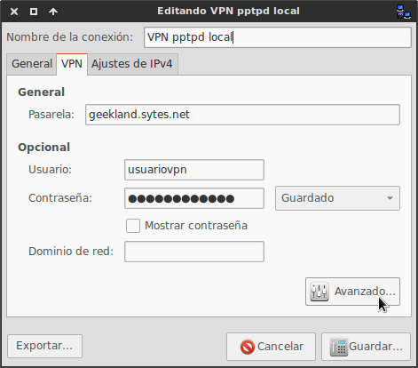](images/19-Intoducción-del-usuario-y-contaseña.png)

Como se puede ver en la captura de pantalla en está ventana **tenemos que indicar el** **nombre de la conexión**, la **IP Pública de nuestro servidor**, nuestro **nombre de usuario** **y** finalmente nuestra **contraseña**.

**Una vez introducidos todos estos datos tenemos que clicar encima del botón que pone** **Avanzado...** Una vez hayamos presionado sobre el botón aparecerá la siguiente pantalla:

[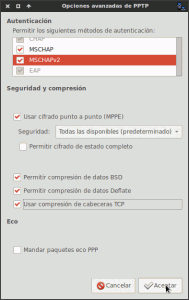](images/20-Configurar-la-conexión-VPN.png)

En la siguiente pantalla tenemos las distintas opciones de configuración del cliente VPN. Ustedes tiene que **seleccionar justo las que pueden ver en la captura de pantalla**. **Una vez seleccionadas presionar el botón** **Aceptar**.

Una vez presionado aceptar aparecerá otra vez la siguiente pantalla:

[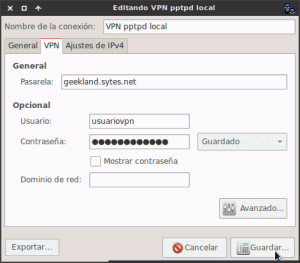](images/21-Guardar-Configuración.png)

Ahora tan solo hace falta **presionar en** **Guardar**. **Para finalizar ya solo nos falta conectarnos. Para hacerlo se van de nuevo al icono del panel de network manager y siguen la ruta que se muestra en la siguiente captura de pantalla:**

[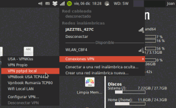](images/22-Conectarse-al-servidor-VPN.png)

Ahora tan solo resta esperar unos segundos y verán que les aparece el mensaje que la conexión se ha establecido con éxito:

[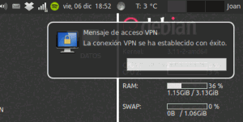](images/23-Conexión-establecida.png)

Una vez conectados al servidor VPN comprobaremos que la IP con la que estamos conectamos a internet no es la la IP pública del sitio de donde nos conectamos. Para ello accedemos a la siguiente web:

[http://www.vermiip.es/](http://www.vermiip.es/ "Averiguar IP Pública")

[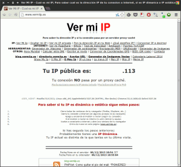](images/24-Comprobación-funcionamiento-Linux.png)

Como se puede comprobar en la captura de pantalla la IP corresponde a nuestro servidor VPN. Por lo tanto todo funciona a la perfección.

## SEGURIDAD QUE NOS APORTARÁ NUESTRO SERVIDOR VPN

Es conocido que **el protocolo pptpd tiene ciertas vulnerabilidades y que a día de hoy se puede considerar un protocolo obsoleto**. **Podemos afirmar esto por los siguientes motivos**:

1. **El cifrado que utiliza este protocolo es un cifrado de 128 bits**. Hoy en día imagino que para organizaciones como la NSA y otras organizaciones que disponen de una gran potencia de computación este cifrado es fácil de romper si se lo proponen.
2. **El protocolo de autenticación MSchapv2 y LEAP presentan vulnerabilidades de seguridad graves** y si elegimos una contraseña débil un atacante puede llegar a obtener está clave en menos de 24 horas mediante ataques de diccionario offline que se pueden realizar con el software [asleap](http://www.willhackforsushi.com/Asleap.html "Web Desarrollo Asleap").

Pero también es cierto que **este protocolo aún tiene algunas ventajas como pueden ser las siguientes**:

1. Es **fácil de configurar.**
2. Disponemos de **clientes VPN incorporados en la gran mayoría de sistemas operativos** como por ejemplo Windows, Android, Mac y iOS.
3. **Lo podemos usar tanto en ordenadores como en tabletas como en teléfonos**.
4. **Es** el protocolo **usado en la mayoría de software antiguos.**

También son muchos los que dicen cosas que no son ciertas. **Se dice que que en el proceso de autenticación nuestro usuario y password van en texto plano. Este es completamente falso**.

[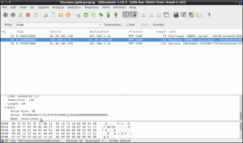](images/25-Response-authentification.png)

Si se observa la captura de pantalla pueden ver que lo máximo que podrá llegar a obtener un atacante mediante un sniffer es nuestro nombre de usuario, el desafío de autenticación y la respuesta de autenticación. Por lo tanto no es verdad que nuestra contraseña esté en texto plano.

###### Nota: Con el desafío de autenticación y la respuesta de autenticación es posible y factible obtener la contraseña mediante un ataque de diccionario con asleap. Por lo tanto se recomienda elegir una contraseña robusta, de gran longitud y complejidad.

###### Nota: Para que quien quiera profundizar más sobre el proceso de autenticación MS-Chapv2, que es el que utiliza el servidor VPN que acabamos de montar, pueden consultar este post:

[http://unaaldia.hispasec.com/2012/09/rematando-ms-chap-v2-microsoft-aconseja\_5.html](http://unaaldia.hispasec.com/2012/09/rematando-ms-chap-v2-microsoft-aconseja_5.html "Explicación del funcionamiento de MSCHAP-v2")

**Otras de las cosas falsas que podéis llegar a leer en la web es que usando el protocolo pptpd el tráfico viaja sin cifrar**. **Esto es totalmente falso ya que este protocolo configurado adecuadamente proporciona un cifrado MPPE de 128 bits (Microsoft Point to Point Encryption)**. Si lo quieren comprobar tan solo observar la siguiente captura de pantalla:

[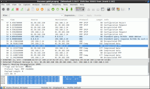](images/26-Totalidad-de-tráfico-cifrado.png)

Como se puede comprobar en la captura de pantalla la totalidad de paquetes capturados están encapsulados.

**Por lo tanto a pesar de ser un protocolo viejo y obsoleto existen mecanismos de defensa que por desgracia a día de hoy son vulnerables para algunas personas**. Por lo tanto **si en vuestro caso manejáis información confidencial o sensible no es recomendable usar pptp. Los más recomendable seria utilizar otros protocolos como por ejemplo** [OpenVPN](https://es.wikipedia.org/wiki/OpenVPN "Explicación del protocolo OpenVPN"), [L2TP](https://es.wikipedia.org/wiki/L2TP "Explicación del protocolo L2TP") o [IPsec](https://es.wikipedia.org/wiki/IPsec "Explicación del protocolo IPsec"). No obstante estos protocolos son bastante más difíciles de configurar que pptp, requieren de certificados digitales y no acostumbran a tener soporte para plataformas o software antiguo. En el caso que alguien maneje información confidencial y necesite la máxima seguridad le aconsejo seguir las instrucciones de este post [https://geeklandlinux.github.io/posts/crear-y-configurar-servidor-openvpn/]() para poder instalar y configurar su propio servidor OpenVPN.

**En el caso que la información que manejáis no sea confidencial no veo porqué no podemos usar pptp**. Deberemos tomar ciertas precauciones como por ejemplo elegir claves largas y complejas y cambiar nuestra contraseña de forma periódica. De esta forma conseguiremos minimizar el riesgo de un ataque.
