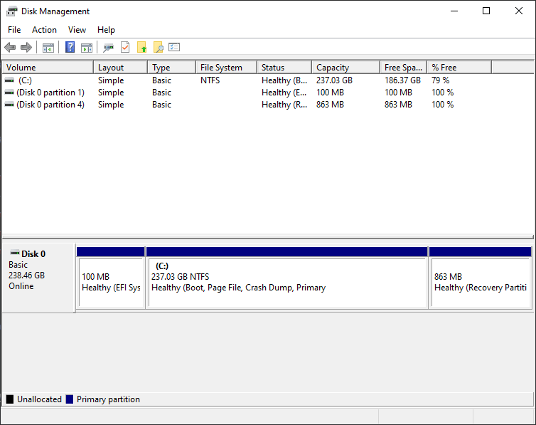
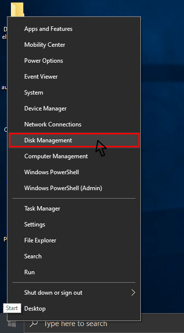
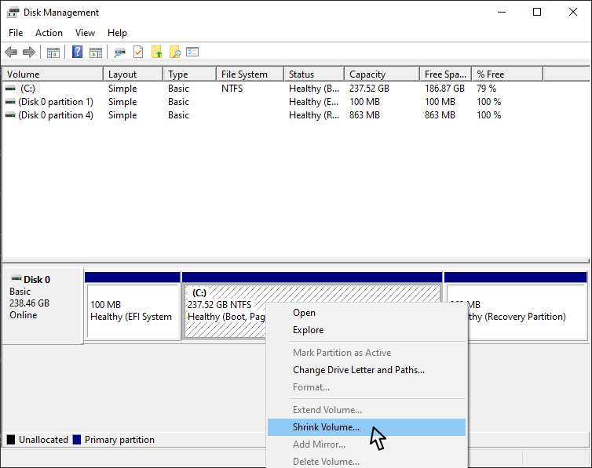
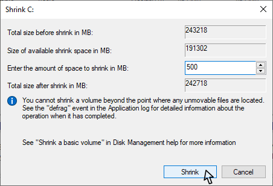
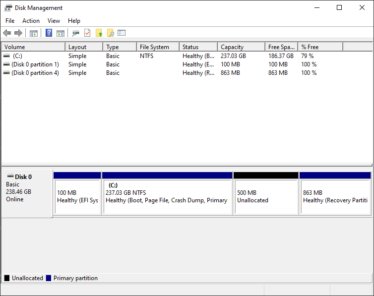
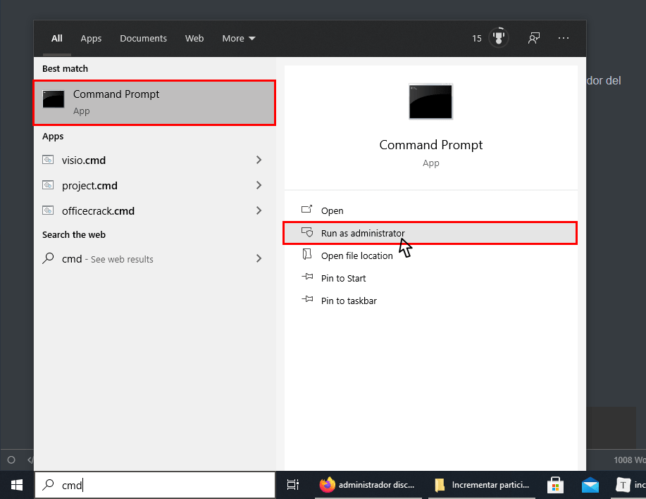
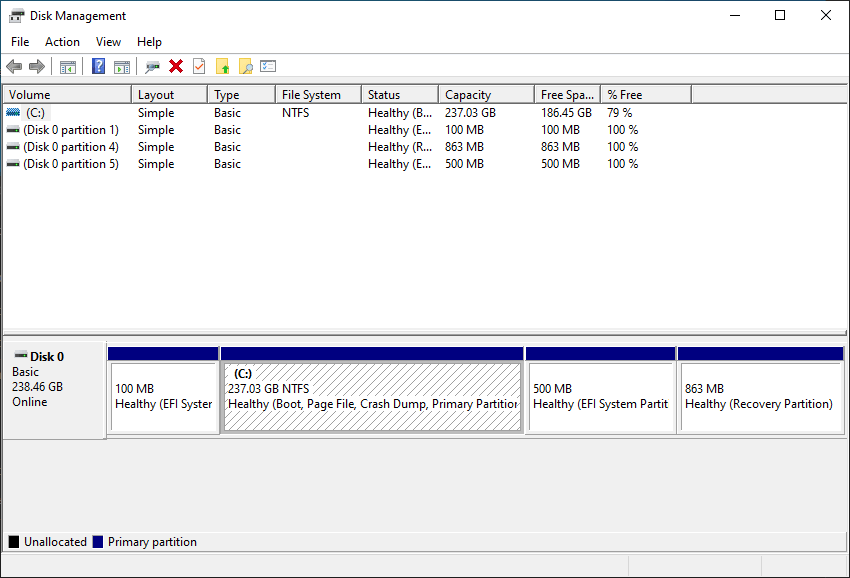
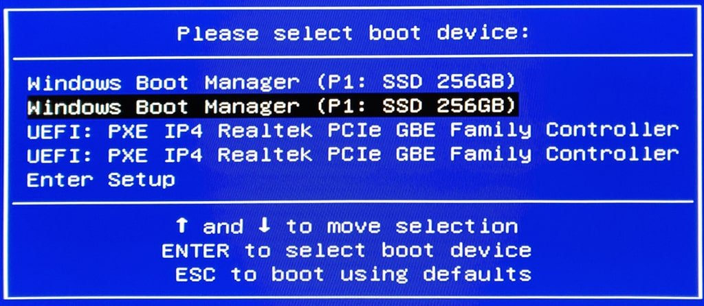

A continuación veremos como crear una partición UEFI desde Windows. En mi caso acabo de recibir un equipo con Windows preinstalado y pretendo realizar un Dual-Boot con Linux. Al observar el esquema de particionado del disco duro observo que la partición UEFI solamente tiene 100MB. Por lo tanto es posible que tarde o temprano la partición acabe llenándose y generando problemas.<!--more-->

[](images/particiones-iniciales-discos-duro.png)

Para solucionar el problema que acabamos de mencionar tenemos 3 opciones:

1. **Usar un software que permita redimensionar las particiones** de nuestro dispositivo de almacenamiento. Esta opción presenta el inconveniente que tendréis que comprar una licencia de software o piratear un software con los riesgos que ello conlleva.
2. **Eliminar la partición UEFI y la partición en que tenemos instado el sistema operativo**. **Una vez eliminadas las tendremos que volver a crear** con el espacio que queramos e instalar de nuevo el sistema operativo. Esto sin duda son horas de trabajo.
3. **Generar una nueva partición UEFI con el espacio que consideremos adecuado**. El único inconveniente de esta opción es que en el inicio del disco dejaremos 100MB sin usar.

Después de evaluar los pros y los contra en mi caso he decido adoptar la solución 3. El procedimiento para crear una nueva partición UEFI ha sido el siguiente.

**Nota**: Si el procedimiento mostrado a continuación se realiza de forma incorrecta puede generar pérdida de información y que Windows no arranque. En ningún caso me hago responsable de los perjuicios y problemas que puedan darse en vuestro caso.

## CREAR UN NUEVO VOLUMEN PARA ALOJAR LA NUEVA PARTICION UEFI

Tenemos que abrir el gestor de discos de Windows. Para ello posicionamos el puntero del ratón encima del botón de inicio de Windows. Presionamos el botón derecho del ratón y cuando aparezca el menú clicamos en la opción **Administrador de discos**.

[](images/acceder-gestor-de-discos.png)

En mi caso no tengo espacio libre para crear una nueva partición. Por lo tanto tendré que usar espacio libre de la partición `C:`. Para ello seleccionaré la unidad `C:` con el ratón, presionaré el botón derecho del ratón y cuando aparezca el menú presionaré sobre la opción `Reducir Volumen...`

[](images/reducir-espacio-de-una-particion.png)

Seguidamente indicaremos que queremos reducir 500 MB el espacio de la partición `C:` y presionaremos el botón `Reducir`.

[](images/cantidad-de-espacio-a-reducir.png)

**Nota**: 500 MB es un espacio generoso para generar la partición UEFI. Todo lo que sea por encima de 300 MB debería ser más que suficiente para el 99% de usuarios.

Finalmente vemos que la partición `C:` se ha reducido en 500MB y por otro lado se ha generado un nuevo volumen de 500MB que es el que usaremos para crear la partición UEFI.

[](images/volumen-generado-para-crear-particion-uefi.png)

## CREAR LA PARTICIÓN UEFI

Lo primero que tendremos que realizar para crear la nueva partición UEFI es abrir una consola con privilegios de administrador del siguiente modo.

[](images/abrir-consola-como-administrador.png)

Una vez abierta la consola ejecutaremos el comando `diskpart` para arrancar la utilidad que nos ayudará a gestionar las particiones de Windows.

```shell
Microsoft Windows [Version 10.0.18363.1316]
(c) 2019 Microsoft Corporation. All rights reserved.

C:\WINDOWS\system32>diskpart

Microsoft DiskPart version 10.0.18362.1171

Copyright (C) Microsoft Corporation.
On computer: DESKTOP-74FTVQJ 
```

A continuación ejecutamos el comando `list disk` para ver la totalidad de discos presentes en nuestro equipo. En mi caso solo tengo un disco que se reconoce como `Disk 0`.

```shell
DISKPART> list disk

  Disk ###  Status         Size     Free     Dyn  Gpt
  -------- ------------- ------- ------- --- ---
  Disk 0    Online          238 GB   500 MB        *
```

Seguidamente seleccionamos el disco duro sobre el que realizar modificaciones ejecutando el comando `sel disk 0`.

```shell
DISKPART> sel disk 0

Disk 0 is now the selected disk.
```

Una vez seleccionado el disco listamos las particiones ejecutando el comando `list partition`.

```shell
DISKPART> list partition

  Partition ###  Type              Size     Offset
  ------------- ---------------- ------- -------
  Partition 1    System             100 MB  1024 KB
  Partition 2    Reserved            16 MB   101 MB
  Partition 3    Primary            237 GB   117 MB
  Partition 4    Recovery           863 MB   237 GB
```

Finalmente crearemos la partición UEFI ejecutando el comando `create partition efi`.

```shell
DISKPART> create partition efi

DiskPart succeeded in creating the specified partition.
```

Si en estos momentos accedemos al gestor de discos de Windows veremos que efectivamente se ha creado una partición EFI de 500MB

[](images/particion-EFI-creada.png)

## COPIAR LOS ARCHIVOS DE ARRANQUE A LA NUEVA UEFI

Seguidamente formatearemos la partición que acabamos de crear y le asignaremos la etiqueta `system` mediante el siguiente comando:

```shell
DISKPART> format quick fs=fat32 Label="system"

  100 percent completed

DiskPart successfully formatted the volume.
```

A continuación asignaremos la letra `M:` a la partición que acabamos de formatear mediante el siguiente comando:

```shell
DISKPART> assign letter=M

DiskPart successfully assigned the drive letter or mount point.
```

El siguiente paso consistirá en listar los volúmenes y particiones para asegurar que todos los pasos se han realizado correctamente. Para ello inicialmente ejecutaremos el comando `list vol` y a continuación `list part`.

```shell
DISKPART> list vol

  Volume ###  Ltr  Label        Fs     Type        Size     Status     Info
  ---------- --- ----------- ----- ---------- ------- --------- --------
  Volume 0     C                NTFS   Partition    237 GB  Healthy    Boot
  Volume 1         SYSTEM       FAT32  Partition    100 MB  Healthy    System
  Volume 2         Recovery     NTFS   Partition    863 MB  Healthy    Hidden
* Volume 3     M   SYSTEM       FAT32  Partition    500 MB  Healthy    Hidden
```

```shell
DISKPART> list part

  Partition ###  Type              Size     Offset
  ------------- ---------------- ------- -------
  Partition 1    System             100 MB  1024 KB
  Partition 2    Reserved            16 MB   101 MB
  Partition 3    Primary            237 GB   117 MB
* Partition 5    System             500 MB   237 GB
  Partition 4    Recovery           863 MB   237 GB
```

**Nota**: Si observáis veréis que la partición 5 está seleccionada, tiene 500MB y es del tipo sistema. Por lo tanto ya podemos copiar los archivos de arranque dentro de la nueva partición.

A continuación saldremos de la utilidad diskpart ejecutando el comando `exit`.

```shell
DISKPART> exit

Leaving DiskPart...

C:\WINDOWS\system32>
```

Finalmente copiaremos/generaremos los ficheros de arranque en la partición UEFI que acabamos de crear ejecutando el siguiente comando:

```shell
C:\WINDOWS\system32>bcdboot C:\windows /s M: /f ALL
Boot files successfully created.
```

**Nota**: Recuerden sustituir `M:` por la letra que vosotros hayan asignado a la partición UEFI.

## ARRANCAR EL EQUIPO HACIENDO USO DE LA NUEVA PARTICIÓN DE UEFI

Una vez creada la nueva partición ya podemos reiniciar el equipo. Pero justo al iniciar el proceso de arranque tendréis que acceder dentro del menú de arranque y seleccionar la segunda de las entradas para arrancar el equipo. De este modo haremos que el equipo arranque usando la partición UEFI de 500 MB que acabamos de generar.

[](images/indicar-arranque.jpg)

**Nota**: Para acceder al menú de arranque tengo que presionar la tecla `F7` justo en el momento que inicia el arranque de mi equipo. La tecla a presionar variará en función de cada equipo, por lo tanto si no les funciona `F7` prueben otras teclas como por ejemplo `F8`, `F12`, `F2`, `Del`, etc.

Si el equipo arranca sin problemas significa que el procedimiento realizado hasta el momento ha funcionado a la perfección. A partir de estos momentos ya podemos hacer un Dual Boot con Linux sin tener problemas de espacio en la partición `/boot/efi`. No obstante, antes de iniciar el proceso de instalación del Dual Boot recomiendo borrar la partición UEFI que no están usando.

## BORRAR LA PARTICIÓN QUE YA NO ESTAMOS USANDO

Una vez comprobado que todo funciona a la perfección podemos eliminar la partición UEFI de 100 MB. Para ello abriremos una consola con permisos de administrador.

[](images/abrir-consola-como-administrador.png)

Acto seguido abrimos la utilidad diskpart ejecutando el siguiente comando:

```shell
Microsoft Windows [Version 10.0.18363.1316]
(c) 2019 Microsoft Corporation. All rights reserved.

C:\WINDOWS\system32>diskpart

Microsoft DiskPart version 10.0.18362.1171

Copyright (C) Microsoft Corporation.
On computer: DESKTOP-74FTVQJ 
```

A continuación listamos todos los discos presentes en nuestro equipo y seleccionamos el disco que contiene la partición UEFI que queremos eliminar.

```shell
DISKPART> list disk

  Disk ###  Status         Size     Free     Dyn  Gpt
  -------- ------------- ------- ------- --- ---
  Disk 0    Online          238 GB      0 B        *

DISKPART> sel disk 0

Disk 0 is now the selected disk.
```

Seguidamente listamos los volúmenes presentes en el disco ejecutando el comando `list vol`.

```shell
DISKPART> list vol

  Volume ###  Ltr  Label        Fs     Type        Size     Status     Info
  ---------- --- ----------- ----- ---------- ------- --------- --------
  Volume 0     C                NTFS   Partition    237 GB  Healthy    Boot
  Volume 1         SYSTEM       FAT32  Partition    100 MB  Healthy    Hidden
  Volume 2         SYSTEM       FAT32  Partition    500 MB  Healthy    System
  Volume 3         Recovery     NTFS   Partition    863 MB  Healthy    Hidden
```

Como han podido ver en la salida del último comando, los volúmenes 1 y 2 alojan particiones UEFI. En mi caso la partición UEFI que estoy usando es la que está en el Volumen 2 porque si os fijáis en la columna `Info` figura la palabra `system`. Además la partición ocupa 500 MB, por lo tanto ya podemos borrar la partición 1 del siguiente modo.

Inicialmente tenemos que seleccionar el volumen que queremos borrar. Como quiero borrar el volumen 1 ejecutaré el siguiente comando:

```shell
DISKPART> Select Volume 1
```

Una vez seleccionado lo eliminaremos ejecutando el siguiente comando:

```
DISKPART> delete partition override

DiskPart successfully deleted the selected partition.
```

De este modo tan solo tendremos una partición UEFI en nuestro equipo. A partir de estos momentos podré iniciar la instalación de un sistema dual-boot sin que la partición UEFI genere problemas.

##### Fuentes

[https://www.youtube.com/watch?v=OUoNrLP57P8](https://www.youtube.com/watch?v=OUoNrLP57P8) [https://www.hebergementwebs.com/inicio-de-windows/bcdboot-reconstruye-el-bcd-de-windows-10](https://www.hebergementwebs.com/inicio-de-windows/bcdboot-reconstruye-el-bcd-de-windows-10)
