En pasados post vimos como podíamos crear muy fácilmente nuestro propio servidor VPN mediante el protocolo pptp.

[https://geekland.eu/crear-un-servidor-vpn-pptp/]()

Pudimos constatar y experimentar que la instalación y configuración del servidor era sumamente sencilla y era altamente compatible con la totalidad de sistemas operativos existentes, pero como punto negativo también vimos que **a día de hoy pptp presenta serios problemas en lo que a la seguridad se refiere**.<!--more-->

**Por lo tanto** a toda la gente que necesite un VPN p**ara la transmisión de información sensible** no le recomiendo el uso del protocolo pptp. Le **recomiendo el uso del protocolo [OpenVPN](http://openvpn.net/ "Web de Openvpn")**. Para ver como instalar y configurar este tipo de servidor VPN tan solo tienen que seguir los pasos que vamos a definir a continuación.

## TIPO DE CONFIGURACIÓN VPN QUE VAMOS A USAR

Hay distintas formas de configurar un servidor mediante OpenVPN. **Los distintos tipos de configuración existentes son Host to Host, Road to Warrior (Host to LAN) y Net to net**. **Nosotros** **nos focalizaremos en el Road to Warrior o Host to LAN**, por ser el más popular de todos y el que seguramente se adaptar a prácticamente las necesidades de de cualquier usuario.

[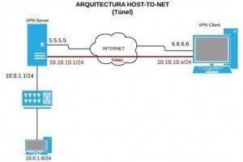](images/1-Arquitectura-Host-to-Net.jpg)

La configuración **Road to Warrior (Host to LAN mediante túnel) permitirá que múltiples dispositivos u ordenadores se puedan conectar simultáneamente a nuestra red VPN** y compartir recursos e informaciones con la red a que se conectan. Por lo tanto en este caso tenemos varios clientes que se pueden conectar de forma independiente al servidor VPN. Para quien precise de más información acerca de este tipo de configuración puede consultar el siguiente enlace.

[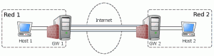](images/2-Arquitectura-host-to-host.png)

**La configuración Host to Host, a diferencia del modo de configuración anterior, únicamente nos permitirá la conexión entre 2 máquinas** o dispositivos conectados a Internet o dentro de una red local. Por lo tanto en este caso solamente existe un cliente y un servidor. Además estás 2 máquinas o dispositivos no podrán compartir recursos e informaciones con otros equipos que estén conectados en la misma red LAN.

[](images/3-Arquitectura-Net-to-Net.jpg)

Para finalizar tenemos **la configuración Net to Net, Red-red, o LAN to LAN**. Esta configuración mayoritariamente es usada en el mundo empresarial. Esta configuración **lo que hace es unir redes locales (LAN) ubicadas en distintas ubicaciones geográficas** para de esta forma poder compartir información entre todos los clientes de todas las redes. De este modo cada una de las redes locales LAN tiene un punto de acceso o puerta de enlace que proporciona un canal de transmisión seguro entre 2 o más redes.

## ASEGURAR QUE EL SERVIDOR OPENVPN TENGA IP FIJA EN LA RED LOCAL

Es muy importante asegurar que nuestro servidor disponga de una IP interna fija en la red local. Es importante porqué cuando recibamos una petición de los clientes VPN, el router tendrá que saber a que IP interna tiene que redireccionar la petición del cliente VPN.

**Para conseguir disponer de un servidor con ip interna fija tan solo tienen que seguir los pasos que se detallan en el siguiente enlance:**

[https://geekland.eu/configurar-ip-fija\_o\_estatica\_ipv4/]()

###### Nota: El método descrito en el enlace es válido en el caso que estéis usando un servidor sin entorno gráfico. En el caso que el servidor que uséis disponga de entorno gráfico tendréis que configurar este aspecto a través de las interfaces visuales de vuestro gestor de red que probablemente será [network manager](https://wiki.gnome.org/Projects/NetworkManager "Proyecto Network Manager") o [wicd](http://wicd.sourceforge.net/ "Proyecto Wicd").

Una vez terminados la totalidad de pasos mi servidor tendrá una IP fija que en mi caso será la **192.168.1.188**. Esta IP es la que deberemos usar para que el router redireccione las peticiones de los clientes al servidor OpenVPN.

## REDIRECCIONAMIENTO DINÁMICO NO-IP

Cuando tengamos nuestro servidor VPN funcionando, lo más probable es que tengamos conectarnos desde el exterior de nuestra local red local mediante el servidor VPN.

Para conectarnos a nuestra red local tendremos que saber nuestra IP Pública pero desafortunadamente en la gran mayoría de casos la IP que tenemos es dinámica. Por lo tanto se puede dar perfectamente el caso que en el momento de conectarnos no sepamos la IP Pública de nuestro servidor.

**Para** solucionar este problema tenemos que **asociar la IP Pública de nuestro servidor a un dominio**. Para poder realizar este paso tan solo **tienen que seguir las indicaciones del siguiente enlace:**

[https://geekland.eu/encontrar-servidor-con-dns-dinamico/]()

Una vez realizados estos pasos tendréis vuestra IP Pública asociada a un dominio. En mi caso mi IP Pública está asociada al dominio **geekland.sytes.net**

## INSTALACIÓN DEL SERVIDOR

La instalación del servidor la vamos a realizar en un sistema operativo Debian Wheezy. **La totalidad del procedimiento descrito tiene que funcionar en cualquier distribución que derive de Debian** como pueden ser [Ubuntu](http://www.ubuntu.com/ "Website de Ubuntu"), [Crunchbang](http://crunchbang.org/ "Website de Crunchbang"), [Linux Mint](http://www.linuxmint.com/ "Website de Mint"), [Kubuntu](http://www.kubuntu.org/ "Website de Kubuntu"), etc.

Para instalar el servidor OpenVPN lo primero que tenemos que hacer es **abrir una terminal**. Dentro de la terminal **teclean el siguiente comando**:

> ```
> sudo apt-get install openvpn openssl
> ```

Ahora ya tenemos instalado el servidor.

## CREAR UNA AUTORIDAD DE CERTIFICACIÓN

OpenVPN es un protocolo de VPN basado SSL/TLS mediante certificados y claves RSA creadas mediante openssl. Por lo tanto el nivel de seguridad proporcionado por OpenVPN es muy elevado.

Al ser un protocolo que funciona bajo certificados y claves necesitaremos crear una autoridad de certificación para a posteriori generar los certificados.

###### Nota: La principal función de una autoridad de certificación es la de emitir y revocar certificados digitales para terceros. Para quien necesite más información puede consultar el siguiente [enlace](https://es.wikipedia.org/wiki/Autoridad_de_certificaci%C3%B3n "Explicación de lo que es una autoridad de certificación").

##### Crear el certificado raíz ca para firmar y revocar los certificados de los clientes

Para poder emitir y revocar la claves **necesitamos crear nuestra propia autoridad certificadora** y disponer de nuestro certificado raíz **ca.ctr** y de nuestra clave **ca.key** para poder crear y firmar las claves de los clientes y del servidor.

Para realizar este paso, y el resto de pasos, ejecutoriaremos los scripts que OpenVPN trae incorporados de seri**e**. Para ello tenemos que crear una carpeta con nombre **easy-rsa** dentro de la ubicación **/etc/openvpn**. **Para ello abrimos una terminal y tecleamos el siguiente comando**:

> ```
> cd /etc/openvpn
> ```
> 
> ```
> mkdir easy-rsa
> ```

Seguidamente tenemos que **copiar los scripts de configuración** de OpenVPN, **que se hallan en** la ubicación **/usr/share/doc/openvpn/examples/easy-rsa/2.0/**, **dentro de la carpeta** **easy-rsa** que acabamos de crear. Para ello en la terminal tecleamos el siguiente comando:

> ```
> cp -r /usr/share/doc/openvpn/examples/easy-rsa/2.0/* easy-rsa
> ```

Una captura de pantalla los pasos realizados hasta el momento se puede ver a continuación:

[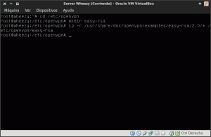](images/4-Ejemplos-copiados.png)

En el caso que que vuestra distro trabaje con la versión 3 de easy-rsa, en el momento de introducir el último comando, obtendréis un error parecido al siguiente error:

**cp: no se puede efectuar \`stat’ sobre «/usr/share/doc/openvpn/examples/easy-rsa/2.0/\*»: No existe el archivo o el directorio**

Los pasos a realizar para solucionar este error son los siguientes. En la terminal escriben el siguiente comando para instalar el paquete easy-rsa.

> ```
> apt-get install easy-rsa
> ```

Seguidamente borran la carpeta easy-rsa que habíamos creado inicialmente introduciendo el siguiente comando en la terminal:

> ```
> rm -R /etc/openvpn/easy-rsa
> ```

Finalmente para obtener los scripts para la creación de claves en la terminal introducimos el siguiente comando:

> ```
> make-cadir /etc/openvpn/easy-rsa
> ```

###### Nota: Algunas de las distros que funcionan con easy-rsa 3.0 son Ubuntu 14.04, Linux Mint 16, etc.

**Para ejecutar los scripts que acabamos de copiar o de obtener, tenemos que ir a la ubicación donde los guardamos**. Para ello ingresamos el siguiente comando en la terminal:

> ```
> cd /etc/openvpn/easy-rsa
> ```

**Antes de ejecutar los scripts editaremos el fichero vars para modificar una serie de parámetros**. Para modificar el fichero vars se tiene que introducir el siguiente comando en la terminal:

```
nano vars
```

##### Tamaño de las claves

Una vez abierto el editor de texto tenemos que **localizar y modificar la siguiente línea**:

**export\_KEY\_SIZE=1024**

Una vez encontrada la sustituyen **por la siguiente linea**:

**export\_KEY\_SIZE=2048**

###### Nota: Con esta modificación estamos incrementando el tamaño de la claves privadas (.key) que vamos a generar y también del parámetro de Diffie Hellman. Con esta modificación incrementarios del tamaño de las claves de 1024 bits a 2048 bits. También seria posible usar 4096 bits. Este parámetro no tiene porqué penalizar en exceso el rendimiento del servidor. Únicamente penalizará el proceso autentificación Handshake de SSL/TLS.

##### Datos de la entidad emisora de los certificados

**Seguidamente tenemos que introducir los datos de la entidad emisora de los certificados** que seremos nosotros mismos Para ello tenemos que localizar las siguientes lineas:

export KEY\_COUNTRY=”US” export KEY\_PROVINCE=”CA” export KEY\_CITY=”SanFrancisco” export KEY\_ORG=”Fort-Funston” export KEY\_EMAIL=”me(arroba)myhost.mydomain” export KEY\_EMAIL=mail(arroba)host.domain export KEY\_CN=Changeme export KEY\_CN=Changeme export KEY\_OU=Changeme

Una vez localizadas las lineas tan solo se tienen reemplezar el contenido por defecto por nuestros datos reales. En mi caso los datos a rellenar podrían ser:

export KEY\_COUNTRY=”ES” “Poner las 2 iniciales de tu país” export KEY\_PROVINCE=”CA” “Poner las 2 iniciales de tu provincia” export KEY\_CITY=”s\*\*\*\*\*\*\*a” “Poner el nombre de tu ciudad” export KEY\_ORG=”geekland” “Poner el nombre de la organización” export KEY\_EMAIL=”xxxxxxx(arroba)gmail.com” “Usar vuestra dirección de email” export KEY\_EMAIL=xxxxxxx(arroba)gmail.com “Usar vuestra dirección de email” export KEY\_CN= wheezy “Usar el nombre del host del servidor” export KEY\_NAME=vpnkey “Designa el nombre de la entidad certificadora que se creará” export KEY\_OI=IT “Departamento de la empresa”

###### Nota: Dentro de este fichero también podemos configurar el tiempo de validez que tendrá nuestra entidad certificadora y el tiempo de validez que tendrán los certificados y claves que crearemos. El valor estándar de validez son 3650 días que no voy a tocar.

**Una vez modificado el archivo vars guardamos los cambios y lo cerramos**. Ahora tendremos que exportar sus variables. Para exportar sus variables tenemos que teclear el siguiente comando en la terminal:

> ```
> source ./vars
> ```

Seguidamente ejecutaremos el script **clean-all**. El script clean-all borrará la totalidad de claves que podrían existir en la ubicación **/etc/openvpn/easy-rsa/keys**. Para ejecutar el script tenemos que teclear el siguiente comando en la terminal:

> ```
> ./clean-all
> ```

**El siguiente paso es generar los parámetros de Diffie Hellman**. Los parámetros de Diffie Hellman se utilizarán para poder intercambiar las claves ente cliente y servidor de forma segura. Para poder realizar este paso **tenemos que teclear el siguiente comando en la terminal**:

> ```
> ./build-dh
> ```

Al terminar el proceso dentro de la ubicación **/etc/openvpn/easy-rsa/keys** se habrá creado el archivo **dh2048.pem** que contiene los parámetros Diffie Hellman.

###### Nota: Para quien requiera información adicional de los parámetros de Diffie Hellman puede consultar el siguiente [enlace](https://es.wikipedia.org/wiki/Diffie-Hellman "Explicación de los parámetros de Diffie-Hellman"). Este parámetro se usará poder un intercambio de claves entre 2 participantes de forma segura.

En la siguiente captura de pantalla podrán ver una muestra de los pasos realizados hasta el momento:

[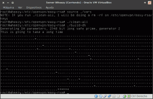](images/5-Creando-buildi-heaffy.png)

Finalmente **vamos a a crear el certificado y la clave privada de nuestra propia autoridad certificadora**. **Para ello tenemos que teclear el siguiente comando en la terminal**:

> ```
> ./build-ca
> ```

Durante el proceso de creación se les hará una serie de preguntas para incorporar información dentro del certificado que se creará. Como anteriormente hemos editado el fichero **vars** ahora solo nos tenemos que limitar a aceptar el valor por defecto de las preguntas que nos hacen.

Al terminar el proceso dentro de la ubicación **/etc/openvpn/easy-rsa/keys** se ha creado **ca.crt** y **ca.key**:

**ca.crt:** Es el **certificado raíz público** de la autoridad de certificación (CA) **ca.key:** Este fichero contiene **la clave privada de la autoridad de certificación** (CA). Este archivo debe mantenerse protegido y no debe estar al alcance de terceros.

Una vez creado el certificado y la clave de vuestra autoridad certificador la pantalla de vuestro ordenador tiene que presentar el siguiente estado:

[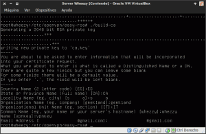](images/6-Entidad-certificadora-creada.png)

## CREAR EL CERTIFICADOS Y LA CLAVE DEL SERVIDOR OPENVPN

A estas alturas ya lo tenemos todo listo **para poder crear el certificado y clave de nuestro servidor**. Para ello **introducimos el siguiente comando en la terminal**:

> ```
> ./build-key-server whezzyVPN
> ```

###### Nota: whezzy VPN es el nombre del servidor. Vosotros tenéis que introducir el nombre que vosotros queráis.

Una vez introducido este comando se nos hará una serie de preguntas. Simplemente tienen que contestar el valor por defecto ya que anteriormente hemos modificado el archivo **vars**.

Al terminar el proceso dentro de la ubicación **/etc/openvpn/easy-rsa/keys** se habrán creado los siguientes archivos:

**whezzyVPN.key:** Este fichero contiene la **clave privada del servidor**. Este archivo no debe estar al alcance de nadie.

**whezzyVPN.crt:** Este fichero corresponde al **certificado público del servidor**.

**whezzyVPN.csr:** Este **archivo es la petición de certificado que se envía a la autoridad de certificación**. Mediante la información que contiene el archivo .csr, la autoridad de certificación podrá realizar el certificado del servidor una vez hayan realizado las comprobaciones de seguridad pertinentes.

Una vez creado el certificado y la clave del servidor la pantalla de vuestro ordenador tiene que presentar el siguiente estado:

[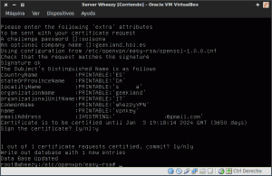](images/7-Certificador-y-clave-servidor-creado.png)

## CREAR EL CERTIFICADO Y LAS CLAVES DE LOS CLIENTES

**El siguiente paso es crear los certificados y las claves de los clientes** que se podrán conectar al servidor VPN. **Para ello tenemos que teclear el siguiente comando en la terminal**:

> ```
> ./build-key usuariovpn
> ```

###### Nota: usuariovpn es el nombre de usuario que vamos a crear. En vuestro caso tendréis que reemplazar usuariovpn por el nombre que queráis.

Una vez introducido este comando se nos hará una serie de preguntas. Simplemente tienen que contestar el valor por defecto ya que anteriormente hemos editado el fichero **vars**.

Al terminar el proceso dentro de la ubicación **/etc/openvpn/easy-rsa/keys** se habrán creado los siguientes archivos

**usuariovpn.key:** Este fichero contiene la **clave privada del cliente**. Este archivo no debe estar al alcance de nadie. **usuariovpn.crt:** Este fichero corresponde corresponde al **certificado público del servidor**. **usuariovpn.csr:** Este archivo es **la petición de certificado que es envía a la autoridad de certificación**. Mediante la información contenida en el archivo .csr, la autoridad de certificación podrá realizar el certificado del cliente una vez hayan realizado las comprobaciones de seguridad pertinentes.

###### Nota: El procedimiento de generación de clientes se deberá repetir tantas veces como clientes queráis que tenga el servidor OpenVPN.

Una vez creado el certificado y la clave del cliente, la pantalla de vuestro ordenador tiene que presentar el siguiente estado:

[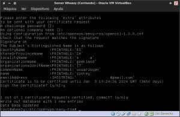](images/8-Certificados-y-claves-clientes-creados.png)

## FORTIFICAR LA SEGURIDAD DEL SERVIDOR OPENVPN CON TLS-AUTH

###### Nota: Esto paso en principio no es necesario pero lo realizaremos para incrementar la seguridad de nuestro servidor VPN.

Ahora **generamos otra clave. Esta clave nos servirá para agregar soporte para usar la autentificación TLS** y de este modo fortificar la seguridad del servidor VPN. Para generar la clave para poder fortificar el servidor se tiene que introducir el siguiente comando en la terminal:

> ```
> cd /etc/openvpn/easy-rsa/keys
> ```

Una vez hemos accedido a la ubicación **/etc/opnevpn/easy-rsa/keys** tecleamos el siguiente comando:

> ```
> openvpn --genkey --secret ta.key
> ```

Justo al ejecutar el comando, Como se puede ver en la captura de pantalla, se generará una clave con el nombre **ta.key** en la misma ubicación dónde hemos aplicado el comando.

[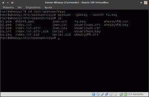](images/9-Autentificación-TLS.png)

**La clave creada servirá para introducir una firma digital HMAC en todas las transacciones del protocolo handshake de SSL/TLS entre el cliente y el servidor. De esta forma podremos verificar la integridad de los paquetes intercambiados entre el cliente y el servidor VPN, y en el caso que un cliente intente conectarse al servidor VPN sin poseer la clave para firmar los paquetes la conexión se rechazará automáticamente**. Además con el uso de autentificación TLS también conseguiremos prevenir los siguientes ataques:

1. Ataques de denegación de servicio [DoS](https://es.wikipedia.org/wiki/Ataque_de_denegaci%C3%B3n_de_servicio "Explicación de un ataque de denegación de servicio").
2. Ataques de denegación de servicio por inundación UDP al puerto del VPN.
3. Escaneo de puertos en nuestro servidor para intentar averiguar vulnerabilidades.

## UBICACIÓN DE LAS CLAVES GENERADAS

A estas alturas hemos generado multitud de claves y certificados. Si se han seguido los pasos detalladamente, la totalidad de claves se hallan en la ubicación /etc/openvpn/easy-rsa/keys.

Anteriormente ya he detallado el uso de cada una de la claves. Seguidamente pasaré a detallar la ubicación de cada una de las claves:

   
|   _**Archivo**_   |   _**Descripción**_   |   _**Ubicación**_   |   _**Secreto**_   |
| --- | --- | --- | --- |
|   _dh2048.pem_   |   Parámetros Diffie Hellman   |   Servidor (/etc/openvpn)   |   Sí   |
|   _ca.crt_   |   Certificado raíz de la entidad certificadora   |   Servidor (/etc/openvpn) y cliente   |   No   |
|   _ca.key_   |   Clave de la entidad certificadora   |   Servidor (/etc/openvpn)   |   Sí   |
|   _whezzyVPN.key_   |   Clave del servidor VPN   |   Servidor (/etc/openvpn)   |   Sí   |
|   whezzyVPN.crt   |   Certificado del servidor VPN   |   Servidor (/etc/openvpn) y cliente   |   No   |
|   whezzyVPN.csr   |   Archivo de petición de certificado   |   Servidor (/etc/openvpn)   |   No   |
|   usuariovpn.key   |   Clave privada del cliente VPN   |   Cliente   |   Sí   |
|   usuariovpn.crt   |   Certificado del cliente VPN   |   Cliente   |   No   |
|   usuariovpn.csr   |   Archivo de petición de certificado   |   Servidor (/etc/openvpn)   |   No   |
|   ta.key   |   Clave para la Autentificación TLS   |   Servidor (/etc/openvpn) y cliente   |   Sí   |

###### Nota: Tienen que trasladar cada una de las llaves mencionadas en las ubicaciones que se detallan en el cuadro. Recuerden transmitir y trasladar las claves y certificados del servidor al cliente por un canal seguro.

## ASEGURAR QUE LAS PETICIONES DNS SE REALIZAN POR EL VPN

Otro punto a contemplar para asegurar que nuestro servidor VPN sea seguro es que nadie pueda capturar nuestras peticiones DNS para saber donde nos estamos conectando.

###### Nota: Quien no sepa que son las peticiones DNS puede consultar el siguiente [enlace]().

**Para que nadie capture nuestras peticiones DNS lo que realizaremos es canalizar la totalidad de nuestras peticiones a través del túnel del servidor OpenVPN**. Así las peticiones DNS se enviarán al servidor VPN de forma cifrada y será el servidor OpenVPN el encargado de resolverlas. **Para poder realizar lo que acabo de describir lo primero que tienen que realizar es instalar dnsmasq**. Para poder instalar dnsmasq teclean el siguiente comando en la terminal:

> ```
> apt-get install dnsmasq
> ```

Una vez instalado dnsmasq lo tenemos que configurar para que escuche las peticiones DNS dirigidas al servidor VPN. Para ello **accedemos al archivo de configuración introduciendo el siguiente comando en la terminal**:

> ```
> nano /etc/dnsmasq.conf
> ```

Una vez abierto el editor de texto **introducen las siguientes líneas**:

> ```
> listen-address=127.0.0.1,10.8.0.1
> ```
> 
> ```
> bind-interfaces
> ```

[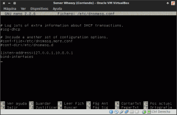](images/10-configuración-dnsmasq.png)

###### Nota: Introduciendo la primera línea lo que estamos haciendo es que Dnsmasq solamente tenga en cuenta las peticiones DNS que se dirijan a las interfaces \[lo\]: 127.0.0.1 y \[tun0\]: 10.8.0.1 que es la de nuestro servidor VPN.

###### Nota: Con la segunda línea estamos habilitando que dnsmasq tenga la capacidad de escuchar solo determinadas interfaces como por ejemplo las dos que hemos definido antes. La \[lo\] 127.0.0.1 y la \[tun0\] 10.8.0.1

Ahora tan solo tienen que **guardar los cambios y salir del archivo de configuración**. La configuración ha terminado y solamente hace falta reiniciar los servicios openvpn y dnsmasq. Para ello teclean los siguientes comandos en la terminal:

> ```
> /etc/init.d/openvpn restart
> ```
> 
> ```
> /etc/init.d/dnsmasq restart
> ```

Es posible que cuando reinicien los servicios o arranquen el sistema vean un error parecido al de la captura de la pantalla:

[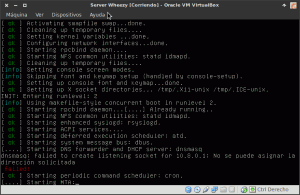](images/11-error-dnsmasq.png)

**Starting DNS forwarder and DHCP server: dnsmasq** **dnsmasq: failed to creat listening to socket for 10.8.0.1: No se puede asignar la dirección solicitada.**

Esto error es debido a que Dnsmaq arranca antes de que se cree la interfaz **\[tun0\]**. Por lo tanto cuando intenta escuchar la interfaz **\[tun0\]** nos dará el error porqué  **\[tun0\]** no existe. Para solucionar este problema y que dnsmasq puede realizar su función tan solo tiene que modificar el archivo **/etc/rc.local**. Para ello en la terminal escriben:

> ```
> nano /etc/rc.local
> ```

Se abrirá el editor de textos y ahora, debajo de las reglas de iptables tan solo tienen que escribir:

> ```
> /etc/init.d/dnsmasq restart
> ```

[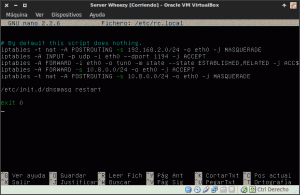](images/12-fichero-rc.local_.png)

Una vez realizado este paso guardan el fichero y salen. Introduciendo esta linea lo que estamos haciendo es reiniciar el servicio dnsmasq una vez se han ejecutado la totalidad de scripts de inicio (init). De este modo cuando se reinicialice dnsmasq la interfaz **\[tun0\]** ya estará levantada.

###### Nota: Para que dnsmasq funcione tienen que tener configurado el servidor VPN tal y como se detalla en el apartado Configurar el servidor.

## CONFIGURAR EL SERVIDOR OPENVPN

Existen ficheros de configuración standard que deberían funcionar out of the box y que podemos aprovechar para realizar nuestra configuración. **Los ficheros de ejemplo que podemos usar para ver la totalidad de opciones que tenemos disponibles se hallan comprimidos en la siguiente ubicación ubicación:**

**/usr/share/doc/openvpn/examples/sample-config-files/server.conf.gz**

Para consultarlos teclear el siguiente comando para acceder a la ubicación de este archivo:

> ```
> cd /usr/share/doc/openvpn/examples/sample-config-files
> ```

Seguidamente copiamos el archivo comprimido que dispone de los archivos de muestra de configuración en la ubicación /etc/openvpn. Para ello tecleamos el siguiente comando:

> ```
> cp -a /usr/share/doc/openvpn/examples/sample-config-files/server.conf.gz /etc/openvpn/
> ```

Seguidamente accedemos a la ubicación donde hemos copiado el archivo comprimido que contiene los archivos de configuración:

> ```
> cd /etc/openvpn
> ```

Para descomprimir el archivo que contiene los archivos de configuración tecleamos:

> ```
> gunzip server.conf.gz
> ```

**Una vez descomprimido el archivo ya podemos consultar los ejemplos de configuración tanto del cliente como del servidor**. Para ver y modificar la configuración estándar para adaptarla a nuestras necesidades tienen que **teclear el siguiente comando en la terminal**:

> ```
> nano server.conf
> ```

Se abrirá el editor de texto en el que podrán ver de forma detallada las opciones de configuración de ejemplo del servidor. Ahora tendréis que c**omprobar que la totalidad de parámetros que se muestran en la tabla de este apartado estén dentro del fichero de configuración** de ejemplo que es el que vamos a usar. En el caso de que los parámetros estén comentados habrá que descomentarlos, en el caso que no existen se deberán añadir y/o modificar.

 
|   **Parámetro**   |   **Descripción**   |
| --- | --- |
| _dev tun_ | Dispositivo virtual en el cual se creara el túnel. |
| _proto udp_ | Protocolo de la conexión VPN. También podríamos usar el tcp. |
| _port 1194_ | Puerto de escucha del servicio. El puerto de escucha se puede modificar. |
| _ca ca.crt_ | Certificado de la autoridad certificadora que creamos. |
| _cert whezzyVPN.crt_ | Certificado del servidor que hemos creado. |
| _key whezzyVPN.key_ | Clave privada del servidor que hemos creado. |
| _dh dh2048.pem_ | Carga de los parámetro de Diffie Hellman. |
| _Server 10.8.0.0 255.255.255.0_ | Indicamos que a los clientes del VPN se les asignará IP del tipo 10.8.0.0/24 |
| _ifconfig-pool-persist ipp.txt_ | Se crea un fichero ipp.txt en el que se registran las IP de los clientes que se conectan al servidor VPN. |
| _push “route 192.168.1.0 255.255.255.0”_ | Con esta línea hacemos que los paquetes que tengan como destino la red 192.168.1.0 viajen por la interfaz del túnel (tun0). De esta forma el cliente VPN se podrá comunicar con cualquier máquina de la red 192.168.1.0. |
| _keepalive 10 120_ | El servidor VPN enviará un ping cada 10 segundos y como máximo esperará 120 segundos para que el cliente de una contestación. |
| _tls-aut ta.key 0_ | Activación de la autentificación TLS en el servidor. |
| _comp-lzo_ | Activar compresión LZO para la transmisión de datos. |
| _max-clients 10_ | Número máximo de clientes que se pueden conectar de forma simultanea. El valor se puede modificar según las necesidades. |
| _user nobody_ | Para limitar los privilegios del demonio de VPN hacemos que funcione con el usuario nobody. |
| _group nogroup_ | Para limitar los privilegios del demonio de VPN hacemos que funcione con el grupo nogroup. |
| _push “redirect-gateway def1”_ | Para que la totalidad de tráfico vaya a través de nuestro VPN |
| _push “dhcp-option DNS 10.8.0.1”_ | Estamos definiendo que las peticiones DNS de los clientes se hagan a través del servidor VPN ubicado en 10.8.0.1 |
| _cipher AES-256-CBC_ | Por defecto el algoritmo de cifrado de OpenVPN es Blowfish con un tamaño de clave de 128 bits. Quien crea que no es suficiente puede añadir esta línea para cambiar el algoritmo de cifrado a AES con un clave de cifrado de 256 bits. Para ver todos los algoritmos de cifrado disponibles teclear **openvpn --show-ciphers** en la terminal. |
| _persist-key_ | En caso que el servidor OpenVPN se caiga las claves no tendrán que ser analizadas de nuevo. |
| _persist-tun_ | El dispositivo tun0 no tendrá que ser reabierto ni cerrado en el caso que tengamos que reiniciar el servidor. |
| _status openvpn-status-log_ | Log donde se guardará información respecto al túnel creado. |
| _plugin /usr/lib/openvpn/openvpn-auth-pam.so /etc/pam.d/login_ | Activación del script encargado de realizar la autenticación del usuario y del cliente. (Ver el apartado “Autentificación del cliente mediante usuario y password”) |
| _verb 3_ | Grado de detalle del estado del túnel en los logs. |

Una vez tenemos listo el fichero de configuración tan solo tenemos que guardar los cambios y cerrarlo.

###### Nota: Si queremos que los clientes que estan conectados al servidor VPN puedan comunicarse entre ellos tenemos que añadir la frase client-to-client en el fichero de configuración del servidor.

###### Nota: Si leéis con detalle el fichero de configuración podréis aplicar configuraciones distintas a las que se detallan en el post.

###### Nota: La configuración propuesta en este apartado se tendrá que adaptar a las características de vuestra red y a vuestras necesidades.

## CONFIGURAR EL CLIENTE OPENVPN

Una vez configurado el servidor ahora pasaremos a configurar el cliente. Para ello dentro de la ubicación **/etc/openvpn** **tecleamos el siguiente comando**:

> ```
> nano client.conf
> ```

Se abrirá el fichero de configuración en el que podrán ver un ejemplo de configuración para un cliente estándar. **Aseguramos que el fichero de configuración estándar tenga los parámetros que se muestran en la tabla de este apartado**. En caso de no tenerlos habrá que añadirlos manualmente, en el caso de que los parámetros estén comentados habrá que descomentarlos y en el caso que no existan se deberán añadir y/o modificar.

 
|   **Parámetro**   |   **Descripción**   |
| --- | --- |
| _dev tun_ | Dispositivo virtual en el cual se creara el túnel. |
| _proto udp_ | Protocolo de transmisión de paquetes del servidor VPN. Se puede usar TCP. |
| _remote geekland.sytes.net 1194_ | Dirección IP pública/Host DNS dinámico y puerto de escucha del servidor VPN. El puerto 1194 se puede cambiar. Si lo cambiamos deberemos adaptar el resto de configuraciones al nuevo puerto |
| _resolv-retry infinite_ | El cliente intentará de forma indefinida resolver la dirección o nombre de host indicado por la directiva remote (geeekland.sytes.net). |
| _nobind_ | A los clientes se les asignará puertos dinámicos (no privilegiados) cuando haya retorno de paquetes del servidor al cliente. |
| _user nobody_ | Para limitar los privilegios de los clientes que se conectan al VPN les asignamos el usuario nobody. (no necesario para windows) |
| _group nogroup_ | Para limitar los privilegios de los clientes que se conectan al VPN les asignamos el grupo nogroup. (no necesario para windows) |
| _persist-key_ | En caso que el servidor OpenVPN sea reiniciado no se tendrán que volver a leer las claves. |
| _persist-tun_ | El dispositivo tun0 no tendrá que ser reabierto ni cerrado en el caso que tengamos que reiniciar el cliente Vpn. |
| _ca ca.crt_ | Certificado de la autoridad certificadora que creamos |
| _cert usuariovpn.crt_ | Certificado del cliente |
| _key usuariovpn.key_ | Clave privada del cliente |
| _ns-cert-type server_ | Para prevenir ataques man in the middle. Con esta frase hacemos que los clientes solo puedan aceptar un certificado de servidor del tipo servidor “nsCertType=server”. En este campo podríamos aplicar otras alternativas similares como por ejemplo "remote-cert-tls server". |
| _tls-auth ta.key 1_ | Activación de la autentificación TLS en el cliente. |
| _cipher AES-256-CBC_ | Por defecto el algoritmo de cifrado de OpenVPN es Blowfish con un tamaño de clave de 128 bits. Quien crea que no es suficiente puede añadir esta línea para cambiar el algoritmo de cifrado a AES con un clave de cifrado de 256 bits. Para ver todos los algoritmos de cifrado disponibles teclear **openvpn --show-ciphers** en la terminal. |
| _auth-user-pass_ | Para indicar que el cliente tiene que introducir un nombre de usuario y un password. |
| _auth-nocache_ | Para evitar que los password queden almacenados en la memoria cache de los clientes. |
| _comp-lzo_ | Activar compresión LZO para la transmisión de datos. |
| _verb 3_ | Grado de detalle del estado del túnel |

## AUTENTIFICACIÓN DEL CLIENTE MEDIANTE LOGIN Y PASSWORD

A pesar de toda la seguridad que hemos implementado hasta el momento podría darse el caso que alguien robará nuestro ordenador. **Si alguien robará nuestro ordenador, teléfono o tablet podría encontrarse con la totalidad de nuestras claves criptográficas y de esta forma podría acceder fácilmente a nuestra red.**

**Para solucionar este problema vamos a introducir un usuario y un password para los clientes de nuestro servidor vpn**. Para ello tan solo tenemos que añadir uno o los usuarios que queramos.

Para añadir un usuario, como por ejemplo el usuariovpn2, tienen que teclear el siguiente comando en la terminal:

> ```
> useradd usuariovpn2 -M -s /bin/false
> ```

Una vez creado el usuario tenemos que definir un password del usuariovpn2. Para ello tecleamos el siguiente comando en la terminal:

> ```
> passwd usuariovpn2
> ```

Una vez introducido el comando nos pedirá que introduzcamos la clave de usuario y después nos pedirá confirmación.

En el caso que a posteriori se precise eliminar el usuariovpn2 tan solo tienen que introducir el siguiente comando en la terminal:

> ```
> deluser usuariovpn2
> ```

Seguidamente en la siguiente captura de pantalla pueden ver un resumen de los pasos realizados:

[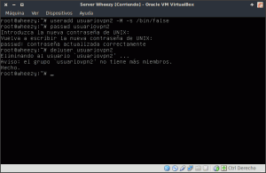](images/13-Creación-y-eliminación-de-usuarios.png)

###### Nota: Para que la autentificación mediante usuario y password funcione tienen que tener configurado el servidor y el cliente tal y como se detalla en los apartados Configurar el servidor y configurar el cliente.

## CONFIGURAR IPTABLES PARA EL ENRUTAMIENTO DE PETICIONES

**Cuando el servidor OpenVPN reciba las peticiones de los clientes se deberán enrutar adecuadamente, y además tendremos que tener configurar el firewall de nuestro equipo para que permita el tráfico a través del túnel que se ha creado ente el cliente y el servidor**.

Para ello **lo primero que tenemos que hacer es habilitar el IP forwarding**. Para habilitar el IP Forwading de forma permanente **tecleamos el siguiente comando en la terminal:**

> ```
> nano /etc/sysctl.conf
> ```

Se abrirá el editor de textos y seguidamente tendremos que **localizar la siguiente linea:**

**#net.ipv4.ip\_forward=1**

Una vez localizada tan solo hay que **descomentarla de forma que quede de la siguiente forma:**

**net.ipv4.ip\_forward=1**

Guardamos los cambios y cerramos el archivo.

**Una vez habilitado el Ipforwarding tenemos que permitir el tráfico por nuestro túnel VPN**, y además tenemos que hacer que los clientes VPN puedan acceder a redes externas públicas y otras subredes dentro de la red VPN. **Para poder conseguir esto en la terminal escriben el siguiente comando:**

> ```
> nano /etc/rc.local
> ```

**Una vez se abra el editor de textos tienen que escribir las siguientes reglas en nuestro firewall**

> ```
> iptables -A FORWARD -i eth0 -o tun0 -m state --state ESTABLISHED,RELATED -j ACCEPT
> ```
> 
> ```
> iptables -A FORWARD -s 10.8.0.0/24 -o eth0 -j ACCEPT
> ```
> 
> ```
> iptables -t nat -A POSTROUTING -s 10.8.0.0/24 -o eth0 -j MASQUERADE
> ```

###### Nota: En función de las características de vuestra red y configuración de vuestro firewall es posible que tenga que implementar reglas adicionales a las que se muestran en este ejemplo.

**Con la primera de las reglas** estamos permitiendo el tráfico por el dispositivo virtual en que que se crea el túnel.

**Con la segunda de las reglas** estamos permitiendo que los paquetes provenientes de **10.8.0.0/24** pueden enviarse o salir por la interfaz de salida **eth0**.

**Con la tercera de las reglas** estamos diciendo al servidor OpenVPN que cuando reciba una petición de cualquiera de los clientes, proceda el mismo a resolverla y enviarla en representación del cliente.

Una vez finalizando el proceso guardan el archivo y cierran el editor de textos. Antes de cerrar el archivo el fichero **/etc/rc.local** tendrá un aspecto parecido al siguiente:

[](images/12-fichero-rc.local_.png)

## CONFIGURAR EL ROUTER Y ABRIR EL PUERTO DEL SERVIDOR OPENVPN

Ya **para finalizar solo nos falta configurar nuestro router, para que redirija las peticiones de los clientes al servidor Opevpn, y abrir el puerto del servidor OpenVPN**. Para realizar esto tenemos que **abrir nuestro navegador y teclear nuestra puerta de entrada**. Una vez realizado esto, tal y como se puede ver en la captura de pantalla, se abrirá una ventana en que nos pedirá nuestro nombre de usuario y contraseña:

[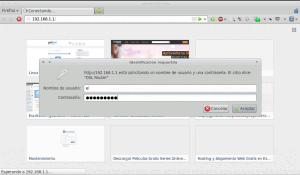](images/14-Acceder-al-Router.png)

Una vez introducida la información accederemos a la configuración de nuestro router. Seguidamente, tal y como se puede ver en la captura de pantalla, tenemos que acceder a los menús **Advanced / NAT / Virtual Servers**:

[](images/15-Acceder-a-Virtual-Servers.png)

Seguidamente presionamos el botón **Add** y nos aparecerá la siguiente pantalla:

[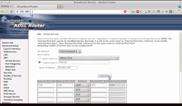](images/16-Abrir-puerto.png)

Tal y como se puede ver en la captura de pantalla, en **en el campo** **custom server** hay que **escribir un nombre cualquiera**. En mi caso como se puede ver en la captura de pantalla he escrito **OpenVPN**. Seguidamente **en el campo** **Server IP Address** tenemos que **escribir la IP del servidor OpenVPN**. En mi caso tal y como se puede ver en la captura de pantalla es la **192.168.1.188**. Finalmente tal y como se puede ver en la captura de imagen **seleccionamos el protocolo** **UDP** **y escribimos el puerto de nuestro servidor OpenVPN** (**1194**) en los puertos internos y externos.

**Presionamos el botón** **Apply/Save** y de esta forma todas las peticiones exteriores que lleguen a nuestro router por el puerto **1194** serán redirigidas a nuestro servidor OpenVPN.

## COMO CONECTARNOS AL SERVIDOR OPENVPN

Seguidamente dejo una serie de enlaces en los que explico de forma detallada los pasos a seguir para conectarnos a nuestro servidor Openvpn en el caso de estar usando los siguientes sistemas operativos:

1. **Linux**
2. [**Android**]()
3. [**Windows**]()
4. [**iOS**]()

Siguiendo las instrucciones de los enlaces que acabo de dejar podremos comprobar fácilmente el funcionamiento de nuestro servidor Openvpn.

## SEGURIDAD QUE NOS APORTARÁ EL SERVIDOR OPENVPN

Si se configura el servidor Openvpn, tal y como se detalla en el post, se obtendrá un nivel de seguridad muy elevado y resultará prácticamente invulnerable frente a ataques.

La seguridad que aportará el servidor OpenVPN que acabamos de configurar estará compuesta por 3 capas:

**Capa 1 “Autentificación TLS”:** Con la autentificación TLS estamos introduciendo una firma digital HMAC a los paquetes antes de empezar la autentificación reciproca entre cliente y servidor. Si no se pasa el test de la firma HMAC, no se llegará ni a iniciar el proceso de autenticación entre cliente y servidor.

**Capa 2 “SSL/TLS”:** Mediante las herramientas de seguridad proporcionadas SSL/TLS se realiza el proceso de autentificacion bidireccional entre el cliente y el servidor OpenVPN mediante claves criptográficas.

**Capa 3 “Cifrado”:** Dispone de varios tipos de cifrado disponibles en la transmisión de datos entre el cliente y el servidor. Además podemos aplicar medidas para los privilegios del demonio de OpenVPN sean los mínimos para poder realizar la función que tiene que realizar.

Todas estas características, más las que se detallan en el post, hacen que OpenVPN sea una opción muy válida para la transmisión segura de datos sensibles. Por esto motivo OpenVPN es el protocolo que utilizan muchas organizaciones en el mundo empresarial. Además OpenVPN es una solución multiplataforma y dentro de lo que cabe no es difícil de configurar si lo comparamos con por ejemplo [Ipsec](https://es.wikipedia.org/wiki/IPSEC "Explicación de lo que es Ipsec").

En lo que a seguridad se refiere también tenemos que destacar que aparte de las 3 capas de seguridad, también hemos implementado un método para que los clientes del VPN tengan que introducir un usuario y un Password. Además la totalidad del tráfico, incluyendo la resolución de las peticiones DNS, será a través del servidor OpenVPN que acabamos instalar y de configurar.

Cabe decir que actualmente no se conocen vulnerabilidades importantes en este tipo de servidor VPN. Es posible que se descubran vulnerabilidades pero si vamos aplicando las actualizaciones de seguridad no deberíamos tener problema alguno en lo que a seguridad se refiere.
