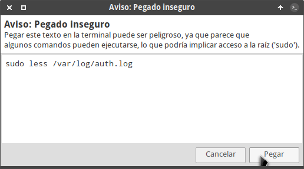
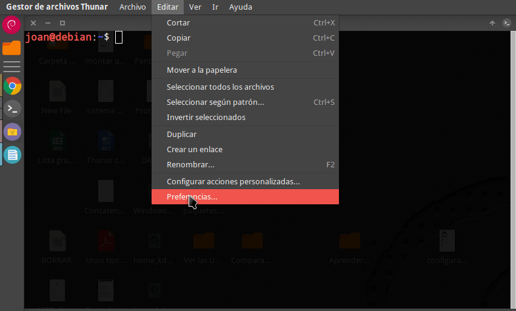
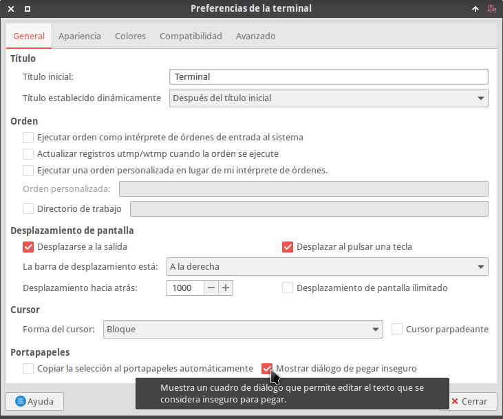

Muchos usuarios noveles de GNU-Linux copian y pegan comandos en la terminal sin saber o analizar lo que hacen. Esto es un peligro ya que alguien con malas intenciones puede dejar un comando que al ejecutarlo destruya el sistema operativo. Por este motivo, la terminal de XFCE incluye un aviso de pegado inseguro a partir de la [versión 0.8.8](https://github.com/xfce-mirror/xfce4-terminal/blob/master/NEWS). Por lo tanto, cada vez que peguemos un comando que se considere peligroso recibiremos una advertencia del siguiente tipo:<!--more-->

Una vez estemos seguros que el comando se puede ejecutar tan solo tendremos que clicar sobre el botón Pegar. Sin duda se trata de un buen mecanismo de seguridad, pero en el caso que consideren las advertencias molestas e inútiles las pueden desactivar de la siguiente forma.

## DESACTIVAR EL AVISO DE PEGADO INSEGURO EN LA TERMINAL DE XFCE

El proceso es sumamente sencillo. Tan solo tenemos que abrir una terminal. A continuación clicamos sobre el menú Editar y cuando se despliegue el submenú clicamos sobre la opción Preferencias...

Acto seguido, en la pestaña General desmarcamos la opción Mostrar diálogo de pegar inseguro y presionamos el botón Cerrar.

A partir de esto momentos ya no aparecerán la advertencia de pegado inseguro.

## ¿POR QUÉ DESACTIVO EL AVISO EN MI CASO?

El aviso de pegado inseguro es una buena idea para usuarios noveles e inexpertos. No obstante es algo frustrante para usuarios que llevan años usando Linux. Por esto motivo en mi caso he decido prescindir de esta opción.

Además si un usuario novel o medio no sabe lo que hace un comando y lo quiere ejecutar, lo acabará ejecutando sepa o no sepa lo que hace.

Por lo tanto dudo que este mecanismo ayude a prevenir la ejecución de comandos maliciosos, pero si ayuda a informar y a educar a los usuarios inexpertos. Para finalizar recordar que antes de ejecutar un comando en la terminal es bueno saber lo que realiza exactamente.
