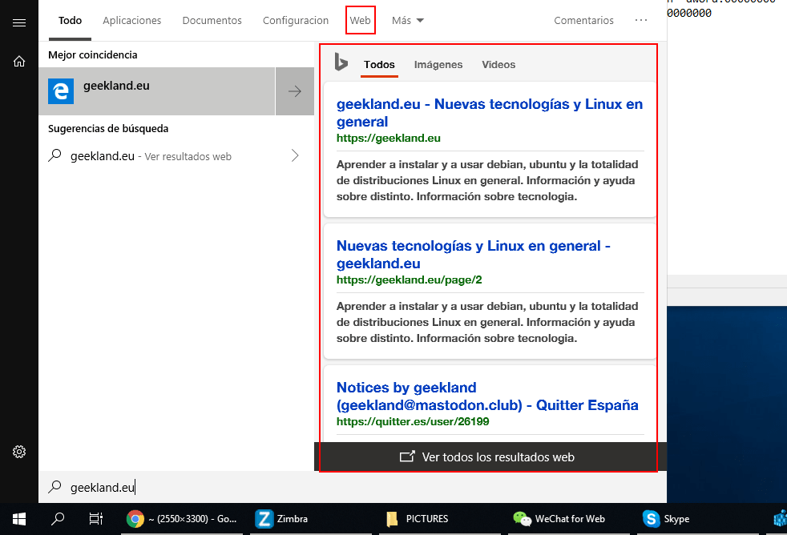
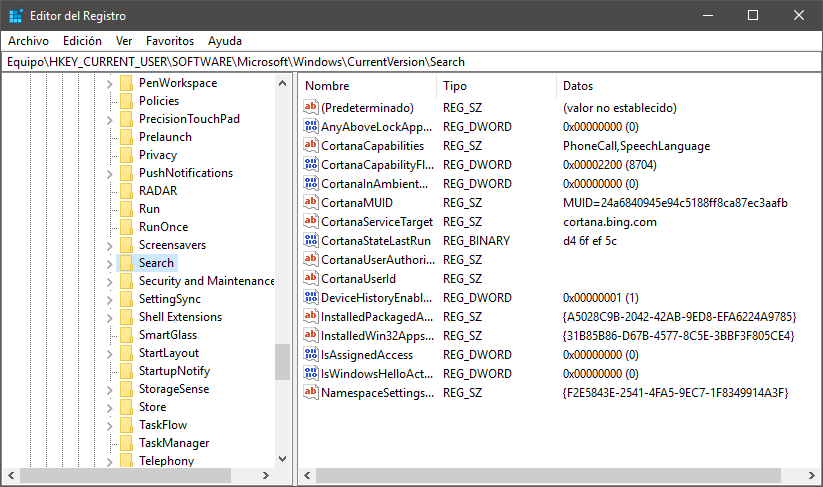
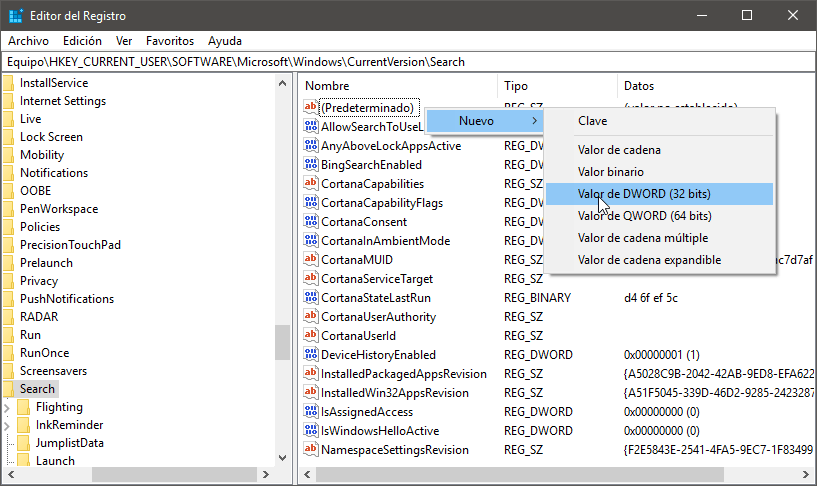
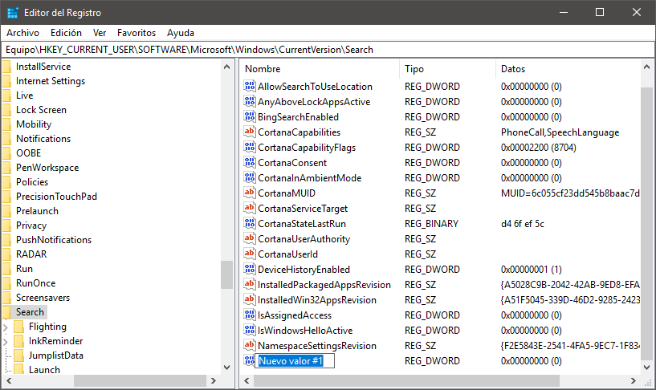
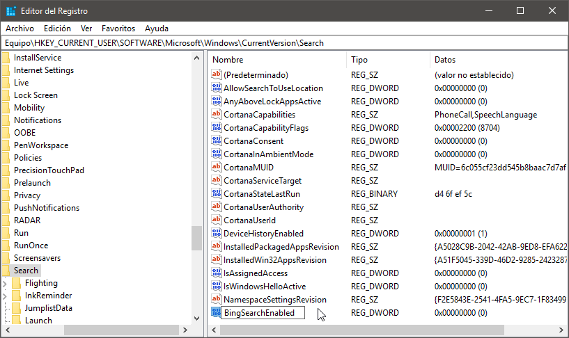
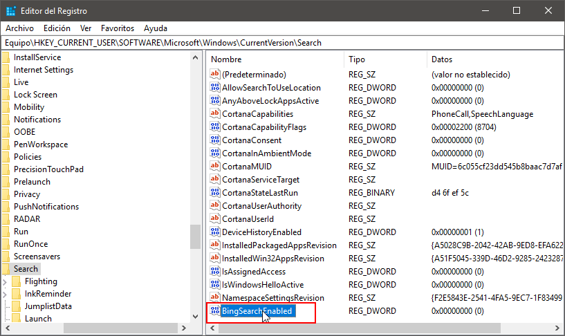
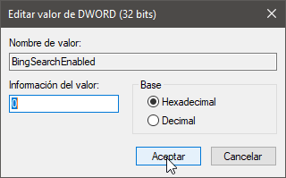
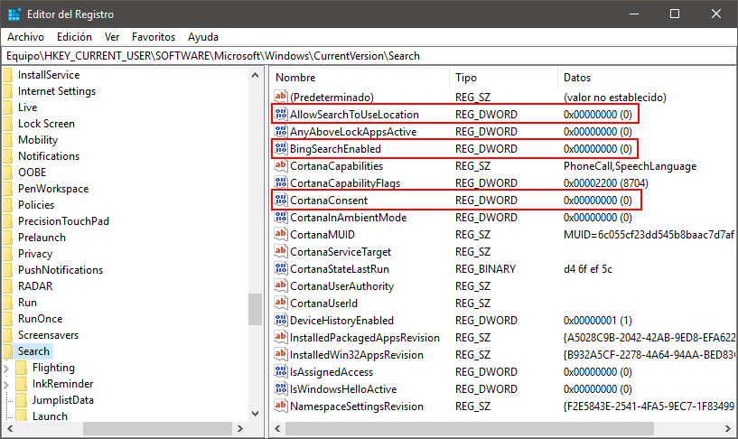
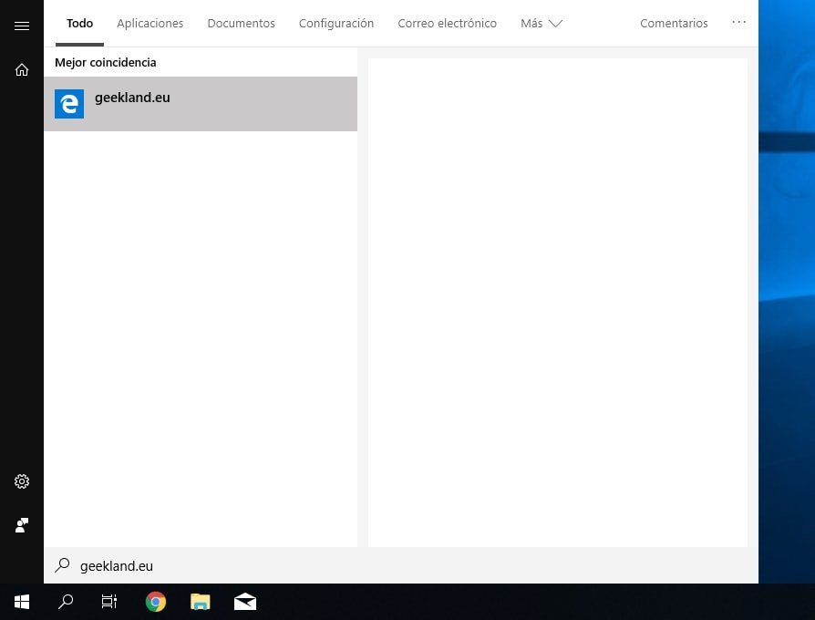

A partir de la versión 1809 Windows 10 incluye la posibilidad de realizar búsquedas web a través de su menú de inicio. En mi caso esta función es un estorbo, por este motivo en el siguiente artículo veremos los pasos a seguir para desactivar la búsqueda web del menú de inicio de Windows.<!--more-->

[](images/busqueda-web-menu-windows.png)

En el caso que la búsqueda estuviera bien implementada podría ser útil, pero bajo mi punto de vista no sirve para nada debido a los siguientes motivos:

1. Provoca lentitud en el acceso y consulta del menú de inicio.
2. Los resultados de búsqueda que ofrece son pésimos. No me gusta el buscador Bing y además no está enfocado a las búsquedas en Español.
3. En muchas ocasiones tan solo quiero buscar un programa, pero en vez buscar el programa se realiza una búsqueda web. Por lo tanto está funcionalidad estorba más que ayuda.
4. Las opciones de configuración de esta función son nulas. No podemos cambiar de buscador, no podemos desactivarla de forma fácil, etc.

Como solución a los problemas que acabo de citar, sigan las siguientes instrucciones para desactivar la búsqueda web del menú de inicio de Windows.

## DESACTIVAR LA BÚSQUEDA WEB DEL MENÚ DE INICIO DE WINDOWS

Para conseguir nuestro objetivo tenemos que presionar la combinación de teclas Win + R. Cuando aparezca la ventana Ejecutar escribiremos regedit y presionaremos el botón Aceptar.

[](images/acceder-registro-windows.png)

Una vez aparezca la ventana en la que podremos modificar el registro de Windows navegaremos hacia la siguiente ubicación:

> ```
> HKEY_CURRENT_USER\SOFTWARE\Microsoft\Windows\CurrentVersion\Search
> ```

[](images/entradas-search-editor-registro-windows.png)

### Crear la entrada BingSearchEnabled en el registro de Windows

Acto seguido sigan las siguientes instrucciones:

1. En la mitad derecha de la ventana del editor del registro presionen el botón derecho del ratón.
2. Cuando aparezca el menú contextual Nuevo, posicionen el puntero del ratón en Nuevo.
3. En las opciones del menú Nuevo cliquen sobre la opción Valor de DWORD (32bits).

[](images/crear-dword-32-bits.png)

Justo después se creará una nueva entrada en el registro con el nombre Nuevo valor #1.

[](images/entrada-creada.png)

A continuación, renombraremos la entrada que acabamos de crear para que tenga el nombre BingSearchEnabled. Una vez renombrada presionamos Enter.

[](images/renombrar-entrada-registro-windows.png)

Seguidamente hacemos doble click sobre la entrada BingSearchEnabled. [](images/acceder-a-los-valores-de-registro.png) Finalmente, cuando se abra la ventana para editar el valor de la entrada aseguramos que sea 0 y presionamos el botón Aceptar.

[](images/asegurar-valor-registro-0.png)

### Crear el resto de entradas para desactivar la búsqueda web del menú de inicio de Windows

Del mismo modo que hemos creado la entrada BingSearchEnabled crearemos las siguientes entradas en el registro Windows:

1. AllowSearchToUseLocation
2. CortanaConsent

[](images/totalidad-entradas-creadas.png)

Una vez creadas las entradas, tal y como hicimos con la entrada BingSearchEnabled, aseguramos que su valor es 0.

### Comprobar que la búsqueda web está desactivada

Finalmente reiniciamos el ordenador. Una vez reiniciado habrá desaparecido la búsqueda web del menú de inicio de Windows. Si realizan una búsqueda verán que en ningún rastro de la búsqueda web.

[](images/busqueda-web-desactivada-panel-inicio.jpg)

Además en el caso que tengan un ordenador que no vaya sobrado de recursos notarán que Windows se comporta de una forma mucho más fluida.

###### Nota: Las acciones realizadas en el artículo sirven para desactivar la búsqueda web de un usuario. Por lo tanto si tenemos un equipo con varios usuarios deberemos aplicar el contenido del tutorial para cada uno de los usuarios.
