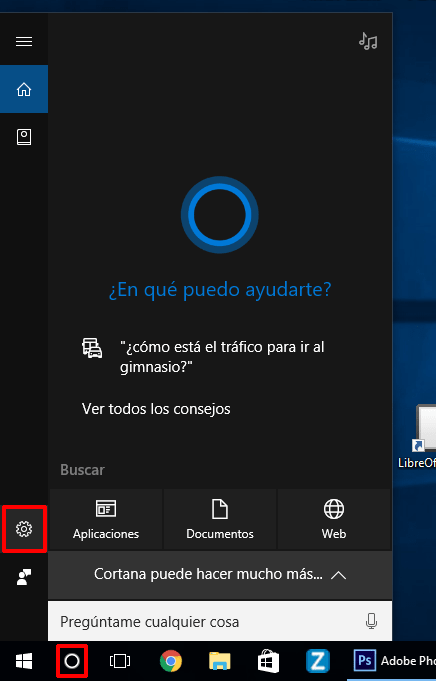
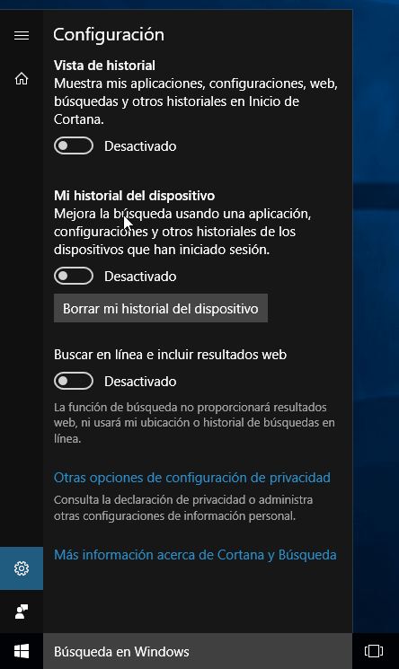
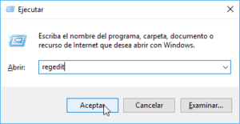
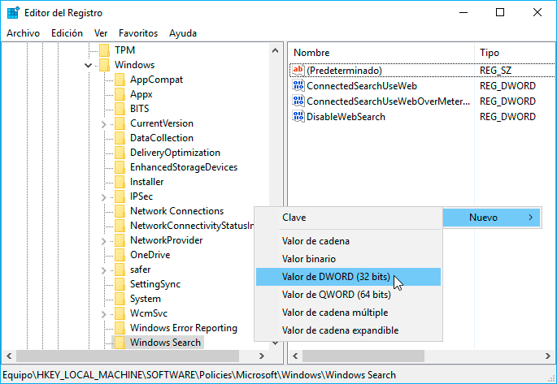
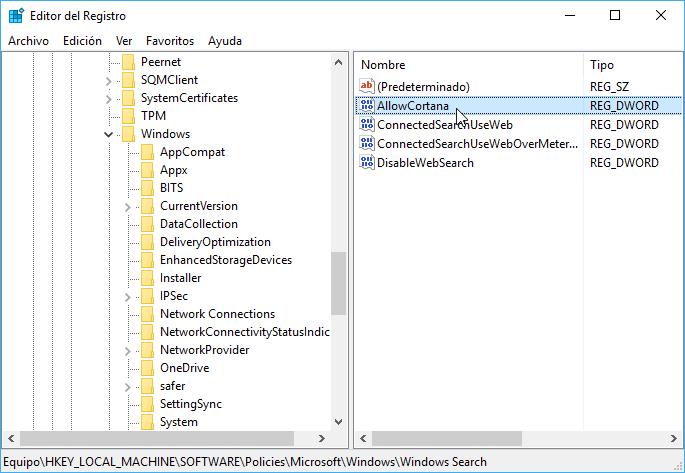
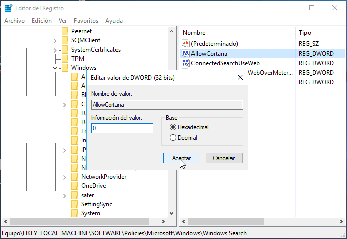
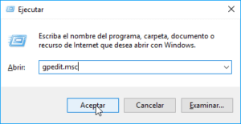
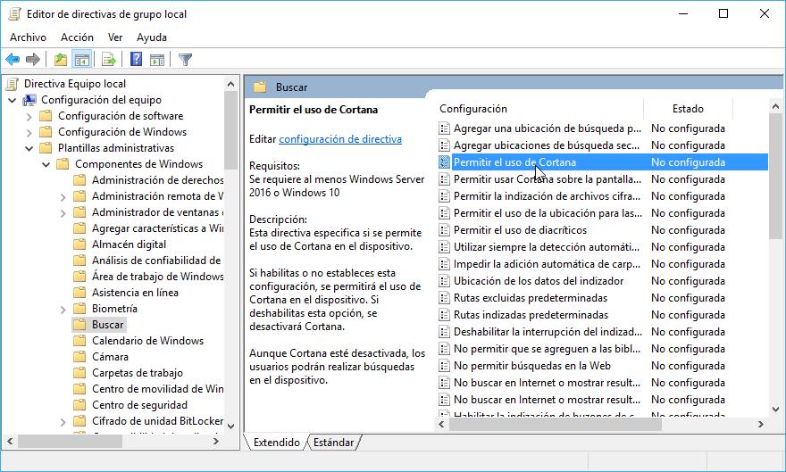
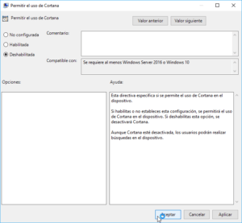

Hoy en día [existen pocas personas que usen de los asistentes personales](). Por esto motivo a continuación veremos los pasos a seguir desactivar Cortana en Windows 10.<!--more-->

## MOTIVOS PARA DESACTIVAR CORTANA EN WINDOWS 10

Algunos de los motivos que hacen altamente recomendable desactivar Cortana son los que se detallan a continuación:

1. No encuentro útil utilizar Cortana en un ordenador personal.
2. Carece de inteligencia y sus funcionalidades son muy limitadas. Este problema aún se acentúa más si la versión de Windows que usamos no es en Inglés.
3. Vulnera la privacidad de los usuarios. Cortana es capaz de monitorizar el contenido que tenemos almacenado en nuestro disco duro, saber los programas que usamos, registrar lo que escribimos, ver nuestro historial de navegación, registrar nuestras peticiones de voz, acceder a nuestra ubicación, consultar nuestros contactos, nuestro correo, nuestro calendario, etc.
4. Gran parte de la información recopilada por Cortana se almacena en los servidores de Microsoft. La [política de privacidad](https://www.microsoft.com/en-gb/servicesagreement/default.aspx "Política de privacidad de Windows") de Microsoft permite usar nuestros datos en caso que alguien de Microsoft lo considere oportuno.
5. Consume recursos de nuestro ordenador. Personalmente no me gusta consumir recursos de mi ordenador en algo que no uso.

###### Nota: Obviamente Microsoft intenta usar los datos recopilados por Cortana para mejorar nuestra experiencia. No obstante proporcionar estos datos también supone una violación importante sobre nuestra privacidad y no es razonable que Cortana venga activado por defecto.

## INSTRUCCIONES PARA DESACTIVAR CORTANA EN UN ORDENADOR

Para desactivar Cortana clicamos en el botón de Cortana y cuando aparezca el menú clicamos en el icono de Configuración.

[](images/acceder-a-la-configuracion-de-cortana.png)

En el menú de configuración de Cortana desactivamos la totalidad de opciones que podemos ver:

[](images/desactivar-las-opciones-de-cortana.png)

Dentro de las opciones de configuración también recomiendo presionar sobre el botón Borrar mi historial del dispositivo. De esta forma eliminaremos la información que Cortana tiene almacenada sobre nosotros.

A continuación debéis seguir las siguientes instrucciones en función de la versión de Windows que estéis usando.

### Desactivar Cortana en Windows 10 en cualquier versión de Windows

Para desactivar Cortana en cualquiera de las versiones de Windows tenemos que acceder al registro del sistema. Para ello presionamos la combinación de teclas Win+R.

Al aparecer la ventana de ejecutar tecleamos el comando regedit y presionamos el botón Aceptar.

[](images/acceder-al-registro-de-windows.png)

Dentro del menú de navegación del registro accedemos dentro de la siguiente ruta:

> ```
> HKEY_LOCAL_MACHINE\SOFTWARE\Policies\Microsoft\Windows\Windows Search
> ```

###### Nota: En el caso que no les aparezca la clave Windows Search créenla manualmente.

Seguidamente en el panel de la derecha presionamos el botón derecho del ratón. Aparecerá un submenú en el que seleccionaremos la opción Nuevo. A continuación se desplegará un submenú en el que deberemos seleccionar y clicar sobre la opción Valor DWORD (32bits).

[](images/crear-un-valor-dword32.png)

A continuación seleccionamos el valor DWORD que acabamos de crear, presionamos la tecla F2 y renombramos el valor DWORD (32 bits) con el nombre AllowCortana

[](images/allow-cortana.png)

Una vez renombrado el valor DWORD hacemos doble click sobre él. Seguidametne aparecerá la siguiente ventana en la que deberán asignar el valor 0 en el campo Información de valor. Para finalizar tan solo tenemos que presionar en el botón Aceptar.

###### [](images/desactivar-cortana-en-todas-las-versions-de-windows.png)

###### Nota: Para reactivar Cortana tan solo tendríamos que revertir los pasos realizados.

Con estos simples pasos podemos desactivar Cortana de cualquier versión de Windows 10.

### Desactivar Cortana en Windows 10 Pro o Enterprise

###### Nota: Este apartado es únicamente válido para los usuarios de Windows 10 Profesional o Enterprice.

Los usuarios de Windows 10 Pro o Enterprise deben presionar la combinación de teclas Win+R. Seguidamente tienen que teclear el comando gpedit.msc y presionar el botón Aceptar.

[](images/acceder-a-directivas-de-grupo.png)

En el editor de directivas de grupos navegamos a la siguiente ruta:

> ```
> Directiva Equipo Local\Configuración del equipo\Plantillas administrativas\Componentes de Windows\Buscar
> ```

Seguidamente hacemos doble click encima de la opción Permitir el uso de Cortana.

[](images/desactivar-cortana-en-windows-pro.png)

Finalmente en la ventana de permitir uso de Cortana tildamos la opción Deshabilitada y presionamos el botón Aplicar.

[](images/deshabilitar-cortana-en-windows-pro.png)

Con estos pasos tanto simples ya hemos conseguido desactivar Cortana en Windows 10 Profesional o Enterprice.

###### Nota: Para reactivar Cortana tan solo tendríamos que revertir los pasos realizados.
