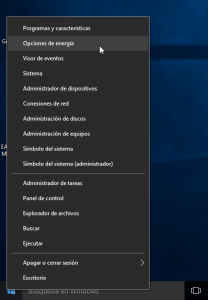
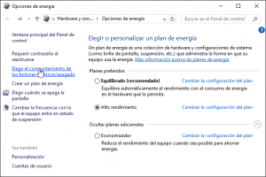
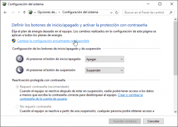
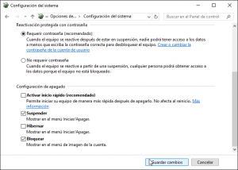

Seguidamente veremos como desactivar una característica que viene activada de serie tanto en Windows 8 como en Windows 10. Se trata del inicio rápido de Windows.<!--more-->

## ¿POR QUÉ TENER DESACTIVADO EL INICIO RÁPIDO DE WINDOWS?

El motivo por el cual quiero tener desactivado el arranque rápido en Windows es simple. Mi ordenador tiene 2 sistemas operativos instalados, en una partición tengo Windows 10 y en otra Debian. **En el caso de tener el arranque rápido activado me ocasiona que no arranque Debian por problemas de montaje en las particiones NTFS y FAT32**.

También es posible que hayan casos en que Linux arranque perfectamente y el problema lo tengamos a la hora de acceder a las particiones NTFS y FAT32 desde Linux obteniendo mensajes de error parecidos al siguiente:

> ```
> Error mounting /dev/sda4 at /media/Datos: Command-line `mount -t "ntfs" -o "uhelper=udisks2,nodev,nosuid,uid=1000,gid=1000,dmask=0077,fmask=0177" "/dev/sda4" /media/Datos "' exited with non-zero exit status 14: The disk contains an unclean file system (0, 0).
> Metadata kept in Windows cache, refused to mount.
> Failed to mount '/dev/sda4': Operation not permitted
> The NTFS partition is in an unsafe state. Please resume and shutdown
> Windows fully (no hibernation or fast restarting), or mount the volumen
> read-only with the 'ro' mount option.
> ```

Por lo tanto la conclusión que tenemos que sacar de todo lo contado hasta el momento es que todos los usuarios que utilicen un dual boot deberían tener desactivada la opción de inicio rápido de Windows para evitar problemas.

## ¿QUÉ HACE EL INICIO RÁPIDO DE WINDOWS?

Como bien describe su nombre el arranque rápido de Windows hace una serie de modificaciones en el proceso de apagado y arranque nuestro ordenador para que se encienda más rápido. Las modificaciones que introduce en el proceso de arranque son básicamente las siguientes:

Si tenemos activado el arranque rápido de Windows, **en el momento de apagar nuestro equipo Windows guardará una imagen del Kernel de Windows, del estado de las particiones, de la sesión del usuario y de otros parámetros en el archivo C://hiberfil.sys**. Una vez guardada la imagen nuestro ordenador se apagará. **En el momento de arrancar el ordenador, en vez de seguir el proceso normal de arranque, Windows se dedicará a cargar la imagen almacenada en el archivo C://hiberfil.sys** obteniendo de esta forma un arranque mucho más rápido.

## RAZÓN POR LA QUE EL INICIO RÁPIDO DE WINDOWS GENERA PROBLEMAS EN EL ARRANQUE DE OTROS SISTEMAS OPERATIVOS

Una vez conocemos el método de funcionamiento del arranque rápido de Windows es fácil deducir la razón por la cual se generan problemas al arrancar otros sistemas operativos con el inicio rápido activado.

**Cuando apagamos Windows con el inicio rápido activado no estamos apagando Windows**. Lo que realmente estamos haciendo es hibernándolo y **esto implica que las particiones del sistema no se desmontan** completamente**. Al no desmontarse** completamente**, al intentar montarlas con otros sistemas operativos se detectan inconsistencias** en el sistema de archivos **que impiden montar las particiones**.

Para solucionar este problema tan solo tenemos que desactivar el inicio rápido de Windows del siguiente modo.

## COMO DESACTIVAR EL INICIO RÁPIDO DE WINDOWS

El primer paso es **ubicarnos encima del botón de inicio de Windows y presionar el botón derecho del ratón**. Al presionar el botón parecerá un menú contextual con varias opciones y, tal y como se puede ver en la captura de pantalla, **clicamos encima de la opción Opciones de energía**.

[](images/Acceder-Opciones-de-Energia.png)

Seguidamente aparecerá la siguiente ventana en la que, tal y como se puede ver en la captura de pantalla, tendremos que **clicar encima de la opción Elegir el comportamiento de los botones de inicio/apagado**.

[](images/Elegir-el-comportamiento-de-los-botones-de-inicios-apagado.png)

A continuación, tal y como se puede ver en la captura de pantalla, deberemos **clicar encima de la opción Cambiar la configuración actualmente no disponible**.

[](images/Cambiar-la-configuración-actualmente-no-disponible.png)

Finalmente, tal y como se puede ver en la captura de pantalla, **en el apartado Configuración de apagado deberemos destildar la opción Activar inicio rápido (Recomendado)** y seguidamente **presionar encima del botón Guardar cambios**.

[](images/Desactivar-iniciar-rápido-y-guardar-cambios.png)

Después de seguir estos pasos el proceso ha terminado. En estos momentos Windows y el resto de sistemas operativos que tenemos instalados en nuestro ordenador deberían convivir sin ningún tipo de problema.

###### Nota: Hay que ir con cuidado con las actualizaciones mayores de Windows. Aunque nosotros desactivemos el inicio rápido de Windows, en cada actualización Windows nos lo volverá a activar por defecto. En el momento que se active por defecto lo deberemos volver a desactivar.
