Hace tiempo que quería escribir este post pero nunca encontraba el momento para ello. Desde que empecé a usar Linux una de las cosas que **no acabo de entender es como puede ser posible que en prácticamente ninguna distro el Salvanpantallas funcione de forma adecuada**. **A muchos seguramente le serán familiares las siguientes situaciones**:<!--more-->

1. **Vamos a ver un vídeo** o una película en el reproductor de vídeo de nuestro ordenador **y durante el transcurso de la película observamos que se activa el salvapantallas**. Da igual que en nuestro reproductor seleccionemos que no se active el salvapantallas porqué seleccionemos lo que seleccionemos el salvapantallas se activará.
2. **Vamos a ver un vídeo en Youtube**, o en cualquier otra plataforma de vídeos, **y** nos encontramos con el problema que **se activa el salvapantallas en medio de la visualización del vídeo**.

###### Nota: Parece mentira que la gran mayoría de distros, o desarrolladores de software de Linux, no presten atención a estos detalles. Sin duda detalles como estos echan para atrás a muchos usuarios de otras sistemas operativos que prueban Linux por primera vez.

**Para solucionar este pequeño inconveniente hace tiempo que vengo usando un pequeño programa que se llama** [Caffeine](https://launchpad.net/~caffeine-developers/+members "Desarrolladores de Caffeine").

## FUNCIONAMIENTO DE CAFFEINE

**Caffeine** es un programa escrito en Phyton **se encarga de deshabilitar el gestor de energía de nuestra distribución cuando nosotros se lo indicamos**. Esto nos servirá para que no se active nuestro protector de pantalla cuando estemos viendo un vídeo de Youtube o una película en nuestro ordenador. De este modo podremos ver tranquilamente el vídeo que queramos mirar sin tener que estar cada X tiempo moviendo el ratón para que no se active el protector de pantalla.

###### Nota: Una solución alternativa a usar Caffeine es entrar en la configuración de gestión de energía de nuestra distribución Linux y desactivar el salvapantallas, pero tener que realizar esto cada vez que visualizamos un vídeo cuanto menos es engorroso.

###### Nota: El consumo de memoria RAM de Caffeine en Debian Testing (Jessie) amd64 es de 20Mb. En un sistema i386 seguramente el consumo de RAM será mucho menor.

###### Nota: Caffeine actualmente está disponible para Linux y para Max OS X. En este artículo únicamente se hace referencia a GNU-Linux ya que es el sistema operativo que utilizo habitualmente en casa.

## INSTALACIÓN DE CAFFEINE EN UBUNTU O LINUX MINT

Para Instalar Caffeine en Ubuntu o Linux Mint es sumamente fácil. Tan solo tenemos que **ingresar en la terminal e usar los siguientes comandos**:

Para añadir el repositorio de Caffeine:

> ```
> sudo add-apt-repository ppa:caffeine-developers/ppa
> ```

Para actualizar los paquetes de los repositorios que tenemos en nuestro ordenador:

> ```
> sudo apt-get update
> ```

Para instalar Caffeine en nuestro sistema operativo:

> ```
> sudo apt-get install caffeine
> ```

Una vez introducidos y ejecutados estos 3 comando Caffeine estará instalado en su ordenador. Ahora tan solo tendremos que ejecutarlo y configurarlo a nuestro gusto.

## INSTALACIÓN DE CAFFEINE EN DISTRIBUCIONES DERIVADAS DE DEBIAN

Desafortunadamente Caffeine no acostumbra a estar disponible en los repositorios de la gran mayoría de distribuciones Linux. Por lo tanto quien quiera usar Caffeine en distribuciones, como por ejemplo Debian, pueden usar la siguiente solución:

**Acceden al siguiente** [Link](https://launchpad.net/~caffeine-developers/+archive/ubuntu/ppa/+packages "Web de descarga de los archivos de instalación de Caffeine"). En este link encontrarán la totalidad de paquetes .deb que están disponibles para todas y cada una de las versiones de Ubuntu. Tal y como se puede ver en la captura de imagen **descargan cualquiera de los paquetes .deb** que están disponibles en link que he dejado:

[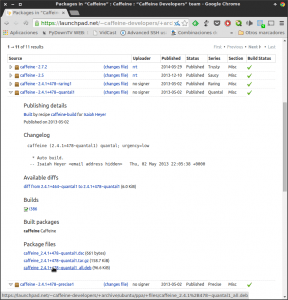](images/Descarga-del-paquete-de-caffeine.png)

###### Nota: En mi caso he descargado el paquete .deb de Caffeine correspondiente a Ubuntu 12.10 (Quantal Quetzal)

**Una vez descargado** el paquete, como podemos ver en la captura de pantalla, **tan solo tenemos que instalarlo** como si de un archivo binario se tratará:

[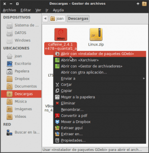](images/Instalar-Caffeine.png)

**Una vez instalado el programa lo ejecutamos para comprobar si funciona**. En el caso que el programa funcione a la perfección el proceso a finalizado. **En el caso que el programa no funcione adecuadamente tenemos que desinstalar el paquete .deb que acabamos de desinstalar y probar con otro de los paquetes .deb que encontraremos en el siguiente** [Link](https://launchpad.net/~caffeine-developers/+archive/ubuntu/ppa/+packages "Web de descarga de los archivos de instalación de Caffeine").

En el caso que el paquete .deb descargado no les funcione pueden abrir una terminal y usar el siguiente comando para desinstalar Caffeine:

> ```
> sudo apt-get remove --purge caffeine
> ```

###### Nota: En el caso de usar Debian Testing (Jessie) el único paquete .deb de Ubuntu que les funcionará es el de la versión 12.10. Por lo tanto la versión de Caffeine que estaremos usando una vez instalado el programa será la 2.4.1

###### Nota: Sin duda esta no es la opción más elegante para instalar Caffeine pero es la forma que yo uso. Podríamos añadir los repositorios de Ubuntu a nuestra distro pero nunca me ha gustado mezclar repositorios de Ubuntu con Debian.

## INSTALACIÓN DE CAFFEINE PARA USUARIOS DE GNOME SHELL

Los usuarios del entorno de escritorio Gnome Shell tienen la suerte de que existe la extensión de Caffeine para su entorno de escritorio. Por lo tanto lo único que tienen que realizar para instalar Caffeine es **clicar encima del siguiente [link](https://extensions.gnome.org/extension/517/caffeine/ "Link de instalación de Caffeine")**. Una vez hayan clicado en el link accederán a la página web donde podrán instalar la extensión de Caffeine para Gnome Shell:

[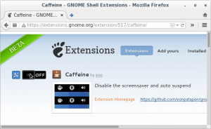](images/Instalación-Extensión-Caffeine.png)

Tal y como se puede ver en la captura de pantalla, para instalar la extensión de Gnome Shell tenemos que **clicar encima del interruptor **OFF** para ponerlo en posición **ON****. Una vez se ponga en posición ******ON****** aparecerá la siguiente ventana en la pantalla:

[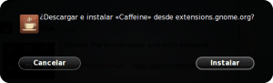](images/Instalar-caffeine.png)

Como nuestro objetivo es instalar la extensión **presionaremos el botón de ****Instalar******. Una vez instalada la extensión aparecerá un applet de una taza de café en el panel de nuestro Gnome Shell:

[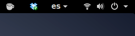](images/Panel-gnome-Shell-con-caffeine.png)

En estos momentos el proceso instalación de la extensión ha finalizado.

## USO Y CONFIGURACIÓN DE CAFFEINE

### Iniciar por primera vez Caffeine

Para iniciar Caffeine tan solo tienen que ir al menú de su distro, y tal y como se puede ver en la captura de pantalla allí encontraran el icono para iniciar la aplicación.

[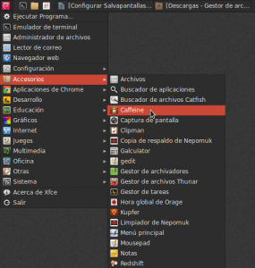](images/Iniciar-Caffeine.png)

Tal y como se puede ver en la captura de pantalla, una vez se haya iniciado caffeine, en el panel de vuestra distro aparecerá una taza de café indicando que Caffeine se ha iniciado satisfactoriamente.

[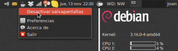](images/Desactivar-salvapantallas.png)

### Hacer que Caffeine arranque automáticamente con el arranque del sistema

Si queremos que esta aplicación se inicie de forma automática cada vez que arrancamos el sistema es muy sencillo. Tan solo tenemos que **ubicarnos encima del applet de la taza de café. Presionamos el botón derecho del mouse**, y tal como se puede ver en la captura de pantalla **seleccionamos la opción** **Preferencias**.

[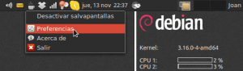](images/Acceder-a-preferencias-de-Caffeine.png)

Seguidamente aparecerá la siguiente ventana:

[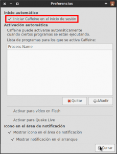](images/Iniciar-Caffeine-en-el-arranque-del-sistema.png)

En esta ventana, tal y como se puede ver en la captura de pantalla, tan solo **tenemos que activar la celda** **Iniciar Caffeine en el inicio de sesión**. **Presionan el botón** **Cerrar** y la próxima vez que arranquemos el ordenador, Caffeine se iniciará de forma completamente automática.

###### Nota: Si queremos que Caffeine no se autoinicie tan solo tenemos que desiltadar la opción que acabamos de marcar.

### Desactivar el salvapantallas manualmente cuando quiero ver un vídeo

Si queremos visualizar un vídeo seguramente nos interesará que no se active el protector de pantalla. Para desactivar el protector de pantalla tan solo tenemos que **ubicarnos encima del applet de la taza de café. Presionamos el botón derecho del mouse, y** tal como se puede ver en la captura de pantalla **seleccionamos la opción** **Desactivar salvapantallas**.

[](images/Desactivar-salvapantallas.png)

Justo después de desactivar el protector de pantallas veremos que encima de la taza de café aparecen una rayas de humo:

[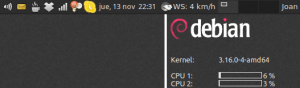](images/Salvapantallas-desactivado.png)

Esto nos está indicando que el protector de pantalla está desactivado y por lo tanto podremos visualizar tranquilamente los vídeos que queramos que el salvapantallas no se activará.

Cuando terminemos de visualizar el vídeo podemos volver a activar el protector de pantalla. Para ello tenemos que ubicarnos encima del applet de la taza de café. Presionar el botón derecho del mouse, y seleccionar la opción Activar salvapantallas.

###### Nota: Particularmente está es la opción que acostumbro a usar. En mi caso no tengo configurado Caffeine para que se inicie con determinadas aplicaciones. Simplemente cuando quiero que no se active el salvapantallas hago un par de clics con el ratón y el salvapantallas queda completamente desactivado.

### Activar Caffeine cuando se inicie un programa determinado

En el caso que la opción de uso mostrada en el apartado anterior no les acabe de satisfacer pueden usar la siguiente opción.

Podemos hacer que cada vez que se inicie un programa determinado se desactive el protector de pantalla. Para ello tenemos **ubicarnos encima del applet de la taza de café. Presionamos el botón derecho del mouse**, y tal como se puede ver en la captura de pantalla **seleccionamos la opción** **Preferencias**.

[](images/Acceder-a-preferencias-de-Caffeine.png)

Una vez dentro de la ventana de preferencias vamos a configurar Caffeine para que desactive el protector de pantalla cuando se inicie por ejemplo el reproductor de vídeo VLC. Tal y como se puede ver en la captura de pantalla **presionamos el botón** **Añadir**:

[](images/Configuración-de-Caffeine.png)

Seguidamente aparecerá la siguiente ventana en la que **tenemos que escribir el nombre del proceso en el que queremos que desactive el salvapantallas cada vez que se ejecute**. Como se puede ver en la captura de pantalla, **como quiero desactivar el salvapantallas cuando se inicia el reproductor de vídeo VLC, escribo **vlc****. Una vez he escrito vlc **presiono el botón** **Añadir**.

[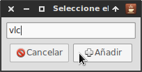](images/Añadiendo-VLC.png)

**En estos momentos cada vez que ejecutemos el reproductor de vídeo VLC se desactivará el salvapantallas** y por lo tanto cuando visualicemos un vídeo nunca se activará el protector de pantalla. **En el momento que cerremos el programa VLC el protector de pantalla se volverá a activar de nuevo**.

###### Nota: En el recuadro en que hemos escrito vlc, no tenemos que escribir el nombre del programa. Tenemos que escribir el nombre del proceso asociado a Vlc. Para averiguar el nombre de proceso asociado a un programa lo pueden realizar fácilmente con top, con gnome-system-monitor, con pstree, etc. Más adelante en el post, como nota aclaratoria, explico como identificar el nombre del proceso asociado a un programa.

**Si en lugar de VLC queremos que el salvapantalas se desactive con otros programas tan solo tenemos que sustituir el comando vlc por el que corresponda en cada caso**. Algunos ejemplos de comandos alternativos a vlc son los siguientes:

**firefox:** Si en vez de vlc escriben firefox desactivaremos el protector de pantalla cada vez que se inicie el navegador web Firefox. **parole:** Si en vez de vlc escriben parole desactivaremos el protector de pantalla cada vez que se inicie el reproductor de vídeo Parole. **chrome:** Si en vez de vlc escriben chrome desactivaremos el protector de pantalla cada vez que se inicie el navegador web Google Chrome. **totem:** Si en vez de vlc escriben totem desactivaremos el protector de pantalla cada vez que se inicie reproductor de video Totem. **skype:** Si en vez de vlc escriben skype desactivaremos el protector de pantalla cada vez que se inicie el programa de mensajería de Skype. **soffice.bin:** Si en vez de vlc escriben soffice.bin desactivaremos el protector de pantalla cada vez que se inicie la suite ofiomática Libreoffice. **evince:** Si en vez de vlc escriben evince desactivaremos el protector de pantalla cada vez que se inicie el lector de pdf Evince **gimp-2.8:** Si en vez de vlc escriben gimp-2.8 desactivaremos el protector de pantalla cada vez que se inicie el programa de edición de imágenes de Gimp. **risttreto:** Si en vez de vlc escriben risttreto desactivaremos el protector de pantalla cada vez que se inicie el visualizador de imágenes de Risttreto.

Para finalizar este apartado les dejo con una captura de pantalla en que les muestro una serie de programas añadidos en el apartado de Activación automática:

[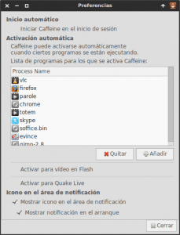](images/Programas-añadidos.png)

Cualquiera de los programas que se ejecute y esté presente en el apartado de activación automática implicará que el protector de pantalla se desactivará automáticamente.

## AVERIGUAR EL PROCESO ASOCIADO CON UN PROGRAMA

Como hemos dicho anteriormente para poder configurar Caffeine a nuestro gusto es necesario conocer el nombre de los procesos de los programas. Una forma simple para realizar esto es con el comando pstree.

Así por lo tanto s**i queremos averiguar el nombre del proceso asociado a gimp, lo primero que tenemos que hacer es abrir gimp. Una vez abierto gimp abrimos una terminal y tecleamos el siguiente comando:**

> ```
> pstree
> ```

El resultado de este comando, tal y como se puede ver en la captura de pantalla, es la totalidad de los procesos que se están ejecutando junto con sus dependencias en forma de árbol.

[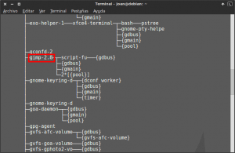](images/Arbol-de-procesos.png)

**Si consultamos los resultados obtenidos**, tal y como se puede ver en la captura de pantalla, **hay un proceso llamado** **gimp-2.8** que con total seguridad corresponde al programa Gimp. P**or lo tanto ya hemos averiguado el nombre del proceso necesarios para poder configurar Caffeine**.

## USO Y CONFIGURACIÓN DE CAFFEINE PARA USUARIOS DE GNOME SHELL

### Iniciar por primera vez Caffeine

En el caso de usar Gnome Shell no hace falta iniciar Caffeine. **En el momento de instalar la extensión de Gnome Caffeine se inicia automáticamente** siempre que arranquemos nuestro sistema.

### Hacer que Caffeine arranque automáticamente con el arranque de sistema

En el caso de usar la extensión de Caffeine para el escritorio de Gnome Shell no hace falta configurar absolutamente nada. Caffeine se inicializará de forma automática con el arranque del sistema.

En el caso de que alguien precise deshabilitar el arranque automático tan solo tiene que desactivar la extensión de Gnome Shell.

### Desactivar el Salvapantallas manualmente cuando quiero ver un vídeo

**Para desactivar el gestor de energía** en gnome shell tenemos que **posicionarnos encima de la taza de café del panel de gnome y presionar el botón derecho o izquierdo del ratón**, justo después de presionar el botón aparecerán una rayas encima de la taza de café indicando que el gestor de energía está deshabilitado. P**ara volver habilitar el gestor de energía tenemos que repetir exactamente la misma operación que hemos realizado para deshabilitarlo**.

### Activar Caffeine cuando se inicie un programa determinado

Para que el gestor de energía se desactive cuando se inicie un programa sencillamente tenemos que **acceder a la configuración de extensiones de Gnome Shell**.

Una vez hemos accedido a la configuración de extensiones, tal y como se puede ver en la captura de pantalla, **presionamos encima del botón de configuración de la extensión de Caffeine**.

[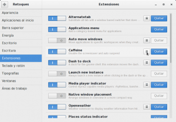](images/Acceso-a-configuración-Gnome-Shell.png)

Después de presionar en el botón de configuración aparecerá la siguiente pantalla:

[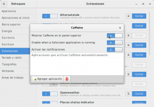](images/Opciones-de-Configuración.png)

**En esta pantalla tendremos la totalidad de opciones de configuración** que nos permite Caffeine. Activando y desactivando los interruptores **podemos configurar las siguientes acciones**:

1. Mostrar u Ocultar el icono de Caffeine del panel de Gnome.
2. Que se desactive el gestor de energía, y por lo tanto el salvanpatallas, cada vez que se ejecute una aplicación a pantalla completa. De esta forma cuando visualicemos un vídeo de Youtube o un vídeo con nuestro reproductor de vídeo no se activará el salvapantallas.
3. Activar o desactivar las notificaciones que indican cuando el salvapantallas se activa o desactiva.

**Además en la parte inferior izquierda de la ventana veremos que que existe un botón para agregar aplicaciones.** De esta forma cuando iniciemos la aplicaciones que se agreguen en este apartado el gestor de energía se desactivará. Para realizar esto **presionamos el Botón de** **Agregar Aplicación**

[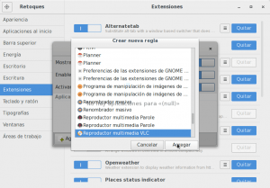](images/Añadir-Aplicación-Gnome-Shell.png)

Tal y como se puede ver en la captura de pantalla aparecerá la ventana Crear nueva regla. En ella tenemos que **seleccionar la aplicación en que queremos que no se active el salvapantallas cuando la utilicemos**. En mi caso selecciono VLC y **presiono el botón** **Agregar**. Una vez realizado este paso cada vez que se arranque la aplicación VLC se desactivará la gestión de energía. Cuando se cierre VLC el gestor de energía se volverá a activar de nuevo.
