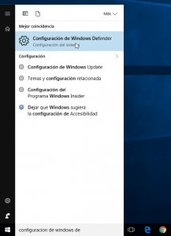
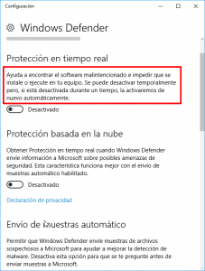
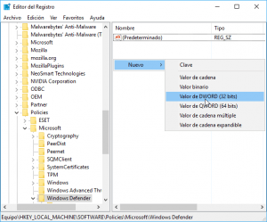
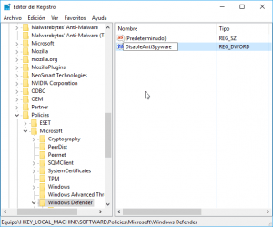
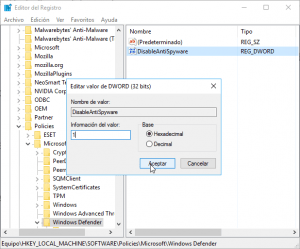
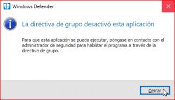
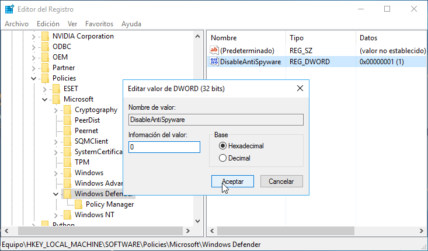
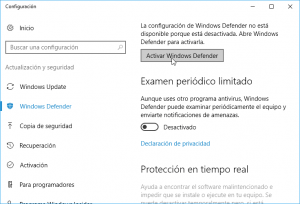
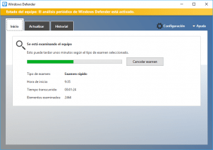

En el presente artículo veremos el proceso para poder desactivar Windows Defender de forma permanente en nuestro sistema operativo Windows.<!--more-->

## RAZONES PARA DESACTIVAR WINDOWS DEFENDER DE WINDOWS

Algunos de los motivos que nos pueden llevar a desactivar Windows Defender son los siguientes:

1. No confiar en la seguridad que ofrece este producto.
2. Windows defender analiza todos y cada uno de los archivos de nuestro ordenador y es probable que Microsoft utilice estos datos para violar nuestra privacidad.
3. Es común que las empresas confíen su seguridad a Software Antivirus de terceros como kaspersky, Eset Nod 32, etc.
4. No es conveniente que funcionen 2 software antivirus de forma simultánea en un mismo ordenador. Puede generar incompatibilidades, problemas y lentitud en el sistema operativo.

## DESACTIVAR WINDOWS DEFENDER DE FORMA COMPLETA

Inicialmente accedemos a la configuración de Windows Defender.

Para ello en el menú de búsqueda de Windows tecleamos **Configuración de Windows Defender**. Una vez realizada la búsqueda clicamos encima de la opción **Configuración de Windows Defender**.

[](images/Acceder-a-la-configuración-de-Windows-Defender.png)

En las opciones de configuración desactivamos todas y cada una de las opciones de protección. Si observamos el texto que está dentro del recuadro rojo de la siguiente imagen veremos que Windows nos informa que tarde o temprano activará el antivirus de nuevo.

[](images/Desactivar-las-opciones-de-Windows-Defender.png)

Para evitar que el antivirus se vuelva a activar presionamos la combinación de teclas **Win+R**.

Cuando aparezca la ventana de **Ejecutar** tecleamos **regedit** y presionamos el botón **Aceptar**.

[](images/Acceder-al-registro-de-Windows.png)

Seguidamente aparecerá una ventana que nos informará si queremos realizar cambios en el registro del sistema. En nuestro caso presionaremos encima del botón **Sí**.

A continuación aparecerá el menú de navegación del registro del sistema. Tal y como se puede ver en la captura de pantalla navegaremos dentro de la siguiente ruta:

> ```
> HKEY_LOCAL_MACHINE\SOFTWARE\Policies\Microsoft\Windows Defender
> ```

Una vez dentro de la ruta, en el panel derecho hacemos click con el botón derecho del ratón y creamos un nuevo valor de Dword de 32 bits:

[](images/Crear-un-valor-DWORD.png)

Una vez creado el DWORD de 32 bits lo renombramos con el nombre **DisableAntiSpyware**:

[](images/DWORD-Disable-AntiSpyware.png)

Finalmente hacemos doble click en el DWORD de 32 bits con nombre **DisableAntiSpyware**, cuando aparezca la ventana de **Editar valor** le asignamos el valor **1**, presionamos el botón **Aceptar** y reiniciamos el ordenador.

[](images/Desactivar-windows-defender-de-forma-permanente.png)

En estos momentos el antivirus Windows defender está completamente desactivado y Windows no lo activará de nuevo por su cuenta.

## COMPROBAR QUE WINDOWS DEFENDER ESTÁ DESACTIVADO

Para comprobar que Windows Defender está desactivado tan solo tenemos que intentar abrir el antivirus. Si en el momento de abrirlo les sale la siguiente ventana podemos estar seguros que Windows Defender está totalmente desactivado.

[](images/Windows-Defender-desactivado.png)

## QUITAR EL ICONO DE WINDOWS DEFENDER DEL PANEL Y DEL MENÚ CONTEXTUAL

Aunque hayan desactivado Windows Defender es posible que el icono de Windows Defender les siga apareciendo en la barra de tareas y en el menú contextual de Windows.

Si quieren eliminar el icono de Windows Defender de la barra de tareas de Windows deben seguir los pasos que encontrarán en el siguiente artículo:

[https://geekland.eu/quitar-el-icono-de-windows-defender/]()

Para eliminar las entradas de Windows Defender en el menú contextual de Windows deben seguir los consejos del siguiente artículo:

[https://geekland.eu/quitar-windows-defender-del-menu-contextual/]()

## REACTIVAR WINDOWS DEFENDER DE NUEVO

Si algún día quieren reactivar Windows Defender es muy sencillo. Tan solo tendrán que revertir la totalidad de pasos realizado en este post.

Para ello acceden a la siguiente ubicación del registro de Windows:

> ```
> HKEY_LOCAL_MACHINE\SOFTWARE\Policies\Microsoft\Windows Defender
> ```

Una vez dentro de la ubicación cambian el valor de **DisableAntiSpyware de 1 a 0** y presionan el botón **Aceptar**.

[](images/Habilitar-Windows-Defender.png)

Acto seguido acceden a la configuración de Windows Defender y presionan el botón **Activar Windows Defender**.

[](images/Activar-Windows-Defender.png)

Justo después de presionar el botón se activará Windows Defender y lo único que tendrán que realizar es configurarlo según sus necesidades en la configuración de Windows Defender.

[](images/Usando-Windows-Defender.png)
