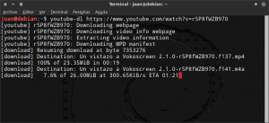
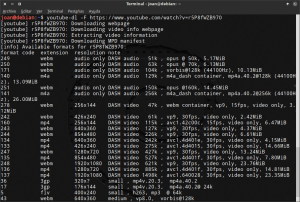
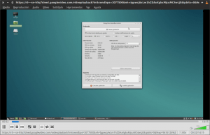

Los usuarios de Gnu/Linux tienen varias alternativas para descargar vídeos de Youtube y de otras web en internet. Una de las opciones interesantes que tenemos es usar un script de phyton llamado Youtube-dl. No se dejen engañar por su nombre ya que youtube-dl, como veremos más adelante, permite descargar vídeos y audio de youtube y de muchos otros sitios web.<!--more-->

Los pasos a seguir para poder instalar y usar youtube-dl en cualquier distribución GNU-Linux son los siguientes:

## INSTALAR YOUTUBE-DL

Para instalar youtube-dl como mínimo disponemos de 3 opciones que son la siguientes:

### Instalación a través de los repositorios de nuestra distro

Es probable que los repositorios de nuestra distribución incluyan youtube-dl en su paqueteria de serie. Por lo tanto **en el caso que utilicen una distribución que utiliza el gestor de paquetes apt-get deberán ejecutar el siguiente comando en la terminal:**

> ```
> sudo apt-get install youtube-dl
> ```

**En el caso de usar el gestor de paquetes pacman deberán reemplazar el comando anterior por el siguiente:**

> ```
> sudo pacman -S youtube-dl
> ```

### Instalación en Ubuntu y en distros derivadas de Ubuntu

En el caso que estén usando Ubuntu, o cualquier distribución derivada de Ubuntu, les recomiendo encarecidamente que instalen Youtube-dl del siguiente modo:

Primeramente hay que **agregar el repositorio de webupd8 ejecutando el siguiente comando en la terminal:**

> ```
> sudo add-apt-repository ppa:nilarimogard/webupd8
> ```

Seguidamente hay que **actualizar los repositorios de nuestra distribución ejecutando la siguiente orden:**

> ```
> sudo apt-get update
> ```

Finalmente **instalamos Youtube-dl ejecutando el siguiente comando en la terminal:**

> ```
> sudo apt-get install youtube-dl
> ```

###### Nota: Recomiendo este método de instalación porque la instalación es fácil y además dispondremos de actualizaciones frecuentes.

### Instalación Youtube-dl de forma manual para descargar vídeos de internet

En el extraño caso que no estemos usando ninguna distribución derivada de Ubuntu y los paquetes de nuestra distribución no contengan rastro de Youtube-dl podemos usar el siguiente método de instalación.

Aseguraremos que disponemos del paquete wget en nuestro sistema operativo. Para ello **ejecutamos el siguiente comando en la terminal:**

> ```
> sudo apt-get install wget
> ```

Seguidamente descargamos el script de phyton Youtube-dl y lo guardaremos en la ubicación**/usr/local/**. Para ello **ejecutamos el siguiente comando.**

> ```
> sudo wget https://yt-dl.org/downloads/latest/youtube-dl -O /usr/local/bin/youtube-dl
> ```

Finalmente damos permisos de lectura y ejecución a todos los usuarios del sistema para que puedan ejecutar el script que acabamos de descargar. Para ello **ejecutamos el siguiente comando en la terminal:**

> ```
> sudo chmod a+rx /usr/local/bin/youtube-dl
> ```

Si el proceso de instalación ha sido satisfactorio obtendrán unos resultados parecidos a la siguiente captura de pantalla:

[](images/instalacion-youtube-dl_2.png)

## WEBS ENS LAS QUE PODEMOS USAR YOUTUBE-DL PARA DESCARGAR VÍDEOS Y AUDIO

Para ver la totalidad de páginas web soportadas por Youtube-dl tan solo hay **abrir una terminal y ejecutar el siguiente comando:**

> ```
> youtube-dl --list-extractors
> ```

Una vez ejecutado el comando podemos ver la totalidad de páginas web compatibles con Youtube-dl.

Actualmente Youtube-dl **permite descargar vídeos y audio de más de 800 sitios web**. Algunos sitios conocidos compatibles con Youtube-dl son:

1. Youtube
2. Vimeo
3. Twitch
4. Ustream
5. Twitter
6. Tunein
7. Periscope
8. Facebook
9. Dailymotion
10. Etc

## DESCARGAR VÍDEOS CON YOUTUBE-DL

Para descargar un vídeo tan solo hay que **abrir una terminal y teclear el comando youtube-dl seguido de la URL de la página web en que está presente el vídeo que queremos descargar**. Así en el caso que queramos descargar [este vídeo](https://www.youtube.com/watch?v=r5P8fWZB970 "URL de muestra para mostrar el funcionamiento de youtube-dl") tan solo tenemos que ejecutar el siguiente comando en la terminal:

> ```
> youtube-dl https://www.youtube.com/watch?v=r5P8fWZB970
> ```

Después de ejecutar el comando, tal y como se puede ver en la captura de pantalla, se empezará a descargar el vídeo.

[](images/descargando-video-de-Youtube.png)

###### Nota: El comando que acabamos de usar descarga el vídeo y el audio en la mayor calidad disponible.

## DESCARGAR VÍDEOS A UNA CALIDAD DETERMINADA

Acabamos de ver que el funcionamiento predeterminado de Youtube-dl es descargar el vídeo y el audio en la mayor calidad disponible. En el caso que queramos modificar este comportamiento lo podemos hacer de la siguiente forma:

Primero listaremos la totalidad de formatos de descarga disponibles para la descarga. Para ello en la terminal **teclearemos el comando youtube-dl seguido de \-F y finalmente introduciremos la URL de la página web en que está presente el vídeo que queremos descargar**. Por lo tanto si seguimos con el ejemplo del apartado anterior deberemos ejecutar el siguiente comando en la terminal:

> ```
> youtube-dl -F https://www.youtube.com/watch?v=r5P8fWZB970
> ```

Una vez ejecutado el comando obtendremos la totalidad de formatos disponibles para la descarga.

[](images/Formatos-disponibles-para-la-descarga.png)

###### Nota: Si observamos los resultados obtenidos vemos que existen multitud de formatos y calidades disponibles para la descarga. Además vemos que existen formatos que contienen exclusivamente audio, formatos que contienen exclusivamente vídeo y formatos que incluyen ambas opciones.

En mi caso quiero descargar el formato con mayor calidad que disponga de audio y vídeo de forma simultanea. Si observamos los formatos disponibles vemos que el formato que se acerca más a lo que estoy buscando es el 22. Por lo tanto abriremos una terminal, **teclearemos el comando youtube-dl seguido de \-f, a continuación introduciremos el número de formato a descargar que en mi caso es el 22 y finalmente introduciremos la URL de la página web que contiene el vídeo que queremos descargar**. Por lo tanto si seguimos con el ejemplo del apartado anterior deberemos ejecutar el siguiente comando en la terminal:

> ```
> youtube-dl -f 22 https://www.youtube.com/watch?v=r5P8fWZB970
> ```

Después de ejecutar el comando se iniciará la descarga del vídeo.

## COMBINAR UN ARCHIVO DE AUDIO CON UN ARCHIVO DE VIDEO

En el caso que queramos descargar un archivo de audio y un archivo de vídeo para posteriormente fusionarlos en un solo archivo de vídeo y audio lo podemos realizar de la siguiente forma.

Abrimos una terminal, **tecleamos el comando youtube-dl seguido de \-f,** a continuación **introducimos el número de formato de vídeo que queremos descargar que en mi caso es el 137, seguidamente escribimos el símbolo + seguido del formato de audio que queremos descargar que en mi caso es el 141, finalmente introducimos la URL de la página web que contiene el vídeo que queremos descargar.** Por lo tanto si seguimos con el ejemplo del apartado anterior deberemos ejecutar el siguiente comando en la terminal:

> ```
> youtube-dl -f 137+141 https://www.youtube.com/watch?v=r5P8fWZB970
> ```

Después de ejecutar el comando se iniciará la descarga de 2 archivos, uno que contendrá el audio y otro que contendrá el vídeo. Una vez descargados ambos archivos se fusionarán formando un solo archivo con el formato de audio y de vídeo que hemos seleccionado.

## DESCARGAR LOS FORMATOS QUE QUERAMOS DE FORMA SIMULTANEA

En el caso que queramos descargar un formato de audio y un formato de vídeo sin que se fusionen al final de su descarga lo podemos realizar de la siguiente forma.

Abrimos una terminal, **tecleamos el comando youtube-dl seguido de \-f, a continuación introducimos el número de formato de vídeo que queremos descargar que en mi caso es el 137, seguidamente escribimos el símbolo **,**  seguido del formato de audio que queremos descargar que en mi caso es el 141 y finalmente introducimos la URL de la página web que contiene el vídeo que queremos descargar**. Por lo tanto si seguimos con el ejemplo del apartado anterior deberemos ejecutar el siguiente comando en la terminal:

> ```
> youtube-dl -f 137,141 https://www.youtube.com/watch?v=r5P8fWZB970
> ```

Después de ejecutar el comando se iniciará la descarga de 2 archivos, uno que contendrá el audio y otro que contendrá el vídeo. Una vez descargados ambos archivos el proceso habrá finalizado.

## DESCARGAR LA TOTALIDAD DE FORMATOS DISPONIBLES

En el caso que precisemos descargar la totalidad de formatos de vídeo y audio disponibles de una sola tacada lo podemos realizar de la siguiente forma:

Abrimos una terminal, **tecleamos el comando youtube-dl seguido de \--all-formats, a continuación escribimos \-o seguido de los comandos pertinentes para especificar el nombre que queremos que tengan los archivos descargados, finalmente introducimos la URL de la página web que contiene el vídeo y/o audio que queremos descargar**. Por lo tanto si seguimos con el ejemplo del apartado anterior deberemos ejecutar el siguiente comando en la terminal:

> ```
> youtube-dl --all-formats -o "%(autonumber)s-%(title)s.%(ext)s" https://www.youtube.com/watch?v=r5P8fWZB970
> ```

###### Nota: En este último ejemplo hemos visto una forma para poder especificar el nombre que queremos que tengan los archivos descargados. Este método se puede aplicar en la totalidad de descargas que realizamos con Youtube-dl. Para obtener información adicional de como especificar el formato de los ficheros descargados abran una terminal y ejecuten el comando **youtube-dl --help**

## EXTRAER EL AUDIO DE UN VÍDEO EN UN ARCHIVO CON FORMATO MP3

Si nuestro objetivo es obtener un audio en formato mp3 a partir de un vídeo lo podemos conseguir fácilmente de la siguiente forma:

Abrimos una terminal, **tecleamos el comando youtube-dl seguido del comando \--extact-audio**, a continuación **introducimos el comando \--audio-format seguido del formato de audio que queremos que en mi caso es mp3. Finalmente introducimos la URL de la página web que contiene el vídeo en que queremos extraer el audio**. Por lo tanto si seguimos con el ejemplo del apartado anterior tenemos que ejecutar el siguiente comando en la terminal:

> ```
> youtube-dl --extract-audio --audio-format mp3 https://www.youtube.com/watch?v=r5P8fWZB970
> ```

Después de ejecutar el comando se iniciará la descarga del audio del vídeo en la mejor calidad disponible. Una vez descargado el audio, ffmpeg se encargará de transformar el archivo descargado a mp3.

###### Nota: Aparte del formato mp3 podemos usar otros formatos como por ejemplo el aac, el vorbis, el m4a, el opus y el wav. Para utilizar alguno de estos formatos tan solo tenemos usar el comando anterior reemplazando mp3 por el formato de salida que queramos.

## EXTRAER EL AUDIO DE UN VÍDEO EN FORMATO MP3 DEFINIENDO UNA CALIDAD DE AUDIO

Si nuestro objetivo es obtener un audio en formato mp3 con una calidad determinada, de por ejemplo 128K, lo podemos conseguir fácilmente de la siguiente forma:

Abrimos una terminal, **tecleamos el comando youtube-dl seguido del comando \--extact-audio**, a continuación **introducimos el comando \--audio-format seguido del formato de audio que queremos que en mi caso es mp3**, a posteriori **añadimos el comando \--audio-quality seguido de la calidad del archivo mp3 que en mi caso es 128K**. **Finalmente introducimos la URL de la página web que contiene el vídeo en que queremos extraer el audio**. Por lo tanto si seguimos con el ejemplo del apartado anterior tenemos que ejecutar el siguiente comando en la terminal:

> ```
> youtube-dl --extract-audio --audio-format mp3 --audio-quality 128K https://www.youtube.com/watch?v=r5P8fWZB970
> ```

Después de ejecutar el comando se iniciará la descarga del audio del vídeo en la mejor calidad disponible. Una vez descargado el audio, ffmpeg se encargará de transformar el archivo descargado a un archivo mp3 con un Bitrate de 128K.

## EXTRAER EL AUDIO DE UN VIDEO CON LA MÁXIMA CALIDAD DISPONIBLE

Si lo que que pretenden es extraer el audio de un vídeo a su máxima calidad y almacenarlo en un archivo .mp3 tendrán que ejecutar el siguiente comando:

```
youtube-dl -f bestaudio --extract-audio --audio-format mp3 --audio-quality 0 https://www.youtube.com/watch?v=gkCCu9d-1PU
```

**Nota:** La única parte que tienen que modificar del comando es la URL de donde pretenden descargar el audio.

## VER VÍDEOS EN STREAMING A TRAVES DE VLC, MPLAYER U OTROS REPRODUCTORES

Si lo que pretendemos es visualizar un vídeo en streaming en nuestro reproductor de vídeo habitual lo podemos realizar de la siguiente forma:

Abrimos una terminal, **tecleamos el comando para abrir nuestro reproductor de vídeo habitual que en mi caso es** **vlc**, seguidamente **escribimos el símbolo $**, a posteriori **abrimos paréntesis y escribimos el comando youtube-dl seguido de \-f y el número de formato de vídeo que queremos visualizar que en mi caso es el 22**, **finalmente introduciremos la URL de la página web que contiene el vídeo que queremos visualizar**. Por lo tanto si seguimos con el ejemplo del apartado anterior deberemos ejecutar el siguiente comando en la terminal:

> ```
> vlc $(youtube-dl -g -f 22 https://www.youtube.com/watch?v=r5P8fWZB970)
> ```

Después de ejecutarse el comando, tal y como se puede ver en la captura de pantalla, se abrirá nuestro reproductor de vídeo vlc y podremos visualizar el vídeo seleccionado sin ningún tipo de problema. De este modo podremos visualizar el vídeo sin tenerlo que descargar en nuestro disco duro.

[](images/Ver-video-en-streaming.png)

## CONSEJO PARA DESCARGAR UNA GRAN CANTIDAD DE VÍDEOS

Si queremos descargar una gran cantidad de vídeos de forma prácticamente automática lo podemos realizar de la siguiente forma.

El primer paso es crear un archivo de texto que contenga las URL de las páginas web que contienen los vídeos que queremos descargar. Para crear el archivo de texto **ejecutamos el siguiente comando en la terminal:**

> ```
> nano videos.txt
> ```

Una vez se abra el editor de textos nano, tal y como se puede ver en la captura de pantalla, **copiaremos la totalidad de URL que contienen los vídeos que queremos descargar.**

[](images/Lista-de-vídeos-a-descargar.png)

Una vez copiadas las URL **guardamos los cambios y cerramos el editor de textos**. En estos momentos para descargar la totalidad de vídeos especificados en el fichero videos.txt tan solo tenemos que **ejecutar el siguiente comando en la terminal:**

> ```
> youtube-dl -a videos.txt
> ```

Después de ejecutar el comando se descargaran la totalidad de vídeos que están presentes en las URL que hemos especificado dentro de fichero videos.txt.

## DESCARGAR VÍDEOS DE UNA PLAYLIST DE YOUTUBE U DE OTRO SERVICIO

Para descargar vídeos de una playlist de youtube, o de otros servicios como por ejemplo yandexmusic, únicamente tenemos que **abrir una terminal y teclear el comando youtube-dl seguido del URL de la playlist que queremos descargar**. Así por ejemplo si queremos descargar la siguiente [playlist](https://www.youtube.com/playlist?list=PLQIzL-WvdPBw3Nv6S69XZX9dNOrjfaYU9 "Playlist de muestra para mostrar el funcionamiento de Youtube-dl") tan solo tenemos que ejecutar el siguiente comando en la terminal:

> ```
> youtube-dl https://www.youtube.com/playlist?list=PLQIzL-WvdPBw3Nv6S69XZX9dNOrjfaYU9
> ```

Justo después de ejecutar el comando se descargaran la totalidad de vídeos presentes en la lista de reproducción que hemos seleccionado.

En una lista de reproducción normalmente hay una gran cantidad de vídeos y en la mayoría de casos resulta poco útil tener que descargar toda la lista para únicamente visualizar 3 o 4 vídeos. Para solucionar este problema podemos usar las siguientes opciones de Youtube-dl:

**En el caso que queramos indicar que se empiece a descargar por un vídeo determinado de la lista y termine por otro** lo podemos hacer de la siguiente forma:

Abrimos una terminal, **tecleamos el comando youtube-dl seguido del comando \--playlist-start=** y a continuación **escribimos el número de vídeo de la lista por el cual queremos iniciar la descarga** **que en mi caso es el** **2**. **Seguidamente tecleamos \--playlist-end= y a continuación escribimos el número de vídeo de la lista por el cual queremos finalizar la descarga que en mi caso es el 4**. **Finalmente escribimos la URL de la playlist que queremos descargar**. Así por ejemplo si queremos descargar los vídeos 2, 3 y 4 de la anterior playlist tenemos que ejecutar el siguiente comando en la terminal:

> ```
> youtube-dl --playlist-start=2 --playlist-end=4 https://www.youtube.com/playlist?list=PLQIzL-WvdPBw3Nv6S69XZX9dNOrjfaYU9
> ```

**En el caso que queramos descargar vídeos de una lista de reproducción que no estén seguido el uno del otro** lo podemos realizar de la siguiente forma:

Abrimos una terminal, **tecleamos el comando youtube-dl seguido del comando \--playlist-items= y a continuación escribimos el número que ocupa en la lista de reproducción el primer vídeo que queremos descargar. Seguidamente introducimos una , y escribimos el número que ocupa en la lista el segundo vídeo que queremos descargar. Finalmente una vez seleccionados la totalidad de vídeos que queremos descargar escribimos la URL de la playlist.** Así por ejemplo si queremos descargar los vídeos 1, 2 y 4 de la anterior playlist tenemos que ejecutar el siguiente comando en la terminal:

> ```
> youtube-dl --playlist-items=1,2,4 https://www.youtube.com/playlist?list=PLQIzL-WvdPBw3Nv6S69XZX9dNOrjfaYU9
> ```

Una vez ejecutado el comando se iniciará la descarga de los vídeos seleccionados.

**En el caso que quisiéramos descargar los vídeos del 1, 2, 3, 7, 10, 11, 12, 13 y 14** podríamos usar el siguiente comando:

> ```
> youtube-dl --playlist-items=1-3,7,10-14 https://www.youtube.com/playlist?list=PLQIzL-WvdPBw3Nv6S69XZX9dNOrjfaYU9
> ```

De este modo tan sencillo podemos descargar los vídeos que queramos de cualquier lista de reproducción.

## DESCARGAR VIDEOS CON EL FORMATO QUE QUEREMOS

Podemos descargar vídeos y cambiar su formato de forma extremadamente fácil. Así en el caso que queramos que un vídeo descargado tenga el formato .mkv tan solo tenemos que seguir los siguiente pasos:

**Abrimos una terminal y escribimos youtube-dl seguido de la opción \--recode-video**. A continuación **indicamos el formato de vídeo que queremos, que en mi caso es mkv**, **finalmente introducimos la URL de la página web que contiene el vídeo que queremos descargar**. Un ejemplo de lo que acabo de explicar es el siguiente:

> ```
> youtube-dl --recode-video mkv https://www.youtube.com/watch?v=r5P8fWZB970
> ```

Después de ejecutar el comando se iniciará la descarga del archivo de vídeo en el formato seleccionado que en mi caso es .mp4. Una vez finalizada la descarga del vídeo ffmpeg transformará el vídeo de mp4 a mkv de forma totalmente automática.

###### Nota: Aparte del formato mkv podemos usar otros formatos como por ejemplo el mp4, el flv, el ogg, el webm y el avi. Para utilizar alguno de estos formatos tan solo tenemos usar el comando anterior reemplazando mkv por el formato de salida que queramos.

## SABER LA VERSION DE YOUTUBE-DL

Este programa recibe actualizaciones de forma frecuente. Si queremos saber si la versión que tenemos instalada en nuestro sistema operativo es la más actual podemos seguir el siguiente procedimiento:

Para ver la versión de youtube-dl que tenemos instalada en nuestro sistema operativo **abrimos una terminal y tecleamos el siguiente comando:**

> ```
> youtube-dl --version
> ```

Después de ejecutar el comando veremos el número de versión que tenemos instalada. Ahora tan solo tenemos que **comparar nuestro número de versión con el número de versión que podéis encontrar en la siguiente página web:**

[http://youtube-dl.org/](http://youtube-dl.org/ "Web de Youtube-dl")

###### Nota: No os tenéis que preocupar en el caso de no tener la última versión instalada ya que lo únicamente verdaderamente importante es que el programa nos permita realizar las descargas que queramos.

## ACTUALIZAR A LA ÚLTIMA VERSIÓN DE YOUTUBE-DL

El proceso para actualizar Youtube-dl varia en función del método de instalación usado.

**Si en su día instalamos Youtube-dl a través de los repositorios de nuestra distro** rolling release **o a través del repositorio ppa de WebUpd8**, **las actualizaciones nos llegarán de forma automática** cuando actualicemos el sistema operativo.

**Si en su día realizamos una instalación manual** descargando el script directamente la web de los desarrolladores **deberemos abrir una terminal y ejecutar el siguiente comando:**

> ```
> sudo youtube-dl -U
> ```

Una vez ejecutado el comando se procederá a la actualización del programa de forma completamente automática.

## TOTALIDAD DE COMANDOS Y OPCIONES DE YOUTUBE-DL

En este post simplemente hemos visto una muestra de la totalidad de opciones que ofrece este programa. **Si quieren ver la totalidad de opciones disponibles pueden abrir una terminal y ejecutar el siguiente comando**:

> ```
> youtube-dl --help
> ```

## PUNTOS FUERTES DE YOUTUBE-DL FRENTE OTRAS ALTERNATIVAS

Para descargar vídeos de internet tenemos otras opciones interesantes como por ejemplo Clipgrab, Jdownloader y la extensión para el navegador de Firefox Video Downloadhelper. No obstante youtube-dl es una alternativa muy interesante por los siguientes motivos:

1. Es **compatible con muchas más páginas web que sus competidores**.
2. Es un programa **pensado para usarse desde la terminal**. Esto le da un sinfín de posibilidades como por ejemplo crear scripts que usen Youtube-dl, usar alias para facilitar nuestras tareas de descarga, etc.
3. Dispone de muchas **más opciones que el resto de programas que conozco**. Algunas de estas opciones son las descargas de listas de reproducción, descargar un gran número de vídeos de forma completamente automática, etc.
4. Es un programa escrito en python y además es **extremadamente ligero**.

###### Nota: En este apartado cito que youtube-dl es un programa pensado para ejecutarse en la terminal. No obstante quien quiera debe saber que existen diversas interfaces gráficas para poder usar youtube-dl.
