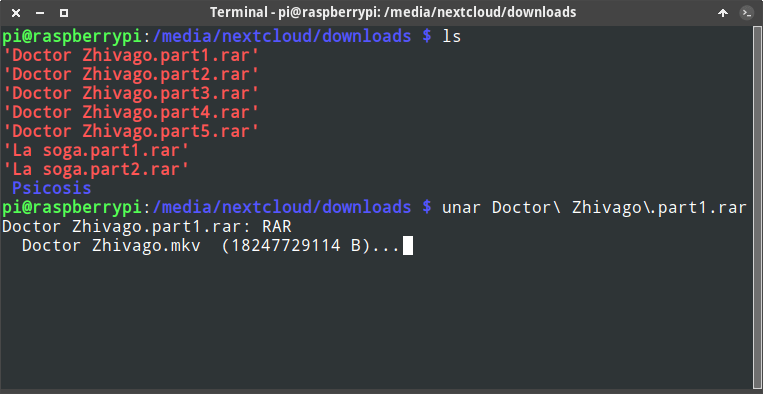

En Linux existen muchos formatos de compresión de archivos y esto hace que sea complicado recordar la totalidad de comandos existentes para descomprimir archivos desde la terminal. Para solucionar este problema existen como mínimo un par de soluciones:<!--more-->

1. Crear un script que considere todos los formatos de compresión y que nos ayude a descomprimir archivos de forma sencilla y sin tener que recordad los comandos.
2. Hacer uso de la utilidad unar. La utilidad unar nos permitirá descomprimir prácticamente todos los archivos mediante un simple comando en la terminal.

A continuación les mostraremos como podemos instalar y usar unar para descomprimir archivos desde la terminal.

## FORMATOS DE ARCHIVO COMPATIBLES CON UNAR

Unar es capaz de descomprimir multitud de formatos de archivo comprimido. Concretamente podrá descomprimir cualquier archivo que tenga la siguiente extensión:

1. zip
2. RAR
3. 7z
4. tar
5. gzip
6. bzip2
7. LZMA
8. XZ
9. CAB
10. MSI
11. NSIS
12. EXE
13. ISO
14. BIN
15. ARJ
16. ARC
17. PAK
18. ACE
19. ZOO
20. LZH
21. ADF
22. etc.

## COMO DESCOMPRIMIR ARCHIVOS DESDE LA TERMINAL CON UNAR

Obviamente lo primero que tenemos que realizar es instalar el paquete unar. Para ello en distribuciones que usen el gestor de paquetes apt deberemos ejecutar el siguiente comando:

> ```shell
> sudo apt install unar
> ```

Una vez instalado el programa tan solo tendrán que ejecutar un comando del siguiente tipo:

> ```shell
> unar [opciones descompresión] [nombre del archivo a descomprimir]
> ```

A priori las opciones de descompresión por defecto funcionan, por lo tanto a la práctica lo único que tendremos que realizar es ejecutar el comando `unar` seguido del `nombre del fichero a descomprimir`. Por lo tanto si en mi caso quiero descomprimir un conjunto de paquetes .rar cuyo primer volumen tiene el nombre `Doctor Zhivago.part1.rar` ejecutaré el siguiente comando en la terminal:

> ```shell
> unar "Doctor Zhivago.part1.rar"
> ```

Y el resultado obtenido será el siguiente:

[](images/descomprimir-archivos-en-la-terminal-con-unar.png)

Por lo tanto escribiendo el comando unar seguido del nombre del archivo a descomprimir podremos descomprimir prácticamente todos los formatos de archivo comprimido existentes.

Si quieren profundizar más sobre las opciones para descomprimir archivos con unar pueden ejecutar el siguiente comando en la terminal:

> ```shell
> man unar
> ```
