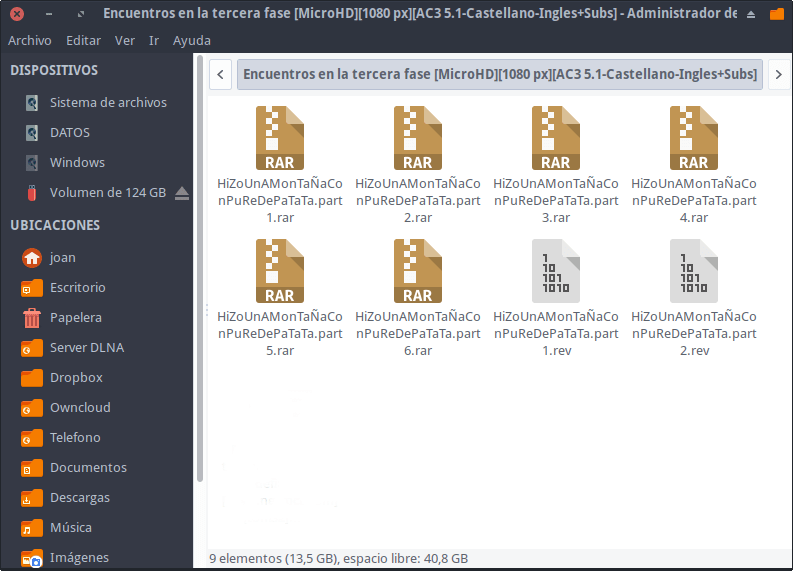
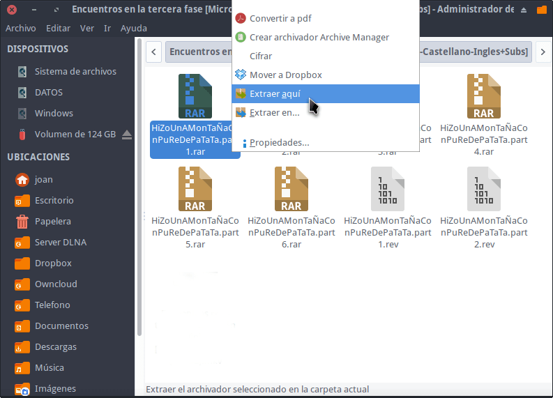
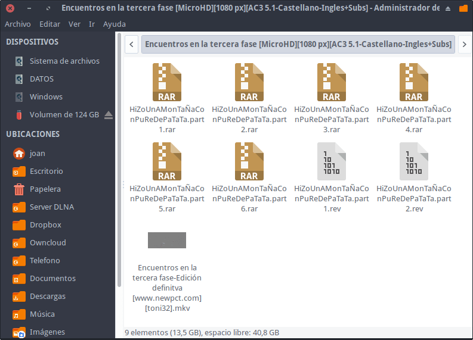

Es posible que algunos usuarios de GNU Linux tengan problemas al unir archivos o descomprimir archivos .part1, .part2, etc.

Casos típicos en los que nos encontramos con la situación que acabo de citar son los siguientes:<!--more-->

1. Algunas películas que nos descargamos de internet acostumbran a estar en archivos comprimidos separados por partes que hay que unir.
2. Algunos usuarios optan por dividir un archivo de gran tamaño en partes para enviarlo a través de varios emails.
3. Etc.

En el caso que nos encontremos con las situaciones que acabamos de citar tenemos que proceder del siguiente modo.

## INSTALAR LOS PAQUETES NECESARIOS PARA DESCOMPRIMIR ARCHIVOS .PART1 DE WINRAR

Para disponer de la totalidad de paquetes para comprimir, descomprimir, separar y unir archivos les recomiendo que sigan los pasos que se citan en el siguiente artículo:

https://geekland.eu/comprimir-descomprimir-archivos-gestor-archivos/

Si siguen los pasos serán capaces de comprimir, descomprimir, separar y unir todos los tipos de fichero en Linux.

En el caso que no quieran sobrecargar su sistema operativo de paquetes pueden únicamente instalar los paquetes mínimos e imprescindibles para unir los archivos ejecutando el siguiente comando en la terminal:

> ```
> sudo apt-get install unrar rar xarchiver
> ```

Una vez instalados los paquetes ya podemos unir archivos del tipo .part1 generados por Winrar de la siguiente forma.

## UNIR ARCHIVOS DEL TIPO .PART1 DE WINRAR EN LINUX

Imaginemos que nos encontramos con la situación que se muestra en la siguiente captura de pantalla:

[](images/archivos-part.1-sin-descomprimir.png)

Para unir o descomprimir estos archivos tan solo tenemos que seguir las instrucciones que veremos a continuación.

### Descomprimir archivos .part1 de winrar usando el gestor de archivos

Si hemos seguido los consejos del siguiente [enlace](), la unión de los archivos es trivial. Tan solo tenemos que seguir los siguientes pasos:

1. Seleccionamos el primero de los archivos y presionamos el botón derecho del ratón.
2. Cuando aparezca el menú contextual presionamos encima de la opción Extraer Aquí.

[](images/descomprimir-archivos-.part1-gestor-archivos.png)

Justo después empezará la unión o descompresión de la totalidad de los archivos y obtendremos un resultado parecido al siguiente:

[](images/archivos-.part1-descomprimidos.png)

Por lo tanto hemos conseguido nuestro propósito que era el de descomprimir un archivo que estaba separado por partes.

### Descomprimir archivos .part1 de winrar usando la terminal

Si queremos también podemos descomprimir .part1 usando la terminal. Para ello tenemos que proceder del siguiente modo:

1. Accedemos vía terminal a la carpeta que contiene los archivos a descomprimir.
2. Una vez dentro de la carpeta ejecutamos el comando unrar x seguido del nombre del primer archivo que queremos descomprimir.

Por lo tanto en el ejemplo que estamos trabajando deberemos ejecutar el siguiente comando:

> ```
> unrar x HiZoUnAMonTaÑaConPuReDePaTaTa.part1.rar
> ```

Acto seguido empezará la descompresión del volumen de archivos.

Recuerden que en el caso que el nombre del volumen de archivos a descomprimir contenga espacios hay que escribir el nombre del archivo entre comillas del siguiente modo:

> ```
> unrar x ”HiZo UnA MonTaÑa Con PuRe De PaTaTa.part1.rar”
> ```
