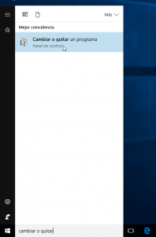
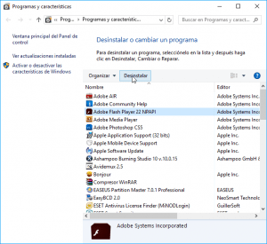
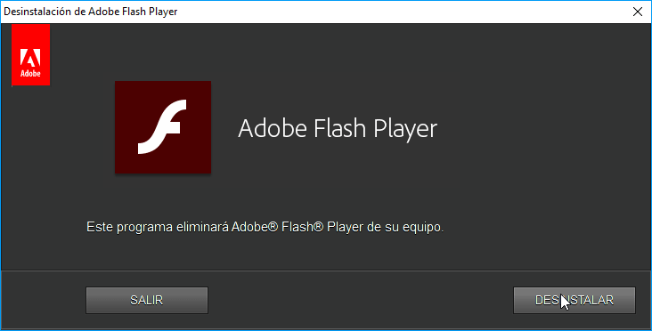
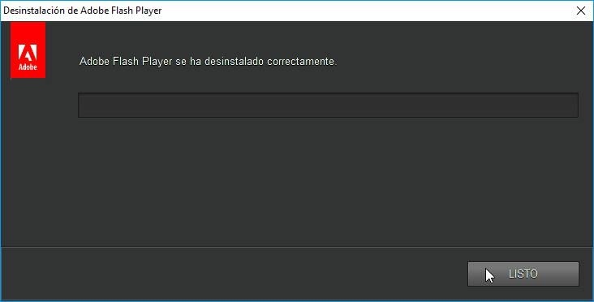
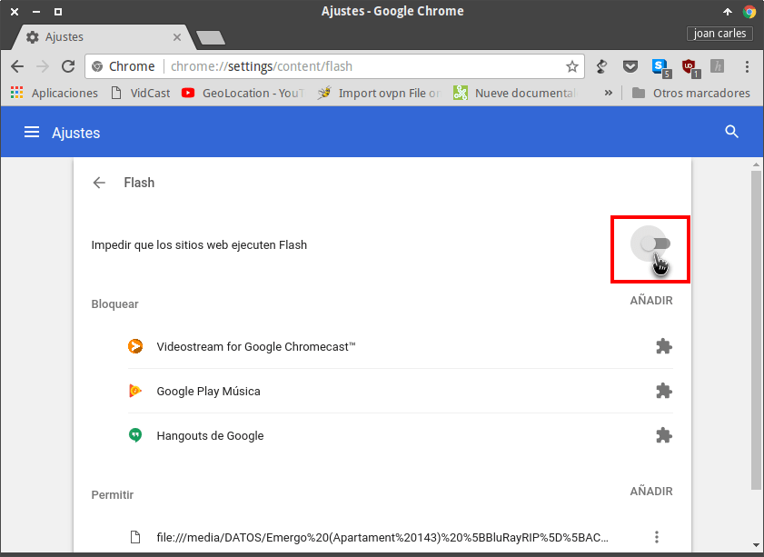

La semana pasada vimos varias [razones por las cuales hoy en día no es recomendable usar Adobe Flash]() Player en nuestro ordenador. Una vez vistas las principales razones en este artículo veremos como podemos desinstalar flash de nuestro ordenador. De esta forma podremos evitar la totalidad de inconvenientes que en su día citamos.<!--more-->

## DESINSTALAR FLASH PLAYER DE NUESTRO ORDENADOR

Si en vuestro caso no necesitáis Flash lo mejor que podéis hacer es desinstalarlo de vuestro sistema operativo. Para ello tan solo tienen que seguir los siguientes pasos.

### Desinstalar Flash Player en Linux

El método para desinstalar Flash variará en función de la distribución Linux que usemos.

###### Nota: Los comandos de desinstalación que mostraremos a continuación funcionarán en el caso que hayan usado los métodos tradicionales para la instalación del plugin de Flash.

#### Desinstalar Flash Player en Ubuntu

En el caso que usen Ubuntu, Linux Mint o cualquier distribución derivada de Ubuntu tienen que abrir una terminal y ejecutar el siguiente comando:

> ```
> sudo apt-get remove --purge adobe-flashplugin flashplugin-installer pepperflashplugin-nonfree
> ```

Una vez ejecutado se procederá a la desinstalación de los posibles plugin de Flash que tengamos instalados.

#### Desinstalar Flash Player en Debian

Si usan Debian o distribuciones derivadas de Debian deberán desinstalar el Plugin ejecutando el siguiente comando en la terminal:

> ```
> sudo apt-get remove --purge flashplugin-nonfree pepperflashplugin-nonfree browser-plugin-freshplayer-pepper flash flashplayer-mozilla
> ```

Justo después de ejecutar el comando se procederá a la desinstalación de cualquiera de los plugin de flash que tengamos instalados en nuestro ordenador.

#### Desinstalar Flash Player en ArchLinux

Los usuarios que usen Archlinux o distribuciones derivadas de Archlinux deberán ejecutar el siguiente comando en la terminal:

> ```
> sudo pacman -Rs flashplugin pepper-flash
> ```

Al ejecutar el comando desinstalarán el plugin oficial de Flash y/o el plugin de pepper-flash.

#### Desinstalar Flash Player en Fedora

Finalmente si usan Fedora o distribuciones derivadas de Fedora deberán ejecutar el siguiente comando en la terminal:

> ```
> sudo dnf remove flash-plugin chromium-pepper-flash
> ```

Después de haber ejecutado el comando deberíamos haber eliminado todo rastro de los plugins de Flash instalados en nuestro ordenador.

### Desinstalar Flash Player en Windows

En el caso de usar Windows nos tenemos que dirigir al menú de Programas y características. Para ello presionamos el botón de Windows y en la barra de búsqueda escribimos **cambiar o quitar un programa**.

Una vez escrito clicamos encima de la opción **Cambiar o quitar un programa** para acceder al menú de programas y características.

[](images/Acceder-a-quitar-programas.png)

En el menú de programas y características buscamos la opción **Adobe Flash Player**, la seleccionamos y presionamos encima del botón **Desinstalar**.

[](images/Desinstalar-adobe-flash-player-Windows.png)

A continuación aparecerá la siguiente ventana en la que tenemos que clicar en el botón **Desinstalar**.

[](images/Iniciar-el-proceso-de-desinstalación.png)

Finalmente después de presionar el botón se procederá a la desinstalación obteniendo el siguiente resultado.

[](images/Flash-player-desinstalado.png)

## DESHABILITAR EL PLUGIN FLASH DE CHROME

Aunque desinstalamos Flash de nuestro ordenador tenemos que tener presente que hoy en día Google Chrome trae el plugin de Flash integrado.

Para inhabilitarlo tenemos abrir el navegador y en la barra de direcciones introducimos la siguiente dirección:

> ```
> chrome://settings/content
> ```

Una vez introducida la dirección presionamos la tecla Enter y aparecerán la totalidad de plugins que tenemos instalados en Chrome.

Buscamos el plugin de **Flash**, clicamos sobre el y a continuación destildamos la opción **Preguntar antes (recomendado)**.

[](images/deshabilitar-flash-en-chrome.png)

## OPCIONES ALTERNATIVAS

En el presente artículo hemos visto los pasos a seguir para desinstalar flash. No obstante es posible que haya personas que aún necesiten usar Flash.

Para ello en las próximas semanas escribiré un artículo en el que mostraré distintos métodos existentes para que Flash solo se ejecute cuando nosotros le demos permiso.
