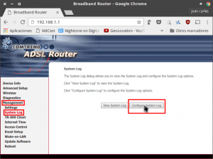
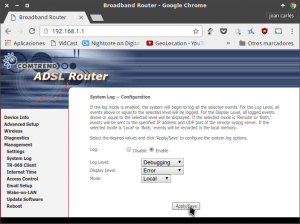
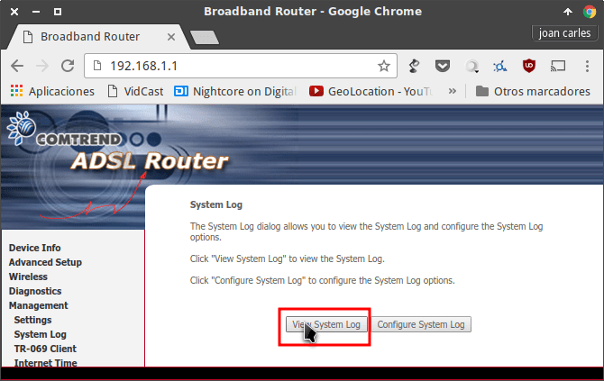
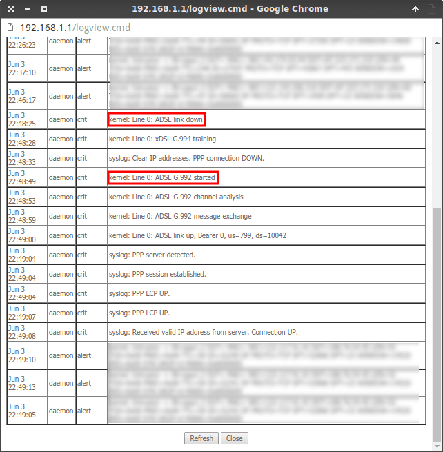

Cuando nuestro Router y el resto de elementos que conforman nuestra instalación de Internet van envejeciendo, se acostumbran a producir cortes y microcortes en nuestra conexión. Con el fin de detectar este problema, en el siguiente artículo explicaré un método elegante y práctico para poder detectar cortes y microcortes en nuestra conexión de internet.<!--more-->

## ACCEDER A LA CONFIGURACIÓN DEL ROUTER

Para acceder a la configuración de nuestro Router abrimos nuestro navegador.

En la barra direcciones tecleamos nuestra puerta de entrada, que en mi caso es **192.168.1.1**, y presionamos la tecla **Enter**.

Seguidamente aparecerá una ventana en la que deberemos ingresar el nombre de usuario y la contraseña de nuestro router.

Una vez introducidos presionamos sobre el botón **Iniciar Sesión**.

[](images/Acceder-a-la-configuración-del-Router.png)

###### Nota: Por normal general el nombre de usuario y la contraseña acostumbran a ser admin y admin respectivamente. En el caso que no sea admin admin pueden probar otras combinaciones como por ejemplo 1234 1234, admin 1234, 1234 admin, etc. Si ninguna les funciona llamen a vuestro proveedor de internet.

## ACTIVAR LOS LOGS DE NUESTRO ROUTER

Una vez dentro de la configuración del router tenemos que activar el registro de Logs.

Para ello en el menú de navegación de la izquierda clicamos en la opción **Management** y seguidamente en la opción **System Log**.

Una vez dentro del menú System Log presionamos encima del botón **Configure System Log**.

[](images/Acceder-a-la-configuración-del-registro-de-Logs.png)

Dentro de la configuración System log verán que existen varios campos para configurar.

### Opciones de configuración a seleccionar para registrar los logs.

El contenido y valor que deben tener cada uno de los campos son los siguientes:

**Log:** Campo donde se activa y desactiva el registro de logs. Como en nuestro caso queremos activar el registro de logs **marcamos la opción Enable**.

**Log Level:** En este campo tenemos varias opciones que nos permiten definir el nivel de detalle que queremos que tenga el registro de logs de nuestro Router. Los diferentes niveles que podemos seleccionar son los siguientes:

- **Emergency:** Solo registra las incidencias que hacen que el sistema no se puede usar.
- **Alert:** Registra las incidencias Emergency y las que requieren emprender acciones inmediatas.
- **Critical:** El router registra incidencias Emergency, Alert y las condiciones que son consideradas críticas.
- **Error:** El router registra las incidencias Emergency, Alert, Critical y las condiciones de error.
- **Warning:** El router registra las incidencias Emergency, Alert, Critical, Error y las condiciones consideradas como significativas.
- **Notice:** El router registra las incidencias Emergency, Alert, Critical, Error, Warning y las condiciones consideradas como significativas de menor importancia.
- **Informational:** El router registra las incidencias Emergency, Alert, Critical, Error, Warning, Notice y las condiciones consideradas poco importantes y solo a modo de información.
- **Debugging:** Finalmente en la opción Debugging registra la totalidad de incidencias que se producen en nuestro Router.

En mi caso **selecciono la opción Debugging**. No obstante para detectar cortes en la conexión de internet la opción critical seria suficiente.

###### Nota: El Router guarda los registros en un búfer. Cuando el búfer se llena la nueva incidencia sobreescribirá la incidencia más antigua. Esto implica que no podemos guardar de forma indefinida la totalidad de incidencias a no ser que las almacenemos en un servidor remoto.

**Display Level:** Campo para filtrar el tipo de logs que queremos visualizar. Las opciones a seleccionar son exactamente las mismas que en el apartado anterior. En mi caso **selecciono la opción Error** ya que de este modo cuando visualice los logs veré la totalidad de registros de emergencia, de alerta, críticos y Errores.

**Mode:** En la opción Mode podemos seleccionar las opciones Local, Remote o Both.

- Si seleccionamos la **opción Local** los logs se guardaran en el búfer de nuestro router.
- Al seleccionar la **opción Remote** y realizar una pequeña configuración, los logs se almacenarán en un servidor remoto mediante **syslog (en linux)** o mediante **MyRouter Log (en Windows)**. En futuros post veremos como usar esta opción.
- Finalmente si seleccionamos la **opción Both** los registros se almacenarán tanto en el Router como en el servidor remoto.

En mi caso **en este apartado selecciono la opción Local**. De este modo los logs quedarán almacenados en mi router.

\[caption id="attachment\_7288" align="alignnone" width="300"\][](images/Habilitar-el-registro-de-logs-para-detectar-cortes.png) Captura de pantalla de la configuración de Logs aplicada a mi Router\[/caption\]

### Aplicar los cambios que acabamos de configurar

Una vez seleccionadas las opciones apropiadas presionamos el botón **Apply/Save**.

En estos momentos detectar cortes en la conexión es sumamente fácil. Cada vez que se produzca un corte en la conexión de internet quedará registrado en nuestro router.

###### Nota: La configuración realizada en este apartado es válida para los Router Comtrend. En el caso que utilicen routers de otras marcas, es posible que el procedimiento de activación de los logs sea diferente al indicado.

## CONSULTAR LOS LOGS DE NUESTRO ROUTER PARA DETECTAR CORTES EN NUESTRA CONEXIÓN DE INTERNET

Una vez finalizada la configuración ya podemos detectar cortes en nuestra conexión de internet visualizando los registros de la siguiente forma.

Accedemos a la configuración del router tal y como se ha hecho en el inicio de este artículo.

Una vez dentro de la configuración del router, en el menú de navegación de la izquierda clicamos en la opción **Management** y seguidamente en la opción **System Log**.

Dentro del menú System Log, tal y como se muestra en la captura de pantalla, presionamos encima del botón **View System Log**.

[](images/Acceder-a-los-logs-para-detectar-cortes-de-internet.png)

Justo después de presionar sobre el botón aparecerá la siguiente ventana en la que podremos leer los logs almacenados por nuestro Router.

[](images/Detección-de-un-corte-en-la-conexión-de-internet.png)

Si observamos los resultados obtenidos vemos el siguiente mensaje a las 22:48:25:

> ```
> Kernel Line 0: ADSL link down
> ```

Por lo tanto podemos estar seguros que a las 22:48:25 se ha producido un corte en nuestra conexión de Internet.

Además si continuamos leyendo en el log veremos que a las 22:48:53 obtenemos el siguiente mensaje:

> ```
> Kernel Line 0: ADSL G. 992 started
> ```

Por lo tanto la conexión se recupero a las 22:48:53 lo que significa que durante un lapso de 28 segundos estuvimos sin conexión a internet.

Así de esta forma tan fácil podremos detectar cortes en la conexión de Internet de nuestro domicilio.

###### Nota: Si tienen dudas del mensaje que se registra en el router tras un corte, tan solo tienen que simular un corte desenchufando el cable de internet del cajetín PTR. Después de simular el corte averiguaran el mensaje que ha generado el router al desconectarse.

## ¿QUÉ DATOS REGISTRAN LOS LOGS DE NUESTRO ROUTER?

Algunos de los datos que podemos registrar y visualizar mediante los logs un router son los siguientes:

1. Los cortes y microcortes que se generan en nuestra conexión de Internet.
2. Los accesos e intentos de acceso a nuestro Router o a un servicio detrás de nuestro Router.
3. Todo tipo de mensajes de error y de alerta de nuestro Router.
4. Cuando nuestro Router ha refrescado nuestra IP pública a un servicio de redireccionamiento DNS Dinámico.
5. Etc.

## REGISTRAR LA ACTIVIDAD DEL ROUTER EN UN SERVIDOR REMOTO

En el transcurso de este artículo hemos visto que la cantidad incidencias que puede almacenar nuestro Router son limitadas.

Además en el caso que se apague el router perderemos la totalidad de datos que hemos registrado.

Para solucionar estos problemas, en las próximas semanas escribiré un post en el que detallaré el procedimiento a seguir para registrar de forma indefinida la totalidad de logs del router en un servidor remoto.
