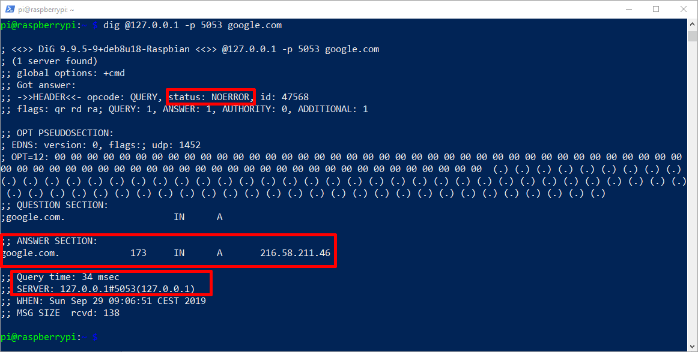
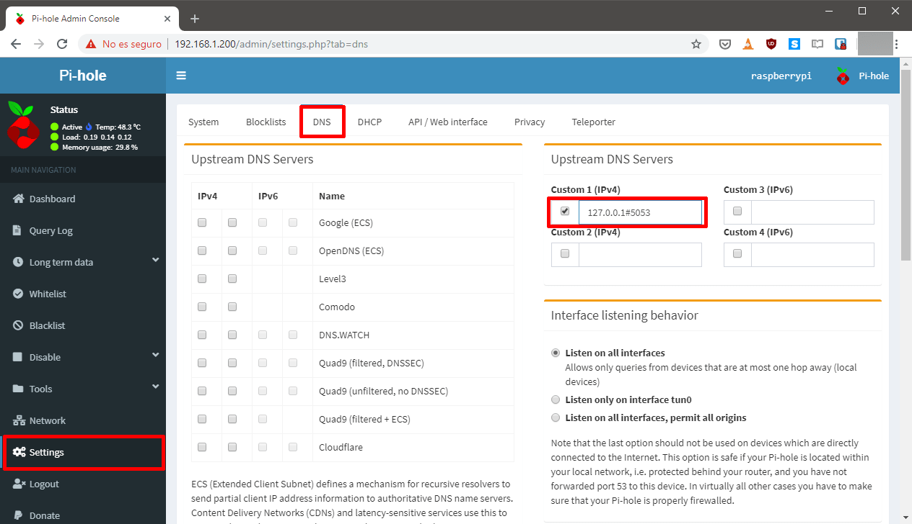
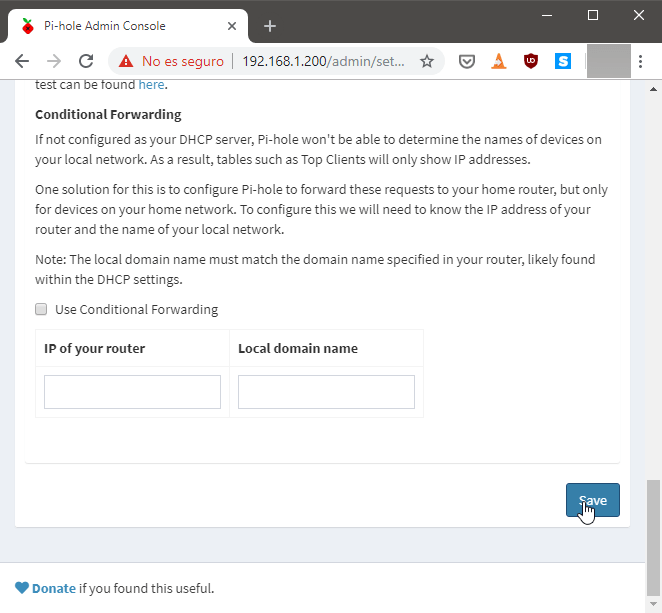

El sistema de resolución de peticiones DNS es un sistema que se desarrolló hace muchos años. La consecuencia directa de lo que acabo de citar es que el sistema actual es obsoleto y presenta carencias en el campo de la seguridad y privacidad. Por esto motivo Cloudflare, Mozilla y Chrome están trabajando en soluciones para que permitan usar un nuevo protocolo de resoluciones DNS llamado DNS over HTTPS.<!--more-->

## ¿QUÉ ES DNS OVER HTTPS (DoH)?

DNS over HTTPS, abreviado como DoH, es un nuevo protocolo propuesto por la [IETF](https://en.wikipedia.org/wiki/Internet_Engineering_Task_Force "Explicación de quien es la IETF") en Octubre de 2018. DNS over https no es más que el DNS de toda la vida, pero con la diferencia que la totalidad de tráfico para resolver la peticiones DNS se hará usando los protocolo https y http/2. Por lo tanto las peticiones DNS estarán cifradas y se realizarán por el puerto 443 en vez del puerto 53.

Por lo tanto, DNS over HTTPS traducirá las direcciones URL convencionales a sus correspondientes direcciones IP, pero con la particularidad que todo el tráfico entre el cliente DNS y el servidor DNS estará completamente cifrado. Por lo tanto, DoH no cifra el tráfico de extremo a extremo, pero si cifra el tráfico DNS.

## VENTAJAS PROPORCIONADAS POR DNS OVER HTTPS

Considerando que el tráfico para resolver las peticiones DNS estará cifrado dispondremos de los siguientes beneficios:

1. De cara a los usuarios, la ventaja más importante es que **la resolución de las peticiones DNS será más rápida**. La latencia será menor y las webs que visitaremos cargarán más rápido.
2. **Nadie**, a excepción de la empresa que nos proporciona la resolución de peticiones DNS, **podrá conocer las webs que visitamos**. Por lo tanto, nuestro operador ISP no podrá bloquearnos el acceso a determinadas web mediante los DNS.
3. **Incremento de la seguridad y privacidad** ya que de este modo se podrán evitar ataques Man in the Middle. Por lo tanto podremos evitar ataques de DNS spoofing, DNS hijacking, etc.
4. El protocolo DNS over HTTPS usa el protocolo https y http/2. Por lo tanto **se beneficiará** automáticamente **de todas las mejoras que se realicen en los protocolo https y https/2**.

A pesar de todas las ventajas citadas, se trata de un protocolo experimental y que aún está en desarrollo. Por lo tanto, pueden darse los siguientes problemas:

1. Si tenemos **sistemas de control parental o de filtrado de contenido**, como por ejemplo pfSense, **dejarán de funcionar**. No podrán funcionar porque no serán capaces de ver las peticiones DNS. Esto es un problema para las empresas o gobiernos que monitorear/filtrar donde se conectan sus trabajadores o ciudadanos.
2. Problemas de interoperabilidad en las redes 5G
3. En teoría la velocidad de resolución ofrecida por DNS sobre HTTPS debería ser mayor que la tecnología que usamos actualmente. No obstante, **pueden darse casos en que la resolución de peticiones DNS sea lenta**.
4. Dificultades a la hora implementar un sistema de DNS divido (Split DNS).
5. Etc.

## CONFIGURAR PI-HOLE PARA USAR DNS OVER HTTPS EN UNA RASPBERRY PI

Ninguno de los sistemas operativos actuales soporta DNS sobre HTTPS de forma nativa. Por lo tanto, si queremos usar este sistema de resolución de peticiones DNS deberemos instalar software adicional o usar un navegador que traiga implementado este protocolo.

Si usamos un navegador, como por ejemplo Firefox o Chrome, únicamente tendremos DNS over HTTPS en el navegador. Si queremos disponer de DNS sobre HTTPS en la totalidad de nuestras peticiones, recomiendo instalar el cliente DNS de Cloudflare en una Raspberry Pi. De este modo la Raspberry Pi actuará como cliente DNS de la totalidad de equipos que configuremos en nuestra red local. Para conseguir lo que acabo de citar deberemos proceder el siguiente modo.

### Instalar Pi-hole en la Raspberry Pi

Obviamente tendremos que tener instalado Pi-hole en nuestra Raspberry Pi. En el caso que no lo tengan instalado pueden seguir las instrucciones que encontrarán en el siguiente enlace:

[https://geeklandlinux.github.io/posts/instalar-configurar-pi-hole-raspberry-pi/](https://geeklandlinux.github.io/posts/instalar-configurar-pi-hole-raspberry-pi/)

### Instalar el demonio Cloudflared en la Raspberry Pi

Cloudflare dispone de un cliente que será el encargado de resolver la totalidad de peticiones DNS sobre HTTPS. El cliente está [disponible para Windows, MacOS y Linux](https://developers.cloudflare.com/argo-tunnel/downloads/ "URL para descargar el cliente DNS over HTTPS de Cloudflare"). En nuestro caso lo instalaremos en una Raspberry Pi del siguiente modo.

Inicialmente descargaremos el cliente ejecutando el siguiente comando en la terminal:

> ```
> wget https://bin.equinox.io/c/VdrWdbjqyF/cloudflared-stable-linux-arm.tgz
> ```

Acto seguido descomprimiremos el archivo ejecutando el siguiente comando:

> ```
> tar -xvzf cloudflared-stable-linux-arm.tgz
> ```

A continuación, copiaremos el archivo binario cloudflared en la ubicación /usr/local/bin ejecutando el siguiente comando en la terminal:

> ```
> sudo cp ./cloudflared /usr/local/bin
> ```

El siguiente paso consistirá en dar permisos de ejecución al archivo binario que acabamos de copiar. Para ello usaremos el siguiente comando:

> ```
> sudo chmod +x /usr/local/bin/cloudflared
> ```

En estos momentos cloudflare ya está instalado. Para comprobar la versión que estamos usando podemos ejecutar el siguiente comando en la terminal:

> ```
> cloudflared -v
> ```

En mi caso el resultado obtenido ha sido el siguiente:

> ```
> cloudflared version 2019.9.2 (built 2019-09-26-1916 UTC)
> ```

### Crear un usuario para Cloudflared

Crearemos un usuario con nombre cloudflared. El usuario no tendrá partición home ni tendrá acceso a la Shell de Linux. Para ello ejecutaremos el siguiente comando en la terminal:

> ```
> sudo useradd -s /usr/sbin/nologin -r -M cloudflared
> ```

### Configurar el demonio Cloudflared DNS

El siguiente paso consistirá en generar el archivo de configuración de Cloudflared. Para ello ejecutamos el siguiente comando en la terminal:

> ```
> sudo nano /etc/default/cloudflared
> ```

Una vez se abra el editor de textos nano pegaremos el siguiente código:

> ```
> # Commandline args for cloudflared
> CLOUDFLARED_OPTS=--port 5053 --upstream https://1.1.1.1/dns-query --upstream https://1.0.0.1/dns-query
> ```

Seguidamente tendremos que guardar los cambios realizados y cerrar el fichero. En el fichero de configuración hemos definido que tendremos un proxy local escuchando en el puerto 5053. Todas las peticiones DNS se dirigirán al puerto 5053 y serán resueltas por los servidores DNS de Cloudflare mediante protocolo DNS over HTTPS.

Finalmente cambiaremos de grupo y usuario el archivo binario y al archivo de configuración de Cloudflared. Para ello ejecutaremos los siguientes comandos en la terminal:

> ```
> sudo chown cloudflared:cloudflared /etc/default/cloudflared
> sudo chown cloudflared:cloudflared /usr/local/bin/cloudflared
> ```

### Crear un servicio de Systemd para Cloudflare

Para gestionar el de servicio Cloudflare deberemos crear un servicio de systemd. Para ello ejecutaremos el siguiente comando en la terminal:

> ```
> sudo nano /lib/systemd/system/cloudflared.service
> ```

Cuando se abra el editor de textos nano pegaremos el siguiente código:

> ```
> [Unit]
> Description=cloudflared DNS over HTTPS proxy
> After=syslog.target network-online.target
> 
> [Service]
> Type=simple
> User=cloudflared
> EnvironmentFile=/etc/default/cloudflared
> ExecStart=/usr/local/bin/cloudflared proxy-dns $CLOUDFLARED_OPTS
> Restart=on-failure
> RestartSec=10
> KillMode=process
> 
> [Install]
> WantedBy=multi-user.target
> ```

A continuación guardaremos los cambios y cerraremos el fichero. Seguidamente ejecutaremos el siguiente comando para que Cloudflare se inicie de forma automática cada vez reiniciemos la Raspberry Pi.

> ```
> sudo systemctl enable cloudflared
> ```

Finalmente arrancaremos el servicio ejecutando el siguiente comando en la terminal:

> ```
> sudo systemctl start cloudflared
> ```

Si precisan comprobar que el servicio se haya levantado de forma correcta puede ejecutar el siguiente comando:

> ```
> sudo systemctl status cloudflared
> ```

### Verificar que Cloudflare está funcionando correctamente

Para comprobar que Cloudflare funciona de forma adecuada ejecutaremos el siguiente comando en la terminal:

> ```
> dig @127.0.0.1 -p 5053 google.com
> ```

Si obtenéis un resultado parecido al siguiente podéis estar seguros que todo lo realizado hasta el momento funciona correctamente.

[](images/comprabacion-funcionamiento-dns-over-https.png)

### Modificar la configuración de Pi-Hole para que pueda usar DNS over HTTPS

Para que Pi-hole pueda utilizar el cliente DNS over HTTPS de Cloudflare deberemos realizar lo siguiente:

1. Accedemos al panel de administración de Pi-hole.
2. Clicamos en la Opción Settings.
3. A continuación clicamos en la pestaña DNS.
4. Destildamos absolutamente todos los DNS que tengamos activados.
5. Tildamos el campo Custom 1 (IPv4) y en el mismo campo pegamos 127.0.0.1#5053

[](images/configurar-pi-hole-dns-over-https.png)

Finalmente presionamos en el botón SAVE para que se hagan efectivos los cambios.

[](images/guardar-cambios-pi-hole.png)

## CONCLUSIONES Y FUNCIONAMIENTO

En mi caso el funcionamiento de DNS over HTTPS es satisfactorio. No observo que la resolución de peticiones DNS sea más rápida, pero tampoco veo que sea más lenta y además supone una mejora importante en términos de seguridad ya que la totalidad de peticiones DNS están cifradas.

Por lo tanto nadie, excepto Cloudflare, tendrá acceso a mi historial de navegación. Por este motivo, si no confían en Cloudflare les recomiendo que no apliquen la solución que se muestra en este artículo.

Cloudflare promete que no guardará ningún historial durante más de 24 horas y que no asociará la dirección IP a un origen. A pesar de esto todo el mundo sabe que de lo que se dice a lo que se hace puede existir una gran diferencia.

DNS over HTTPS es una mejora importante en términos de privacidad ya que los gobiernos y/o ISP no podrán aplicar restricciones ni filtrar el contenido que visitan los ciudadanos. Por este motivo algunos gobiernos, como el británico, están haciendo todo lo posible [para que no se adopte este protocolo](https://www.theregister.co.uk/2019/09/24/mozilla_backtracks_doh_for_uk_users/ "Polémica creada por DoH").
