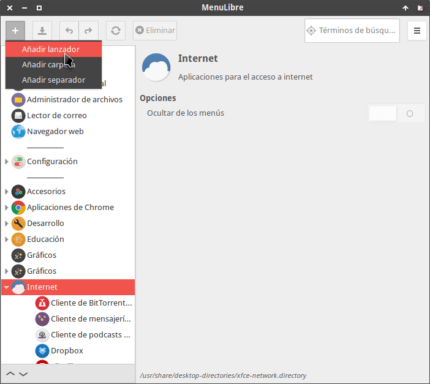
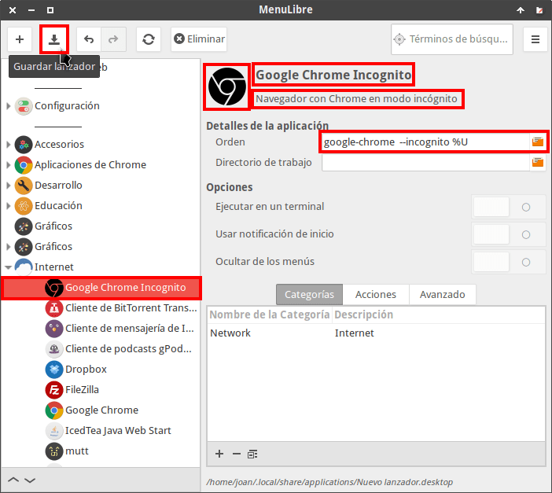
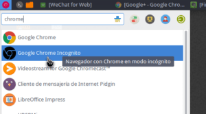
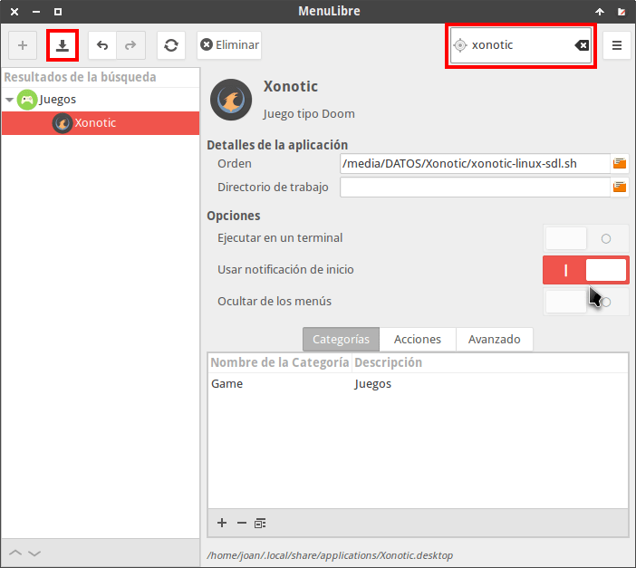
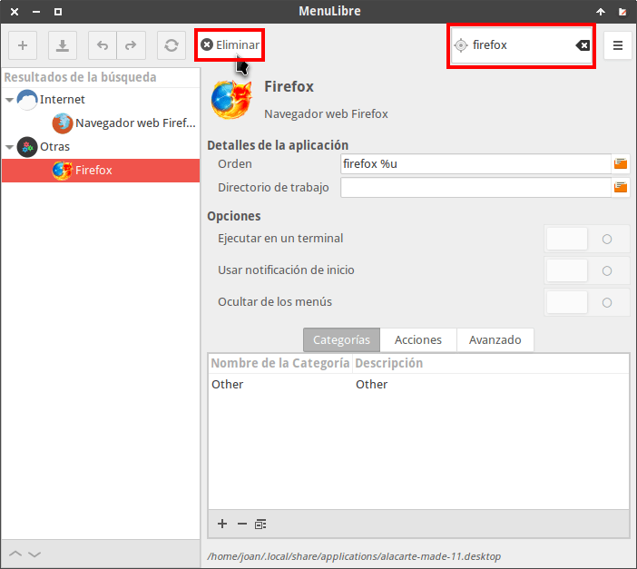
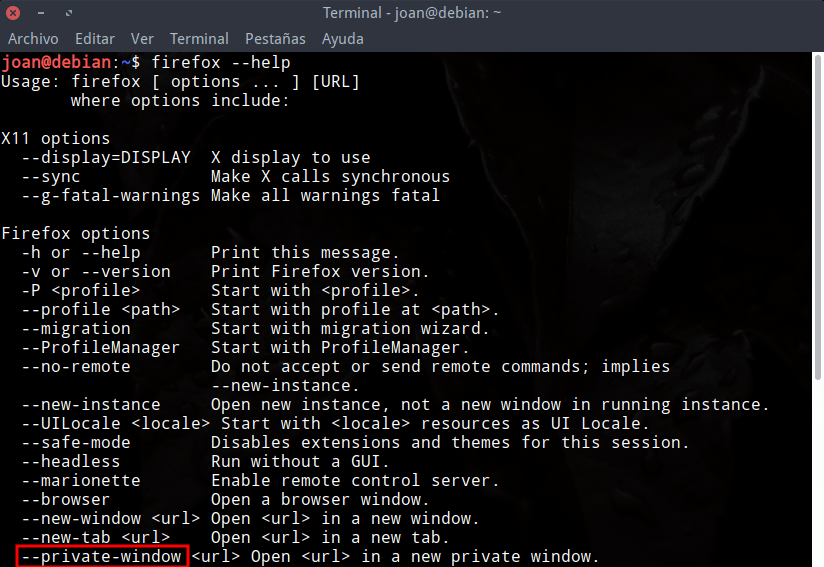
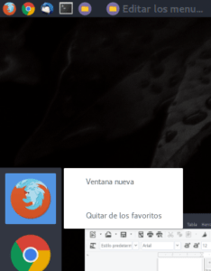
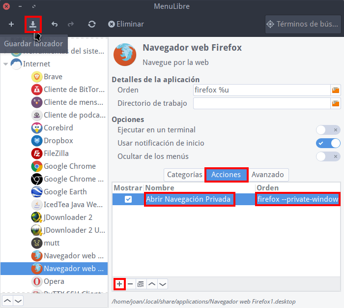
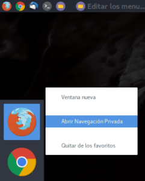
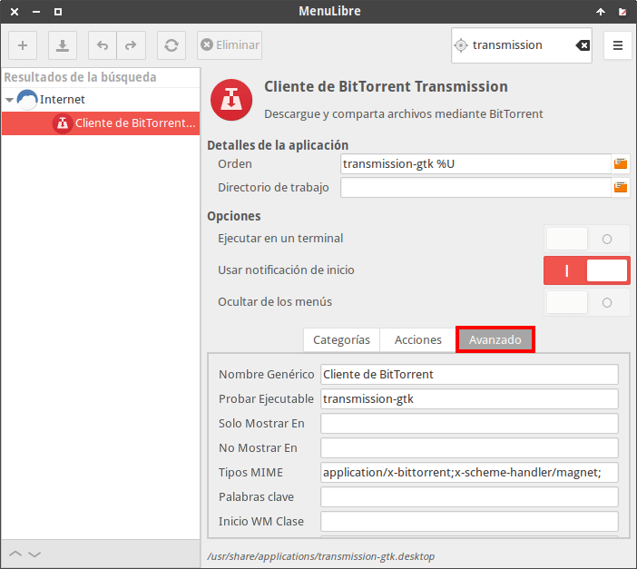

A continuación veremos como podemos editar el menú de nuestra distribución Linux de forma fácil y sencilla usando el programa MenuLibre.<!--more-->

## SITUACIONES EN LAS QUE PUEDE SER NECESARIO EDITAR EL MENÚ

Necesitaremos editar el menú de nuestra distribución Linux cuando por ejemplo se den las siguientes circunstancias:

1. Aparecen elementos duplicados en el menú y queremos eliminarlos.
2. Queremos crear una nueva categoría en el menú.
3. Precisamos mover una aplicación de una categoría a otra.
4. Necesitamos añadir una entrada en los menús de nuestra distribución. Hay programas y aplicaciones que al instalarse no crean una entrada en el menú de nuestra distribución.
5. Editar las propiedades de un elemento que ya aparece en el menú.
6. Etc.

## ENTORNOS DE ESCRITORIO EN LOS QUE PODEMOS USAR MENULIBRE PARA EDITAR EL MENÚ

MenuLibre fue creado [Sean Davis](https://bluesabre.org/projects/menulibre/ "Web del creador de MenuLibre"). Sean Davis forma parte del equipo de desarrollo de Xubuntu, no obstante podemos usar MenuLibre en un número muy elevado de entornos de escritorio.

Algunos de los entornos de escritorio más destacados en los que podremos editar el menú con MenuLibre son:

1. Gnome Shell
2. XFCE
3. LXDE
4. Cinnamon
5. Unity

## OPCIONES ALTERNATIVAS AL EDITOR DE  MENÚS DE MENULIBRE

Obviamente existen otras alternativas a MenuLibre. Algunas de ellas son las que podréis encontrar a continuación:

Para entornos de escritorio basados en librerías GTK únicamente disponemos de otra opción alternativa. Esta opción es **Alacarte**. Existen otras aplicaciones pero tienen el inconveniente que sus funciones son muy reducidas o simplemente hace años que no se actualizan.

En el caso que seáis usuarios de KDE también podréis editar el menú con **Kde Menu Editor**. Kde Menu Editor tiene una interfaz gráfica y funcionamiento muy similar a la de MenuLibre.

## ¿POR QUÉ MENULIBRE ES UNA BUENA OPCIÓN PARA EDITAR EL MENÚ?

MenuLibre es la mejor opción para editar los menús de los entornos de escritorio que usan librerías GTK.

Alacarte es una alternativa válida, pero únicamente nos permite modificar los nombres, los comandos, los iconos y descripciones de las aplicaciones presentes en el menú. Como veréis más adelante, las opciones que nos ofrece MenuLibre son bastante superiores.

Además el número de dependencias para poder usar MenuLibre es muy bajo. Por lo tanto lo podemos instalar y usar sin problema en distribuciones ligeras, ya que en el momento de instalarlo no se instalará medio escritorio de Gnome.

## INSTALAR EL EDITOR DE MENÚS MENULIBRE

Es posible que vuestra distribución no disponga de MenuLibre instalado de serie. No obstante está disponible en el los repositorios de la gran mayoría de distros. Por lo tanto, para instalarlo en Debian y en distribuciones derivadas de Debian, tienen que ejecutar el siguiente comando en la terminal:

> ```
> sudo apt-get install menulibre
> ```

###### Nota: El comando de instalación es válido para las distribuciones que usan paquetería .deb. En el caso que usen otro tipo de paquetería deberán adaptar el comando que acabo de dejar.

## USO BÁSICO DE MENULIBRE PARA EDITAR EL MENÚ DE NUESTRA DISTRIBUCIÓN LINUX

El uso de MenuLibre es extremadamente fácil. A partir de una serie de ejemplos podremos comprender su funcionamiento de forma fácil y sencilla.

Una vez abierto el programa MenuLibre podremos realizar las siguientes operaciones.

### Añadir un elemento al menú de nuestra distribución

Añadir un lanzador a nuestro menú es extremadamente fácil. Inicialmente nos ubicamos encima de la categoría a la que queremos añadir el lanzador, seguidamente presionamos encima del botón + y clicamos encima de la opción crear Añadir lanzador.

[](images/anadir-un-lanzador-al-menu.png)

Seguidamente, como mínimo, tenéis que configurar los campos que podéis ver en la captura de pantalla.

[](images/configurar-campos-para-anadir-lanzador-menu.png)

Las opciones que en mi caso he configurado son las siguientes:

1. **He seleccionado el icono que quiero que tenga mi lanzador**. Como quiero crear una entrada para arrancar Chrome en modo incógnito he seleccionado un icono alternativo de Google Chrome.
2. **Se ha puesto un nombre al lanzador**. En mi case he seleccionado el nombre Google Chrome Incognito.
3. **He introducido una descripción de lo que realiza el lanzador**.
4. **En el campo Orden escribo el comando que quiero que se ejecute** cuando clico sobre la entrada del menú. En mi caso he introducido el comando que usaría en la terminal para abrir Chrome en modo incógnito.

Una vez realizados los cambios tan solo tienen que clicar encima del botón Guardar lanzador. A partir de estos momentos aparecerá una nueva entrada en la categoría Internet de vuestro menú.

[](images/entrada-nueva-en-el-menu.png)

En el momento que ejecute esta entrada se abrirá Google Chrome en modo incógnito.

Otras opciones que hubiera podido editar son las siguientes:

- **Directorio de trabajo:** No recomiendo tocar este apartado a no ser que lo necesitemos. En este apartado podemos definir el directorio de trabajo del programa que abrirá el lanzador.
- **Ejecutar en una terminal:** Tildando esta opción el programa se abrirá como si lo ejecutáramos desde una terminal. De este modo conseguiremos ver los errores que se producen al iniciar o al usar un programa.
- **Usar notificación de inicio:** Si tildamos esta opción el cursor de nuestro ratón se convertirá en un reloj mientras se está abriendo el programa.
- **Ocultar de los menús:** En el caso que tengamos un lanzador creado y lo queramos esconder podemos tildar esta opción.

### Modificar un lanzador existente del menú

Si lo único que precisamos es variar un parámetro de un lanzador existente tenemos que proceder de la siguiente forma.

Inicialmente usamos el cuadro de búsqueda de lanzadores para buscar el lanzador que queremos modificar. En mi caso preciso modificar el lanzador del juego Xonotic.

[](images/modificar-lanzador-xonotic.png)

Una vez encontrado el lanzador podéis modificar los parámetros que creáis convenientes. Una vez modificados deberán presionar en el botón Guardar para que se apliquen los cambios.

MenuLibre nunca modificará la configuración estándar del lanzador que sea crea al instalarse una aplicación. Las modificaciones de las entradas del menú se gestionan del siguiente modo:

1. MenuLibre crea una copia del lanzador original del menú.
2. La copia se modifica con las nuevas opciones que nosotros elijamos.
3. Finalmente, el lanzador modificado se almacena en la ubicación ~/.local/share/applications. Hay que recordar que la ubicación predeterminada de los lanzadores originales es /usr/share/applications.

De este modo se pueden modificar las entradas de nuestro menú de forma más segura.

### Eliminar un elemento duplicado en el menú

En mi caso uso el cuadro de búsqueda para ver las entradas de Firefox que tengo presentes en mi menú.

Si observáis la captura de pantalla veréis que la entrada de Firefox está duplicada en 2 categorías distintas.

Para solucionar este problema seleccionamos al entrada que queremos eliminar y presionamos sobre el botón Eliminar. Seguidamente nos preguntará si estamos realmente seguros de eliminar el elemento, si estamos seguros presionamos el botón Aceptar.

[](images/eliminar-elemento-menu.png)

De esta forma tan fácil y tan sencilla podemos eliminar entradas de nuestro menú.

## USO AVANZADO DE MENULIBRE PARA EDITAR EL MENÚ DE NUESTRA DISTRO

Si necesitamos configurar parámetros más avanzados de nuestros lanzadores podemos usar las **Acciones** y el menú **Avanzado** de MenuLibre .

### Crear acciones cuando lanzamos un programa del menú

###### Nota: Este apartado únicamente es aplicable a los entornos de escritorio como por ejemplo Gnome Shell y Unity.

Las acciones únicamente son parámetros de la línea de comandos que aplicamos a un programa.

Para saber las acciones que tiene disponibles un programa tenemos que abrir una terminal y escribir el nombre con que ejecutaríamos el programa seguido del comando \--help. Por lo tanto para averiguar las acciones de Firefox escribiremos el siguiente comando en la terminal:

> ```
> firefox --help
> ```

El resultado obtenido en mi caso es el siguiente:

[](images/acciones-disponibles-firefox.png)

Existen muchas acciones, pero en mi caso me centraré en la acción **\--private-window**. Esta acción es la que usamos para abrir Friefox en modo privado.

Si os fijáis en mi menú de Gnome no existe la opción de abrir Firefox en modo navegación privada.

[](images/acciones-iniciales-lanzador-firefox.png)

Para añadir la acción abrimos MenuLibre y buscamos y seleccionamos el lanzador de Firefox.

A continuación clicamos encima del botón **Acciones**, seguidamente clicamos encima del botón **+**. Finalmente en los apartados **Nombre** y **Orden** introducimos los parámetros que podéis ver en a siguiente captura de pantalla:

[](images/crear-accion-entrada-menu-firefox-.png)

En el campo **Nombre** escribimos una descripción de lo que hará la acción. En mi caso elijo la descripción Abrir navegación privada.

Finalmente, en el apartado **Orden** tenemos que introducir el comando que ejecutaríamos para iniciar Firefox en modo privado desde la terminal. En este caso es:

> ```
> firefox --private-window
> ```

Una vez finalizada la configuración **guardamos los cambios** y reiniciamos nuestro equipo.

Después de reiniciarse el equipo ya aparecerá la acción para arrancar Firefox en navegación privada.

[](images/accion-creada-para-el-lanzador-firefox.png)

### Opciones avanzadas del editor de menús MenuLibre

Si os fijáis MenuLibre tiene un apartado de configuración avanzada. A continuación se muestra la configuración avanzada para el lanzador de Transmission.

[](images/opciones-avanzadas-menulibre.png)

En los distintos campos de las opciones avanzadas podemos configurar los siguientes parámetros:

- **Nombre genérico:** Un nombre cualquiera que damos al programa. Podemos elegir el que más nos guste.
- **Probar ejecutable:** Tenemos la posibilidad de indicar la ruta de un ejecutable que es necesario que exista para que el lanzador funcione. De esta forma solo se añadirán elementos al menú que tengan un ejecutable determinado con los correspondiente permisos de ejecución.
- **Solo mostrar en:** Podemos seleccionar los entornos de escritorio en los que queremos que se muestre nuestro lanzador. Si únicamente queremos que se muestre el lanzador en XFCE escribiré **XFCE**. Otros valores que puedo escribir en este apartado son GNOME, KDE, Razor, MATE, LXDE, etc. Este campo únicamente es configurable si el campo **No mostrar en** esta inactivo.
- **No mostrar en:** Tenemos la opción de indicar los entornos en que no queremos que se muestre el lanzador. Este campo únicamente es configurable si el campo Solo mostrar en esta inactivo.
- **Tipos MIME:** Se indican los tipos MIME soportados por la aplicación. De este modo asociamos los tipos de archivo a un programa determinado.
- **Palabras clave:** Son palabras que simplemente ayudan a buscar un lanzador de forma más rápida. En nuestro caso por podríamos introducir la palabra Torrent o la palabra Transmission. De esta forma las búsquedas de lanzadores en nuestro menú serán más rápidas.
- **Inicio WM clase:** Para asociar una aplicación a una determinada clase de ventana. Con el comando **xprop** podemos averiguar e identificar las distintas clase de ventanas existentes.
- **Oculto:** Si fijamos el valor **true** (verdadero) se oculta el lanzador del menú y todos los otros elementos del sistema operativo que puedan hacer uso del lanzador.
- **DBUS Activable:** Si fijamos el valor **true** (verdadero), la aplicación usará D-Bus en en el momento de arrancar la aplicación. Para ello la aplicación que lanzamos tiene que ser compatible con D-Bus.

De esta forma tan simple y sencilla podremos editar el menú de nuestra distribución Linux def forma rápida y extremadamente sencilla.
