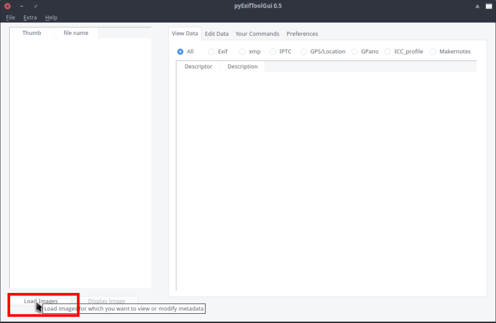
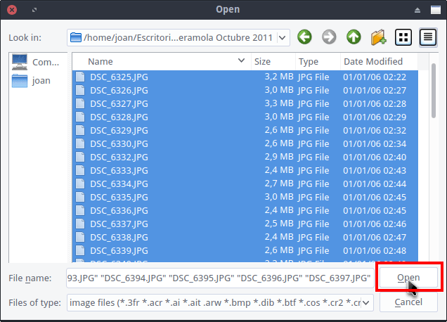
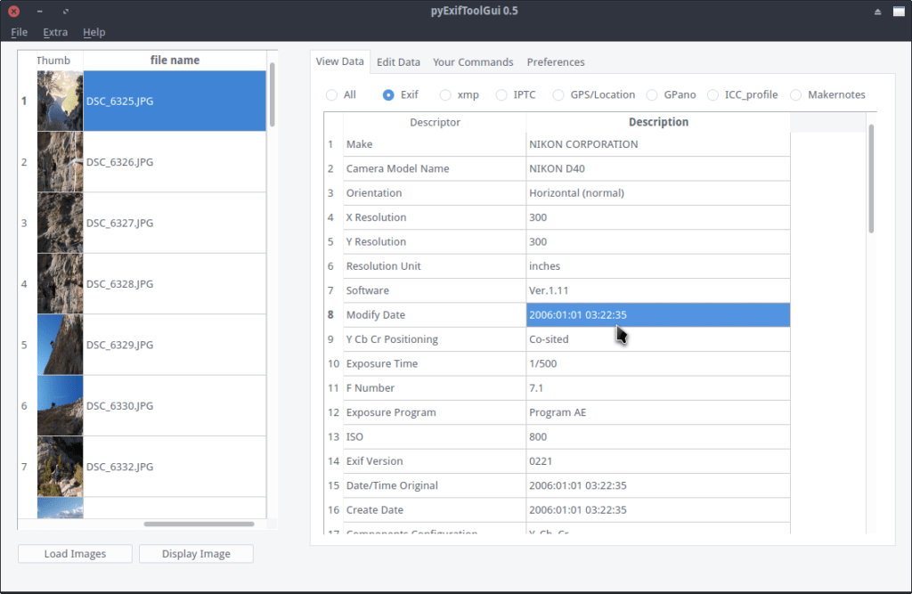
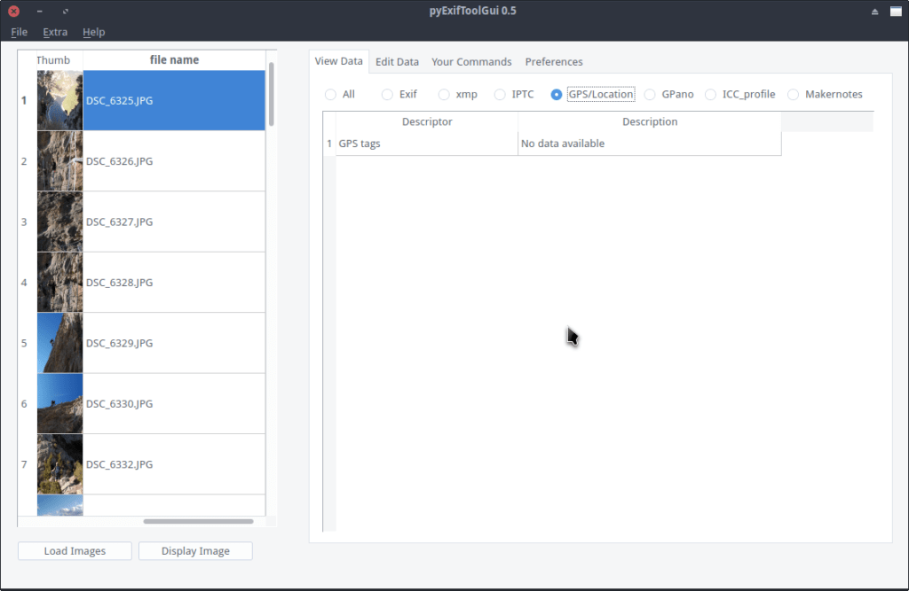
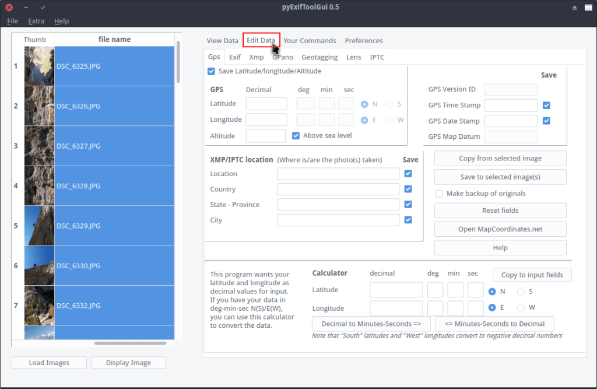
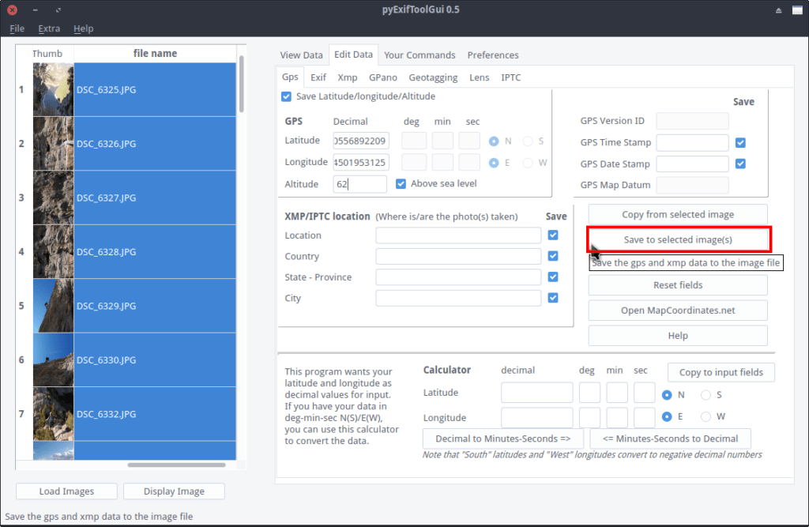
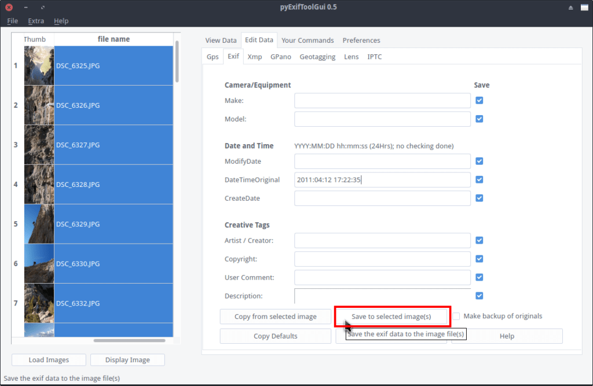

Existen casos en los que precisamos editar los metadatos de una fotografía. Algunos ejemplos de ello son los siguientes:

1. Cuando la hora y/o la fecha de disparo de una fotografía no son correctas.
2. Fotografías que no disponen de metadatos y queremos añadírselos manualmente.
3. Para ocultar o eliminar algunos de los metadatos antes de enviar una fotografía a un tercero.
4. Establecer coordenadas GPS a nuestras imágenes en el caso que lo consideremos necesario.
5. Etc.

<!--more-->

Cuando nos encontramos con estas situaciones, una solución fácil para editar los metadatos de las fotografías es usar [PyexifToolGUI](https://hvdwolf.github.io/pyExifToolGUI/manual/pyexiftoolgui.html "Información adicional de PyExifToolGUI").

PyexifToolGUI no es más que un simple front-end para poder usar la herramienta Exiftool de forma gráfica y cómoda.

## INSTALAR EL PROGRAMA PYEXIFTOOLGUI PARA EDITAR LOS METADATOS

Antes de iniciar el programa PyexifToolGUI tenemos que instalar una serie de paquetes en nuestro sistema operativo. Para ello ejecutaremos el siguiente comando en la terminal:

> ```
> sudo apt-get install libimage-exiftool-perl python-pyside python
> ```

Una vez instalados los paquetes descargaremos la última versión del programa ejecutando el siguiente comando en la terminal:

> ```
> wget https://github.com/hvdwolf/pyExifToolGUI/archive/0.5.tar.gz
> ```

A continuación descomprimiremos el archivo que acabamos de descargar ejecutando el siguiente comando en la terminal:

> ```
> tar zxf 0.5.tar.gz
> ```

Para realizar la instalación accedemos a la carpeta que acabamos de descomprimir ejecutando el siguiente comando en la terminal:

> ```
> cd ~/pyExifToolGUI-0.5/
> ```

Finalmente instalamos el programa ejecutando el siguiente comando en la terminal:

> ```
> sudo ./install_remove.py install
> ```

## ¿CÓMO PODEMOS DESINSTALAR PYEXIGTOOLGUI?

Si algún día precisamos desinstalar el programa tan solo tenemos que ejecutar el siguiente comando en la terminal:

> ```
> sudo ./install_remove.py remove
> ```

## USAR PYEXIFTOOLGUI SIN NECESIDAD DE INSTALARLO

Para usar PyExifToolGUI sin instalarlo es necesario tener la totalidad de dependencias que requiere el programa instaladas. Para ello tienen que ejecutar el siguiente comando en la terminal:

> ```
> sudo apt-get install libimage-exiftool-perl python-pyside python
> ```

Seguidamente ya podemos ejecutar su archivo binario introduciendo el siguiente comando en la terminal:

> ```
> ~/pyExifToolGUI-0.5/bin/pyexiftoolgui
> ```

Acto seguido el programa se abrirá y lo podremos usar con total normalidad.

## VER Y EDITAR LOS METADATOS DE UNA FOTOGRAFÍA O LOTE DE FOTOGRAFÍAS

Una vez instalado el programa tan solo tenemos que abrirlo.

A continuación tenemos que cargar la totalidad de fotografías en que queremos visualizar o modificar sus metadatos. Para ello clicamos encima del botón Load Images.

[](images/cargar-imagenes-para-modificar-metadatos.png)

Seguidamente aparecerá una ventana en la que deberemos buscar y seleccionar la/s fotografía/s en que queremos visualizar o editar los metadatos. Una vez seleccionadas las imágenes presionamos el botón Open.

[](images/abrir-las-fotos-para-editar-los-metadatos.png)

### Ver los metadatos de una fotografía

Una vez cargadas las fotos tan solo tenemos que ir clicando cada una de las fotografías para ver la totalidad de sus metadatos. Observando los metadatos Exif de las fotografías observo que la fecha de disparo es totalmente incorrecta.

[](images/fecha-incorrecta-metadatos-exif.png)

Además si clico en la opción GPS Location veo rápidamente que las imágenes no llevan ningún tipo de coordenadas GPS.

[](images/ver-locaclizacion-gps-foto.png)

Para corregir los 2 puntos que acabo de citar en la totalidad de fotografías podemos proceder del siguiente modo.

### Editar los metadatos de una imagen o lote de imágenes

Para **introducir o modificar las coordenadas GPS a nuestras fotografías** seleccionamos la totalidad de fotografías en las que queremos modificar los metadatos. A continuación clicamos encima de la pestaña Edit Data y seguidamente clicamos en la pestaña Gps.

[](images/seleccionar-todo-y-editar-metadatos.png)

El siguiente paso consiste en **introducir las coordenadas GPS** de donde tiramos el lote de fotografías que estamos editando y presionar el botón Save to selected images(s).

[](images/grabar-coordenadas-gps.png)

Después de presionar el botón se establecerán coordenadas GPS en la totalidad de fotografías que teníamos seleccionadas.

Si ahora queremos **modificar la fecha en que se tomaron las fotos** tan solo tenemos que seguir los siguientes pasos.

Inicialmente seleccionamos la totalidad de fotos en las que queremos modificar la fecha y hora de disparo. A continuación clicamos encima de la pestaña Edit Data y en el campo DateTimeOriginal introducimos la fecha y hora real del disparo. Finalmente tan solo tenemos que apretar el botón Save to selected image(s).

[](images/cambiar-fecha-de-disparo-lote-fotos.png)

Acto seguido se modificará la fecha de disparo de la totalidad de fotografías que habíamos seleccionado.

De esta forma tan simple y tan sencilla podemos visualizar y modificar los metadatos de una foto o conjunto de fotos de forma simple, rápida y efectiva.

## OTRAS OPCIONES QUE OFRECE EL SOFTWARE PYEXIFTOOLGUI

En el artículo hemos visto un par de funciones del programa que son las siguientes:

1. Modificar metadatos del tipo Exif.
2. Añadir coordenadas GPS a nuestras imagenes.

Además hemos visto que la edición de metadatos se puede realizar de forma individual o por lotes.

Pero la verdad es que PyExifToolGUI permite muchas más operaciones como por ejemplo las siguientes:

1. Editar la totalidad de metadatos de una fotografía o conjunto de fotografías. Así por ejemplo podemos editar la localización donde se disparo una fotografía, su resolución, el tiempo de exposición, la marca de la cámara fotográfica que tiro la foto, etc.
2. El programa no es únicamente capaz de visualizar y editar metadatos exif. También es capaz de ver y editar metadatos del tipo xmp e iptc.
3. Al ser compatible con metadatos xmp de Adobe, el programa también es capaz de ver y editar metadatos xmp en archivos de imagen, de audio como por ejemplo el .wav o el .mp3, en pdf’s, en archivos de vídeo, etc. Algunas de las etiquetas comunes de los metadatos xmp son el título, la descripción, el creador, una cualificación en estrellas del archivo, etc.
4. El software no únicamente nos permite editar los metadatos exif mediante una interfaz gráfica. También nos permite editar y leer metadatos mediante los típicos comandos de exiftool que ejecutaríamos en una terminal.
5. Editar metadatos [GPano XMP para Photo Sphere](https://developers.google.com/streetview/spherical-metadata?hl=es-419 "Explicación de los metadatos GPano"). De este modo también podremos editar de forma más adecuada los metadatos en fotos esféricas como por ejemplo las que tiramos con la función Photo Sphere de Google.
6. Permite seleccionar y copiar metadatos de una fotografía determinada y pegarlos a un lote de fotografías.
7. Renombrar el nombre de fotografías por lotes o de forma individual.
8. Etc.
