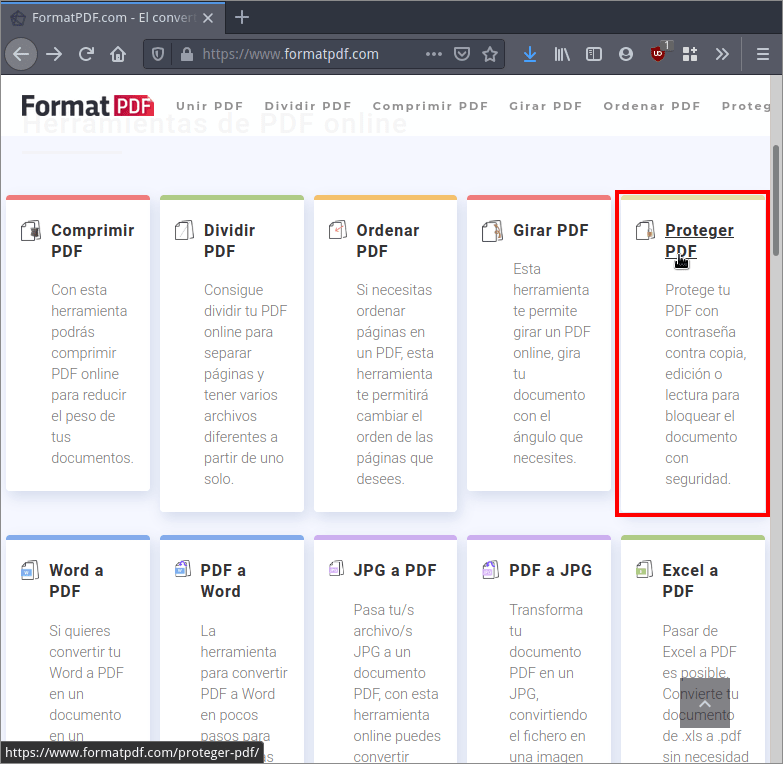
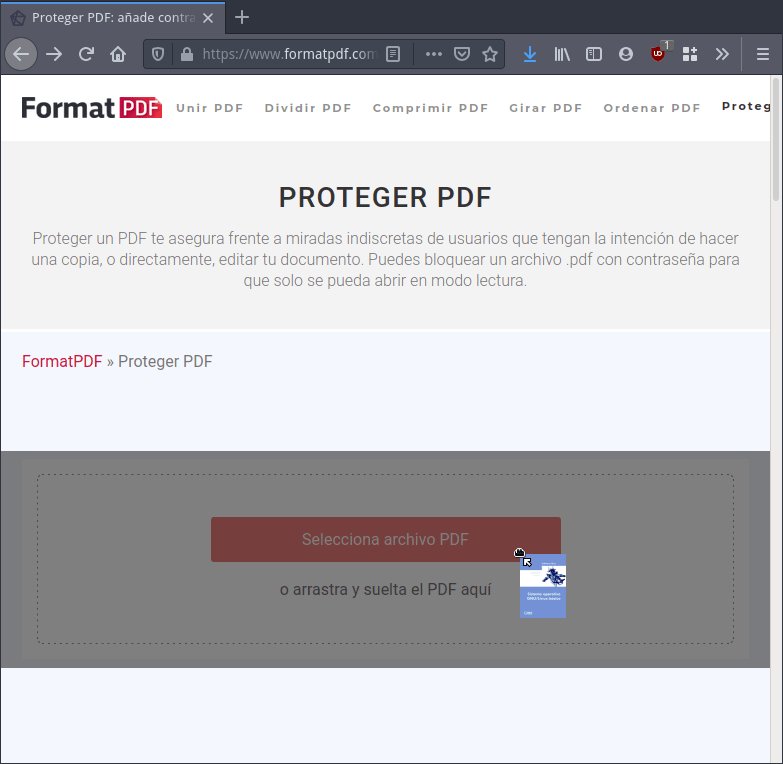
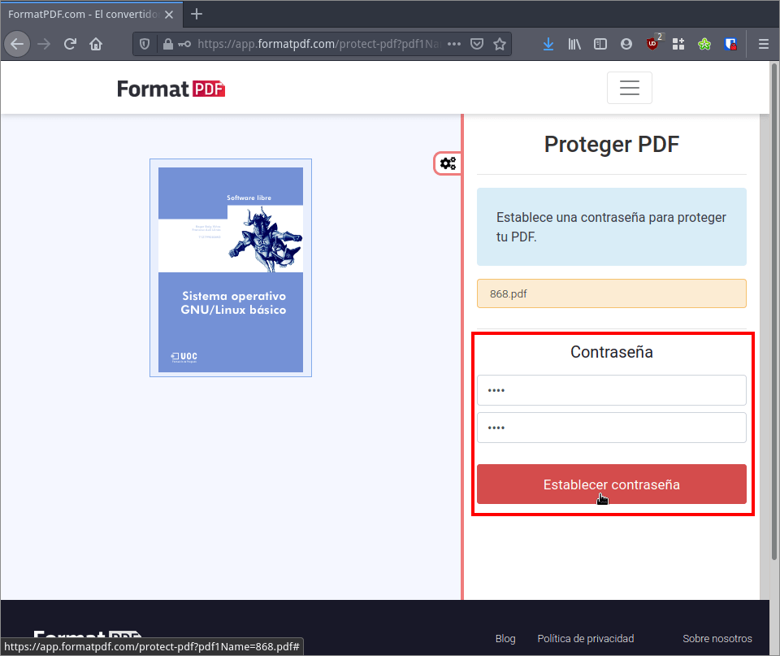
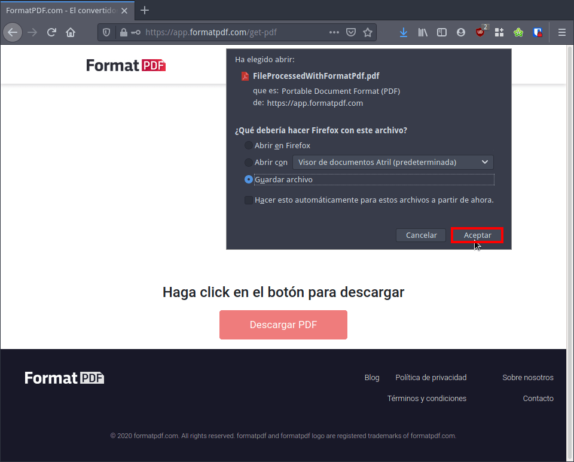
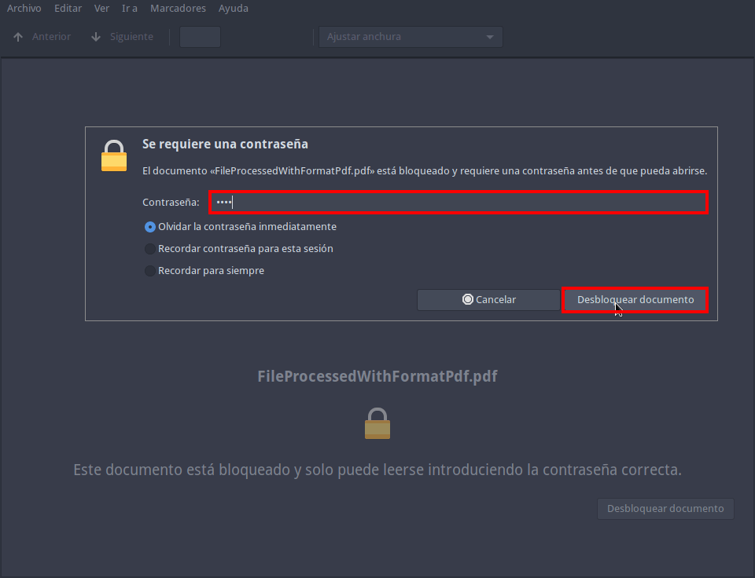

Cuando usamos GNU Linux, Android o iOS y tenemos que gestionar, manipular y editar documentos PDF no existen muchas opciones y las que existen no son fáciles de usar para usuarios noveles. Por este motivo en el siguiente artículo les hablaré del servicio web [FormatPDF](https://www.formatpdf.com/) que les permitirá gestionar documentos PDF de forma sencilla estén donde estén. Lo único que necesitarán es una conexión a Internet y un navegador web.<!--more-->

## ¿OPERACIONES QUE PODEMOS REALIZAR CON FORMATPDF?

Mediante una interfaz web simple e intuitiva FormatPDF permitirá realizar las operaciones que citamos a continuación.

### Modificar, transformar y editar el contenido de ficheros PDF

Tenemos disponibles las herramientas que cito a continuación para modificar/editar el contenido de un fichero PDF.

1. Dividir un PDF en partes o unir varios PDF formando un solo documento.
2. Reordenar las páginas de un archivo PDF.
3. Extraer e insertar páginas en un documento PDF.
4. Cambiar la orientación de las páginas de un PDF.
5. Editar un fichero PDF.
6. Numerar las páginas de un archivo PDF.
7. Poner y quitar marcas de agua de un fichero PDF.
8. Comprimir un PDF para que ocupe menos espacio.

**Nota**: Algunas de las opciones mencionadas aún no están operativas, no obstante es un servicio que acaba de nacer. Imagino que la totalidad de las funciones estarán disponibles en breve.

### Transformar prácticamente cualquier tipo de fichero a PDF y viceversa

FormatPDF permitirá realizar las siguientes transformaciones de formato de archivo:

1. PDF a Word y viceversa.
2. PDF a Excel y viceversa.
3. De PDF a Powerpoint y viceversa.
4. De PDF a ODT y viceversa.
5. PDF a Epub y viceversa.
6. PDF a JPG y viceversa.
7. PDF a TIFF y viceversa.
8. PDF a DJVU y viceversa.

**Nota**: Algunas de las opciones mencionadas aún no están operativas, no obstante es un servicio que acaba de nacer. Imagino que la totalidad de las funciones estarán disponibles en breve.

### Incrementar la seguridad de un documento PDF

En lo que a seguridad se refiere también proporciona tres características interesantes. FormatPDF permitirá:

1. Proteger y desproteger un archivo PDF mediante una contraseña.
2. Firmar digitalmente/electrónicamente un documento PDF.
3. Intentar reparar un documento PDF en el caso que esté dañado.

De este modo podemos autenticar un documento y hacer que solo ciertas personas puedan leerlo.

## ¿POR QUÉ RECOMIENDO GESTIONAR Y EDITAR DOCUMENTOS PDF CON FORMATPDF?

A pesar de ser una herramienta web gestionada por un tercero la considero una opción interesante por lo siguientes motivos:

1. Es una solución Web completa para gestionar, manipular y editar documentos PDF. Además está en Español y no contiene publicidad.
2. Su uso es fácil e intuitivo. Tan solo hay que entrar en la web e ir siguiendo las instrucciones que veréis en pantalla.
3. Se puede usar desde cualquier ordenador y desde cualquier dispositivo móvil. Da igual el sistema operativo que estamos usando ya que tan solo necesitamos un navegador web para trabajar con nuestros documentos PDF.
4. El servicio no requiere de ningún tipo de registro a día de hoy. Todo el mundo lo puede usar sin tener que dar ningún dato personal. FormatPDF únicamente pedirá la información mínima necesaria para que el servicio pueda funcionar.
5. Tiene una [política de privacidad](https://www.formatpdf.com/politica-de-privacidad/) y unos [términos y condiciones](https://www.formatpdf.com/terminos-y-condiciones/) claros. El servicio ha sido creado en España y por lo tanto le aplican la totalidad de leyes españolas. Esto garantiza que el usuario tendrá derechos, entidades a donde puede ir a reclamar y además tendrá un mínimo de privacidad gracias a la ley orgánica de protección de datos.
6. A día de hoy el servicio es gratuito y lo puede usar todo el mundo. No obstante leyendo las condiciones de servicio vemos que ha nacido para ser un servicio de pago o Freemium. Esto en cierto modo es positivo porque da a entender que el modelo de negocio de FormatPDF no es traficar con los datos de sus usuarios.

## EJEMPLO BÁSICO DE COMO PODEMOS PROTEGER UN ARCHIVO PDF CON CONTRASEÑA

Su uso es extremadamente sencillo. Para proteger un documento entramos en su página web y clicamos encima de la opción `Proteger PDF`.

A continuación arrastramos el documento que queremos proteger con contraseña dentro del navegador web.

Seguidamente definimos la contraseña con la que queremos proteger el documento PDF y presionamos sobre el botón `Establecer contraseña`.

Una vez establecida la contraseña tan solo tendremos que descargar el documento. El documento descargado será el mismo que arrastramos, pero estará protegido mediante una contraseña.

Por lo tanto si abren el documento que acaban de proteger verán que para que se abra hay que introducir una contraseña. Una vez introducida de forma correcta podrán leer el contenido del fichero PDF.

## OPINIÓN ACERCA DEL SERVICIO WEB DE FORMATPDF

Aún hay bastantes funcionalidades pendientes de implementar. No obstante las que hay funcionan y su uso es extremadamente fácil. Para diferenciarse de la competencia y ofrecer más servicios podrían añadir más opciones como por ejemplo:

1. Transformar ficheros de Markdown a PDF y viceversa.
2. Transformar ficheros de HTML a PDF y viceversa.
3. Convertir ficheros de LaTeX a PDF y viceversa.
4. Ofrecer otro tipo de transformaciones que no impliquen operar con ficheros PDF. Por ejemplo podrían ofrecer transformar ficheros de formato Markdown a HTML.

Asimismo también podrían generar aplicaciones de escritorio y para dispositivos móviles.
