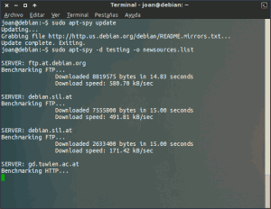
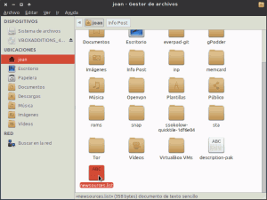
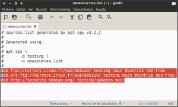
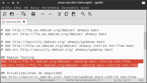
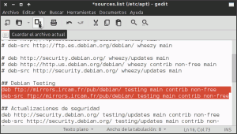
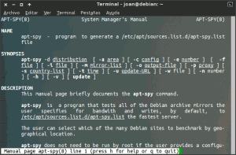

Ahora mismo estoy en una máquina virtual con Debian Testing. Hace bastante tiempo que no la utilizo y la quiero actualizar. Por lo tanto imagino que me entrará un montón de paquetería nueva y el tiempo de la actualización será elevado.

**Para minimizar el tiempo de la actualización** del sistema en el futuro, _lo que haré es ver cuales son los repositorios de Debian más rápidos_ en función de mi ubicación geográfica. De está forma podré actualizar mi sistema operativo de forma más rápida.<!--more-->

Para realizar este proceso hay distintas herramientas. La herramienta que voy a usar se llama apt-spy.

###### Nota: Una de las herramientas alternativas a apt-spy es netselect-apt. No obstante si queremos usar el repositorio más rápido pienso que la mejor herramienta es usar apt-spy. El motivo de esta afirmación es que los parámetros de evaluación que considera apt-spy son el ancho de banda del servidor y su ping, mientras que netselect-apt considera el ping y el número de servidores por los cuales una petición debe pasar antes de alcanzar su destino.

###### Nota: El Ping es el tiempo que tardan en comunicarse dos puntos remotos. En otras palabras es el tiempo que tarda nuestra petición en ir al repositorio y volver hacia nosotros.

## COMO FUNCIONA APT-SPY

El funcionamiento de apt-spy es simple de comprender. La forma en que apt-spy evaluará cada uno de los repositorios es la siguiente:

1. **El programa va a chequear uno por uno los repositorios** que se indican en la siguiente dirección web: [ftp://ftp.us.debian.org/debian/README.mirrors.html](ftp://ftp.us.debian.org/debian/README.mirrors.html "Repositorios de Debian")
2. **Los parámetros usará apt-spy para evaluar cada uno de los repositorios especificados** en este enlace **son el el ping, y el ancho de banda**. Los repositorios más adecuados serán aquellos que tendrán un buen ancho de banda y un ping bajo. Los repositorios con las características mencionadas serán aquellos que podrán descargar más información en un tiempo determinado
3. **Una vez realizada la comprobación de todos los repositorios**, apt-spy nos generará un archivo de texto del cual **podremos extraer cuales son los repositorios más adecuados** para nosotros en función de nuestra ubicación geográfica.

###### Nota: Un repositorio es un servidor web donde se alojan los paquetes y aplicaciones que acostumbramos descargarnos y a instalar con [apt-get](https://es.wikipedia.org/wiki/Advanced_Packaging_Tool "Explicación de lo que es apt-get"), [Synaptic](https://es.wikipedia.org/wiki/Synaptic "Explicación de lo que es Synaptic") o [Aptitude](https://es.wikipedia.org/wiki/Aptitude "Explicación de lo que es Aptitude").

## INSTALACIÓN DE APT-SPY

El proceso de instalación de apt-spy es sumamente fácil. Tan solo tienen que **abrir una terminal y teclear el siguiente comando**:

> ```
> sudo apt-get install apt-spy
> ```

Después de introducir el comando se procederá a la instalación de apt-spy.

## ELEGIR EL REPOSITORIO MAS RÁPIDO

Una vez instalado apt-spy el primer paso es **actualizar la lista de repositorios** que se analizará. Para actualizar la lista de repositorios tenemos que introducir el siguiente comando en la terminal:

> ```
> sudo apt-spy update
> ```

###### Nota: La lista de repositorios a analizar se actualizará en función del contenido que se ubica en [ftp://ftp.us.debian.org/debian/README.mirrors.html](ftp://ftp.us.debian.org/debian/README.mirrors.html "Repositorios de Debian")

Una vez actualizada la lista de repositorios a analizar ya podemos ejecutar apt-spy. Pero antes de hacer nada tenéis que ir con cuidado a la hora de aplicar los comandos que se mostrarán a continuación. En el caso de introducir el comando de forma errónea podéis dañar vuestro fichero sources.list. Por lo tanto lo primero que vamos a realizar es **hacer una copia de seguridad de nuestro fichero sources.list**. Para realizar la copia de seguridad tenéis que ingresar el siguiente comando en la terminal:

> ```
> sudo cp /etc/apt/sources.list /etc/apt/sources.list.bak
> ```

Una vez finalizada la copia de seguridad ya podemos **ejecutar apt-spy**. **Para ejecutar apt-spy deben introducir el siguiente comando:**

> ```
> sudo apt-spy -d testing -o newsources.list
> ```

Este comando analizará el ancho de banda y ping de cada uno de los repositorios de Debian Testing que se hallan descritos en este [enlace](ftp://ftp.us.debian.org/debian/README.mirrors.html "Repositorios que analiza apt-spy"). Una vez finalizado el análisis, apt-spy ubicará un archivo con nombre newsources.list en nuestra home que contendrá el repositorio más rápido para nosotros.

Si en vez de hallar los repositorios más rápidos de Debian testing queréis hallar los repositorios más rápidos de Debian Estable el comando a usar seria el siguiente:

> ```
> sudo apt-spy -d stable -o newsources.list
> ```

Y si finalmente estáis usando Debian Sid o inestable el comando debería ser el siguiente:

> ```
> sudo apt-spy -d unstable -o newsources.list
> ```

Los pasos ejecutados hasta el momento los pueden ver resumidos en la siguiente captura de pantalla:

[](images/1-Ejecución-de-apt-spy.png)

###### Nota: Como se puede ver en la captura de pantalla se está analizando los bytes que cada uno de los repositorios es capaz de descargar en 15 segundos. El que pueda descargar más bytes será aquel servidor que tiene la mejor ping y mayor ancho de banda, y por lo tanto será el servidor que más nos conviene.

Una vez finalizado el proceso, que seguramente durará más de una hora, ya podemos **ir a nuestra home a consultar cual es el repositorio más rápido. Como se puede ver en la captura de pantalla abro el archivo newsources.list que se acaba de generar:**

[](images/2-Localizar-los-resultados-de-apt-spy.png)

Una vez abierto vemos que el contenido es el siguiente:

[](images/3-Resultados-obtenidos.png)

Como se puede ver en la captura de pantalla, **en mi caso el repositorio aconsejado es** [ftp://mirrors.ircam.fr/pub/debian](ftp://mirrors.ircam.fr/pub/debian "Repositorio de Debian Aconsejado"). Por lo tanto **ahora** tan solo **tenemos que ir a nuestro sources.list y remplazar nuestro repositorio actual por el nuevo repositorio**. Para acceder a nuestro sources.list abren una terminal y escriben el siguiente comando:

> ```
> sudo gedit /etc/apt/sources.list
> ```

Se abrirá el editor de textos. Una vez se haya abierto el editor de textos localizan los repositorios a reemplazar que en mi caso son los que se muestran en la siguiente captura de pantalla:

[](images/4-Localización-del-contenido-a-cambiar.png)

Una vez localizados los repositorios, reemplazan el contenido actual por la recomendación de apt-spy. Seguidamente presionan el botón de guardar tal y como se muestra en la captura de pantalla:

[](images/5-Contenido-cambiado.png)

Una vez realizados estos pasos ya podremos disfrutar de los nuevos repositorios.

###### Nota: Los resultados obtenidos pueden variar de un momento a otro en función de la carga que tiene el repositorio al que nos conectamos. Cuando un servidor tiene mucha carga la velocidad de descarga que ofrecerá a los clientes que se conectan será menor.

###### Nota: En el archivo sources.list es dónde indicamos a [apt-get](https://es.wikipedia.org/wiki/Advanced_Packaging_Tool "Explicación de lo que es Apt") o [aptitude](https://es.wikipedia.org/wiki/Aptitude "Explicación de que es Aptitude") desde que repositorios nos tenemos que descargar los paquetes y aplicaciones.

## VARIANTES DEL COMANDO APT-SPY

En el caso de querer acotar más nuestra búsqueda, apt-spy nos ofrece varias opciones. **La totalidad de opciones que nos ofrece se pueden consultar introduciendo el siguiente comando en la terminal:**

> ```
> man apt-spy
> ```

Una vez introducido el comando os aparecerán las instrucciones para usar apt-spy:

[](images/6-Instrucciones-del-comando-apt-spy.png)

Ahora seréis vosotros quienes a partir de las opciones mostradas por **man apt-spy** tendréis que jugar para obtener los resultados que más os interesan. **Algunas de las variantes del primer comando que hemos usado pueden ser las siguientes:**

#### Variante 1

> ```
> sudo apt-spy -d testing -w newsources.list -n 7
> ```

**Este comando a diferencia del primero nos dará el nombre de los 7 servidores más rápidos de la rama de Debian Testing**. El resultado lo escribirá en un archivo que se generará en nuestra home con nombre newsources.list. Este comando pienso que es más útil que el primero ya que tendremos más de una opción de repositorio a elegir.

###### Nota: En Rojo indico las partes variables del comando. Testing puede ser reemplazado por stable o por unstable. 7 puede ser reemplazado por cualquier número en función del número de servidores que queremos que nos proporcione apt-spy.

#### Variante 2

**En el caso que queramos analizar un número determinado de servidores en un continente en particular, podemos usar el siguiente comando:**

> ```
> sudo apt-spy -d unstable -a europe -e 100 -o newsources.list
> ```

Este comando testea 100 repositorios de la distribución Debian inestable ubicados en Europa. Una vez analizados los servidores, en nuestro servidor se genera un archivo con nombre newsources.list que contiene el repositorio más apropiado en nuestro caso.

###### Nota: En Rojo indico las partes variables del comando. Unstable puede ser reemplazado por stable o por testing. 100 puede ser reemplazado por cualquier número en función del número de repositorios que queramos comprobar. Finalmente europe lo podemos reemplazar por north-america, south-america, oceania, asia o africa en función del continente que queráis seleccionar.

#### Variante 4

Ahora supongamos estoy usando Debian Estable y quiero usar un repositorio cuyo servidor esté ubicado físicamente en España. Bajo estas premisas lo que realizaré es utilizar el siguiente comando para averiguar cual es el mejor repositorio para nosotros:

> ```
> sudo apt-spy -d stable -s ES -o newsources.list
> ```

**Este comando lo que hará es analizar la totalidad de repositorios de Debian Estable ubicados en España**. Una vez finalizado el estudio, en nuestra home se creará un fichero con nombre newsources.list que nos informará del repositorios más rápido ubicado en España.

###### Nota: Este comando, como todos los otros, puede presentar variantes. Stable puede ser reemplazado por testing y unstable en función del tipo de rama que queramos analizar. El término ES también puede ser modificado en función del país que deseemos analizar. Las diferentes variables que podemos usar para reemplazar ES son:

**AT** (Austria) //**AU** (Australia) // **BE** (Bélgica) // **BG** (Bulgaria) // **BR** (Brasil) // **BY** (Bielorusia) // **CA** (Canadá) // **CH** (Suiza) // **CL** (Chile) // **CN** (China) // **CR** (Costa Rica) // **CZ** (República Checa) // **DE** (Alemania) // **DK** (Dinamarca) // **EE** (Estonia) // **ES** (España) // **FI** (Finlandia) // **FR** (Francia) // **GB** (Reino Unido) // **GR** (Grecia) // **HK** (Hong Kong) // **HR** (Croacia) // **HU** (Hungría) // **ID** (Indonesia) // **IE** (Irlanda) // **IL** (Israel) // **IN** (India) // **IS** (Islandia) // **IT** (Italia) // **JP** (Japón) // **KR** (Korea) // LT (Lituania) // **LU** (Luxemburgo) // **LV** (Letonia) // **MX** (México) // **NI** (Nicaragua) // **NL** (Holanda) // **NO** (Noruega) // **NZ** (Nueza Zelanda) // PL (Polonia) // **PT** (Portugal) // **RO** (Rumania) // **RU** (Rusia) // **SE** (Suecia) // **SG** (Singapur) // **SI** (Eslovenia) // **SK** (Eslovaquia) // **TH** (Tailandia) // **TR** (Turquía) // **TW** (Taiwan) // **UA** (Ucrania) // **US** (Estados Unidos) // **ZA** (Sur África)

#### Variante 5

Ya para finalizar pondré una variante de los comandos anteriores para la gente que tenga poca paciencia y no disponga de mucho tiempo para esperar a obtener un resultado. Como hemos visto anteriormente cada servidor se testea durante 15 segundos. Si queremos disminuir el tiempo de 15 segundos a 5 segundos, lo podemos hacer de la siguiente forma:

> ```
> sudo apt-spy -d testing -s DE -t 5 -w nuevasfuentes.list -n 4
> ```

**Este comando va analizar la totalidad de repositorios de Debian Testing ubicados en Alemania. Cada repositorio solo se va a testear durante 5 segundos. El resultado de los 4 mejores repositorios lo deberemos consultar en un archivo que se ubicará en nuestra home**. Este archivo tendrá el nombre nuevasfuentes.list.

###### Nota: En Rojo se indican las partes del comando que se pueden modificar. Testing se puede reemplazar por stable o unstable. DE se puede reemplazar por cualquiera de los países que se indican en la variante 3 de este post. 5 Puede ser reemplazado por cualquier número en función de los segundos que queramos testear cada repositorio. Y finalmente 4 lo podemos reemplazar por cualquier valor en función de los resultados de salida que queremos que nos de apt-spy.

## MÉTODOS ALTERNATIVOS

Aparte de netselect-apt y apt-spy existen otros métodos para seleccionar nuestros repositorios. Una método que también es muy interesante es usar los repositorios redirector de Debian. Para Obtener más información sobre este método pueden consultar el siguiente link:

[https://geekland.eu/repositorios-redirector-en-debian/]()

Este probablemente será el último post del año 2013. Por lo tanto aprovecho la ocasión para desearos a todos felices fiestas y feliz año nuevo. Nos vemos el año que viene.
