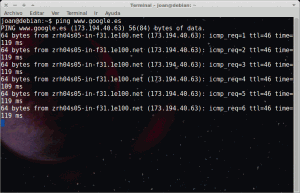
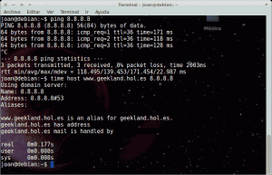
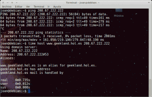
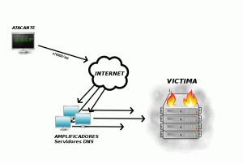
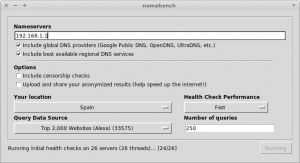
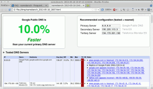
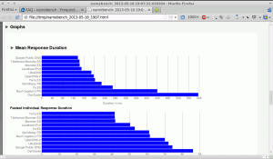
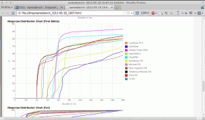
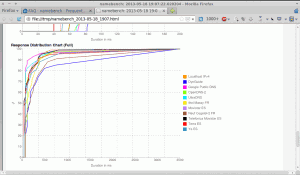

En grandes cantidades de post o en conversaciones entre geeks se suelen recomendar algún que otro servidor DNS para incrementar la velocidad de navegación en Internet. Pero hay que tener en cuenta la elección del mejor DNS depende de múltiples factores. Puede ser que para nosotros el mejor DNS sea el de Google mientras que por determinadas circunstancias en otros países otros servidores DNS, como por ejemplo los que te puede ofrecer tu ISP, funcionen mejor que los de Google.<!--more-->

Una vez planteada esta situación en el siguiente post conoceremos de forma precisa para que sirve un servidor DNS, como funciona y como elegir el DNS que más nos conviene en función de nuestra ubicación geográfica.

## PARA QUE SIRVE UN SERVIDOR DNS

Para ver la utilidad de un servidor DNS lo más fácil es poner un ejemplo. Imaginemos que nos queremos conectar a una determinada página web.

Sabemos que toda página web está alojada en un servidor y que cada servidor tiene una IP pública que es única. Por lo tanto teóricamente para conectarnos a una página web lo podemos hacer introduciendo la IP del servidor en que esta alojada la página web.

Así por lo tanto si queremos acceder al buscador de google lo podemos realizar introduciendo su IP. Primero averiguamos la IP. Podemos averiguar la IP tecleando el siguiente comando en la terminal:

> ```
> ping www.google.es
> ```

[](images/Averiguar-IP-web.png)

Como se puede ver en la captura de pantalla la IP del servidor de google es **173.194.40.63**. Una vez conocemos la IP nos vamos a nuestro navegador y en la barra de direcciones introducimos la IP **173.194.40.63**. Como se puede ver en la siguiente captura de pantalla hemos accedido al buscador:

[](images/Entrar-a-google-con-la-IP.png)

###### Nota: El método que se acaba de describir no funcionará en el caso que se intente acceder mediante la IP a un servidor web que aloje varias páginas.

Por lo tanto acabamos de ver que podemos acceder a las páginas web por medio de su IP. Pero este método presenta graves inconvenientes como por ejemplo los siguientes:

1. Resulta sumamente difícil recordar una dirección IP
2. Las direcciones IP pueden cambiar. Así por ejemplo acabamos de acceder al buscador de Google con la IP **173.194.40.63**. Puede ser que en una semana está dirección ya no funcione porque la IP ha cambiado.

Para solucionar este problema existen los servidores DNS. La función de un servidor DNS será la de traducir todo nombre de dominio, como por ejemplo [www.google.es](https://www.google.es/ "Google"), a una dirección IP para poder establecer la conexión a la web que queremos visitar. Así por lo tanto cuando nosotros introducimos [www.google.es](https://www.google.es/ "Google") el servidor DNS se encargará de traducir el dominio [www.google.es](https://www.google.es/ "Google") a la IP **173.194.40.63**. Además [www.google.es](https://www.google.es/ "google") es sumamente fácil de recordar y en el caso que cambie la IP donde está alojado el servidor de Google no habrá problema ya que el servidor DNS detectará que la IP ha cambiado.

Con el ejemplo que acabamos de ver pienso que queda claro para que sirven los servidores DNS. Con el ejemplo también podemos deducir que en el caso que el servidor DNS no funcione perderemos completamente la capacidad de navegar por Internet ya que para nuestro navegador el dominio que tecleamos para acceder a una página web no tiene ningún significado.

## COMO FUNCIONA UN SERVIDOR DNS

Una vez sabemos el uso que tiene un servidor DNS podemos ver como funciona. Para ver el funcionamiento lo mejor es explicarlo de forma simplificada y a través de un ejemplo. El ejemplo es el siguiente:

1. En nuestro navegador tecleamos la página web que queremos visitar. Pongamos el caso que vamos a visitar el la web [www.geekland.eu](https://geekland.eu/ "Geekland")
2. En el caso de tener instalado un servidor DNS cache en casa, como por ejemplo Bind, nscd o dnsmasq, la primera acción que se realizará es comprobar si la petición [www.geekland.eu](https://geekland.eu/ "Geekland") está almacenada la cache de nuestro servidor. Si la petición está almacenada se termina el proceso. Nuestro servidor DNS cache asociará el nombre de dominio [www.geekland.eu](https://geekland.eu/ "Geekland") con su IP correspondiente.
3. En el caso que el servidor DNS cache no tenga la petición almacenada , ya que es la primera vez que accedemos a esta web, entonces se realizará la petición al servidor DNS externo. El servidor DNS externo, una vez haya recibido la petición, comprobará si la tiene almacenada en su cache. Si la tiene almacenada el proceso termina y el servidor DNS externo asociará el nombre del dominio [www.geekland.eu](https://geekland.eu/ "Geekland") con su IP.
4. En el caso que el servidor DNS externo no tuviera almacenada nuestra petición entonces lo que haría seria consultar otro servidor DNS, si el nuevo servidor tampoco tuviera almacenada la petición consultaría a otro servidor y así sucesivamente hasta que al final un servidor nos devolverá la dirección IP del dominio o página que queremos visitar que en este caso es [www.geekland.eu](https://geekland.eu/ "Geekland").

###### Nota: El proceso descrito en este apartado es muy rápido. La totalidad de acciones descritas en los 4 puntos, como veremos más adelante, se realizan en cuestión de milisegundos.

## UTILIDAD QUE TIENE CAMBIAR LOS DNS

Acabamos de ver que cada vez que ponemos una dirección en nuestro navegador hay un servidor que se encarga de averiguar la IP del dominio al que nos queremos conectar. Pues bien, hay servidores que obtendrán más rápidamente la IP que no otros. Si obtenemos la IP con menos tiempo podremos acceder antes a la página web que queremos visitar.

Para poder ver que lo que acabo de comentar es cierto podemos verlo de la siguiente forma. Primero analizaremos el tiempo que el serividor DNS de Google necesita para poder resolver la petición para entrar en la web [www.geekland.eu](https://geekland.eu/ "Geekland")

Para ello primero tenemos que analizar el tiempo que tarda la información en viajar desde nuestro ordenador al servidor de Google, y desde el servidor de Google a nuestro ordenador. Para poder analizar el tiempo lo podemos usar con el comando ping de la siguiente forma. Entramos en la terminal y ponemos el siguiente comando:

> ```
> ping 8.8.8.8
> ```

###### Nota: 8.8.8.8 es la IP de uno de los servidores DNS de Google. Al ejecutar el comando nos empezará a dar resultados. Estos resultados son el tiempo de tarda la información en trasladarse de un sitio a otro. Para salir del comando ping tenemos que presionar Ctrl+C. Al salir veremos que se nos proporciona una estadística de tiempos.

Una vez conocemos el tiempo que tardan los paquetes en ir de un sitio a otro, para obtener el tiempo total de resolución de un dominio, hay que añadir el tiempo que tarda el servidor en resolver nuestra petición. Para obtener este tiempo lo podemos hacer mediante el siguiente comando:

> ```
> time host www.geekland.hol.es 8.8.8.8
> ```

Una vez aplicados estos 2 comandos podéis ver los resultados obtenidos en la siguiente captura de pantalla:

[](images/Tiempo-de-resolución-google.png)

Si observamos la captura de pantalla vemos que si sumamos el tiempo de resolución del servidor más el tiempo de ida y vuelta, el tiempo total para resolver el dominio [www.geekland.eu](https://geekland.eu/ "Geekland") es de 317ms aproximadamente.

Una vez conocidos los resultados con el servidor DNS de Google pasaremos a realizar el mismo experimento pero ahora con el servidor OpenDNS. Así de esta forma podremos comparar los dos resultados. Para realizar el estudio con el servidor de  OpenDNS tenemos que aplicar los mismos pasos que acabamos de aplicar con el servidor de google. Por lo tanto abrimos la terminal y aplicamos los siguientes comandos:

> ```
> ping 208.67.222.222
> ```
> 
> ```
> time host www.geekland.hol.es 208.67.222.222
> ```

###### Nota: 208.67.222.222 es la IP de uno de los servidores de OpenDNS.

Una vez aplicados estos 2 comandos podéis ver los resultados obtenidos en la siguiente captura de pantalla:

[](images/Tiempo-de-resolución-Open-DNS.png)

Como se puede ver en este caso la velocidad de resolución es de 935ms. Si comparamos la velocidad con el caso anterior, 317ms, podemos concluir que la velocidad de resolución del servidor de Google para acceder a [www.geekland.eu](https://geekland.eu/ "Geekland") es mucho mejor que no la del servidor de OpenDNS.

Por lo tanto si usamos el servidor DNS de Google conseguiremos acceder en este blog de forma más rápida que los usuarios que usen el servidor DNS de OpenDNS.

## OTROS FACTORES A CONSIDERAR PARA LA ELECCIÓN DEL MEJOR DNS

Acabamos de ver que la velocidad es un factor importante a la hora de elegir un servidor DNS u otro. Pero un Servidor DNS, como todo servidor, es susceptible de recibir ataques. Por lo tanto no solo tenemos que tener en cuenta la velocidad. La estabilidad y la seguridad también serán factores muy a tener en cuenta en la elección del servidor DNS.

Si encontramos un servidor que ofrece la misma velocidad de resolución que Google, pero no es reconocido, es mucho mejor elegir los de Google. Los servidores de Google por ejemplo serán mucho más estables y estarán más protegidos frente a los ataques descritos a continuación:

### Dns Spoofing:

[](images/dnsspoofing.jpg)

Hay ciertos ataques que aprovechando vulnerabilidades del servidor intentan envenenar la memoria cache del servidor DNS. Una vez envenenada la memoria cache nosotros haremos una petición al servidor DNS. El servidor DNS mirará si nuestra petición se encuentra almacenada en su cache. Si encuentra que la petición está en la cache y además está envenenada es posible que el servidor DNS nos redirija a una web maliciosa que nos instalé algún gusano, malware o que simplemente nos redirija a un clon de la pagina que queremos acceder con el fin de obtener nuestras credenciales, datos bancarios, etc.

###### Nota: Cuando la situación descrita se presenta el ataque afectará a la totalidad de clientes del servidor DNS. Además este tipo de ataque también puede afectará indirectamente a servidores DNS que dependen del servidor afectado. Así por lo tanto si hacemos una petición a un servidor DNS y no la puede resolver inmediatamente consultará a otro servidor DNS cercano para poder resolver la petición. Si el servidor DNS al que se conecta está envenenado también puede envenenar a nuestro servidor.

### Ataques de amplificación DNS o Smurff: 

[](images/smurf-attack.png)

Aprovechando vulnerabilidades de uno o varios servidores DNS, o simplemente aprovechando que en internet hay multitud de servidores DNS abiertos lo que hace este tipo de ataque es lo siguiente:

1. Un grupo de atacantes decide atacar un servicio con una determinada IP. Para realizar el ataque, los atacantes realizan peticiones falsas a distintos servidores DNS vulnerables.
2. Cuando los distintos servidores DNS reciben las peticiones piensan que las peticiones provienen de la IP que queremos atacar. Por lo tanto los servidores DNS responden la multitud de peticiones y las dirige a la IP que se quiere atacar. De esta forma se consigue hacer caer el servicio atacado ya que no tiene capacidad de dar respuesta a la totalidad de tráfico que le estamos enviando.

###### Nota: Este tipo de ataque es el que se utilizo para llevar a termino el famoso ataque de SpamHaus, el mayor ciberataque conocido hasta el momento. Como se puede ver en la explicación con simplemente generar una cantidad ínfima de tráfico haciendo peticiones DNS somos capaces de generar una gran cantidad de tráfico a la víctima.

Por lo tanto con todos todos mis respetos, en términos de seguridad me fío mucho más de la seguridad de un proveedor como Google u Open DNS que no de proveedores como por ejemplo Telefónica o Jazztel. Google es una empresa pionera en muchos aspectos como por ejemplo aplicar las últimas técnicas de seguridad en sus servidores.

Ahora bien todo el mundo es libre de elegir el DNS que consideré oportuno. También hay que decir que Google en términos de privacidad debe dejar bastante que desear. Estoy seguro que deben hacer uso de la información almacenada en sus servidores DNS para saber las páginas que visitamos.

## SELECCIONAR EL DNS MÁS RÁPIDO

Para conocer el DNS más rápido en función de nuestra zona geográfica existe una aplicación que se llama namebench.

### ¿Cómo funciona namebench?

Para entender como funciona namebench tenemos que tener en cuenta estos aspectos:

1. Namebench dispone de una base de datos muy extensa de páginas web que reciben un alto número de visitas.
2. Namebench también dispone de una base de datos de multitud de servidores DNS existentes en todo el mundo.

Partiendo de esta base namebench, para cada una de las paginas web que tiene en su base de datos realizará una petición a cada uno de los servidores DNS existentes en la otra base de datos.

Para cada una de las peticiones realizadas, namebench registrará los tiempos de resolución y al final nos acabará dando una serie de estadísticas que nos revelerán el mejor DNS en nuestro caso.

### Instalación de Namebench

Namebench está en la paquetería de prácticamente la totalidad de distros Linux. Por lo tanto para instalarlo tan solo tenemos que abrir una terminal y teclear el siguiente comando:

> ```
> sudo apt-get install namebench
> ```

En el caso de ser usuario de Windows o MAC\_OS pueden descargar namebench de la siguiente página web:

[https://code.google.com/p/namebench/downloads/list](https://code.google.com/p/namebench/downloads/list "Descargar namebench")

### Instrucciones para usar namebench

Una vez instalado namebench lo ejecutamos. Para ejecutarlo escribimos el siguiente comando en la terminal:

> ```
> namebench
> ```

Se ejecutará el programa y nos aparecerá la siguiente pantalla:

[](images/namebench.png)

###### Nota: La captura de pantalla muestra las opciones que elegí para saber cuales son los mejores DNS en mi caso. Otras configuraciones también pueden ser completamente válidas.

Las opciones de configuración que ofrece namebench se pueden ver en la última captura de pantalla. El significado de cada una de las celdas es el siguiente:

**nameservers:** En este campo tenemos que introducir la totalidad de servidores DNS que queremos asegurar que sean incluidos en la comparativa de velocidad. El valor por defecto de este campo son las DNS que tenemos configuradas actualmente en nuestro equipo, que como se puede ver en la captura de pantalla son los de mi ISP. Si queremos podemos ampliar el campo nameservers con otros servidores DNS.

**Include global DNS providers:** Si seleccionamos esta opción estaremos incluyendo Multitud de servidores DNS archiconocidos en nuestro estudio. Estos DNS por ejemplo incluyen los DNS de Google, los OpenDNS o los UltraDNS.

###### Nota: Editando el fichero namebench.cfg ubicado en /etc/namebench podemos añadir servidores adicionales. No obstante si consultáis el archivo veréis que dispone de aproximadamente 4000 servidores DNS. Por lo tanto en principio no es necesario ampliar la lista.

**Include best available regional DNS services:** Seleccionando esta esta opción estamos incluyendo un gran número de servidores regionales en nuestro análisis de servidores más rápidos.

###### Nota: A pesar de disponer de un elevada base de datos de servidores namebench solo considerará 10 servidores en el estudio que realizará. Namebench elegirá 4 servidores globales, 4 servidores regionales y el servidor dns primarios y secundario que tenemos actualmente configurados en nuestro ordenador.

**Include Censorship Checks:** Al seleccionar esta opción estaremos forzando a namebench que testee los servidores DNS con páginas web que en principio están censuradas. Namebench intentará analizar que el resultado de la consulta a la páginas web censuradas proporcionen el resultado esperado. En el caso de no proporcionar el resultado esperado entonces este servidor DNS no es seguro.

**Your Location:** En este apartado tenemos que seleccionar nuestro país. En mi caso España.

**Upload and Share:** Al seleccionar esta opción estamos dando permiso a namebench para que almacene de forma anónima los resultados que hemos obtenido en el test. De está forma namebench podrá mejorar su software y de paso los ISP podrán consultar la información acerca de si el servicio que están ofreciendo es correcto o no.

**Query Data Source:** Como hemos dicho anteriormente namebench tiene una base de datos de páginas web que usa para realizar peticiones a los servidores DNS. Pues bien, la verdad es que no solo tiene una base de datos si no que tiene varias. En este campo nosotros deberemos elegir la base de datos que deseemos. Por ejemplo podemos elegir las paginas web que tenemos en el historial de navegación de nuestro navegador, el top 2000 de las páginas web registradas en Alexa, etc.

**Health Check Performance:** En este campo podemos seleccionar el número de servidores DNS a los que namebench puede realizar peticiones simultáneamente. Si elegimos la opción fast se podrán realizar hasta 40 peticiones a servidores de forma simultanea. Si elegimos slow se harán 10.

**Number of queries:** En este campo estaremos seleccionando un número de peticiones que se harán para cada uno de los servidores DNS. Por defecto el número de peticiones que se hace a cada uno los servidores DNS es de 250.

Una vez seleccionadas las opciones clicamos al Botón Running y empezará el estudio. El estudio durará ente 10 y 15 minutos aproximadamente.

Como hemos dicho anteriormente namebench realizará peticiones automáticas de nuestras direcciones más visitas almacenadas en Firefox o en el top 2000 de las webs registradas en Alexa y analizará y registrará la velocidad de resolución de cada uno de los servidores DNS.

## RESULTADOS PROPORCIONADOS POR NAMEBENCH

Una vez realizado el análisis nos dará el siguiente tipo de resultados:

[](images/Resultado-namebench.png)

###### Nota: Como se puede ver en la captura de la imagen si cambiará mi servidor DNS primario actual por el servidor DNS de Google mi velocidad de resolución en las peticiones se incrementaría un 10%.

[](images/Resultado-namebench-2.png)

###### Nota: En el primer gráfico podemos ver que Google es el servidor DNS que nos da la mejor velocidad media de resolución de peticiones con 130 ms de media. En el segundo gráfico podemos que la resolución más rápida que ha realizado ha sido de 74ms ocupando prácticamente la última posición. Esto quiere decir que la velocidad de resolución de peticiones del servidor DNS de Google es muy constante independientemente de la web que queramos visitar.

[](images/Resultado-namebench-3.png)

###### Nota: En este gráfica se puede que que el servidor DNS de Google resuelve aproximadamente el 80% de peticiones en apenas 70ms. Mientras que el servidor de Terra el 42% de las peticiones las resuelve en apenas 40 ms.

[](images/Resultado-namebench-4.png)

###### Nota: Este tipo de gráfico muestra el mismo tipo de información que la anterior. La única diferencia es que el gráfico anterior solo se representaban los 200 primeros ms mientras que en esta se representa hasta los 3500 ms.

## COMO CAMBIAR LOS DNS DE MI ORDENADOR

Seguidamente en función de los resultados obtenidos con namebench cambiaremos los DNS de nuestro ordenador para de esta forma poder navegar más rápido. La forma más rápida para poder realizar este paso es mediante al terminal. Por lo tanto abrimos una terminal e introducimos el siguiente comando:

> ```
> sudo gedit /etc/resolv.conf
> ```

Se abrirá el editor de textos gedit. El contenido que tengo inicialmente es:

**\# Generated by NetworkManager** **nameserver 80.58.0.33** **nameserver 80.58.32.97**

Ahora tan solo tengo que sustituir las IP del servidor primario y secundario en función de los resultados obtenidos en namebench. Por lo tanto en mi caso el contenido del archivo **resolv.conf** tendría que quedar de la siguiente forma:

**\# Generated by NetworkManager** **nameserver 8.8.8.8** **nameserver 195.235.113.3**

Guardamos los cambios, cerramos el editor de textos y ya podemos decir que el proceso ha terminado.

###### Nota: Otra opción es cambiar los servidores DNS directamente en el router.

## ALGUNOS SERVIDORES DNS PÚBLICOS RECONOCIDOS

En el caso que algunas personas tengan curiosidad para consultar algunos de los servidores DNS existentes les dejo el siguientes link:

[http://www.adslzone.net/datosconexion.html](http://www.adslzone.net/datosconexion.html "Algunos Servidores DNS")

Además también existen otra serie de servidores DNS público como por ejemplo los siguientes:

**Google DNS** DNS Primario: **8.8.8.8** DNS Secundario: **8.8.4.4**

**OpenDNS** DNS Primario: **208.67.222.222** DNS Secundario: **208.67.220.220**

**Comodo Secure DNS** DNS Primario: **8.26.56.26** DNS Secundario: **8.20.247.20**

**Norton ConnectSafe** DNS Primario: **198.153.192.50** DNS Secundario: **198.153.194.50**

## FUENTES

[https://code.google.com/p/namebench/](https://code.google.com/p/namebench/ "Namebench Website")
