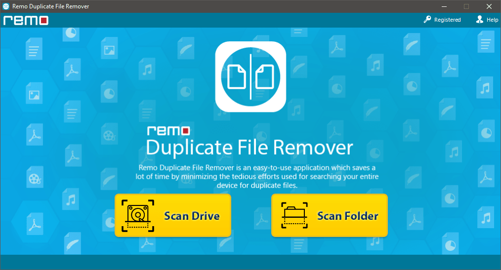
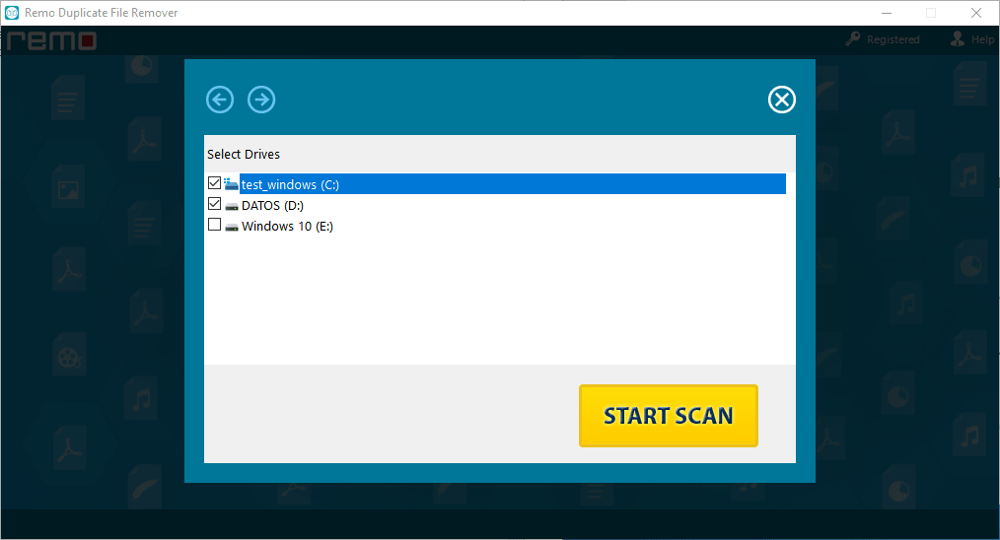
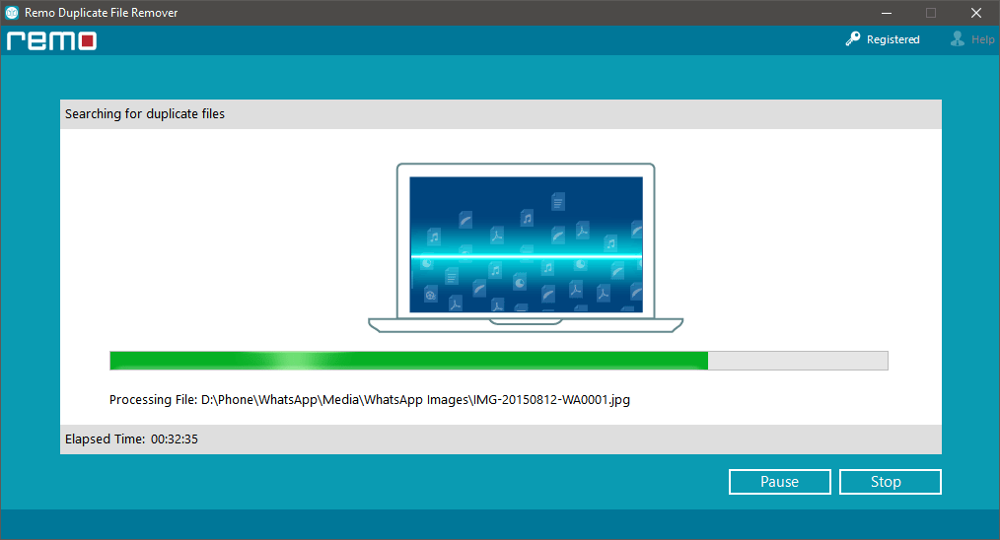
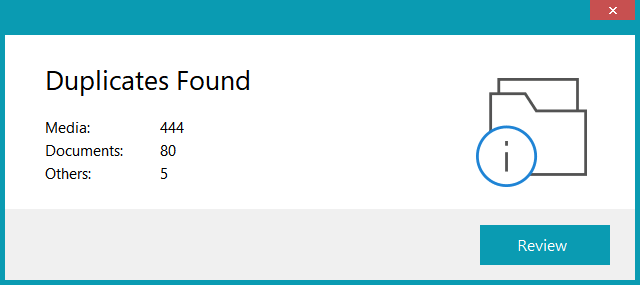
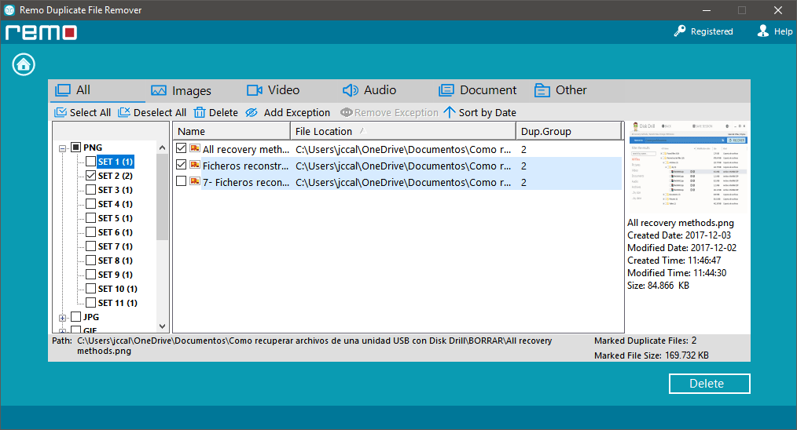
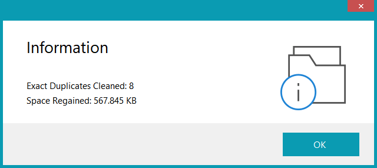

Si somos personas poco organizadas, tarde o temprano acabaremos generando archivos duplicados en nuestro ordenador. Para solucionar este problema, a continuación detallaremos como buscar i eliminar archivos duplicados en Windows con el software [Duplicate file remover.](https://www.remosoftware.com/remo-duplicate-file-remover)<!--more-->

## SITUACIONES EN LAS QUE SE PUEDEN DUPLICAR ARCHIVOS EN NUESTRO EQUIPO

Normalmente se generan archivos duplicados en las siguientes situaciones:

1. Cuando hacemos copias de seguridad antes de una modificación, pero una vez realizada la modificación nos olvidamos de borrar la copia de seguridad realizada.
2. Con fotos que antes de editarlas y/o clasificarlas hacemos una copia de seguridad.
3. Una día determinado descargamos vídeos o fotos y las almacenamos. Dentro de unos meses puede que no nos acordemos y volvamos a descargar y almacenar el mismo contenido.
4. Miembros de una familia que usan el mismo ordenador puedan acabar descargando y almacenando el mismo contenido como por ejemplo fotos familiares, música, vídeos, etc.
5. Nuestro sistema operativo puede estar creando archivos duplicados sin que nosotros lo sepamos.
6. Etc.

## CONSECUENCIAS QUE SE DUPLIQUEN ARCHIVOS EN NUESTRO ORDENADOR

Obviamente las consecuencias inmediatas de lo que acabo de mencionar son:

1. Pérdida de espacio de almacenamiento. Si nuestro dispositivo de almacenamiento está al límite de su capacidad, nuestro ordenador funcionará más lento y pueden producirse cierres inesperados.
2. Nuestro equipo acaba siendo un caos de archivos con multitud de imágenes, audios, vídeos, etc.
3. Acabamos sin saber cual es la última versión de un determinado archivo.

## BENEFICIOS DE ELIMINAR ARCHIVOS DUPLICADOS DEL SISTEMA OPERATIVO

Por lo tanto es útil realizar una limpieza periódica de archivos duplicados en nuestro equipo. El proceso de eliminar archivos duplicados nos ayudará a:

1. Recuperar espacio en nuestro dispositivo de almacenamiento.
2. Encontrar la información que estamos buscando de forma eficaz y eficiente.
3. Optimizar el rendimiento de nuestro ordenador.

## ELIMINAR ARCHIVOS DUPLICADOS DE NUESTRO SISTEMA OPERATIVO

En mi caso he eliminado los archivos duplicados de un Windows 10 que hace años que tengo instalado. El proceso seguido es el que detallo a continuación.

Una vez hayamos instalado el [programa para eliminar archivos duplicados](https://www.remosoftware.com/es/remo-removedor-de-archivos-duplicados) tan solo tenemos abrirlo. Una vez abierto tendremos que seleccionar el medio o carpeta en que queremos hallar y eliminar los archivos duplicados. Como en mi caso quiero analizar los archivos en la totalidad de mi disco duro clico sobre la opción Scan Drive.

Acto seguido selecciono las particiones del disco duro en que quiero analizar los archivos duplicados. En mi caso he seleccionado la C: y la D: y seguidamente he presionado el botón Start Scan.

A continuación se iniciará el proceso de escaneo. El tiempo de escaneo dependerá de muchos factores como por ejemplo la velocidad de lectura de su disco, el tamaño de su disco duro, etc.

Una vez finalizado el proceso de escaneo vemos que en mi caso se han hallado 444 archivos multimedia duplicados, 80 documentos y otros 5 tipos de archivo. Para eliminar estos archivos tenemos que clicar encima del botón Review.

Finalmente podremos iniciar el proceso de eliminación de archivos duplicados. Para ello, tal y como se puede ver en la captura de pantalla, tendremos que ir inspeccionando cada uno de los set de archivos duplicados encontrados. Una vez dentro de un set deberemos seleccionar los archivos duplicados que queremos eliminar y dejar sin tildar el que queremos conservar. Una vez realizada la selección en la totalidad de sets tan solo tenemos que presionar encima del botón Delete.

Acto seguido se procederá a la eliminación de los archivos duplicados.

## ANÁLISIS DEL RENDIMIENTO DE DUPLICATE REMOVER

Los puntos a destacar son los siguientes:

1. El programa **funciona a la perfección**. Permite detectar y borrar archivos duplicados de forma efectiva.
2. Su **interfaz** es **minimista**. Esto hace que su uso sea realmente intuitivo y simple.
3. **Permite seleccionar donde queremos realizar el análisis** de archivos duplicados. Podemos seleccionar un disco duro, una partición de un disco duro o una determinada carpeta.
4. El **software permite previsualizar y abrir los ficheros duplicados** antes de eliminarlos.
5. El software trae **mecanismos para evitar que borremos información de forma accidental**. Si tenemos un set de 2 archivos duplicados el programa solo nos dejará borrar unos de los 2 archivos.
6. El proceso de **escaneo de archivos duplicados es rápido**.

### Puntos de mejora del programa

No obstante el programa es excesivamente lento a la hora de seleccionar y borrar los archivos duplicados. El programa debería mejorar en los siguientes aspectos:

1. El programa **debería permitir ponerse a pantalla completa**. De esta forma podríamos seleccionar los archivos a borrar de forma más sencilla.
2. Tener la capacidad de seleccionar un archivo, presionar el botón derecho del ratón y que el menú contextual nos ofreciera la posibilidad que nuestro gestor de archivos se abriera en la ubicación que está el archivo que seleccionamos.
3. Filtros más avanzados para priorizar el contenido duplicado que queremos borrar. Por ejemplo, el programa **no permite filtrar el contenido duplicado por tamaño de archivo**.
4. **Permitir el uso del teclado** para usar el programa. De esta forma podríamos operar de forma más rápida.
5. La **previsualización de las imágenes debería ser más rápida**. El proceso para previsualizar un set de 2 imágenes duplicadas es lento y acaba desesperando si no tenemos paciencia.
6. Debería **permitir guardar un registro en forma de texto de los resultados obtenidos en el escaneo**. De esta forma podríamos cerrar el programa y borrar los archivos manualmente en el momento que nosotros quisiéramos.

También seria positivo disponer de una aplicación portable y que el programa estuviera en más idiomas. Actualmente el programa solo está en inglés.

### Conclusión final del programa para eliminar archivos duplicados

El software funciona de forma correcta, pero tratándose de un software de pago debe mejorar en todos y cada uno de los apartados que he mencionado. El proceso de eliminación de archivos no es lo cómodo que debería ser y debería incluir funcionalidades adicionales.
