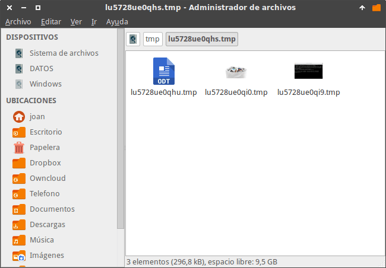

En el último post vimos como gestionar el [borrado de los archivos temporales con systemd]() y también se menciono que eliminar archivos temporales de los directorios /tmp y /var/tmp puede ser peligroso si no se hace de forma adecuada.

Por este motivo en el siguiente artículo veremos un par de métodos para poder eliminar archivos temporales de forma segura.<!--more-->

## ¿POR QUÉ PUEDE SER PELIGROSO ELIMINAR ARCHIVOS TEMPORALES?

Eliminar archivos temporales mientras un programa los está usando puede generar los siguientes problemas:

1. Cuelgue del programa que estamos usando.
2. Pérdida de información.

El contenido que se almacena en los directorios /tmp y /var/tmp puede ser importante. A modo de ejemplo, el directorio /tmp almacena datos del documento de Libreoffice que estoy editando en estos momentos.

[](images/Muestra-de-uso-de-los-directorios-temporales.png)

Estos datos almacenados tienen las siguientes utilidades:

1. Son necesarios para el correcto funcionamiento de Libreoffice.
2. En caso de un error en el programa o de un cierre inesperado nos ayudaran a restaurar el archivo que estoy editando.

## MÉTODOS PARA ELIMINAR ARCHIVOS TEMPORALES DE FORMA SEGURA

Existen varios métodos para forzar el borrado de los archivos temporales de forma segura. Algunos de ellos son los siguientes:

1. Borrar los archivos temporales cuando iniciamos el ordenador.
2. Eliminar los archivos temporales en el momento de apagar el ordenador.
3. Forzar el borrado de los archivos temporales que no han sido usados recientemente.

## FORZAR EL BORRADO DE LOS ARCHIVOS TEMPORALES

Para forzar el borrado de los archivos temporales según los métodos descritos en el apartado anterior tenemos que proceder de la siguiente forma:

### Eliminar archivos temporales cuando se enciende o apaga el ordenador

Para borrar los archivos temporales en el momento de abrir y/o cerrar nuestro ordenador podemos crear un servicio de systemd que se encargue de ejecutar scripts cuando iniciamos y/o apagamos el ordenador.

#### Creación de los scripts para eliminar archivos temporales

###### Nota: Hay que ir con sumo cuidado con el código que introduciremos en los scripts. Cualquier error puede dejar el sistema operativo completamente inservible y podemos perder la totalidad de nuestros datos.

Para empezar creamos el directorio que contendrá los scripts que se ejecutarán cada vez que apaguemos o encendamos el ordenador ejecutando el siguiente comando en la terminal:

> ```
> sudo mkdir /usr/lib/systemd/scripts
> ```

Seguidamente **creamos el script que se ejecutará al apagar el ordenador** ejecutando el siguiente comando en la terminal:

> ```
> sudo nano /usr/lib/systemd/scripts/custom-shutdown.sh
> ```

Cuando se abra el editor de textos pegamos el siguiente código:

> ```
> #!/bin/sh
> rm -vfr /tmp/* >/dev/null 2>&1 && rm -vfr /var/tmp/* >/dev/null 2>&1
> ```

La función del código que pegamos es borrar completamente el contenido de los directorios /tmp y /var/tmp. Una vez pegado el código guardamos los cambios y cerramos el archivo.

A continuación **creamos el script que se ejecutará al encender el ordenador** ejecutando el siguiente comando en la terminal:

> ```
> sudo nano /usr/lib/systemd/scripts/custom-start.sh
> ```

Al abrirse el editor de texto nano pegamos el siguiente código:

> ```
> #!/bin/sh
> #rm -vfr /tmp/* >/dev/null 2>&1 && rm -vfr /var/tmp/* >/dev/null 2>&1
> ```

El código pegado en el script está comentado. Por lo tanto al encender el ordenador no se borrará ningún archivo de los directorios /tmp y var/tmp. Lo hago de esta forma porque si borro los archivos temporales en el apagado del ordenador no es necesario que los vuelva a borrar cuando lo encienda.

Una vez pegado el código guardamos los cambios del documento y lo cerramos.

#### Dar permisos de ejecución a los scripts

El siguiente paso es dar permisos de ejecución a los scripts que acabamos de crear. Para ello ejecutamos los siguientes comandos en la terminal:

> ```
> sudo chmod +x /usr/lib/systemd/scripts/custom-shutdown.sh
> ```
> 
> ```
> sudo chmod +x /usr/lib/systemd/scripts/custom-start.sh
> ```

#### Crear y activar el servicio de Systemd que ejecutará los scripts en el inicio y apagado del ordenador

A continuación crearemos un servicio llamado start-shutdown que se encargará de ejecutar los scripts que hemos creado cada vez que encendamos y apaguemos el ordenador.

Para ello ejecutamos el siguiente comando en la terminal:

> ```
> sudo nano /lib/systemd/system/custom-start-shutdown.service
> ```

Cuando se abra el editor de textos nano pegamos el siguiente texto:

> ```
> [Unit]
> Description=Ejecutar scripts en el apago y en el encendido
> 
> [Service]
> Type=oneshot
> ExecStart=-/usr/lib/systemd/scripts/custom-start.sh
> ExecStop=-/usr/lib/systemd/scripts/custom-shutdown.sh
> RemainAfterExit=yes
> 
> [Install]
> WantedBy=multi-user.target
> ```

###### Nota: La parte de color rojo la deberéis modificar en función del nombre y de la ruta de los scripts creados en el apartado anterior.

Una vez pegado el código guardamos los cambios y cerramos el archivo.

Finalmente habilitamos y activamos el servicio que acabamos de crear ejecutando los siguientes comandos en la terminal:

> ```
> sudo systemctl enable custom-start-shutdown.service
> ```
> 
> ```
> sudo systemctl start custom-start-shutdown.service
> ```

Finalmente tan solo tenemos que reiniciar el ordenador y verán que los archivos temporales de los directorios /tmp y /var/tmp se borrarán en el apagado del sistema.

#### Comprobación del funcionamiento

Cuando se haya reiniciado el sistema tan solo tienen que comprobar el contenido de los directorios /tmp y /var/tmp. Verán que gran parte de los archivos temporales se han borrado y solo están presentes los archivos temporales que se han creado en el arranque de nuestro sistema operativo.

Además para comprobar que el servicio de systemd creado está activo pueden ejecutar el siguiente comando en la terminal:

> ```
> sudo systemctl status custom-start-shutdown.service
> ```

Si el resultado obtenido es similar al siguiente podemos está seguro que el servicio está activo.

> ```
> joan@jessie:~$ sudo systemctl status custom-start-shutdown.service
> ● custom-start-shutdown.service - Custom Start and Shutdown
>  Loaded: loaded (/lib/systemd/system/custom-start-shutdown.service; enabled)
>  Active: active (exited) since dom 2016-12-18 11:46:32 CET; 2s ago
>  Process: 1966 ExecStart=/usr/lib/systemd/scripts/custom-start.sh (code=exited, status=0/SUCCESS)
>  Main PID: 1966 (code=exited, status=0/SUCCESS)
> dic 18 11:46:32 jessie systemd[1]: Started Custom Start and Shutdown.
> ```

#### Interrumpir el funcionamiento del servicio de Systemd

El método mostrado en este post no es algo que se tenga que implementar de forma habitual. Para mantener a raya los archivos temporales existen otros métodos más apropiados.

Por lo tanto una vez borrados los archivos temporales es posible que les interese desactivar y parar el servicio de Systemd que hemos creado. Para ello tan solo hay que ejecutar los siguientes comandos en la terminal:

> ```
> sudo systemctl disable custom-start-shutdown.service
> ```
> 
> ```
> sudo systemctl stop custom-start-shutdown.service
> ```

Si algún día precisan activar de nuevo el servicio deberán ejecutar los siguientes comandos:

> ```
> sudo systemctl enable custom-start-shutdown.service
> ```
> 
> ```
> sudo systemctl start custom-start-shutdown.service
> ```

### Eliminar archivos temporales que lleven tiempo sin usarse

Si lo único que pretendemos es borrar con seguridad los archivos temporales de forma urgente porque tenemos problemas de espacio en el disco duro podemos seguir los siguientes consejos:

Primero cerramos absolutamente todos los programas que tengamos abiertos.

Seguidamente abrimos una terminal y ejecutamos alguno/s de los comandos que encontrarán a continuación y que más se adapten a sus necesidades.

#### Para borrar los archivos temporales que se crearon hace más de 10 días

> ```
> sudo find /tmp -ctime +10 -exec rm -rf {} +
> 
> ```
> 
> ```
> sudo find /var/tmp -ctime +10 -exec rm -rf {} +
> ```

#### Para borrar los archivos temporales que hace más de 2 días que no han sido accedidos

> ```
> sudo find /tmp -atime +2 -exec rm -rf {} +
> 
> ```
> 
> ```
> sudo find /var/tmp -atime +2 -exec rm -rf {} +
> ```

#### Para borrar los archivos temporales que hace más de 1440 minutos que no han sido modificados

> ```
> sudo find /tmp -mmin +1440 -exec rm -rf {} +
> 
> ```
> 
> ```
> sudo find /var/tmp -mmin +1440 -exec rm -rf {} +
> ```

###### Nota: el texto en rojo son valores de tiempo que se pueden modificar para adaptarlos a sus necesidades.
