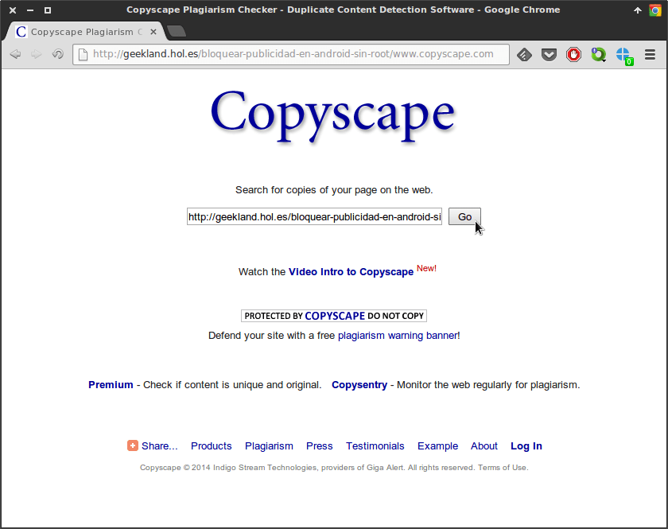
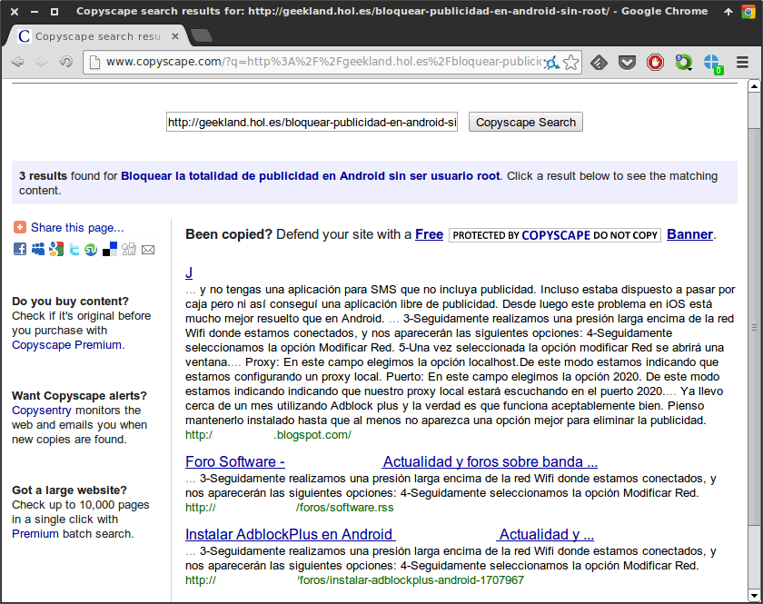
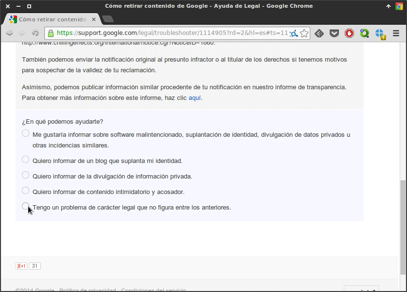
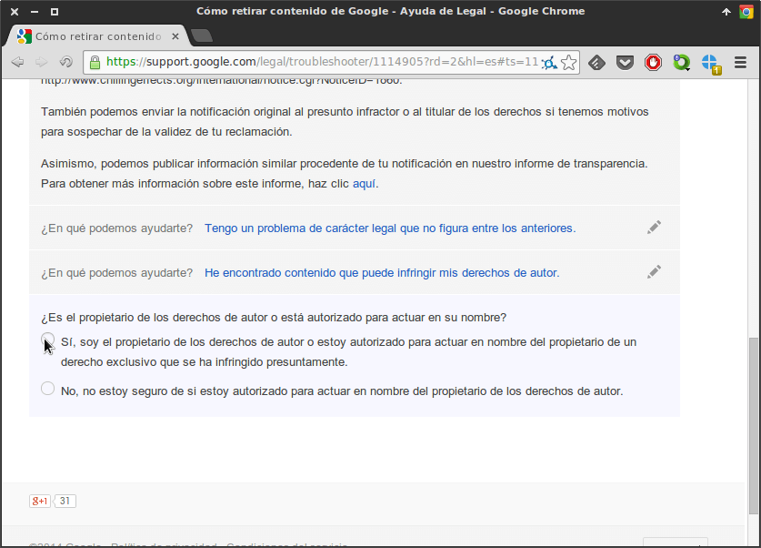
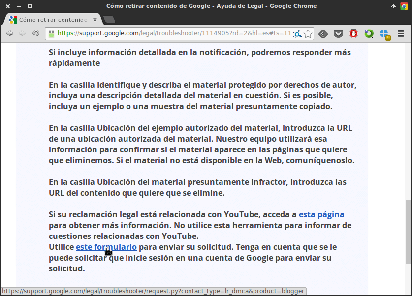
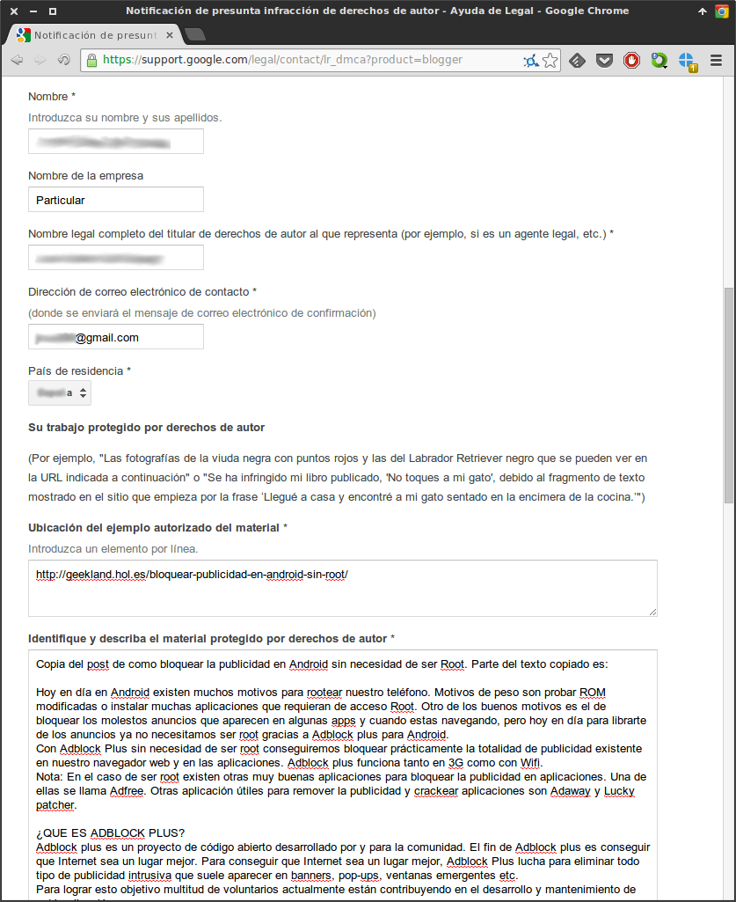
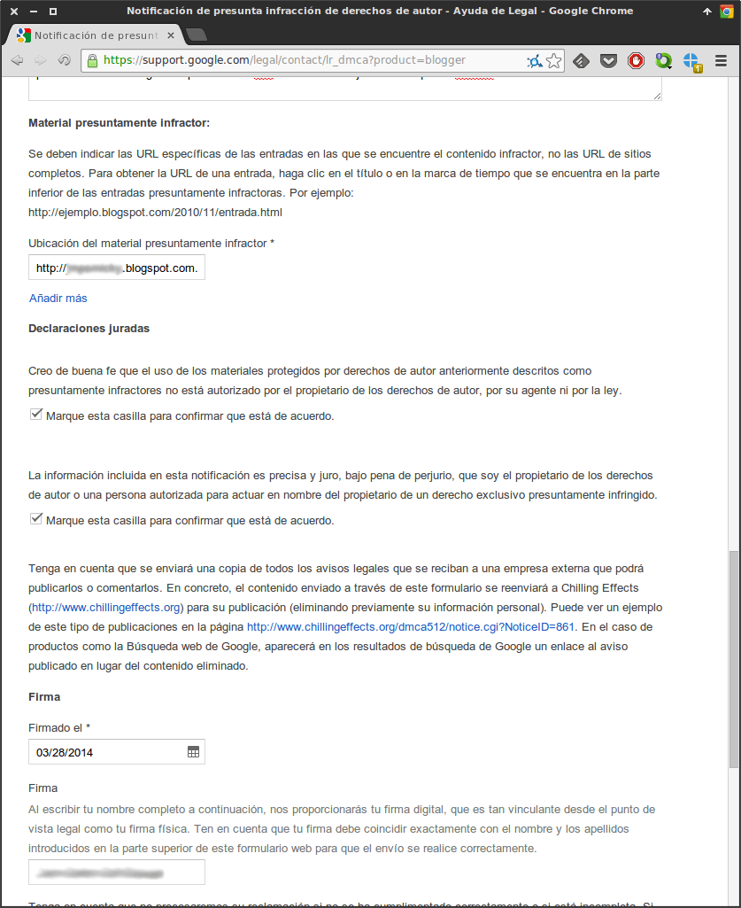
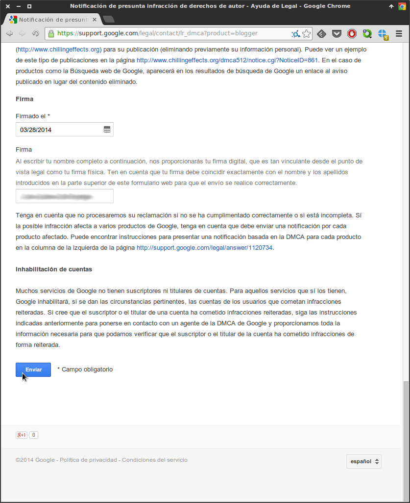

Durante las próximos meses voy a publicar una serie de artículos de como hacer que se retire contenido que vulnera los derechos de autor en la Web.

El primer ejemplo que veremos es como eliminar contenido que vulnera los derechos de autor en la plataforma Blogger. Después de aplicar los pasos que se detallan en el contenido del post, se eliminará completamente de Internet la página que vulnera los derechos de propiedad intelectual.<!--more-->

## LOCALIZAR EL ARTÍCULO A BORRAR

Cierto día escribí un artículo para explicar como bloquear prácticamente la totalidad de publicidad en Android sin necesidad de ser usuario root.

Resulta que el artículo gusto y hay varios blogs que han fotocopiado este post sin poner ni tan siquiera la fuente y haciendo [hot-linking](https://es.wikipedia.org/wiki/Hot-linking "Explicación de lo que es el Hot-Linking"). Por lo tanto como no me gusta la forma de proceder de esta gente, y además están robando recursos del servidor que pago procederemos a que Google/Blogger retire el contenido de uno de los blogs que ha realizado esto.

Para localizar la ubicación del contenido copiado pueden usar varios métodos. Uno de los métodos que se puede usar es el servicio de copyscape. Para acceder a este servicio tan solo tienen que clicar en el siguiente [enlace](http://www.copyscape.com/ "Servicio para detectar contenido copiado y duplicado en la Red").

Tal y como pueden ver en la captura de pantalla una vez han accedido dentro de la web, ingresan la URL que quieren analizar si ha sido copiada.

Cuando hayamos copiado la URL, que en mi caso es [https://geeklandlinux.github.io/posts/bloquear-publicidad-en-android-sin-root/](), presionamos el botón **Go**.

Seguidamente aparecerán la totalidad de enlaces que simplemente se han dedicado a copiar y pegar nuestro contenido.

En mi caso he encontrado he encontrado 3 webs que han usado contenido del artículo que escribí. Después de analizar los 3 enlaces veo que uno de estos ha fotocopiado el post sin referencias a su autor y además esta realizando hotlinking. Tomamos nota del enlace que nos copia que al ser de la plataforma Blogger tendrá un aspecto parecido al siguiente:

**http://xxxxx.blogspot.com/2014/01/bloquear-publicidad-en-android-sin-ser.html**

Una vez ya tenemos la URL que queremos eliminar ya podemos pasar al siguiente paso.

###### Nota: Compartir contenido está bien. Fotocopiar, robar recursos de un servidor y apropiarse de algo que no es tuyo está mal.

## PROCEDIMIENTO PARA ELIMINAR CONTENIDO DE BLOGGER

Una vez conocida la URL que queremos eliminar tan solo tenemos que clicar en el siguiente [enlace](https://support.google.com/legal/troubleshooter/1114905?hl=es "Enlace para proceder a denunciar el contenido copiado") . El enlace que acabo de poner tiene la utilidad de eliminar el contenido que queramos de cualquiera de los productos/servicios de google.

Una vez hemos ingresado dentro del enlace tan solo tenemos que ir siguiendo las instrucciones y leer detalladamente el contenido que se nos muestra en pantalla. Las opciones que debemos elegir en mi caso son las que muestro a continuación:

#### 1-Seleccionar el producto de Google del que queremos solicitar información

Aparecerán una serie de opciones de productos de Google para solicitar información. Tal y como se puede ver en la captura de pantalla quiero solicitar información acerca de **Blogspot/Blogger** ya que el usuario que ha fotocopiado el post usa Blogspot.

#### 2-Tipo de información que queremos solicitar

Seguidamente nos aparecerá una pantalla que nos preguntará que queremos solicitar de Blogger. Ninguna de las opciones que se muestran en pantalla será la que necesitamos. Por lo tanto tal y como pueden ver en al captura de pantalla seleccionamos la opción **Tengo un problema de carácter legal que no figura entre los anteriores**.

Al seleccionar esta opción aparecerán otra serie de opciones, y en esta caso si figurará la opción que nosotros tenemos que seleccionar. La que tenemos que seleccionar es **He encontrado contenido que puede infringir mis derechos de autor**.

#### 3- Confirmación que somos los propietarios del material que estamos denunciando

En el siguiente paso se nos preguntará si somos los propietarios de los derechos de autor. En mi caso tal y como se puede ver en la captura responderé que si que soy el propietario.

#### 4- Seleccionar el tipo de material que se está infringiendo

La siguiente pregunta es seleccionar el tipo de material que está infringiendo los derechos de autor. En mi caso aparecen solamente dos opciones que son imágenes u otros.

Ya que el contenido copiado es una fotocopia del post incluyendo imágenes y texto, podría seleccionar cualquiera de las 2 opciones. No obstante como solo podemos seleccionar una de las opciones voy a seleccionar la opción **Otros**.

#### 5- Acceder al formulario para cumplimentar la información de la denuncia

Tal y como se puede ver en la captura de pantalla, el siguiente paso es clicar encima del enlace **este formulario** para de esta poder dar información adicional a Google para que retire el contenido.

#### 6- Cumplimentar el formulario de denuncia

Finalmente ya solo nos queda cumplimentar el formulario. Los datos que tendremos que introducir en el formulario son los siguientes:

**Nombre y apellidos:** En esta celda tienen que introducir vuestro **nombre y apellidos**. **Nombre de la empresa:** En el caso que formarais parte de alguna organización empresarial habría que introducir el nombre de la empresa. En mi caso como soy solo una persona pondré **Particular**. **Dirección de email:** Tienen que poner una dirección de email para que google les pueda contactar. **País de residencia:** Tienen que seleccionar vuestro país. Por lo tanto en mi caso tengo que seleccionar España. **URL que contiene el contenido Original:** En este apartado tenemos que indicar la URL que contiene el material original. En mi caso [https://geeklandlinux.github.io/posts/bloquear-publicidad-en-android-sin-root/](). **Identificar y describir el material protegido por los derechos de autor:** En este campo tenemos que describir el material que vulnera los derechos de autor. También tenéis que copiar una muestra del material que vulnera los derechos de autor. **URL a eliminar:** Simplemente tenéis que especificar la URL que queréis eliminar de Internet. En mi caso esta URL es **http://xxxxx.blogspot.com/2014/01/bloquear-publicidad-en-android-sin-ser.html** **Aceptar las declaraciones juradas:** En este paso tan solo tenéis que tildar los 2 cuadrados pequeños. Tildando estos 2 cuadritos estáis diciendo a Google que el propietario de los derechos de autor no autoriza a los presuntos infractores a compartir su contenido. Además estáis jurando bajo pena de perjurio que la denuncia que estáis haciendo es verídica. **Fecha de la firma:** En este campo desplegable tan solo tenemos que introducir la fecha de la denuncia. **Firma:** Como paso final tan solo tenemos que introducir nuestra firma. Para introducir la firma tan solo tenemos que introducir nuestros nombres y apellidos.

Finalmente una vez cumplimentados todos los campos tan solo tienen que ir a la parte inferior de la página y presionar el botón **Enviar**.

Para a quien la explicación no le haya resultado clara la explicación o tenga alguna duda les dejo las capturas de pantalla de la denuncia que cursé en su día:

## CONFIRMACIÓN DE LA RETIRADA DEL CONTENIDO

Justo al enviar la petición de retirada de contenido recibiréis un email de Google comunicando que han recibido tu solicitud de carácter legal y que procederán a analizar si es aceptada o no.

Ahora tan solo tenéis que esperar 3, 4 o 5 días a que Google tome una decisión. En el momento que se tome la decisión se nos informará vía email.

En el caso que expongo en este post, con total seguridad Google procederá a eliminar por completo el contenido de Blogger/Blogspot. Es solo cuestión de días que esto pase.

Por lo que hace referencia al usuario de Blogger o Blogspot que ha copiado el post en principio no le pasará nada. Lo máximo que le pasará es que probablemente reciba una penalización en lo que a SEO se refiere y su número de visitas decrecerá. No obstante si propietario del blog de Blogger acumula muchas denuncias con un carácter similar lo más probable es que Google proceda a cerrarle su blog al igual que cierra canales de Youtube.

## ADVERTENCIAS

Esta no es una herramienta para jugar, ni para hacer peticiones malintencionadas ni para hacer malas pasadas a los Bloggers.

En el caso que alguien se dedique a realizar denuncias falsas puede salir perjudicado en función de los daños que ocasione con sus denuncias falsas. Además frente a una denuncia, los denunciados siempre tendrán derecho a realizar una contranotificación informando a Google que la denuncia que han recibido es falsa.

Por lo tanto mi consejo es que se lo piensen 2 veces antes de denunciar. Lo más aconsejable antes de denunciar a Google seria hablar con la persona que ha colgado vuestro material sin autorización y pedirle que lo retire por las buenas.

## OTRAS UTILIDADES DE ESTA HERRAMIENTA

Esta herramienta que acabamos de mostrar tiene varias utilidades. No solo la podemos usar para borrar contenido de blogger. La podemos usar en muchas otras circunstancias. Algunas de estas ocasiones en que podemos usar la misma herramienta son:

1. Para eliminar contenido de carácter personal que esta indexada en Google.
2. Para denunciar la suplantación de identidad en un blog o red social.
3. Para eliminar contenido acosador o intimidatorio.
4. Para denunciar imágenes que pueden herir la sensibilidad de personas.
5. Para eliminar contenido difamatorio de un tercero hacia nosotros.
6. Otras opciones... Para ver el resto de opciones que ofrecen tan solo tienen que dar una ojeada a las múltiples opciones que ofrece esta herramienta.

En un futuro breve volveré para explicar como realizar lo mismo en otras plataformas como por ejemplo Wordpress, eliminar contenido del buscador de Bing, etc.
